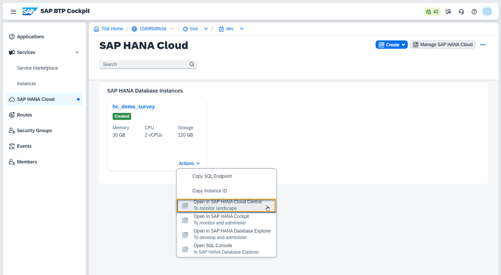
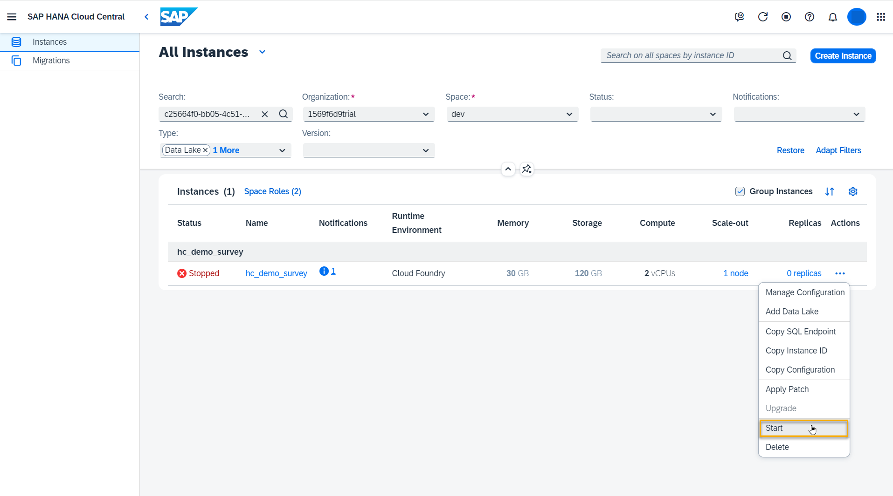
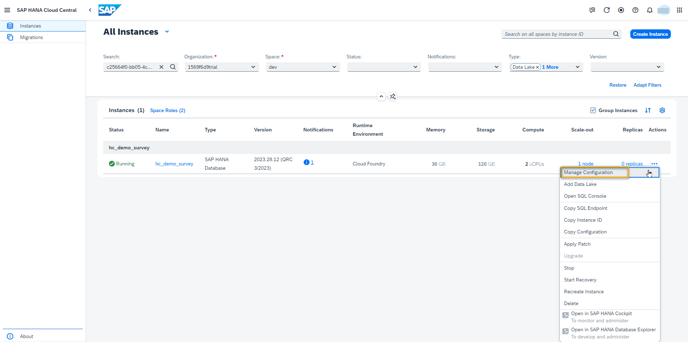
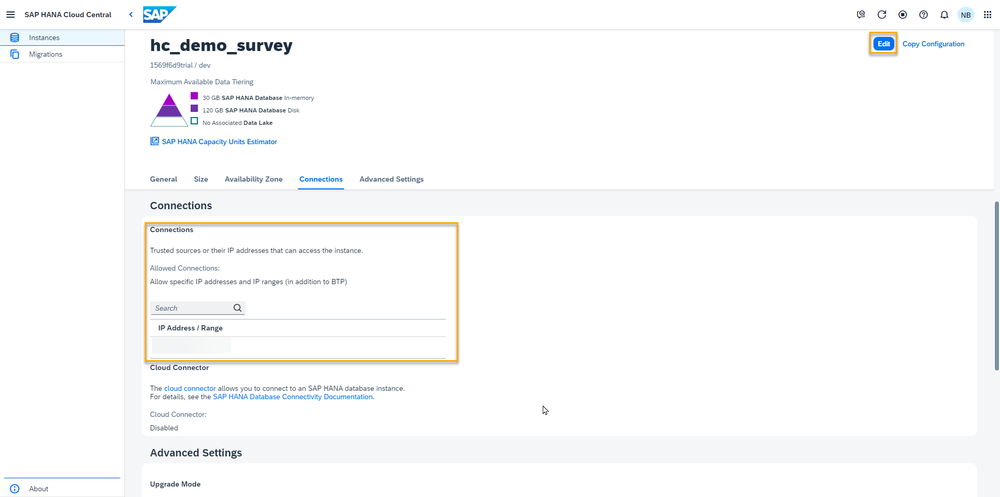
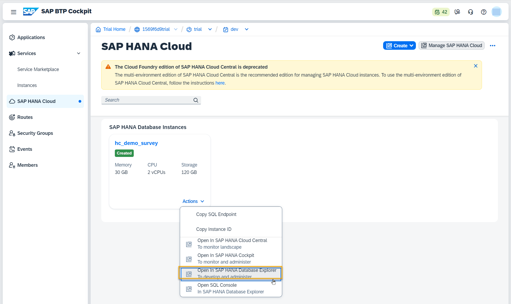
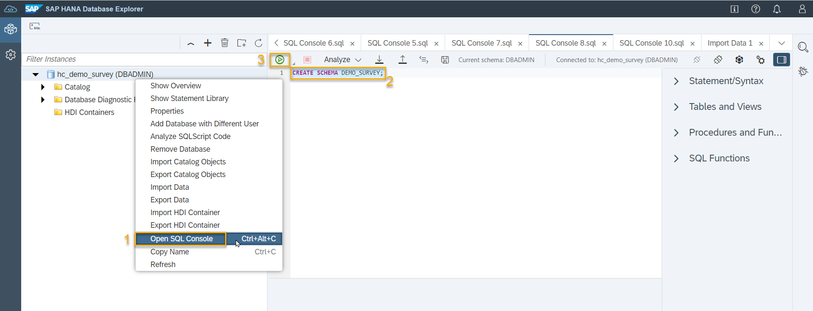
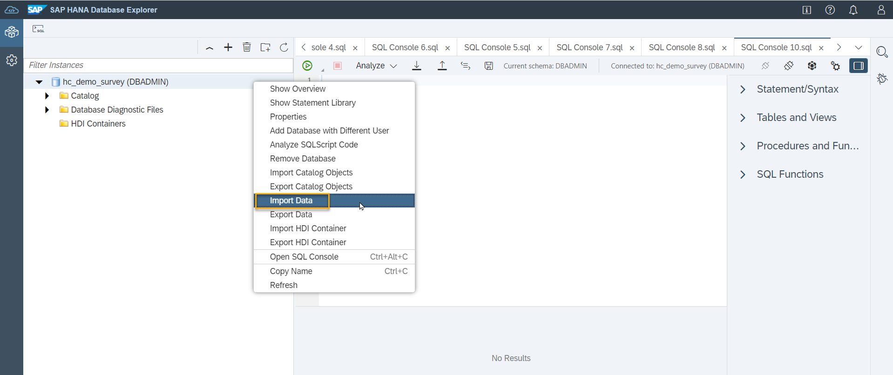
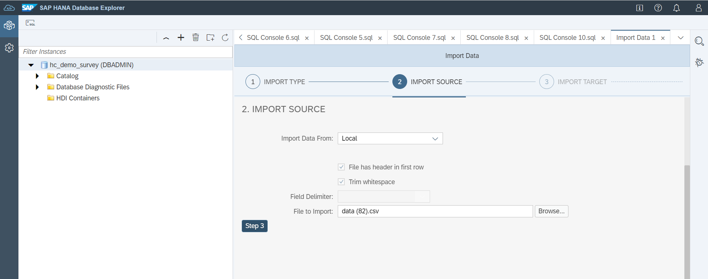
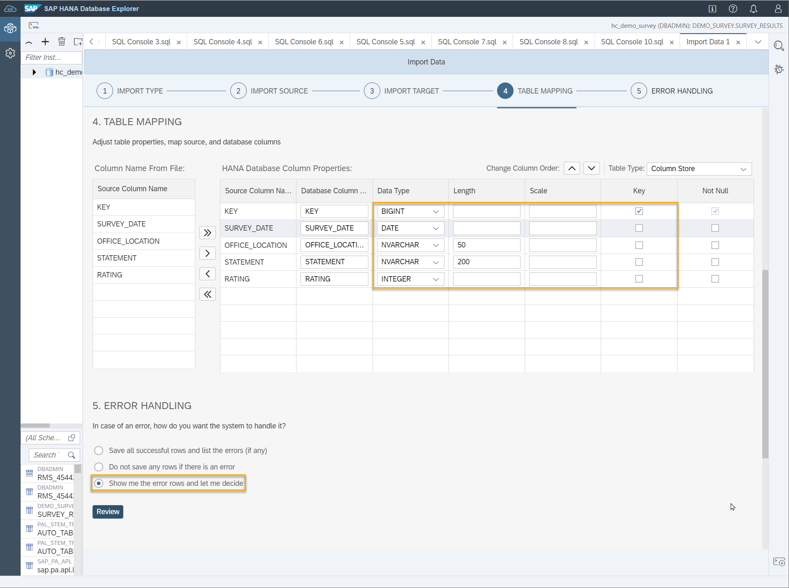

This section shows us how we can set up a HANA Cloud instance and add data to a table on this instance.

### Add Datasphere as Trusted Source in HANA Cloud
SAP HANA Cloud, SAP HANA database instances are exposed via secure end points to the public Internet. Connections are protected using TLS/SSL and access can be restricted using source IP allowlists.

By default, all access to SAP HANA database instances is denied. However, you can choose to allow access from any IP address or to restrict and control access using source IP allowlists. In this section, you are going to add Datasphere as trusted source.

If you need to enter a database user and credentials, use the user `DBADMIN` and the password you set when creating the HANA Cloud trial instance. 

1. Access your SAP HANA Database Instance in SAP HANA Cloud Central.
   
   
   
2. Ensure that the status of your instance is **Running**. If the status is **Stopped**, start your instance.

   

3. Select **Manage Configurations**.
   
    
   
4. Look up the Datasphere Outbound IP Address (**System**->**About**).
   
    

5. Add the Datasphere Outbound IP Addresses in the HANA Cloud.
   
   


### Create a Table in HANA Cloud
1. Access the Database Explorer for your HANA Cloud instance.
   
    
   
2. Open the SQL Console and create a new schema by running the statement ```CREATE SCHEMA DEMO_SURVEY```. 

    

3. Right click on the database entry on the left side and select **Import Data**.

    
 
4. In the **Import Data** dialogue, select **Import Data**. Download [this CSV file](HC_DEMO_DATA_SURVEY.csv) and select this downloaded file    in the import dialogue.

     
   
5. In step 3, select **Create a new table** and choose the schema ``DEMO_SURVEY``. Name the table ``SURVEY_RESULTS``.
    
6. Adjust the proposed data types, lengh and key settings according to the screenshot. Set the error handling mode to ``Show me the error rows and let me decide``. 

    

7. Run the data import and verify at the end that 5.750 records have been inserted successfully.
