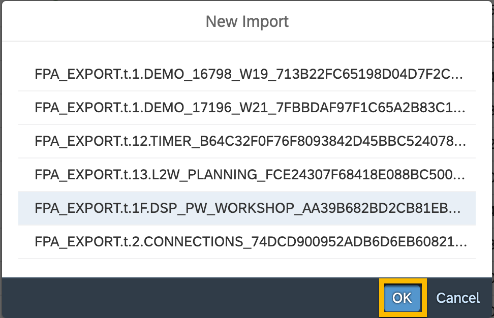

# Import a content package into SAP Analytics Cloud

<!-- description -->

There are two ways to promote content across SAP Analytics Cloud tenants. You can choose whether to use **local .tgz files** or transfer over the cloud using the **content network**. Although to keep content organized, available, and secured by appropriate permissions, we recommend using the content network, for the sake of simplicity, we will be using local .tgz files in our example.

    Note: .tgz files are only compatible with the same version of SAP Analytics Cloud or with the subsequent release.

## Prerequisites
 - You have an SAP Analytics Cloud user who is assigned the Admin or BI Admin standard application role, or is assigned a custom role with `Read`, `Maintain`, and `Share` permissions for **Lifecycle** object.

 

## You will learn
  - Prerequisites to import content into SAP Analytics Cloud.
  - How to import a package containing the Partner Workshop Template into SAP Analytics Cloud directly from a .tgz file.

This tutorial is based on **Sales data** from **Best Run Bikes**, a global bike supplier focused on selling bikes of any kind across the globe. The **Sales Manager** is looking for a comprehensive view on the main KPIs to understand the company's performance prior to the board meeting scheduled for tomorrow. It is the beginning of the year, and being able to analyze last year peformance from different angles is key to make the right decisions for the current year.

There is not so much time left and you see yourself forced to use the new purchased BI application, SAP Analytics Cloud. You heard that some **Power Users** have already created a good number of corporate templates. The idea was to speed up the process of building dashboards where all the **look & feel** has already being defined, and you will only need to focus on the required data. Luckily, all the data is available in **SAP Datasphere**, therefore you will only need to bind the data into an SAP Analytics Cloud story using the aleady existing template.

---

### Import package with Partner Workshop Story Template

1. Download the `FPA_EXPORT_T_1F_DSP_PW_WORKSHOP.tgz` file from [here](./others-dsp_analytics_1-import-template/FPA_EXPORT_T_1F_DSP_PW_WORKSHOP.tgz).

2. Go to **Transport**, **File System** tab and click **Continue** in the Warning message window. Then, click on the `Upload` icon on top right bar.

    

3. Select the `FPA_EXPORT_T_1F_DSP_PW_WORKSHOP.tgz` file downloaded in **step 1**. Then, click **OK** button.

    

4. Click `Upload` button on the **Preview** window.

    

5. Click `OK` button on the **New Import** window.

    

6. Confirm that the package contains all the required information. In this case, you should see **2 Folders** and one **Template**. Clic on the `Upload` icon on the top right.

    

7. Leave all the default options in the **Import** window, and click `OK` button to continue.

    

This will trigger the import process. It will only take some seconds for the content to be imported.

8. Once the previous step has finished, go to **Stories**, and confirm that the `Partner Workshop Story` template appears under the **Templates** section.

    

You have **successfully imported** a package containing a Template definition from another tenant.