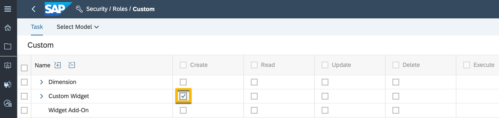
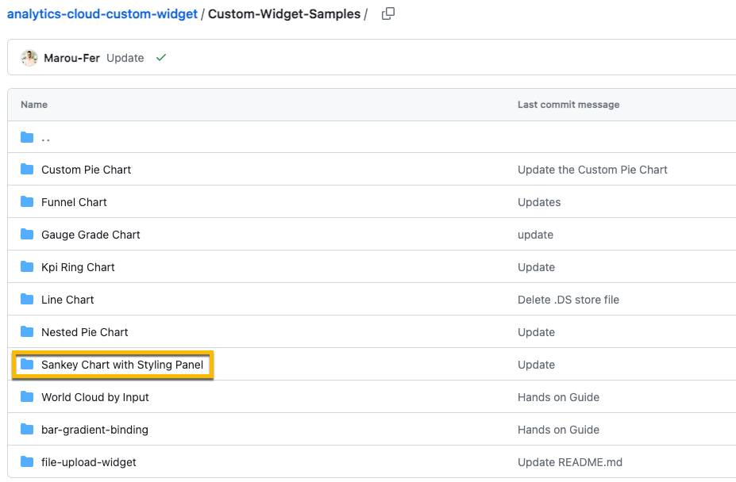
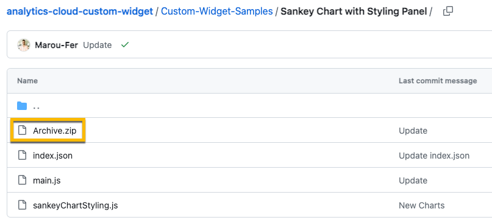
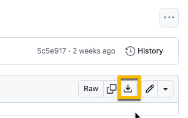
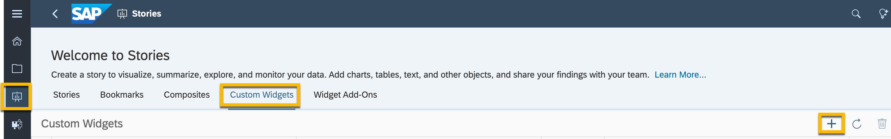
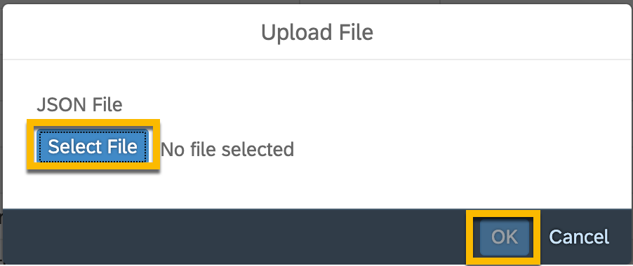
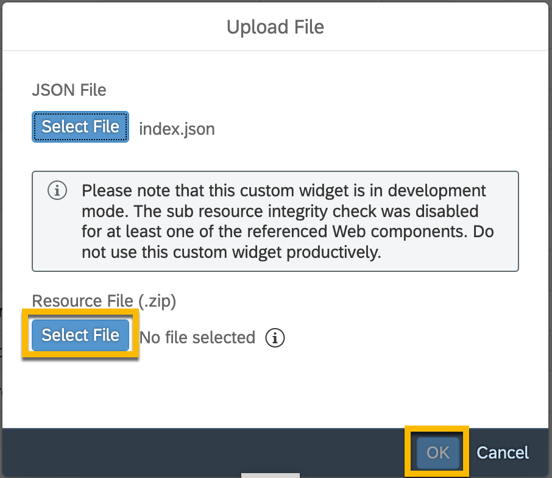
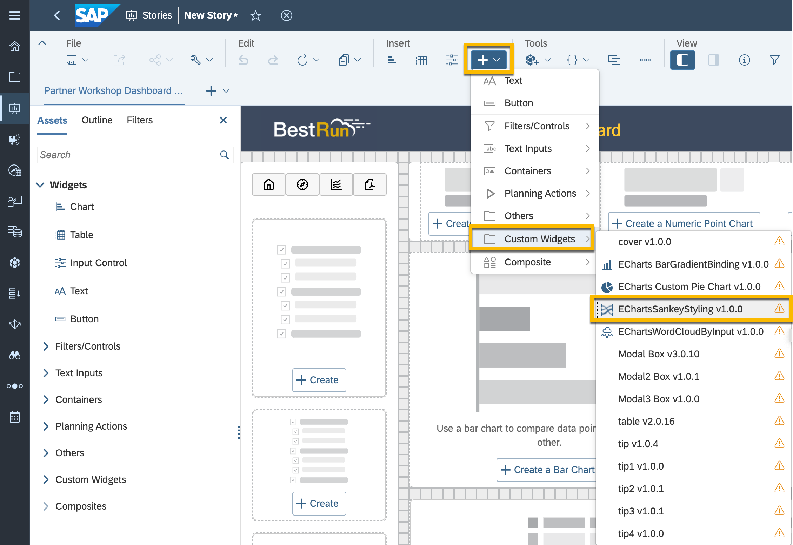

# Import a custom widget into SAP Analytics Cloud

<!-- description -->

You can use custom widgets, which extend the functionalities of SAP Analytics Cloud and complement the standard palette of widgets according to your needs.

## Prerequisites
 - You have an SAP Analytics Cloud user who is assigned a role, standard or custom, with `Create` permission for **Custom Widget**.

    

## You will learn
  - Prerequisites to use Custom Widgets in SAP Analytics Cloud.
  - How to import a custom widget into SAP Analytics Cloud.

---

### Import a Custom Widget

Before being able to use **Custom Widgets**, there are some steps that need to be accomplished.

The process will be similar regardless of the widget selected, but for our example, you will be importing `Sankey Chart with Styling Panel`.

1. Go to [Custom Widget Samples](https://github.com/SAP-samples/analytics-cloud-custom-widget/tree/main/Custom-Widget-Samples) GitHub repository.

2. Open `Sankey Chart with Styling Panel` folder.

    

3. Click on `Archive.zip`.

    

4. Click on `Download` icon on top right menu.

    

5. Repeat steps 3 and 4 for `index.json` file.

6. Now in SAP Analytics Cloud, go to **Stories**, then click on **Custom Widgets** tab, and then click on the `+` button to add new Custom Widget.

    

7. Select the `index.json` file you downloaded on step 5, and then click `OK` button.

    

8. Then select the `Archive.zip` file you downloaded on step 4, and then click `OK` button.

    

9. You have successfully added a new **Custom Widget**, and it is ready to be added to any of your new or existing stories. Inside the story, click on `+` button from the **Insert** section, and then choose your **Custom Widget** under the `Custom Widgets` menu. You can do the data binding just like with any other chart.

    

---