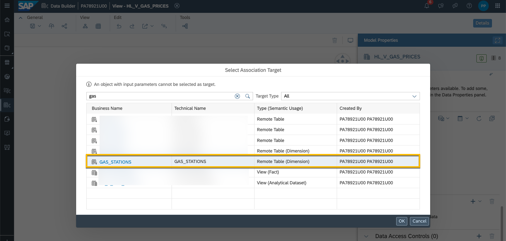

# Data Federation
This scenario provides an introduction on how to access remote data of a HANA Cloud source system.

If you are thinking about using federated data, use a SQL-based connector, not a non-SQL application connector based on e.g. OData or ABAP-ODP. You will want to make it possible for HANA’s federation layer to push as much as possible to the remote system and move as little data as possible over to Datasphere.

## Prerequisites
- You have the connection details to a HANA Cloud with tables set up as described in [this document ](../dsp_hc_federation_1/dsp_hc_federation_1-trainer_instructions.md). For this demo, data from https://dev.azure.com/tankerkoenig/_git/tankerkoenig-data?path=/stations is used.

## You will learn
  - How to access data via remote tables.
  - How to check remote statements in the Data Integration Monitor. 

--- 
## Create a Connection to a HANA Cloud Instance

1. Access **Connections** to create a new connection to HANA Cloud. 

    
    
2. Select `Cloud` for category and `User Name and Password` for authentication type. Enter host, port, user name and password. Use your own trial HANA Cloud (create the [required tables and upload data before](../dsp_hc_federation_1/dsp_hc_federation_1-trainer_instructions.md). If you are doing this exercise as part of a workshop, these details are shared with you.

    

3. Enter `HC_HandsOn`as business and technical name. 

    

4. Select the new created connection and select `Validate`. You should see the confirmation that Data Flows, Replication Flows and Remote Tables are enabled.
    

## Build the Data Model

1. In the Data Builder, go to `Import Remote Tables`.

    

2. Select the connection `HC_HandsOn` and click `Next Step`. Select the schema `DSP_WORKSHOP_GASPRICES` and pick the remote tables `GAS_PRICES` and `GAS_STATIONS`. Click `Next Step`

    

3. Import and deploy the two selected tables from HANA Cloud. 

    

4. After the import has finished successfully (check in the notification section that both tables are deployed successfully), open the table `GAS_STATIONS` in the Data Builder. Adjust the semantic usage to `Dimension`. Save and deploy the table.

    

5. Create a new graphical view. Drag the remote table `GAS_PRICES` into the editor. 

    

6. Set semantic usage to `Fact`. Move the columns `DIESEL`, `E5` and `E10`to the section **Measures**. Name the view `HL_V_GAS_PRICES`.

    

7. Create a new association. This should link the fact data on gas prices to the gas stations.  

    

8. Select the remote table (dimension) `GAS_STATIONS`.
    
    

9. Map the column `STATION_UUID` (view `HL_V_GAS_PRICES`) to the column `uuid` (remote table `GAS_STATIONS`).
    
    

10. Save and deploy the view `HL_V_GAS_PRICES`.

11. Open the data preview for the view `HL_V_GAS_PRICES`.

12. Run a data preview for the view `HL_V_GAS_PRICES`. The viewer header indicates the total number of rows. Notice that the preview doesn't display all records, it's limited to the first 1000 rows.

     

## Check Remote Statement in the Data Integration Monitor for Graphical View
1. Open the **Data Integration Monitor** and go to the tab **Remote Queries**. Here you can check and analyze the queries sent to your remote connected systems for your space. This information is helpful when analyzing executions of story, Analytic Models, views or previews, since it provides details of single read requests, like runtimes or result set size. In the example below, you can see the statement executed counting all records of the view (statement **1**, the total number of rows was displayed in the view header). You can also see that there were statements run which returned 1.000 records (statement **2**) - this is the query triggered by the data preview.

    

## Create Analytic Model
1. In the **Data Builder**, select **New Analytic Model**.
2. Drag the fact view `HL_V_GAS_PRICES` into the modelling canvas. Select all attributes and measures to be added as well as the associated dimension pointing to the target business entity `GAS_STATIONS`.

    

3. Save and deploy the Analytic Model with the name `RL_AM_GAS_PRICES`.

4. Open the data preview by selecting `Preview` in the right upper corner. 

5. The preview displays the sum of costs for the three different gas types (diesel, e5, e10).

    

6. Open the attributes of the dimension `STATION_UUID` linked to the gas prices. Select `city` to be added as rows.

    

7. Select `Heidelberg` as filter value for city.

    

8. Your preview for the Analytic Model should like displayed below (the numbers might vary depending on the records available in the source).

    

## Check Remote Statement in the Data Integration Monitor for Analytic Model
1. Access the **Data Integration Monitor**. You are going to see which remote statements have been triggered by the preview run on the Analytic Model.
2. Have a look at the most last remote query which run. You can display the complete remote statement by clicking on `More`. This statement shows that the dimension associated to the fact is joined. This join and the filter are executed in the remote source. Because of this, less records need to be transferred from the source to Datasphere. The Analytic Model returns records aggregated automatically based on the defined aggregation behavior.    

     

## General Considerations

Connections have defined capabilities, not available capabilities will be taken over by Datasphere, but can lead to more data being selected. In this example scenario, the filter as well as the aggregation and the join is executed in the remote HANA Cloud system.
Data access controls can require loading more granular data.

When you decide for federated access, be aware on the impact on the source system(s) as well as your SAP Datasphere tenant. Federated access will pass through all requests to the source and stress the source system. Datasphere needs to hold the result sets in federation separately. A persisted result set can act as cache, but would break federation.

You can find more details on this in the document [SAP Datasphere - First Guidance: Development Guidelines and Naming Conventions](https://www.sap.com/documents/2021/09/8a0fc7ca-f67d-0010-bca6-c68f7e60039b.html).
