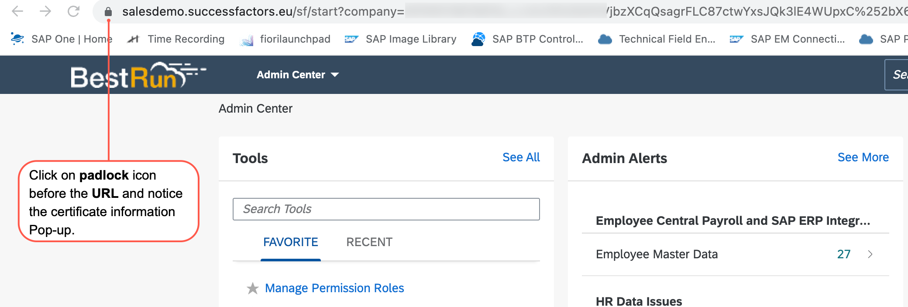
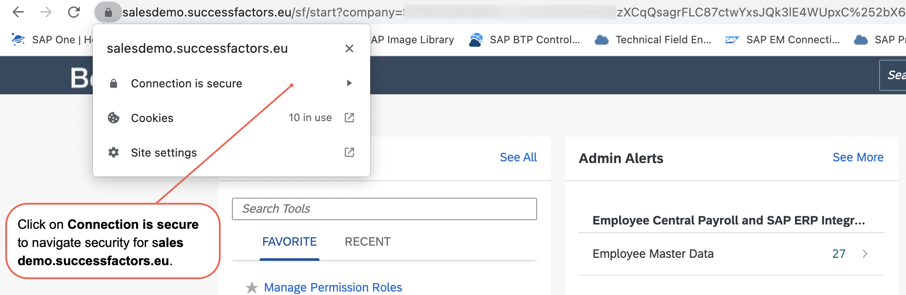
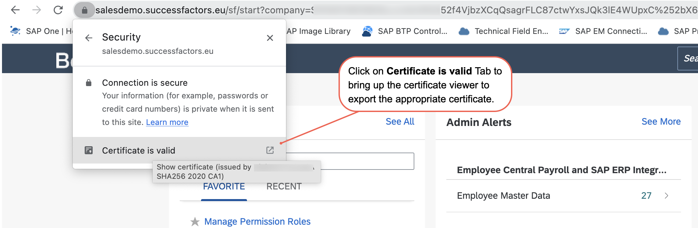
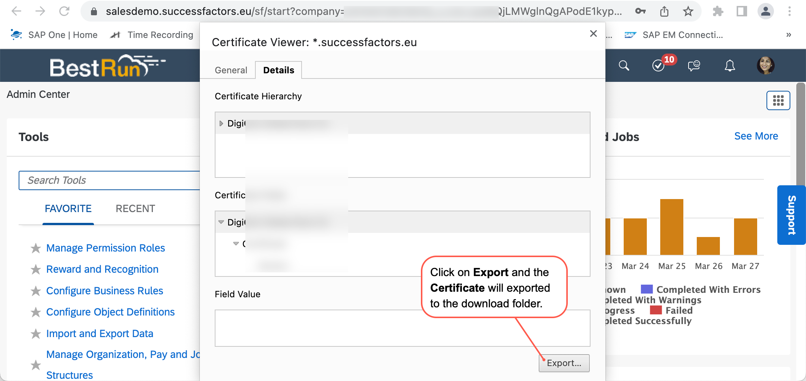
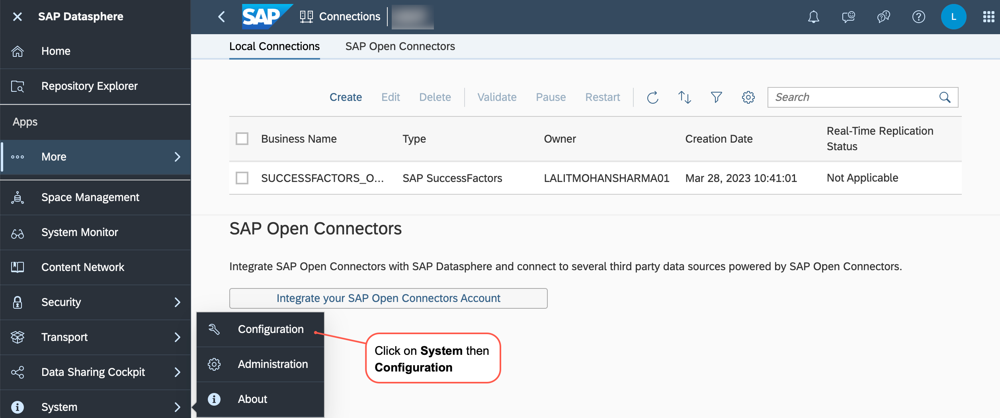
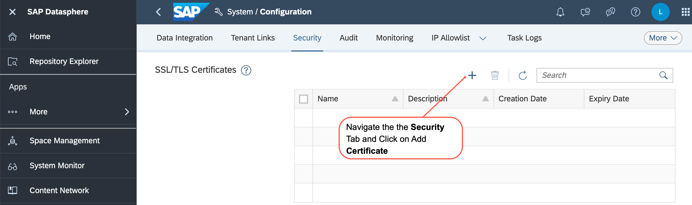
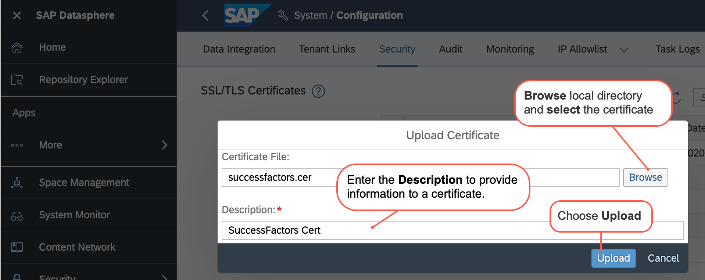
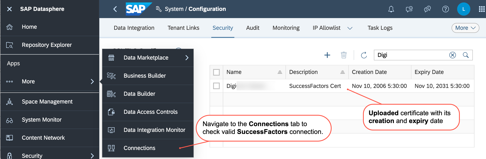
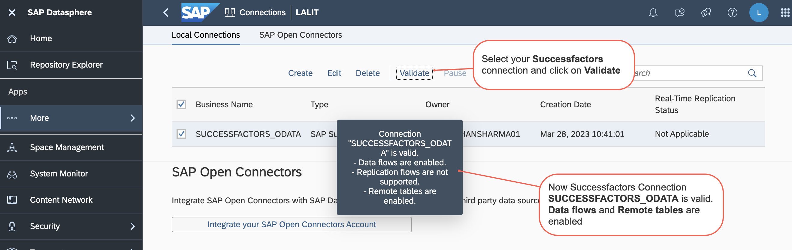

# Enabling a secure SSL/TLS-based connection

To enable a secure SSL/TLS-based connection, we need an SSL certificate, a digital certificate that provides authentication for a website, and a secured encrypted connection, for a connection type that allows remote tables and data flow. 

We must upload the server certificate to SAP Datasphere to successfully validate and use the SAP SuccessFactors connection.

## Download Certificate
One of the easiest ways is to download the required SSL certificate from an appropriate website. Common browsers give users the option to download these certificates by exporting them.

Visit the website for the URL you wish to download the Certificate from. For instance, at https://salesdemo.successfactors.eu, sign in with your login and password and the correct Company ID.
After logging in, notice the certificate information Pop-up by clicking the padlock icon before the URL.

As shown below, click the Connection is secure link. 

Click on Certificate is Valid Tab to bring up the certificate viewer to export the appropriate Certificate.

Click the Export button to export the certificate to the download folder.

## Upload Certificate

We have already discussed a server certificate to SAP Datasphere that needs to be uploaded to enable a secure SSL/TLS-based connection that allows remote tables and Data flow.

Return to the SAP Datasphere system once more, then click System then Configuration in the side navigation menu.

Click the Add Certificate icon under the Security tab.

Choose the certificate by browsing your local directory in the Upload Certificate dialogue.  Add a description to the certificate to give understandable information about it. Choose Upload.

In the Security Overview tab, you can see the Certificate’s creation and Expiry date. If required from the Overview, you can delete certificates as well.

After successfully importing the Certificate, we need to recheck the connection validation. So, In the side navigation area, click on Connections, select a space if necessary, and then click the Local Connections tab.

Select the Connection and click Validate to check if the Connection is valid and can be used for the enabled features. After some time, a message popped up which shows Connection is valid.

With this validated Connection, you are now ready to add SAP SuccessFactors data source into SAP Datasphere.

