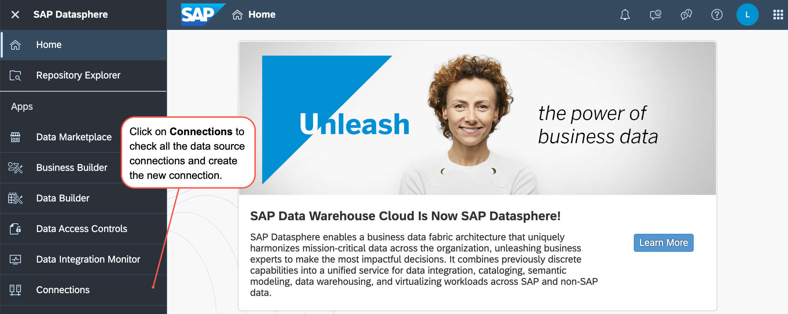
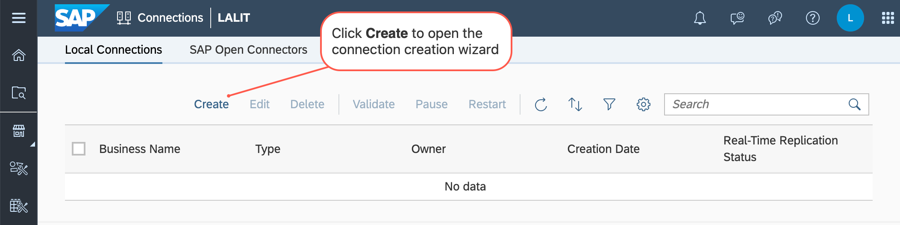
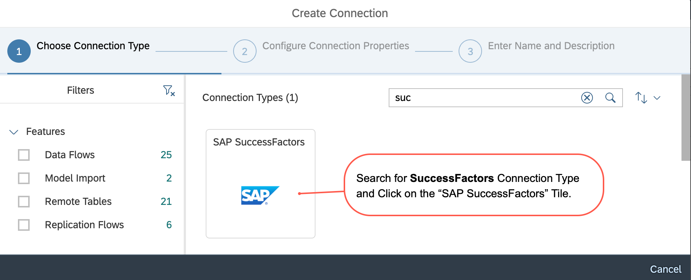
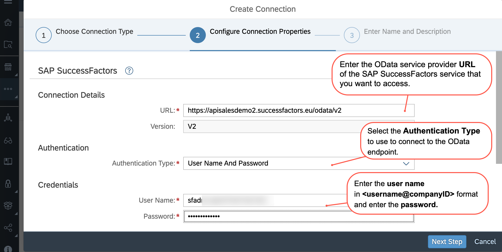
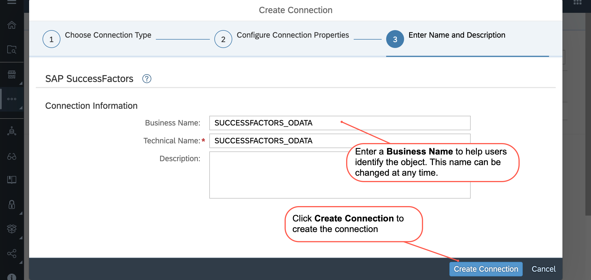
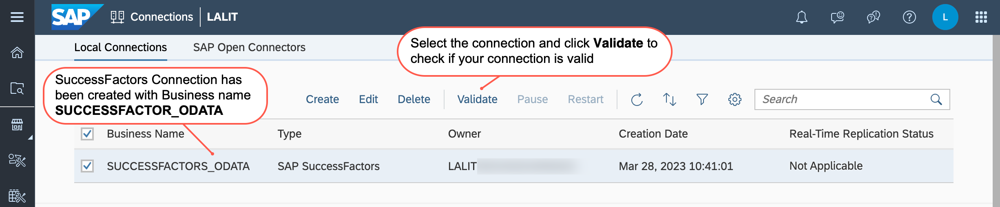

# Integrate SuccessFactors as a Data Source into Datasphere
This tutorial is based on an [SAP Community Blog](https://blogs.sap.com/2023/04/20/connecting-sap-successfactors-and-sap-datasphere/), in which you will configure your Datasphere to allow SuccessFactors connection. In addition to this, you will be adding a SuccessFactors instance as a data source in your own space.
  
  
 We have already learnt how to import data into SAP Datasphere with flat files. Now let us learn another way. It is possible to import data from other corporate sources. One such data source is SAP SuccessFactors.  The business data from SAP SuccessFactors can be properly utilized and evaluated in SAP Datasphere which would enable organizations to:

- Evaluation of the current roles and organization structure 
- Find opportunities for improvement, review processes and speak with team members. 
- Examining procedures and communicating to find areas for improvement 
- Presenting findings and recommendations to management and other key stakeholders 
- Making financial and visual representations to assist with business decisions 
- Educating and coaching about new systems

## Prerequisites
You need to have:

- A SAP SuccessFactors instance

## You will learn
  - How to prepare the Datasphere account to allow a secure SSL/TLS based connection to a data source
  - How to connect to SuccessFactors instance as a data source
  
---

### Preparing the Datasphere account for the SuccessFactors data source

This part is already done. Please refer to this [page](./others-dsp_integration_2-connect_sf/dsp_integration_2.1-configure_certification_sf.md) for the step-by-step process.

---

### Creating the SuccessFactors connection

To access data from various sources, including those that are on-premises, in the cloud, or both, or those that are SAP-related, as well as those that are not, SAP Datasphere provides a wide variety of default connections. 

Connections are in a separate view accessible from the main navigation window on the left. In SAP Datasphere, connections are individual objects. They are built and maintained per SAP Datasphere space; only individuals who are a part of that space may use the linked connections.

Connections allow the space members to connect sources for accessing and modelling data in SAP Datasphere. 

In the side navigation area, click on Connections, select a space if necessary and then click the Local Connections tab.

Click Create to open the connection creation wizard.

In the connection creation wizard, please enter a search string SuccessFactors in the search field to only show the connection type for SAP SuccessFactors. Click an SAP SuccessFactors connection type tile for your source.

Complete the configure connection properties.

Connection Details 
URL  :  Enter the OData service provider URL of the SAP SuccessFactors service that you want to access.
Version : Displays the OData version used to implement the SAP SuccessFactors OData service.

Authentication 
Authentication Type : User Name And Password:
User Name : Enter your API user and company ID in the format <username@companyID>. e.g. sfapi@HXM2345 into the User Name.
Password: Enter the password.

Click on Next Step

Enter a descriptive Business Name, which you can change at any time. Technical Name displays the name used in scripts and code, synchronized by default with the Business Name. Once the object is saved, the Technical Name can no longer be modified. To Provide more information to understand the object enter the Description as well.

Click Create Connection to add the Connection to the overview of available connections.

Select the connection and click Validate to check if the connection is valid and can be used for the enabled features.

The connection is then validated. Please note that if the steps on this [page](./others-dsp_integration_2-connect_sf/dsp_integration_2.1-configure_certification_sf.md) are not followed, then there might be a warning at this point, if the connection is valid.

So, now you have seen how to create a valid connection with SAP SuccessFactors.
