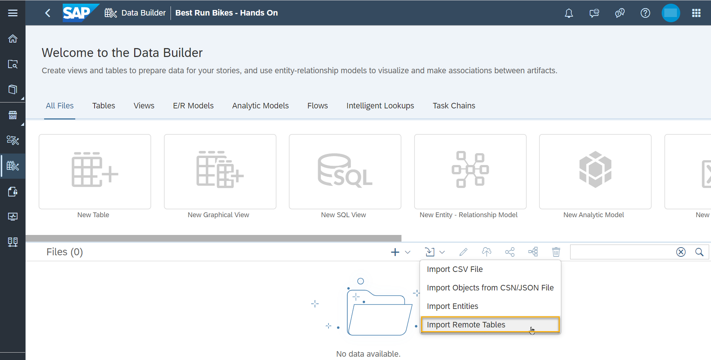
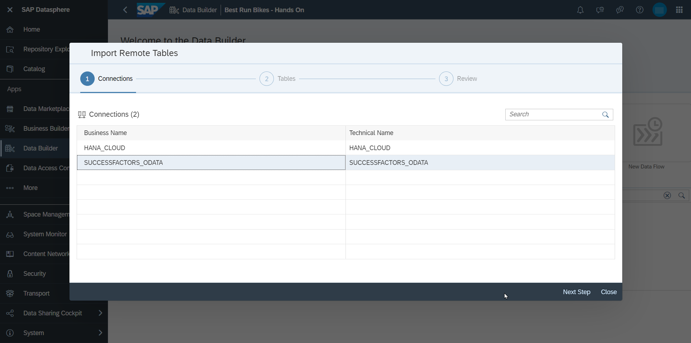
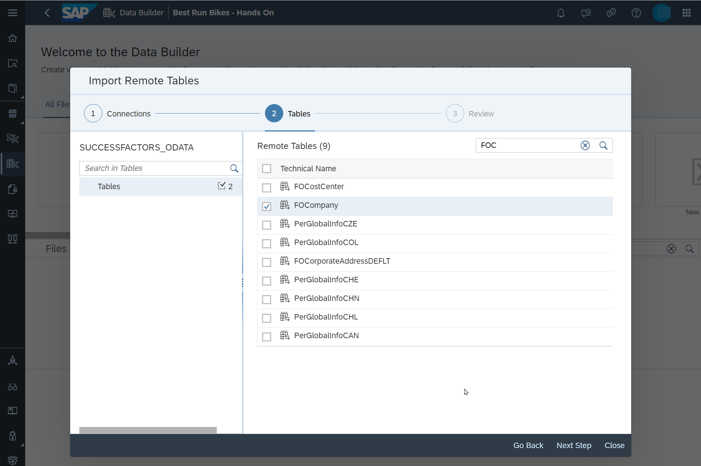
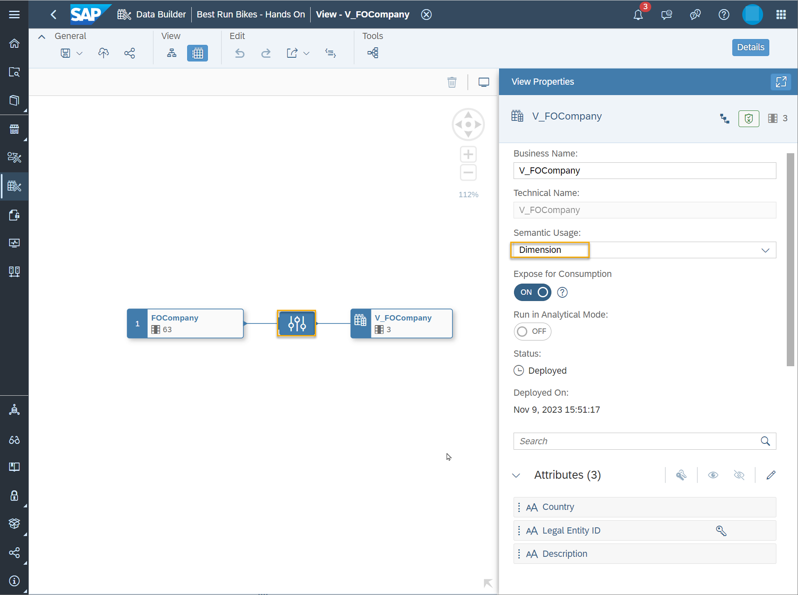
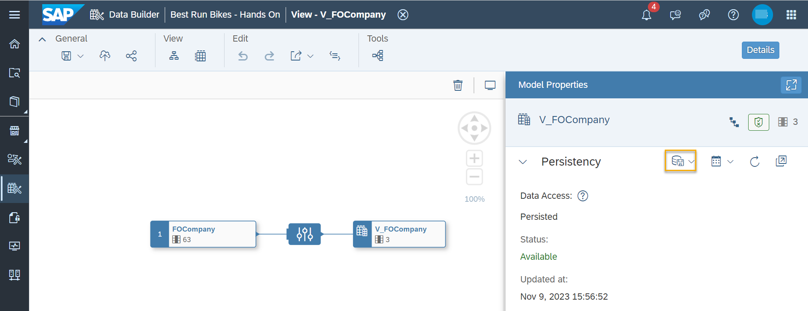

# Import SuccessFactors data into SAP Datasphere

## Prerequisites
You need to have:

- followed the previous [tutorial](https://github.tools.sap/HDACSM/DatasphereWorkshop/blob/main/dsp_integration_1-connect_sf/dsp_integration_1-connect_sf.md/)
- A SAP SuccessFactors instance

## You will learn
  - How to import Remote Tables from SAP SuccessFactors data into SAP Datasphere.
  - How to run snapshot replication of SAP SuccessFactor data for views.
  
### Use Case
The survey dataset contains the codes of company locations. To map the codes to countries, data from SAP SuccessFactors containing company details is imported in this exercise.

### Import Remote Table from SAP SuccessFactors
1. Access the Data Builder. Select the **Import**-Button to import remote tables. 

    

2. Select your before created connection to SuccessFactors.

    

3. Expand the Node **Tables** on the left side. Search and select the remote tables `FOCompany`.

    

4. Review that `FOCompany` is listed in **Read for Import**. Please note that remote tables can only be imported once per space. Click **Import and Deploy**

5. Open the table `FOCompany`. The data access type is set to "Remote". In this case, data is federated and not replicated to Datasphere. Open the Data Preview, the keys are derived from the source. 
The column `Legal Entity ID (technical name: externalCode)` contains the location codes (available in the survey). The standardized country codes can be found in `Country`. They are required to use external data containing latitudes and longitudes. 
Please note that the location records are not time dependent in our use case, otherwise Datasphere provides the capability to configure time-dependent master data (values in the columns `Start Date` and `End Date` are set as generic values). 

6. As only some of the 63 columns are required for this use case, replicating the full table is not required. Instead, create a view `V_FOCompany_<YOUR_USER_ID>` based on this table and use the operator **Rename/Exclude Columns**. Only keep the following columns: `Country`, `Description (technical name: description` and `Legal Entity ID (technical name: externalCode)`. Set the semantic usage to "Dimension".

     

7. Save and deploy the view. Views can be replicated in a snapshot load which could also be scheduled. Start **Load New Snapshot**.

     