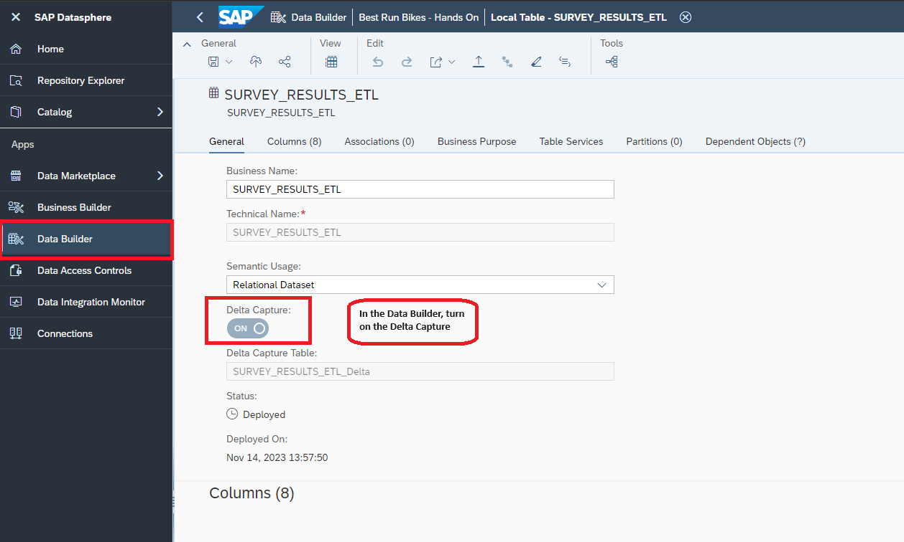

# Connect to HANA Cloud and Access the data
 
 HANA Cloud is a multi-model database management system that stores high volume business data. For the business need to consume this data in SAP Datasphere, SAP Datasphere allows to add HANA Cloud connection in order to consume the data meaningfully.

## Prerequisites
You need to have:

- a space and service account user added to that space in SAP Datasphere
- an SAP HANA Cloud / SAP HANA Cloud Trial instance
- followed the previous [tutorial](../dsp_integration_2-import_sf_data/dsp_integration_2-import_sf_data.md)

## You will learn
  - How to connect to HANA Cloud instance from SAP Datasphere
  - How to access the HANA Cloud data
  - How to build replication flows and transformation flows on HANA cloud data
  
### Use Case and Exercise Break-up

Please note that the survey data is a <b>fictional example</b>.
The company <b>Best Run Bikes</b> has office loctions in different countries. Employee statisfaction and Work-life balance are very important topics for this organization. To ensure this, the company employs a monthly employee survey to stay informed about the changing employee attitudes. The survey data is then visualized to make relevant changes in the company.
In this exercie, we want to identify these trends as quickly as possible and derive actions based on the analysis of these surveys. 

The survey results are persisted in a table of a standalone HANA Cloud system. To gurantee the anonymity of each employee, only the office code is part of a survey record. Our goal is to map the survey results to the locations of our company to analyze the results in SAP Analytics Cloud.

This exercise is divided into three main parts. They are:
1. Add Datasphere as Trusted Source in HANA Cloud
2. Create a table in HANA Cloud
2. Connect to HANA Cloud
3. Create a replication flow to access delta data from a table
4. Create a transformation flow to categorize repititive data

In the next sections, we will look at the step-by-step process for each of these parts.

### Add Datasphere as Trusted Source in HANA Cloud
SAP HANA Cloud, SAP HANA database instances are exposed via secure end points to the public Internet. Connections are protected using TLS/SSL and access can be restricted using source IP allowlists.

By default, all access to SAP HANA database instances is denied. However, you can choose to allow access from any IP address or to restrict and control access using source IP allowlists. In this section, you are going to add Datasphere as trusted source.

1. Access your SAP HANA Database Instance in SAP HANA Cloud Central.
2. Select **Manage Configurations**.
    
3. Look up the Datasphere Outbound IP Address (**System**->**About**).
    

4. Add the Datasphere Outbound IP Addresses in the HANA Cloud.
 


### Create a Table in HANA Cloud
1. Access the Database Explorer for your HANA Cloud instance.
2. Right click on the database and select **Import Data**.
3. Download [this CSV file](HC_DEMO_DATA_SURVEY.csv) and select this downloaded file in the import dialogue.
4. Verify that the columns have the corresponding SQL Data Types as listed below:
- KEY - BIGINT and Key
- SURVEY_DATE - Date
- OFFICE_LOCATION - NVARCHAR(50)
- STATEMENT - NVARCHAR(200)
- RATING - Integer 
5. Run the data import and verify at the end that 5.750 records have been inserted successfully.

### Connect to HANA Cloud
The HANA Cloud instance has already been created on the BTP account. It needs to be added to the Datasphere space. Please note that this can be done in each space only once.
1. Select **Connections** from the main menu.


2. Select Create option from Menu.


3. Search for the 'SAP HANA' option and select it as the connection type.


4. Add the connection details and credentials and continue to the next step.


5. Add the technical and business names for the connection. If you create connections to different  HANA Cloud tenants, add your user ID. Click on **Create Connection**.


The HANA Cloud connection is successfully created.

### Create a replication flow

Now that the HANA Cloud connection has been established, we can start using the data. For this use case, we need a replication flow. A replication flow is used to copy multiple data assets from the same source to the same target in a fast and easy way. Hence, it does not require complex projections.
We will create a replication flow to fetch the latest data from a remote table in the HANA Cloud instance. When the replication flow runs for the first time, all the data is fetched and on subsequent runs, the delta data will be fetched. To serve as the target container for the replication flow, we need a delta-capture-enabled local table. It can be created as follows:


Name the table **T_SURVEY_RESULTS_<USER_ID>**. The semantic type of the table is Relational Dataset. Turn on the 'Delta Capture' option on the table. Due to this, two new columns called `Change Type` and `Change Date` are already added to the table. Add the rest of the columns. For the table to be used in the Replication Flow, a key column is compulsory. Set the column `KEY` as the primary key of the table. The delta capture option allows to track the changes and new rows in the table. 


We can now continue with the replication flow. Here are the steps to create a replication flow:

1. In the Data Builder Section, use the **New Replication Flow** option to start creating it.


2. Add the Source object information. The HANA Cloud instance connection is the Source Connection. i.e. <b>HANA_CLOUD(HANA)</b> is the connection that we created previously.
The Schema on the database will be added as the Source Container. i.e. <b>DEMO_SURVEY</b> is the schema in the HANA Cloud instance which will be added.


3. Add the source objects. The table **SURVEY_RESULTS** has all the survey data in the schema. This is added as the source table. You will have to wait till the table and its data are loaded. This is indicated with the progress bar in the Status column.


4. The target container will be SAP Datasphere since we are reading the data into Datasphere. This needs to be read into a Local table in Datasphere. Use the option 'Map to existing Target Object'  and add the newly created local table **T_SURVEY_RESULTS_<USER_ID>** as the target container. 


5. Change the Settings of the Replication Flow. i.e. Change the Load Type to **Intial and Delta**. Also, turn on the **Truncate** option.
With this load type, the first time you run the transformation flow, the system will load the full set of data to the target table. For subsequent runs, the system will only load delta changes to the target table.
Then, name the Replication Flow **RF_Populate_Survey_Results_<USER_ID>**. Then Save and Deploy. You will be notified when the deployment is successful.


6. You can run the Replication Flow using the Run button. The progress of the run can be viewed using the Status button. You will also be notified when the run has finished


7. The data that was populated, can be viewed in the Data Builder tab. The target table is called **T_SURVEY_RESULTS_<USER_ID>**. The Data Viewer button can be used to view the data.


### Create a transformation flow
 
Now, we need a transformation flow. Tranformation flows load data from one or more source tables, apply transformations on it (such as a join), and output the result in a target table. You can load a full set of data from one or more source tables to a target table. You can also load delta changes from one source table to a target table.
A transformation flow run is a one-time event that completes when the relevant data is loaded to the target table successfully. You can run a transformation flow multiple times, for example if you are loading delta changes to the target table.

For this use case, we will use the transformation flow to create categories for the repititive survey questions. We will create a calculated column which will generate an umbrella category for the questions. The questions can be categorized as follows:

<table>
  <tr>
    <th>Statement</th>
    <th>Category</th>
  </tr>
  <tr>
    <td>I have a really interesting  job.</td>
    <td>Job Satisfaction (Positive)</td>
  </tr>
  <tr>
    <td>Most of the time I enjoy going to work.</td>
    <td>Job Satisfaction (Positive)</td>
  </tr>
  <tr>
    <td>I'm often bored at work.</td>
    <td>Job Satisfaction (Negative)</td>
  </tr>
  <tr>
    <td>If I could, I would like to change careers.</td>
    <td>Job Satisfaction (Negative)</td>
  </tr>
  <tr>
    <td>I'm satisified with the relations between colleagues in my team.</td>
    <td>Positive Working Atmosphere</td>
  </tr>
  <tr>
    <td>I can always trust the colleagues in my team.</td>
    <td>Positive Working Atmosphere</td>
  </tr>
  <tr>
    <td>It would not bother me if some colleagues of my team would be replaced.</td>
    <td>Negative Working Atmosphere</td>
  </tr>
  <tr>
    <td>It's sometimes difficult to remain a good relation to all colleagues.</td>
    <td>Negative Working Atmosphere</td>
  </tr>
   <tr>
    <td>After work, I'm exhausted in the evening.</td>
    <td>Workload (Negative)</td>
  </tr>
  <tr>
    <td>I'm often working under time pressure.</td>
    <td>Workload (Negative)</td>
  </tr>
</table>

Here are the steps:
1. In the Data Builder Tab, select the option **New Tranformation Flow** to start creating a transformation flow.


2. Use the Edit Button on the object **View Tranform** to start editing.


3. From the Repository, search for the local table **T_SURVEY_RESULTS_<USER_ID>**. Drag and drop the table on the View Tranform Editor. Then, use the calculated column option on the object, to start creating a calculated column.


4. Name the operation **Calculate_category** and proceed to add a calculated column.


5. Name the calculated column **CATEGORY** and add the semantic type for the column. 


6. Then proceed to add the logic for the calculation as follows and validate the expression.

```
CASE
WHEN STATEMENT = 'I have a really interesting  job.' THEN 'Job Satisfaction (Positive)' 
WHEN STATEMENT = 'Most of the time I enjoy going to work.' THEN 'Job Satisfaction (Positive)' 
WHEN STATEMENT = 'I''m often bored at work.' THEN 'Job Satisfaction (Negative)' 
WHEN STATEMENT = 'If I could, I would like to change careers.' THEN 'Job Satisfaction (Negative)' 
WHEN STATEMENT = 'I''m satisified with the relations between colleagues in my team.' THEN 'Positive Working Atmosphere' 
WHEN STATEMENT = 'I can always trust the colleagues in my team.' THEN 'Positive Working Atmosphere' 
WHEN STATEMENT = 'It would not bother me if some colleagues of my team would be replaced.' THEN 'Negative Working Atmosphere' 
WHEN STATEMENT = 'It''s sometimes difficult to remain a good relation to all colleagues.' THEN 'Negative Working Atmosphere' 
WHEN STATEMENT = 'After work, I''m exhausted in the evening.' THEN 'Workload (Negative)' 
WHEN STATEMENT = 'I''m often working under time pressure.' THEN 'Workload (Negative)' 
ELSE 'Not Available'
END
```

7. Go back to the main view of the Tranformation flow and add a new local table as the target table to persist the results. The new table is called **T_SURVEY_RESULTS_ETL_<USER_ID>**.


8. In the main view, change the load type for the transformation flow as **Intial and Delta**. Save the transformation flow as **TF_Populate_Category_<USER_ID>**. Then Deploy the changes


9. The **Delta Capture** Option has to be turned on in the table **T_SURVEY_RESULTS_ETL_<USER_ID>** as shown below. 


If this is not turned on already. Then you have to turn it. Search for the table **T_SURVEY_RESULTS_ETL_<USER_ID>** in the Data Builder section. Then turn on the toggle **Delta Capture**:



10. Now that the transformation flow is ready, you can run it to populate the 'CATEGORY' column in the local table **T_SURVEY_RESULTS_ETL_<USER_ID>**. You can see the status of the run and you will be notified once the run has finished.


11. You can view the data from using the Data Viewer button in the table **T_SURVEY_RESULTS_ETL_<USER_ID>**


Now that the Transformation Flow has been created, it can be used for any further modelling that will be done. For our case, we have numerically values that we want to analyze in our SAC story, hence we need to change the semantic usage type to 'Fact'.
In the Data Builder, select the table **T_SURVEY_RESULTS_ETL_<USER_ID>** and change its Semantic Usage to 'Fact'. Then Save and Deploy.


In addition to this, we have to add a measure in the Fact. Measures appear in tables and views with a Semantic Usage of Fact and are columns containing numerical values that you want to analyze. Each Fact must contain at least one measure. Let us add a measure to our fact table **T_SURVEY_RESULTS_ETL_<USER_ID>**.
We will move the column **RATING** as a Measure since this is the KPI that we want to analyze. You can either drag and drop the column in the Measures section or simply use the downward arrow to do so.

