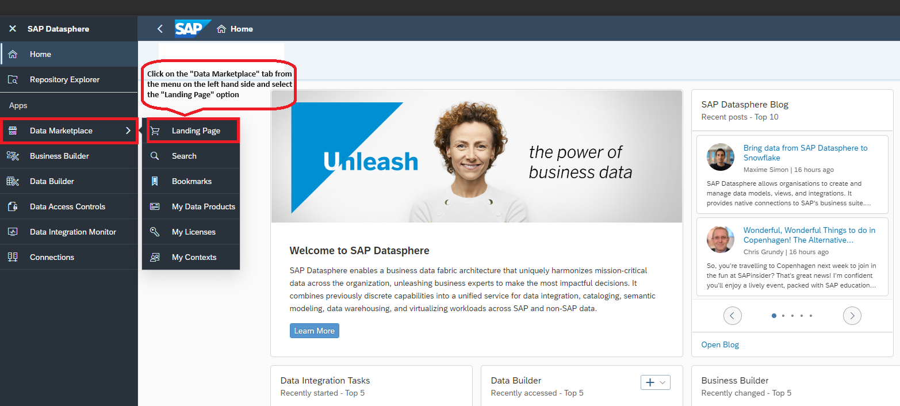
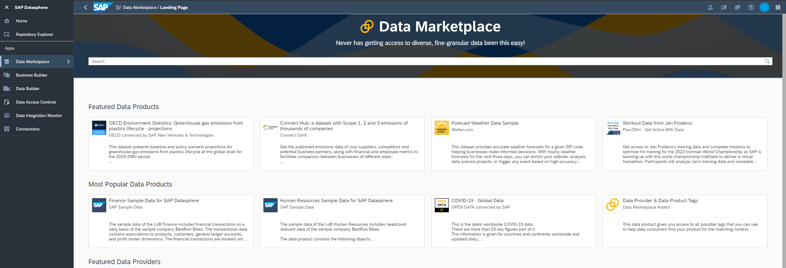
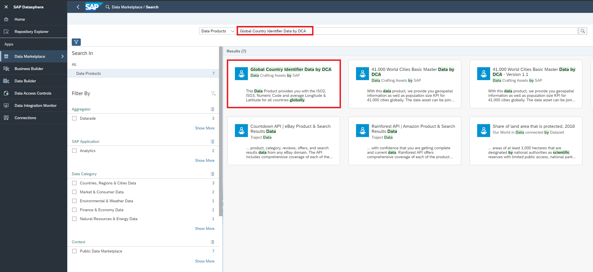
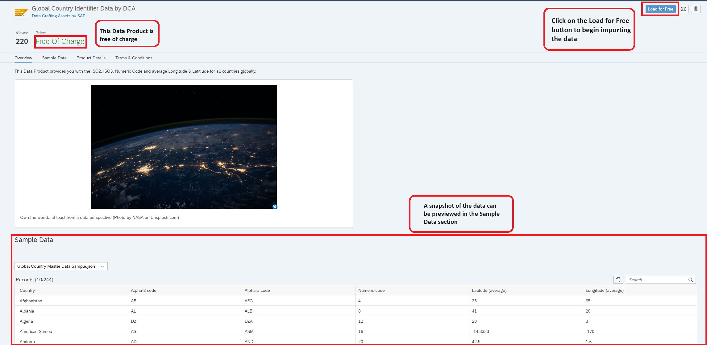
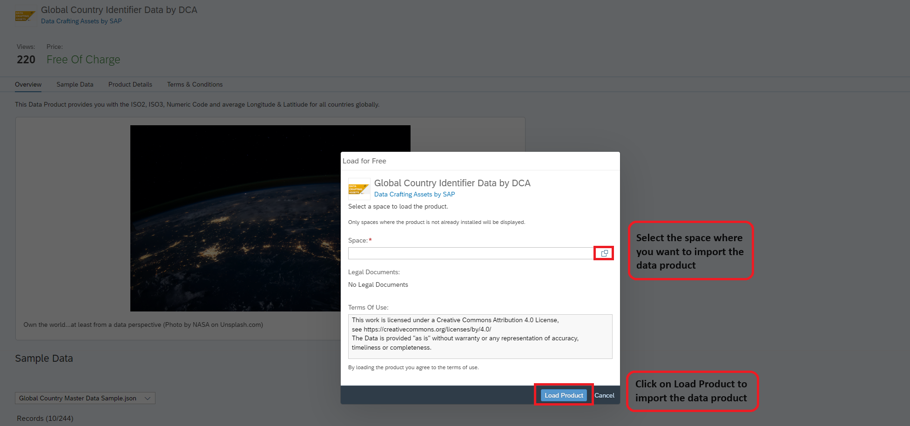
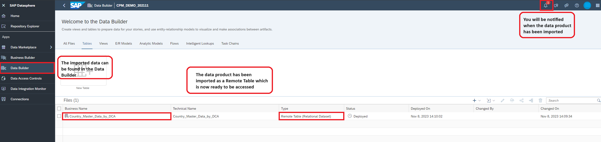
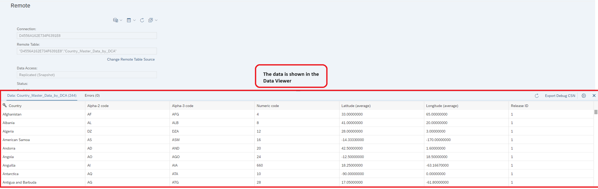
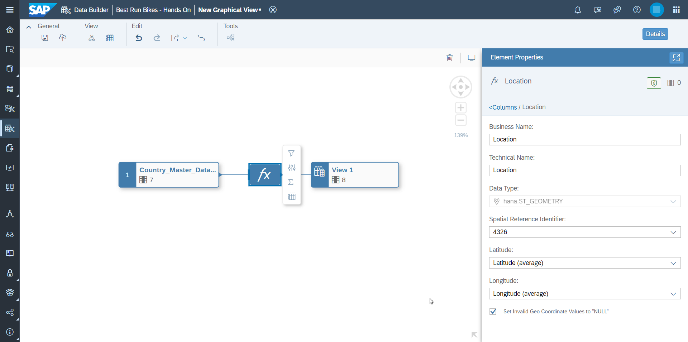

# Acquiring Data Products from the Data Marketplace

We have already learnt to import data from different sources within the organizations. Now let us learn about how to acquire third-party data using the SAP Datasphere Data Marketplace.

SAP Datasphere Data Marketplace serves an excellent tool for organizations on their data journey. It offers a rich and diverse ecosystem of external data providers and products, providing a wide array of data assets waiting to be harnessed. Organizations can easily integrate available third-party data to their datasets.
The data comes in form of data products that can be used in one or several spaces of your SAP Datasphere tenant. Data products are either provided for free or require the purchase of a license at a certain cost. Some data products are available as one-time shipments, other data products are regularly updated by the data provider.

## Prerequisites
You have a space and service account user added to that space in SAP Datasphere

## Steps to acquire a data product

We would like to enrich our location data from SuccessFactors with the geographical co-ordinates. This would enable us to visualize the data on a geo-map in an SAC story.
<b>Note that one data product can be imported into a space only once. Keep this in mind when several users are co-working in a space.</b>

In order to acquire a data product from data Marketplace following steps can be followed:

Click on the "Data Marketplace" tab from the navigation panel on the left side and click on the Landing Page option.

The Data Marketplace Landing Page looks as shown below. 

Use the Search bar to look for the desired data product i.e. <b>Global Country Identifier Data by DCA</b>. Select the first the product shown. Note that this data product is free of cost. Note that there are more comprehensive search options on the left that can be employed to filter for specific needs, if required.

Click on 'Load for Free' to begin importing.

Search the name of the space where the data product needs to be imported and then click on Load Product

You will be notified in the notification section on the top right corner when the Data Product has been successfully imported in the chosen space. The data has been imported as a Remote Table which can be found in the Data Builder section. The Remote Table is called <b>Country_Master_Data_by_DCA</b>.

The acquired data product can be viewed using the Data Viewer as shown below.

So, now you have seen how to acquire a data product using the SAP Datasphere Data Marketplace.

## Create a Dimension View for Country Master Data
1. Create a new view `V_Dim_Country_<YOUR_USER_ID>` which consumes the imported data product. Set the semantic usage to `Dimension`.

2. Create a Geo-Coordinates column. If you can't select **Geo-Coordinates Column**, validate that you selected `Dimension` as semantic usage for this view.

3. Set the attribute `Alpha-3 code` as key as it identifies the countries. (This column will be mapped to the country codes derived from SuccessFactors data.)

4. Save and deploy this view.

