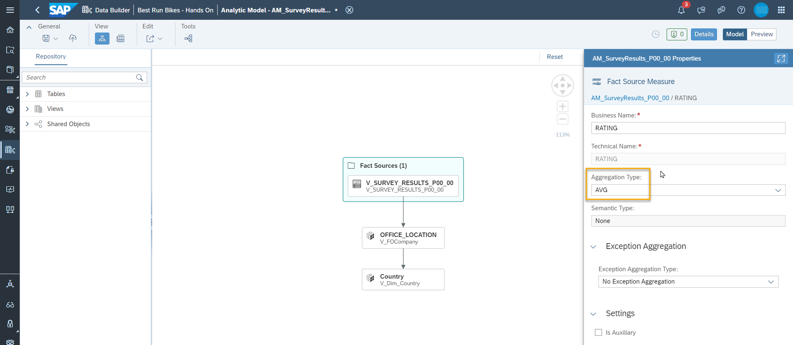

# Build Data Model to Define Custom KPIs
After importing entities from different sources, combine and extend the different datasets available so that you can report across the survey results  your defined KPIs.
 

## Prerequisites
You followed the previous tutorials to 
- [access and import survey results provided HANA Cloud](../dsp_integration_1-connect_to_hana_cloud_access_data/dsp_integration_1-connect_to_hana_cloud_access_data.md/)
- [access and import data on locations and offices from SuccessFactors](../dsp_integration_3-import_sf_data/dsp_integration_3-import_sf_data.md/)
- [access and import location data with geospatial information from the Data Marketplace ](../dsp_integration_4-data-marketplace/dsp_integration_4-data-marketplace.md/)

## You will learn
  - How to build an analytic model mapping data from various sources.

  
## Create Dependencies between Entities  
Create associations between the different entities. You can either create the associations in an E/R Model, or access each entitiy in its own editor. As the modeling using the E/R Model has been introduced in [a previous tutorial](../dsp_modeling_2-create-relationships/dsp_modeling_2-create-relationships.md/), this one shows how to create associations in the table and graphical view editor.

1. The graphical view `V_SURVEY_RESULTS_<USER_ID>` contains the survey results after transformation. Create an association from `V_SURVEY_RESULTS_<USER_ID>` (column `OFFICE_LOCATION`) to the view containing location data `V_FOCompany_<USER_ID>` (column `Default Location`). 

     

2. Create an association from `V_FOCompany_<USER_ID>` (column `Country`) to `V_Dim_Country_<USER_ID>` (column `Alpha 3-code`). 

     

3. To validate your data model: When creating a new ER-Model and adding the related entities, the following dependencies should be displayed:

     

### Create an Analytic Model
1. Create a new Analytic Model named `AM_SurveyResults_<USER_ID>`. Drag the fact view `V_SURVEY_RESULTS_<USER_ID>` into the canvas. Select all measures, attributes and proposed dimensions to be added. 

     

2. Include the associated dimension country (select the dimension `OFFICE_LOCATION/V_FOCompany` and include `V_Dim_Country`). Add the attributes `Country` and `Location`.

     

3. Check the measure `RATING` which has been derived from the fact source. Currently the aggregation is set to `SUM`, adjust it to `AVG`.

     

3. Create five restricted measures for the rating which filter on the different categories: `Job Satisfaction (Negative)`,  `Job Satisfaction (Positive)`,`Negative Working Atmosphere`, `Positive Working Atmosphere`, `Workload (Negative)`. Save and deploy your model afterwards. In the screenshot below, the restricted measure for `Job Satisfaction (Negative)` is displayed as an example. You can use the button **Insert Values** to insert a value from the list (values are retrieved from the sources and intermediate nodes of the object). 

    

  
4. Switch to the preview for the Analytic Model and display the measures together with the `Country` attribute of the according dimension.

    
