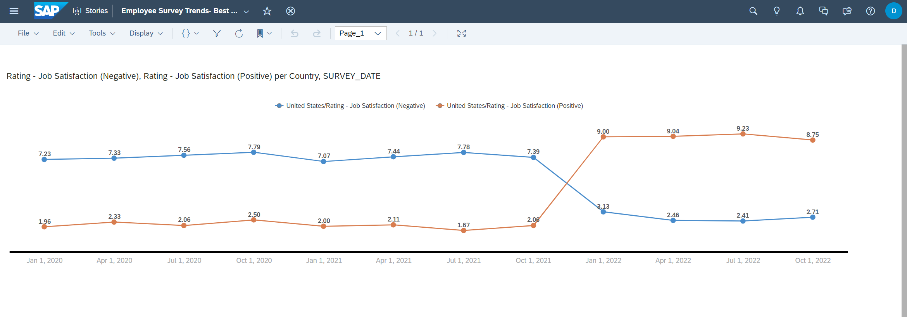

# SAP Analytics Cloud Story

We have already used SAP Analytics Cloud in [a previous exercise](/dsp_integration_6-create-sac-story/dsp_integration_6-create-sac-story.md) to create a story. We will now create another story on the extended analytic model for the survey data by location. To reiterate, SAP Analytics Cloud consumes data from SAP Datasphere via a live connection to create stories and analytic applications. 

## Prerequisites

- You have [created an extended Analytic Model](https://github.com/SAP-samples/hda-cross-pm-samples/blob/main/tutorials/partner-workshop-content/dsp_integration_5-build_data_model/dsp_integration_5-build_data_model.md) using the data from HANA Cloud, SuccessFactors and Datasphere Data Marketplace

## You will learn or reiterate
  - Prerequisites to create a live connection between SAP Analytics Cloud and Datasphere
  - Creating a story accessing data from Datasphere
  - Utilizing semantics and measures which have been defined in Datasphere before

## Use case
We have the monthly survey data results by location. Since **Best Run Bikes** cares about employee satisfaction, they want to view the trends in the employee ratings in different categories so that they can look into making appropriate decisions in the future.

We will create a line trends chart for all the ratings by country to view the changing trends in employee satisfaction in the different categories. Additionally, we will create a geo map with the ratings at a given point in time to view the effects on Covid on employee satisfaction during the peak home office period.

## Create a new Story

Here are the steps to create a Story:
1. SAP Analytics Cloud can be accessed using the **Product Switch** and selecting **SAP Analytics Cloud**

    

2. From the Stories Tab, select the Responsive Story. Proceed to selecting the Optimized Experience and press **Create**.

    

    

3. Drag and drop the **Chart** element on the canvas. This prompts the dialog where the Analytic Model for the story needs to be selected. Select the freshly created Analytic Model **AM_Survey_Results_<USER_ID>** as the basis.

    

4. Change the Chart Type to **Line** to view the trends from the data

    

5. We have to add the dimensions and measures in the chart to generate it. We will analysis the positive and negative categories for the Job Satistfaction by Date and Country. Hence, add **Job Satisfaction (Positive)** and **Job Satisfaction (Negative)** as the measures on the y-axis. Add the **SURVEY_DATE** as the Dimension. To add different line trends for each country, add **COUNTRY** as a color dimension.

    

6. It is possible to analyze the data for different countries. Say for just data from USA, we can add a filter on the country.

    

7. In order to view the story, it has to be saved. Save the story and name it **Employee Survey Trends- Best Run Bikes**. You can now view the results.

    

We will now extend the story to show a geo map of the survey data at a given point in time. **Best Run Bikes** wants to analyze their employees feelings towards their workload right at the start of the COVID crisis. i.e. filter by date April 1, 2020

Here are the steps:

1. Use the add button and a new Geo Map.

    

2. There are many ways of visualizing the geo map. We will visualize it as a Chloropleth (i.e. a symbol or marked and bounded area on a map denoting the distribution of some property). The measure `Rating - Negative Workload` is selected. High values indicate high workload and are displayed in red, low values in green. We will filter the date to April 1, 2020. 

    

3.  The chart provides insights into how the employees rated their Work atmosphere in April of 2020. The legend can be to make sense of the ranges.

    

4. Thus, we can derive a lot of insights from our data model in different scenarios by adjusting the different dimensions and measures.
The screenshot below displays an example how the story for the reporting on employee surveys of Best Run Bikes could look like.

    

