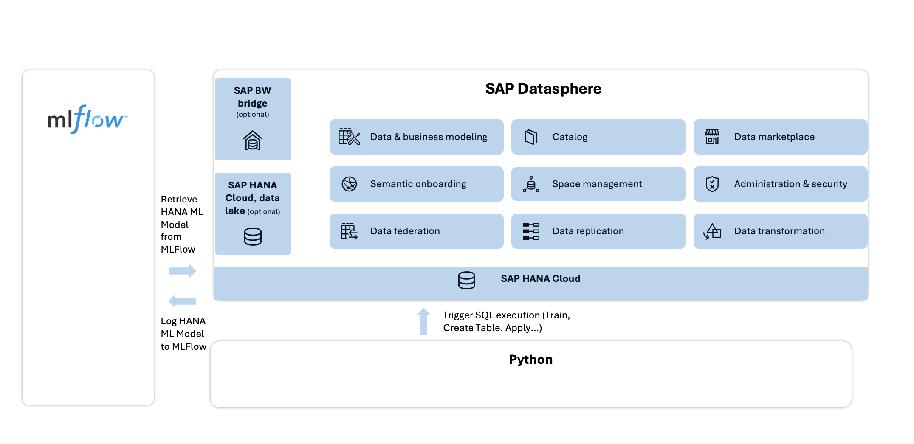

# Predict Supply Chain with SAP Datasphere and HanaML (WIP)
<!-- description --> Explore SAP Datasphere and Hana ML to source data, build, train and deploy machine learning models. This use case enables enterprises for predicting supply chain inventory allocation, do comparative supply chain sales performance analysis and derive insights using SAP Analytics Cloud, all without data duplication.

......

## Prerequisites
- You have an application user in Datasphere which is assigned to a space. 
- You have a Database User in SAP Datasphere that has the permissions to read and write.
- You Visual Studio code & Python installed in your system
- 
## You will learn
  -  How to run machine learning experiments in SAP Datasphere
  - Learn about MLflow 
  - Learn about machine learning algorithm
  - How to leverage machine learning capabilities in SAP Datasphere
  -
    
  This tutorial is based on [a Datasphere mission](https://discovery-center.cloud.sap/protected/index.html#/mymissiondetail/90542/), in which you try to help Company XYZ to get a holistic view of their sales data by using the power of SAP Datasphere. 
  
  You will get the sales and inventory data of Company XYZ and it is your mission to leverage machine learning capabilities of SAP Datasphere to help the bike suppliers make predictions about their sales for an upcoming calendar year and make the best possible business decisions. 

  ..

### Learn about Machine Learning

--
### Learn about MLflow

--

### Learn about HanaML

--

### Get to Know HybridGradientBoostingTree or the algorithms used

--

### Architecture Diagram

 

### Prepare your data in SAP Datasphere

Now it's time to import the CSV file, so you can prepare your dataset in SAP Datasphere. 

1. Simply click on the import CSV icon as shown in the image below.

(import image)

2.  Then, select your source file from your system.

(import image)

3.  Quickly review your data and then click deploy once done

(import image)

4. Give the table a technical name () and a business name () and then wait whilst the table is deployed

The CSV files can be found ...
Alternatively, all the dataset files can be found [here](../dsp_ml_flow_1/dataset_dsp_ml_flow_1/)

*if you see the discovery center there are two steps to create tables importing the csv files. One set of data for the retailers and another one ‘DistributorData.csv’, ‘ProductMaster.csv’, ‘RetailMaster.csv’. May be we could do it in one step or divide into two steps*

### Create View on top of the three retailer tables

1. After the tables are created, please create SQL views for those retaier 1, retailer 2, retailer3 table in SAP Datasphere. When creating these views, please ensure the order of the columns remains productsku, calendar_year, calendar_month, inventory, sales, retailer.

retailer1 table should have view ‘RETAILER1_V’,

retailer2 table should have view ‘RETAILER2_V’,

retailer3 table should have view ‘RETAILER3_V’. 

Make sure consumption is turned on for these views.

(import image)

2. Save and deploy these views.

### Creating a Union View for the Retailers
Now, we need to create a view for the union of the 3 retailer tables. 

(import image)

### Describe ML part

### Visualizarion part

In ML flow if possible to show a nice chart which answers a question like: 

Predict the sales for calendar year 2021, calendar month 2, productsku 1061 and retailer 10001?

### Create a SAC story

..........

### Information for further read (Focusing on advanced user)

May be links for further read for advanced user and your blog link 
