# Predict Customer Behavior with SAP Datasphere and Hana ML (WIP)
<!-- description --> Explore SAP Datasphere and Hana ML to source data, build, train and deploy machine learning models. This use case enables enterprises for predicting user response to a marketing campaing and shows how the enriched data with Machine Learning can be visualized within SAP Analytics Cloud, all without data replication or federation.

## Prerequisites
- You have an application user in Datasphere which is assigned to a space. 
- You have a Database User in SAP Datasphere that has the permissions to read, write and access PAL/ APL SQL procedures.
- You have an IDE & Python installed on your system
- You have a separate Virtual Environment created
- You have to run the following command ``pip install -r requirements.txt`` to install all necessary Python packages for this tutorial
## You will learn
  -  How to run machine learning experiments in SAP Datasphere
  - Learn about MLflow 
  - Learn about machine learning algorithm
  - How to leverage machine learning capabilities in SAP Datasphere
  - Learn what a neural network is
    

Your working peer has provided you with customer data of your Company, and it is your mission to leverage the machine learning capabilities of SAP Datasphere to help your marketing team to identify the customers that are likely to respond the campaign.

### Learn about Machine Learning
- [Machine Learning Introduction](https://slds-lmu.github.io/i2ml/)
- [CodeCamp Machine Learning course](https://youtu.be/i_LwzRVP7bg?feature=shared)
- [Generative AI at SAP](https://open.sap.com/courses/genai1)

### Learn about MLflow
- [Introduction to MLflow](https://mlflow.org/docs/latest/index.html)
- [MLflow Medium blog](https://medium.com/@jaz1/introduction-to-mlflow-ad1a1d8b6dcd)


### Learn about Hana ML
- [Introduction to HANA ML](https://community.sap.com/t5/technology-blogs-by-sap/hands-on-tutorial-leverage-sap-hana-machine-learning-in-the-cloud-through/ba-p/13495327)
- [HANA ML sample github](https://github.com/SAP-samples/hana-ml-samples/tree/main)
- [HANA ML Python documentation](https://help.sap.com/doc/1d0ebfe5e8dd44d09606814d83308d4b/2.0.07/en-US/hana_ml.html)
- [HANA Cloud Multi-Model openSAP course](https://open.sap.com/courses/hana10)

### Architecture Diagram

 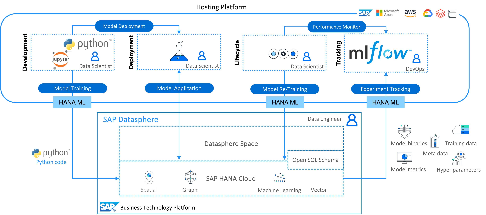

### Prepare your data in SAP Datasphere

Now it's time to import the CSV file, so you can prepare your dataset in SAP Datasphere. 

1. Click on the import CSV icon as shown in the image below.


2.  Then, select the source file from the GitHub repository using the [customer profile dataset](data/CUSTOMER_PROFILE.csv)

3. Upload the dataset using the import functionality of Datasphere. Navigate therefore to the location of the file and select the file to be uploaded. After clicking on the Upload button, you find the following screen which shows the different imported columns with its values. In total the dataset contains 24 columns with in total 2,240 rows:

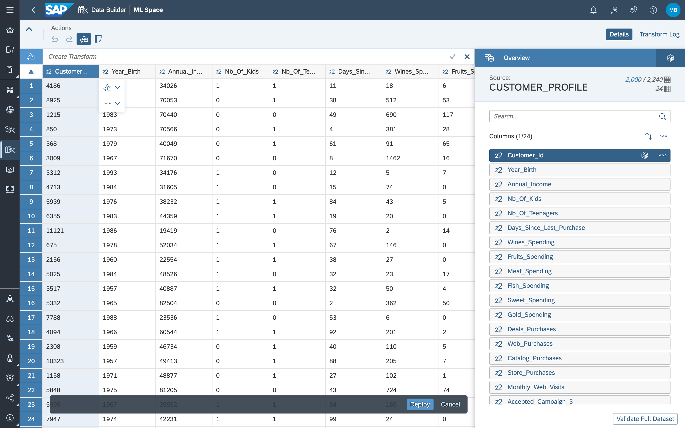
4. After verifying that everything has been imported successfully, use the **deploy** button.
5. You get prompted to name your dataset. After you have selected an appropriate name, you can click on the **deploy** button to finish the data import. In our case, we name it **Customer Profile Table**
> If you select a different name, make sure to adapt the name if needed for the following document

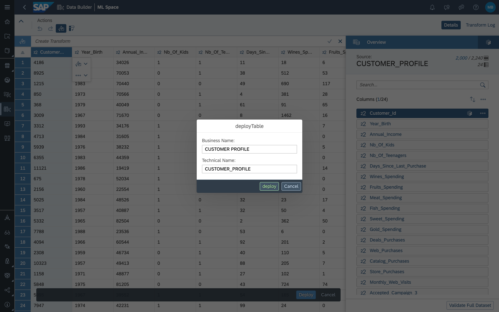
6. After the import is finished, your space should look like the following:

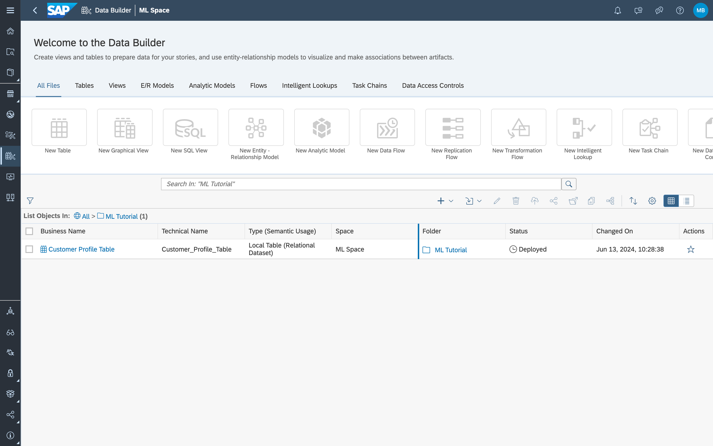

7. In order to consume the data for HANA ML, we need to create a view and expose the view in order to make it accessible to the Open SQL schema of SAP Datasphere
8. For non-technical users, we can make use of the Graphical View. In order to make use of it, we can click on the tile **New Graphical View**
9. For the Graphical view, you can drag and drop the table **Customer Profile Table** into the canvas in order to map the table to the view entity which is getting associated. As we are only using a simple projection view, we do not include any additional calculation. We name our View **Customer Profile View** and toggle the option to expose the view for consumption. After entering all the data, you need to click on the deploy icon.

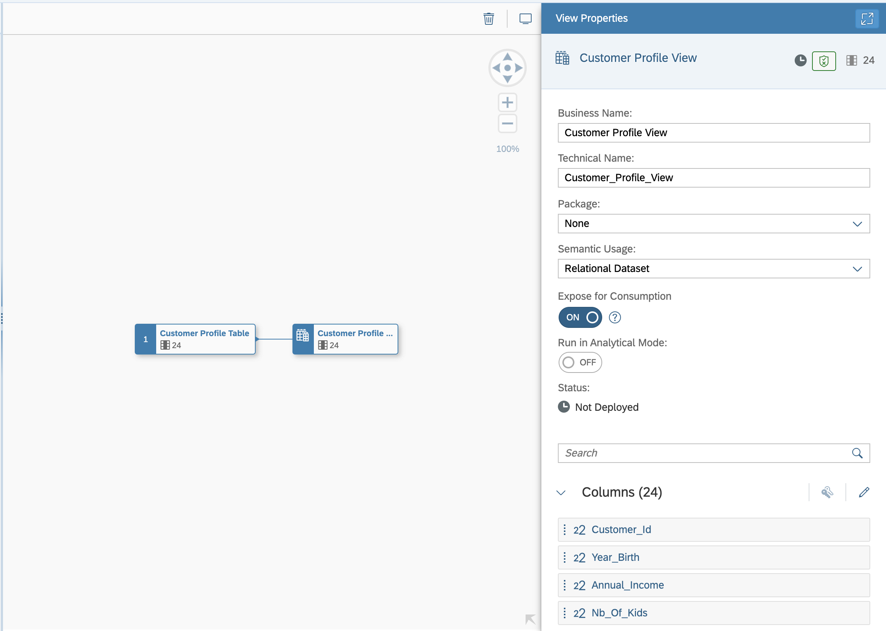
10. For more technical users, users have the possibility to use SQL in order to create a View by using the following SQL statement with the SQL View editor:
```SQL
SELECT "Customer_Id",
	"Year_Birth",
	"Annual_Income",
	"Nb_Of_Kids",
	"Nb_Of_Teenagers",
	"Days_Since_Last_Purchase",
	"Wines_Spending",
	"Fruits_Spending",
	"Meat_Spending",
	"Fish_Spending",
	"Sweet_Spending",
	"Gold_Spending",
	"Deals_Purchases",
	"Web_Purchases",
	"Catalog_Purchases",
	"Store_Purchases",
	"Monthly_Web_Visits",
	"Accepted_Campaign_3",
	"Accepted_Campaign_4",
	"Accepted_Campaign_5",
	"Accepted_Campaign_1",
	"Accepted_Campaign_2",
	"Has_Complained",
	"Has_Responded"
FROM "Customer_Profile_Table"
```
11. Name the SQL View accordingly and toggle the option **Expose for Consumption**. After the settings are set, click on the Deploy icon in order to save the view within your space.

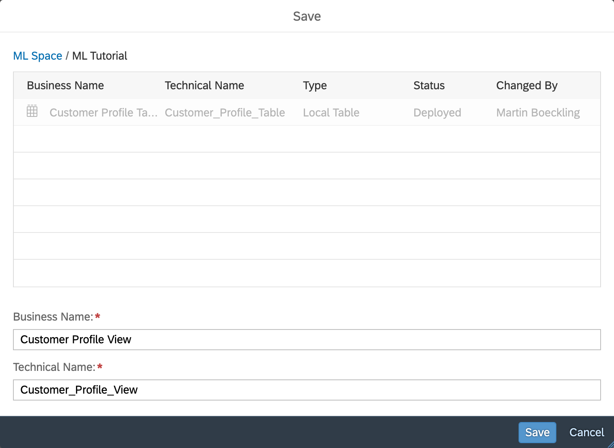
12. After the creation of the view, we see the following artifacts within our space:

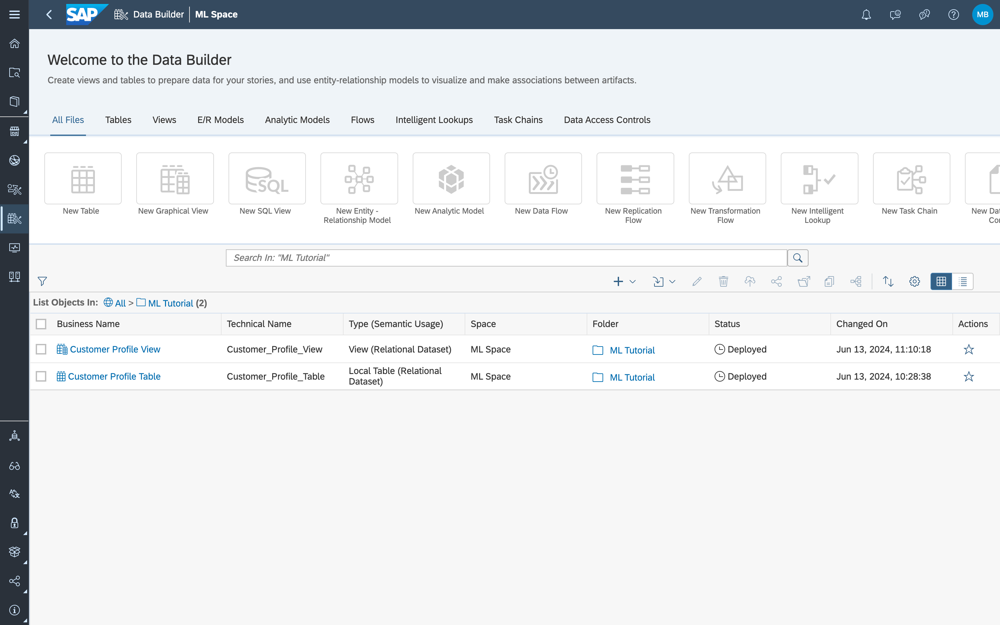

13.  In the following the metadata information of the [imported table](csn_data_format/Customer_Profile_Table.json) and the created [Datasphere View](csn_data_format/Customer_Profile_View.json) are found.
## Classification
For the Machine Learning part, we want to classify whether a customer would respond to our marketing campaign or not. In order to determine which algorithm works best, we try in our setting two different algorithms for the classification:
- [Hybrid Gradient Boosting Trees](https://help.sap.com/doc/1d0ebfe5e8dd44d09606814d83308d4b/2.0.07/en-US/pal/algorithms/hana_ml.algorithms.pal.trees.HybridGradientBoostingClassifier.html#hana_ml.algorithms.pal.trees.HybridGradientBoostingClassifier)
- [Multi Layer Perceptron](https://help.sap.com/doc/1d0ebfe5e8dd44d09606814d83308d4b/2.0.07/en-US/pal/algorithms/hana_ml.algorithms.pal.neural_network.MLPClassifier.html)

For the hyperparameter optimization, we use a Bayesian Hyperparameter optimization in order to determine the best combination of hyperparameters. Hyperparameters in the context of Machine Learning algorithms are parameters influencing the algorithm structure (Number of trees in Random Forest, learning rate). In order to log the different results, we make use of the MLflow platform to determine the best model and hyperparameter combination. For a more detailed explanation of the different methods, you can view the following [section](#information-for-further-read-focusing-on-advanced-user).

### Build up connection to the HANA database
In order to make use of the embedded ML libraries in the underlying HANA database, we need to establish the connection to the database reserved for the Datasphere space. For that, the provided secrets are used loading the secrets from the locally stored secret file. In order to retrieve the credentials, the [constant file](HanaML_DSP/constants.py) is used. The [constant file](HanaML_DSP/constants.py) is used as the central collection for all constant variables throughout the template.

> Generally, all data which is handled within the HANA ML framework will reside within HANA without transferring data from the database to the Python client itself. This especially reduces the amount of time that is needed for a retrieval and caching of data packages to Python itself to run machine learning models.

1. Define overall connection to the underlying HANA database and import all necessary packages

```Python
from hana_ml import dataframe
from hana_ml.algorithms.pal.unified_classification import UnifiedClassification
import mlflow
from bayes_opt import BayesianOptimization
from constants import db_url, db_user, db_password, db_space, mlflow_url
# suppress warnings coming from pandas
import warnings
warnings.simplefilter(action='ignore', category=FutureWarning)
# dataset retrieval
conn = dataframe.ConnectionContext(address=db_url,
                                   port=443,
                                   user=db_user,
                                   password=db_password)
```

2. After the successful connection to the HANA database, we now need to make sure to reference our exposed Datasphere View. In order to establish the connection to the View, we need to use the following code:

```Python
data = conn.table('Customer_Profile_View', schema=db_space)
```
3. The variable **data** now contains a HANA ML dataframe object, which references the respective Datasphere View over the established connection. In order to run our model, we use the functionality of the data type casting to change all columns which use BIGINTEGER data types to normal INTEGER data types. For this, we use the following code snippet:
```Python
data = data.auto_cast({"BIGINT": "INT"})
```

4. Set up the connection to your MLflow instance in order to log the metrics to the MLflow instance
```Python
# set up MLflow tracking with experiment
mlflow.set_tracking_uri(mlflow_url)
mlflow.set_experiment("HANA ML DSP Experiment")
```
After the data preparation together with the data retrieval has been finished, we now look into the possibility on how the HANA ML model is trained.
### Training of HANA ML model
For the overall training of the ML model, we have the possibility to directly run our dataset on the different algorithms which HANA ML provides. However, central questions for a Machine Learning experimentation remain unanswered:
- What is the optimal algorithm for my dataset?
- What is the best hyperparameter combination for the algorithm?
- What is the performance which I can expect for new data coming in?

In order to answer the different questions, we perform a hyperparameter optimization using two different algorithms with the Hybrid Gradient Boosting Tree, as well as the Multi Layer Perceptron.

#### Hybrid Gradient Boosting Tree
>A Hybrid Gradient Boosting Tree is a sophisticated machine learning model that combines the strengths of Decision Trees and Gradient Boosting, often enhanced with additional techniques for improved performance. It combines the output of different individual decision trees and then combines it into a single prediction. For classification, it uses a majority vote for a class to determine the class that should be predicted

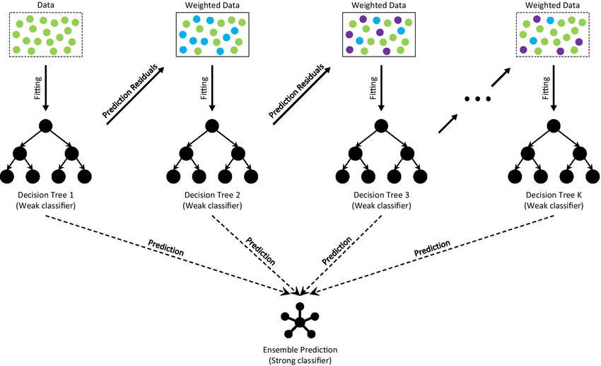

1. Create a Python method which contains our training procedure for a single hyperparameter optimization. The method accepts the different hyperparameters and stores them in the variable
```Python
def hgt_training_routine(n_estimators:float, max_depth:float, subsample: float, col_subsample_tree: float, col_subsample: float, learning_rate: float) -> float:
    """Trains a Hybrid Gradient Boosting Tree classifier and returns the MCC (Matthews Correlation Coefficient) score.

    Args:
        n_estimators (float): The number of boosting stages to be run.
        max_depth (float): The maximum depth of the individual estimators.
        subsample (float): The fraction of samples to be used for fitting the individual base learners.
        col_subsample_tree (float): The fraction of features to be used for each tree.
        col_subsample (float): The fraction of features to be used for each split.
        learning_rate (float): The learning rate shrinks the contribution of each tree by `learning_rate`.

    Returns:
        float: The MCC score of the trained model.
    """

```
2. Within the created method, create an individual MLflow run which passes the hyperparameters to a dictionary and converts the different parameter into the correct data type
```Python
with mlflow.start_run():
        # Set parameters for the Hybrid Gradient Boosting Tree model
        hgt_params = {
            "n_estimators": int(n_estimators),
            "max_depth": int(max_depth),
            "subsample": subsample,
            "col_subsample_tree": col_subsample_tree,
            "col_subsample_split": col_subsample,
            "learning_rate": learning_rate,
            "random_state": 42,
            "evaluation_metric": "auc"
        }
```
3. Within the method, initialize the classification model using the Hybrid Gradient Boosting algorithm and enable the MLflow autologging capabilities using HANA ML
```Python
# Initialize the classification model with specified parameters
hgt_classification = UnifiedClassification(func="HybridGradientBoostingTree", **hgt_params)
hgt_classification.enable_mlflow_autologging()
```
4. Fit the specified model with the hyperparameters which are passed to the method. Furthermore, we specify a validation dataset, for which we test how the model performs
```Python
# Fit the model with the data, specifying all parameters
hgt_classification.fit(data,key="Customer_Id", label="Has_Responded", partition_method="stratified", stratified_column="Has_Responded", build_report=True, partition_random_state=42, training_percent=0.8)
```
5. Collect the MCC metric calculating the performance of our model. For that, we collect the HANA dataframe values and extract the MMC metric. A definition of the MCC metric and explanation can be found in the [following section](#mcc-metric). We then return the extracted MCC metric within the method itself.
```Python
# Collect model statistics and extract the MCC metric
statistic_dataset = hgt_classification.statistics_.collect()
mcc_metric = statistic_dataset[statistic_dataset["STAT_NAME"] == "MCC"]["STAT_VALUE"].values.tolist()[0]
mcc_score = float(mcc_metric)
return mcc_score
```
6. Define the search space for the Bayesian Search Optimization for the Hybrid Gradient Boosting tree. This defines the lower and upper boundary of each hyperparameter for the search of the optimal combination
```Python
# define search space for hyperparameter tuning of the HGT model itself
hgt_optimizer = BayesianOptimization(f=hgt_training_routine,
                                     pbounds={
                                         "n_estimators": (50, 1000),
                                         "max_depth": (0, 50),
                                         "subsample": (0.01, 1.0),
                                         "col_subsample_tree": (0.01, 1.0),
                                         "col_subsample": (0.01, 1.0),
                                         "learning_rate": (0.01, 1.0)
                                         },
                                         verbose=2)
```
7. After we have defined the search space for our Hyperparameter optimization, we need to run the optimizer. Our goal for the optimization is to maximize the MCC score. In total, we run 10 random hyperparameter selections and after the 10 runs, we run in total 30 Bayesian search optimization runs. During the process of the optimization, we print out the logs with the different hyperparameters and respective score:
```Python
# define run of the model using 10 random selections and 30 iterations using a bayesian search optimization through the hyperparamter search space
hgt_optimizer.maximize(
    init_points=10,
    n_iter=30
)
```

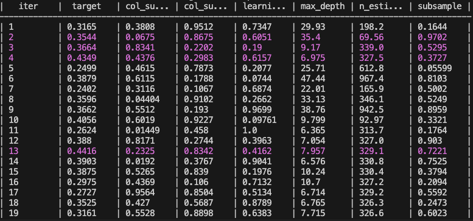

8. After the run is finished, we print the best score together with the optimal hyperparameter for the Hybrid Gradient Boosting Tree out
```Python
print(f"""
The best score for the model is {hgt_optimizer.max['target']} with the parameter combinations of {hgt_optimizer.max['params']}
""")
```

#### Multi Layer Perceptron
> A Multi-Layer Perceptron (MLP) is a type of artificial neural network that is designed to model complex relationships in data. It consists of multiple layers of nodes, called neurons, each of which performs a simple computation.

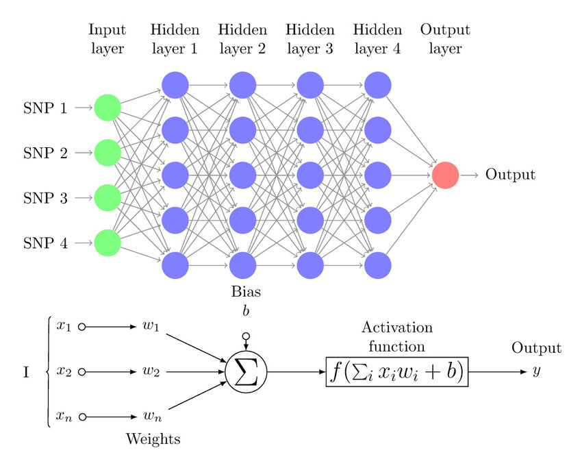

1. Similarly to the Hybrid Gradient Boosting Tree, we define first a method which uses the hyperparameter retrieved from the Bayesian search optimization and starts an MLflow run with the respective hyperparameters:
```Python
def mlp_training_routine(max_iter: float, learning_rate: float, momentum: float, batch_size: float, hidden_layer_size: float) -> float:
    """Trains a Multi-Layer Perceptron (MLP) classifier and retrieves the MCC (Matthews Correlation Coefficient) score from the model statistics.

    Args:
        max_iter (float): The maximum number of iterations.
        learning_rate (float): The learning rate for weight updates.
        momentum (float): The momentum for gradient descent updates.
        batch_size (float): The number of samples per batch.
        hidden_layer_size (float): The size of the hidden layer.

    Returns:
        float: The MCC score of the trained model.
    """
    with mlflow.start_run():
        # Set parameters for the MLP model
        mlp_params = {
            "max_iter": int(max_iter),
            "learning_rate": learning_rate,
            "momentum": momentum,
            "batch_size": int(batch_size),
            "hidden_layer_size": (int(hidden_layer_size),),
            "random_state": 42,
            "evaluation_metric": "auc_onevsrest",
            "activation": "sigmoid_asymmetric",
            "output_activation": "sigmoid_asymmetric",
            "normalization": "z-transform",
            "weight_init":'uniform'
        }
        # Initialize the classification model with specified parameters
        mlp_classification = UnifiedClassification(func="MLP", **mlp_params)
        mlp_classification.enable_mlflow_autologging()
        # Fit the model with the data, specifying all parameters
        mlp_classification.fit(data,key="Customer_Id", label="Has_Responded", partition_method="stratified", stratified_column="Has_Responded", build_report=True, partition_random_state=42, training_percent=0.8)
        # Collect model statistics and extract the MCC metric
        statistic_dataset = mlp_classification.statistics_.collect()
        mcc_metric = statistic_dataset[statistic_dataset["STAT_NAME"] == "MCC"]["STAT_VALUE"].values.tolist()[0]
        mcc_score = float(mcc_metric)
    return mcc_score
```
2. We define the search space for our hyperparameter run. In general, we change the hyperparameters as we run a Multi Layer Perceptron, which is in the need of different hyperparameters:
```Python

mlp_optimizer = BayesianOptimization(f=mlp_training_routine,
                                     pbounds={
                                         "max_iter": (1, 10000),
                                         "learning_rate": (0.00001, 1.0),
                                         "momentum": (0.00001, 1.0),
                                         "batch_size": (1, 50),
                                         "hidden_layer_size": (1, 300)
                                         },
                                         verbose=2)
```
3. Run the optimization with in total 10 random runs as well as 30 runs using the Bayesian search algorithm
```Python
# define run of the model using 10 random selections and 30 iterations using a bayesian search optimization through the hyperparamter search space
mlp_optimizer.maximize(
    init_points=10,
    n_iter=30
)
```
4. Print out the best score of the MLP model together with the optimal hyperparameter combination
```Python
print(f"""
The best score for the model is {mlp_optimizer.max['target']} with the parameter combinations of {mlp_optimizer.max['params']}
""")
```

The complete training script with all the methods used in training can be found in the following [training script](HanaML_DSP/HANA_ML_Train.py):

### Hyperparameter Visualization part
In MLflow we are now able to see the different runs which have been logged during the hyperparameter search. In total, we have logged 80 runs, all with different hyperparameters using in total two different algorithms. In order to analyze the different runs, you can start to explore the different runs in MLflow.
1. Click on the provided MLflow link in order to access the MLflow web page
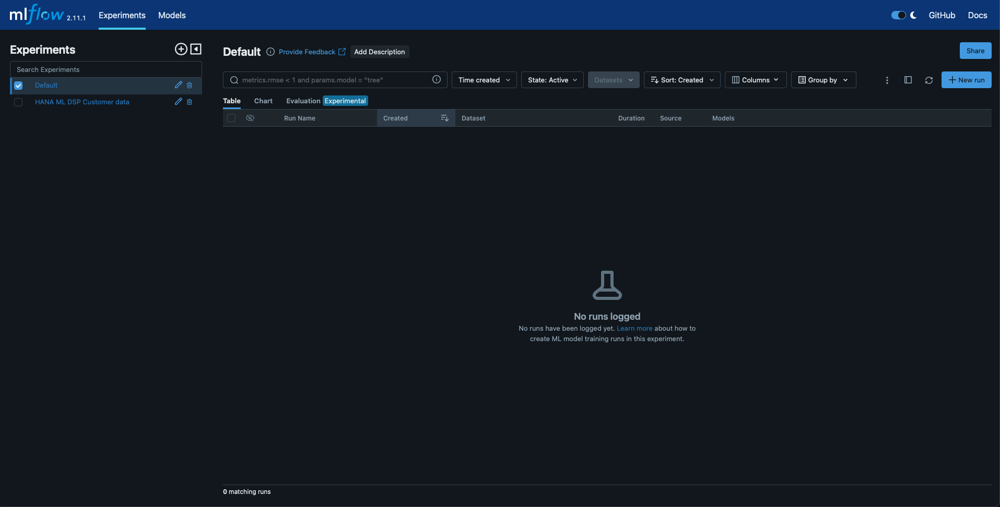
2. Navigate to the experiment under which you have logged your different Machine Learning runs
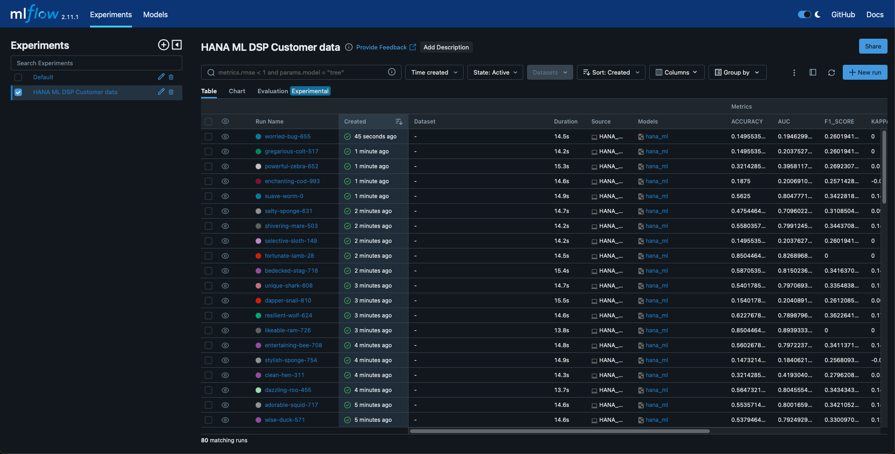
3. Click on the Chart tab to see the automatic generated visualizations comparing the different HANA ML runs
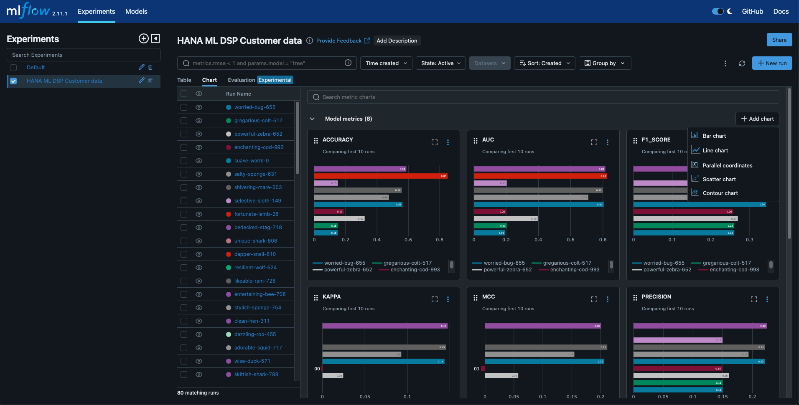
4. Click on the add chart button and click on the Parallel coordinates option

5. Add in the Params box the following parameters to visualize our hyperparameter search for the Hybrid Gradient Boosting Tree algorithm
- col_subsample_tree
- col_subsample_split
- max_depth
- n_estimators
- subsample
- learning_rate

    For the metrics select the MCC metric and click on the save button.

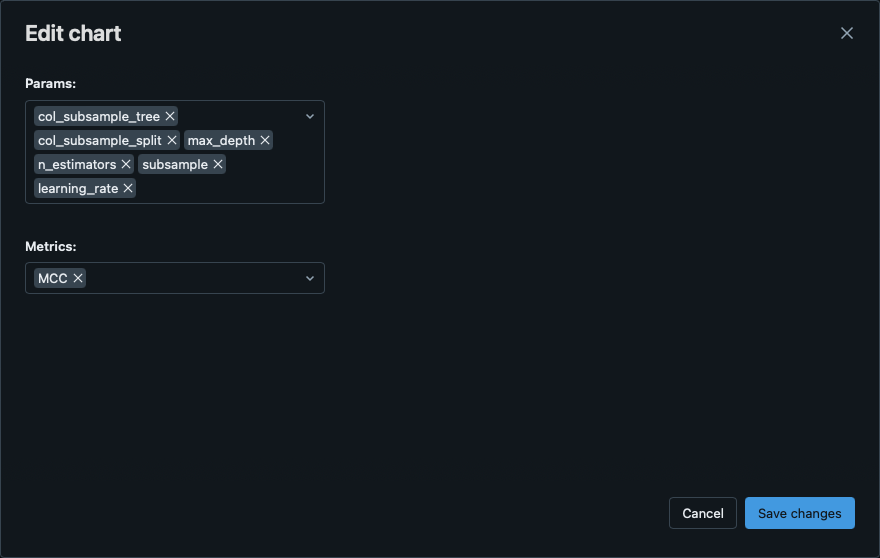

6. The now newly added chart should be visible within the chart overview in MLflow visualizing our hyperparameter search for the Hybrid Gradient Boosting Tree algorithm

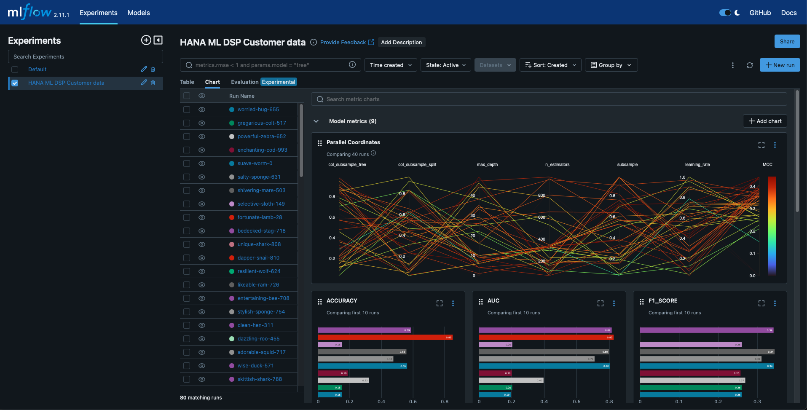

7. In order to visualize the model hyperparameter search also for the Multi Layer Perceptron, we can add a new Parallel Coordinates plot to the chart overview of MLflow
8. Add the following parameters to the chart overview
- batch_size
- hidden_layer_size
- learning_rate
- max_iter
- momentum

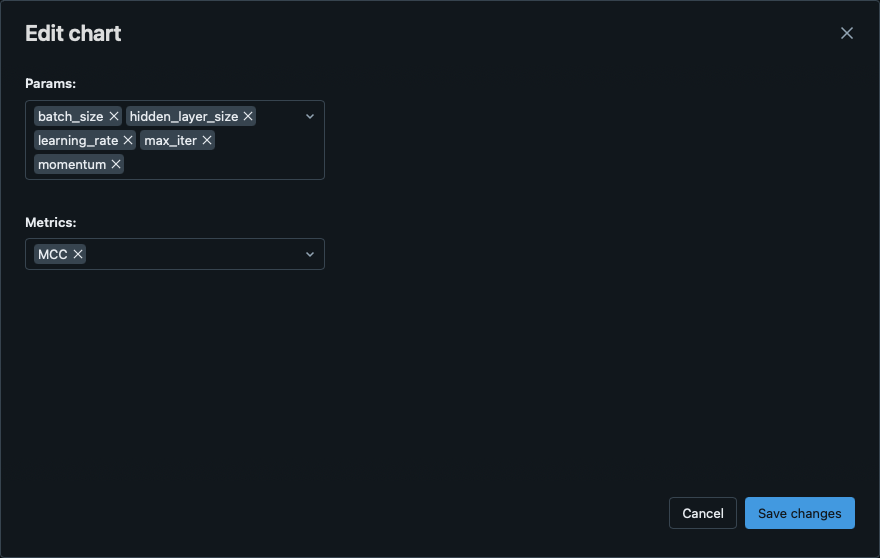

The overall chart for the hyperparameter search of the Multi Layer Perceptron model looks in our case like the following:

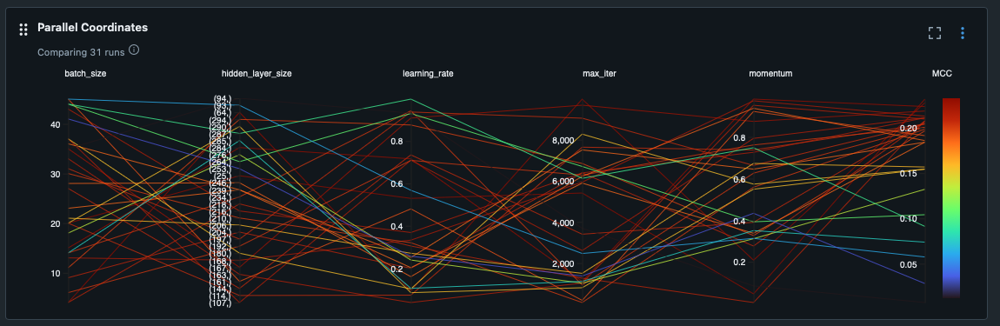

9. In order to determine what our best run is, we can navigate back to the Table tab which gives us the overview of all our different runs. We therefore select the MCC metric as our central metric and click on the column which contains the metric name. This sorts our runs in descending order, for which we then have the run with the highest score at the very top of the table. In our case, the best performing algorithm is the Hybrid Gradient Boosting tree.

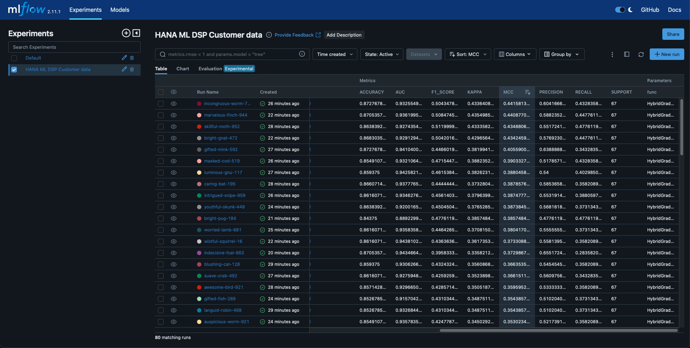

10.  Besides the overall metrics, HANA ML also logs the metadata of a model to MLflow. When we click at a run name, this allows us to view the different metadata information logged to the individual run

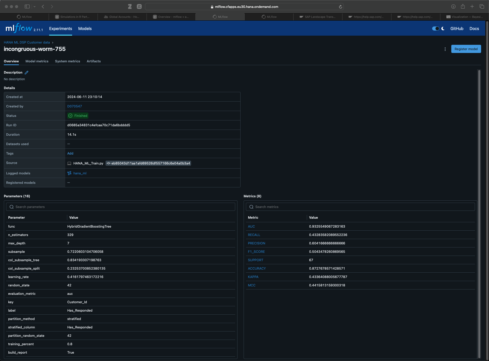

11. When we click in the upper table of the overview at the row of the logged model, we see that within MLflow the metadata information of the HANA ML model is completely logged to MLflow.

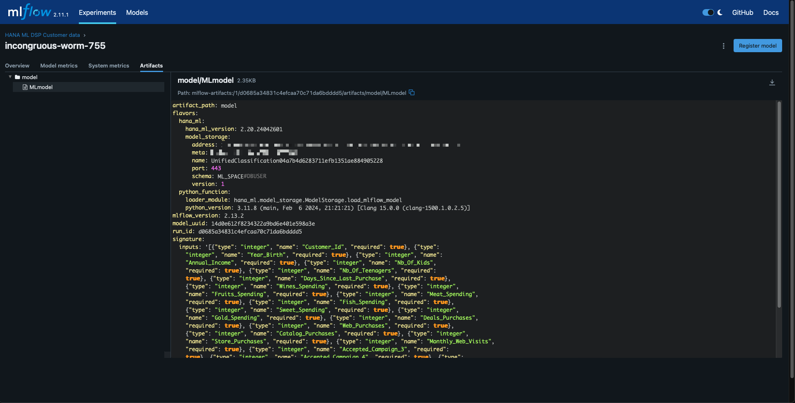
### Apply the best ML model on the data
After the comparison of our different hyperparameters for the two different algorithms, we want to apply our trained model to our dataset in order to enrich our data with the prediction information. We will write the resulting dataset back to Datasphere and make it available in our space for modeling purposes.

1. Navigate to our run for which we have received the best results for the MCC score and retrieve the run ID from the metadata:

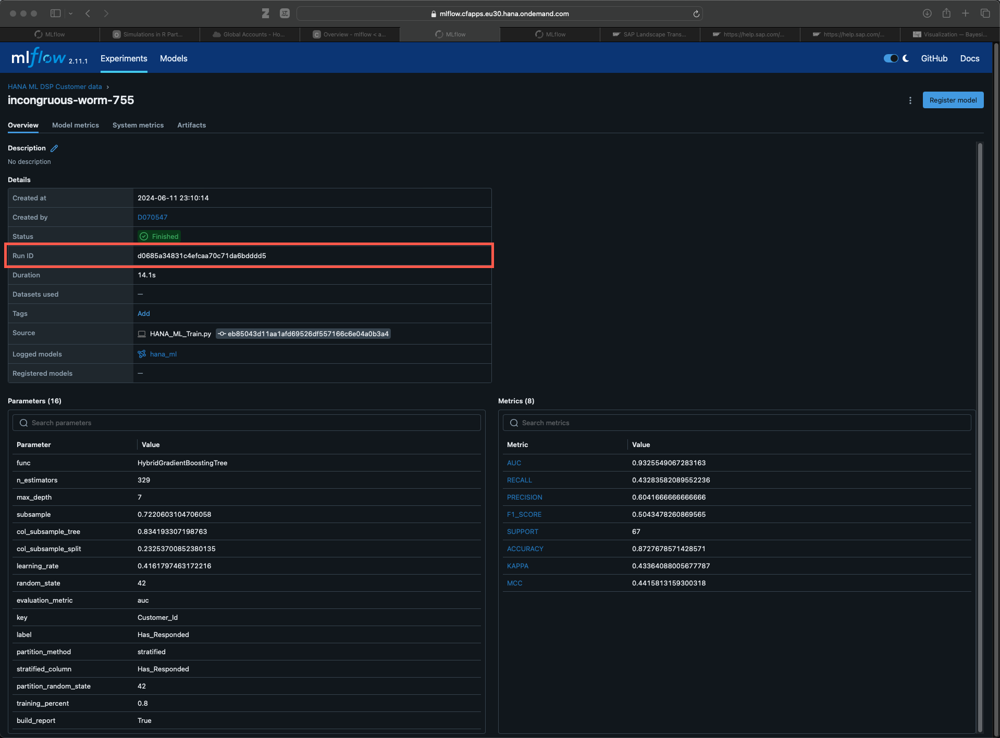
3. Create a new Python file which is called **HANA_ML_Apply.py** in your working directory
3. Add the following script part in order to create a connection to the HANA database
```Python
from hana_ml import dataframe
from hana_ml.model_storage import ModelStorage
from hana_ml.algorithms.pal.auto_ml import Preprocessing
import mlflow
from constants import db_url, db_user, db_password, db_space, db_table, load_dotenv

conn = dataframe.ConnectionContext(address=db_url,
                                   port=443,
                                   user=db_user,
                                   password=db_password)

data = conn.table('Customer_Profile_View', schema=db_space)
```
4. Create the same data transformation as we have done it for the Train script
```Python
data = data.auto_cast({"BIGINT": "INT", "DECIMAL": "DOUBLE"})
```
5. Retrieve the logged HANA ML model from MLflow, which is associated to the best run we have logged during our experimentation. Insert the value to the variable logged_model as a string. When loading the model, we see a progress bar which indicates the metadata download from MLflow:


```Python
model_storage = ModelStorage(connection_context=conn)
logged_model = **runid**
mymodel = model_storage.load_mlflow_model(connection_context=conn, model_uri=logged_model)
```
6. Use the loaded model in order to predict the data from our dataset. We therefore use the predict method from our model and specify the primary key of our dataset. This allows us in the coming steps to join the prediction dataset to our original dataset and enrich it.
```Python
dataset_data_predict = mymodel.predict(data=data, key="Customer_Id")
dataset_data_predict.save(where="HANA_ML_Prediction")
```

7. The complete apply script for the HANA ML model can be found [here](HanaML_DSP/HANA_ML_Apply.py).

8. We now navigate back to our Datasphere space, from which we open the SQL View editor

9. Click on the sources tab and search for the name under which we have stored our prediction (**HANA_ML_Prediction**). After we have found the respective dataset, we drag and drop it into the canvas

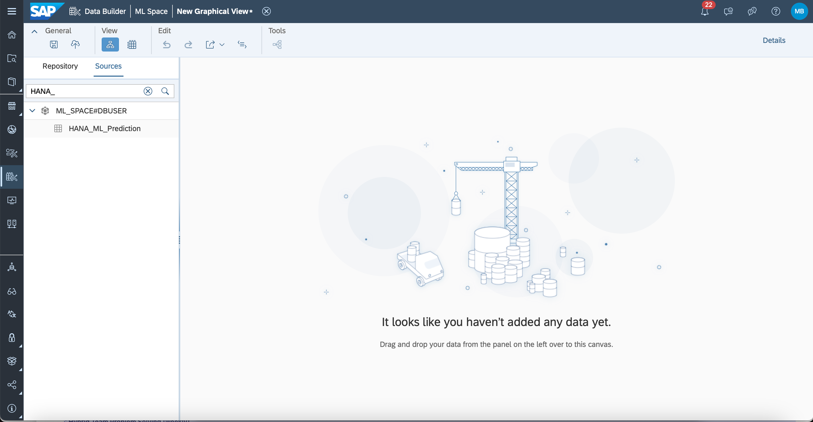

10. After you have dragged the table into the canvas, you get the message prompted to import the HANA table to SAP Datasphere. Click on the Import and Deploy button to import the table to Datasphere.

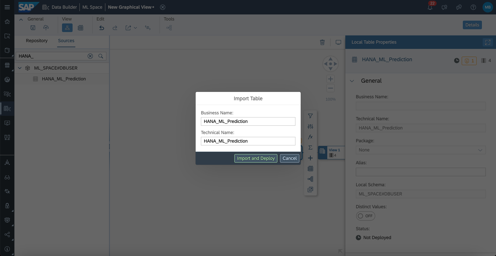

11. We change the model properties of the Datasphere View in the language tab from **SQL (Standard Query)** to **SQLScript (Table Function)** and toggle the **Expose for consumption** as well as the **Run in Analytical Mode**.

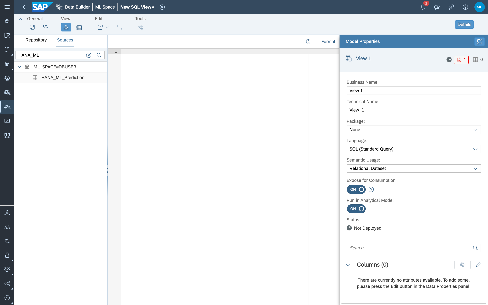

12. We add the following SQL code into the canvas in order to flatten our JSON structure in the reason code for visualization purposes in SAC:

```SQL
RETURN
-- Select table and extract from reason code JSON values from the specified keys and cast them to the respective data type if needed
SELECT
	"JSON_TABLE"."Customer_Id",
	"JSON_TABLE"."SCORE",
	"JSON_TABLE"."CONFIDENCE",
	SUBSTR_REGEXPR(
		'("attr":)(")(\w+)(")' IN "JSON_TABLE"."REASON_CODE" GROUP 3
	) AS "ATTR",
	CAST(
		SUBSTR_REGEXPR(
			'("val":)(.*)(,)' IN "JSON_TABLE"."REASON_CODE" GROUP 2
		) AS DOUBLE
	) AS "VAL",
	CAST(
		SUBSTR_REGEXPR(
			'("pct":)(.*)(})' IN "JSON_TABLE"."REASON_CODE" GROUP 2
		) AS DOUBLE
	) AS "PCT"
FROM
-- Subquery which splits the list of JSONs dynamically into separate rows, containing in each row one JSON over regular expressions
	(
		SELECT
			"HANA_ML_Prediction"."Customer_Id",
			"HANA_ML_Prediction"."SCORE",
			"HANA_ML_Prediction"."CONFIDENCE",
			SUBSTR_REGEXPR(
				'{.*?}' IN "REASON_CODE" OCCURRENCE SERIES."ELEMENT_NUMBER"
			) AS "REASON_CODE"
		FROM
			"HANA_ML_Prediction"
			CROSS JOIN SERIES_GENERATE_INTEGER(1, 0, 10) SERIES
		WHERE
			SUBSTR_REGEXPR(
				'{.*?}' IN "REASON_CODE" OCCURRENCE SERIES."ELEMENT_NUMBER"
			) IS NOT NULL
	) AS "JSON_TABLE";H
```
13. We click on the **pen icon** in the left to customize the columns of the Datasphere View with the following properties:

|Business Name | Data Type  |
|:-------------|:-----------|
|Customer_Id   |Integer     |
|SCORE         |String(256) |
|CONFIDENCE    |Double      |
|ATTR          |String(5000)|
|VAL           |Double      |
|PCT           |Double      |

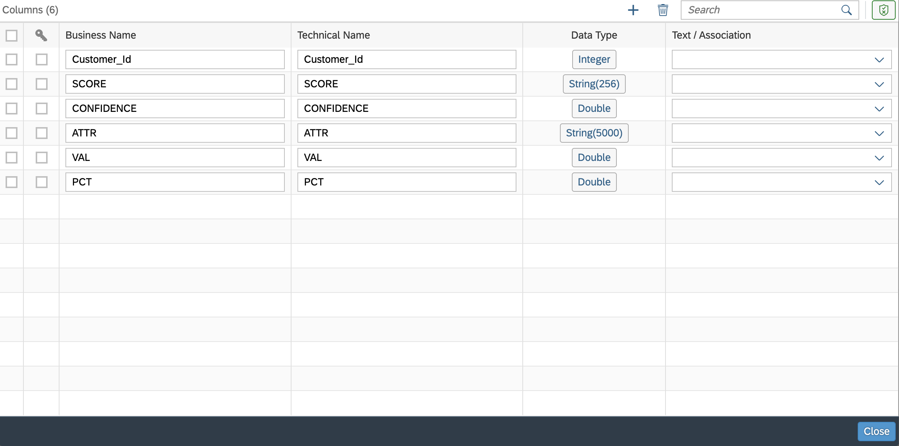

14.  We click on the deploy icon and call our created SQL View **HANA ML flattened reasoning**. After having the name stored, the data modeling within SAP Datasphere is finished.

15. The metadata of the created View can be found [here](csn_data_format/HANA_ML_flattened_reasoning.json).

# Information for further read (Focusing on advanced user)
## Get to know Hybrid Gradient Boosting Tree
Hybrid Gradient Boosting Trees (HGBT) combine the principles of traditional Gradient Boosting with additional techniques to enhance performance, robustness, and interpretability. These hybrid methods integrate various strategies such as feature selection, regularization, or even combining gradient boosting with other algorithms to address specific challenges or improve overall model efficiency. It involves several base concepts:

1. **Base Learners:**

    In Gradient Boosting, the base learners are typically simple models like decision trees. These trees are shallow, making them weak learners. In HGBT, other algorithms can be combined or used as base learners to leverage their strengths.
2. **Sequential Learner:**

    Each new tree in the sequence is trained to predict the residuals (errors) of the previous ensemble of trees. This sequential correction process reduces errors and refines predictions.
3. **Hybrid Techniques**

    HGBT integrates various enhancements such as:
    - **Feature Selection**: Techniques like regularization (L1, L2) to select the most relevant features, reducing overfitting and improving model interpretability.
    - **Regularization Methods**: Methods like shrinkage or learning rate adjustment to prevent overfitting by controlling the contribution of each new tree.
    - **Algorithm Combination**: Combining gradient boosting with other algorithms (e.g., linear models) to leverage their complementary strengths.

The advantages of the Hybrid Gradient Boosting Tree can be described as followed:
- **Improved Accuracy:** By combining different techniques, HGBT can achieve higher accuracy than traditional gradient boosting models.
- **Reduced Overfitting:** Regularization methods and hybrid approaches help in controlling overfitting, making the model generalize better to unseen data.
- **Better Interpretability:** Feature selection and regularization improve the interpretability of the model, making it easier to understand which features contribute most to the predictions.
- **Flexibility:** The hybrid approach allows for customization and adaptation to different types of datasets and specific challenges within the data.

Hybrid Gradient Boosting Trees for Classification represent an evolution in boosting techniques, combining the robustness of traditional gradient boosting with innovative methods to tackle specific challenges. This hybrid approach enhances the model's performance, interpretability, and applicability across various domains, making it a valuable tool in the machine learning practitioner's toolkit. The original paper can be found [here](https://dl.acm.org/doi/abs/10.1145/2939672.2939785) for a deeper and more technical description.

## Get to know Multi Layer Perceptron
A Multi-Layer Perceptron (MLP) is a class of feedforward artificial neural network (ANN) and is one of the simplest forms of neural networks used for classification tasks. MLPs consist of multiple layers of nodes (neurons) in a directed graph, with each layer fully connected to the next one. They are particularly powerful for supervised learning problems where the goal is to learn a mapping from inputs to outputs.

A MLP is therefore structured as followed:
1. **Input Layer:**
The input layer consists of nodes representing the input features of the dataset. Each node in this layer corresponds to a single feature.

2. **Hidden Layers:**
Hidden layers are the intermediate layers between the input and output layers. An MLP can have one or more hidden layers, each containing a number of neurons. These neurons apply activation functions to introduce non-linearity, enabling the network to learn complex patterns.

3. **Output Layer:**
The output layer consists of one or more neurons, depending on the classification task. For binary classification, a single neuron with a sigmoid activation function is typically used. For multi-class classification, multiple neurons with a softmax activation function are used to produce a probability distribution over classes.

For MLP several key concepts are important in order to determine the overall way how MLPs function:

1. **Feedforward Architecture:**
In an MLP, data flows from the input layer through the hidden layers to the output layer in a single direction. This is known as a feedforward neural network.

2. **Backpropagation:**
Backpropagation is the learning algorithm used to train MLPs. It involves two main steps:
   - Forward Pass: Compute the output of the network for a given input.
   - Backward Pass: Compute the gradient of the loss function with respect to each weight by applying the chain rule, and update the weights using gradient descent.
3. Activation Functions:
Activation functions introduce non-linearity into the network, allowing it to learn complex patterns. Common activation functions include:
   - **Sigmoid:** $\sigma(x)=\frac{1}{1+e^{-x}}$
   - **ReLU (Rectified Linear Unit):** $ReLU(x)=max(0,x)$
   - **Tanh (Hyperbolic Tangent):** $tanh(x)=\frac{e^{x}-e^{-x}}{e^{x}+e^{-x}}$

The loss function measures the difference between the predicted output and the actual target. For classification tasks, common loss functions include:
- Binary Cross-Entropy: Used for binary classification.
- Categorical Cross-Entropy: Used for multi-class classification.

The advantages of the MLP algorithm can be described as followed:
1. **Flexibility:** MLPs can model complex relationships in data due to their non-linear activation functions and multiple layers.
2. **Generalization:** Properly regularized MLPs can generalize well to new, unseen data.
3. **Scalability:** MLPs can be scaled up to handle large datasets and complex tasks by adding more layers and neurons.

Multi-Layer Perceptrons for Classification are foundational elements of neural network-based machine learning. They offer flexibility and power in modeling complex patterns in data, making them suitable for a wide range of applications. Despite being one of the simplest forms of neural networks, MLPs remain highly effective and widely used, providing a strong starting point for understanding more advanced neural network architectures. The original paper can be found [here](https://psycnet.apa.org/doiLanding?doi=10.1037%2Fh0042519) for a deeper and more technical description.

## Get to know Bayesian hyperparameter search optimization
Bayesian Hyperparameter Search Optimization is an advanced technique for hyperparameter tuning that uses Bayesian inference to model the relationship between hyperparameters and model performance. Unlike traditional methods such as grid search or random search, Bayesian optimization is more efficient and can find optimal hyperparameters with fewer evaluations.

The following key concepts are defined for the overall search optimization:
1. **Surrogate Model:**
Bayesian optimization uses a surrogate model to approximate the objective function that maps hyperparameters to performance metrics. Common surrogate models include Gaussian Processes (GP), Random Forests, and Tree-structured Parzen Estimators (TPE).

2. **Acquisition Function:**
The acquisition function determines the next set of hyperparameters to evaluate based on the surrogate model. It balances exploration (trying hyperparameters with high uncertainty) and exploitation (trying hyperparameters with high predicted performance). Common acquisition functions include:

   - **Expected Improvement (EI):** Chooses hyperparameters that are expected to improve the objective function the most.
   - **Probability of Improvement (PI):** Selects hyperparameters that have the highest probability of improving the objective function.
   - **Upper Confidence Bound (UCB):** Balances exploration and exploitation by considering both the mean and uncertainty of the surrogate model's predictions.
3. **Iterative Process:**
Bayesian optimization iterates between updating the surrogate model with new observations and using the acquisition function to select the next set of hyperparameters. This iterative process continues until a stopping criterion is met, such as a maximum number of iterations or a time limit.

It is based on the overall Bayes rule, which helps to predict an instance $Y$ given $X$. The formula for the Bayes rule is given as $P(Y|X)=\frac{P(X|Y)P(Y)}{P(X)}$. For the Bayes rule, the different variables are defined as:
- $P(X)$ is defined as the probability of observing the evidence $X$
- $P(X|Y)$ is the overall probability of observing the evidence $X$ given the event $Y$
- $P(Y)$ is the initial hypothesis about the event Y that we care about

Translating the overall Bayes rule to the overall hyperparameter tuning search, we can formalize the equations as followed: 

$P(\text{metric}|\text{hyperparameter combination})= \frac{P(\text{hyperparameter combination | metric})P(\text{metric})}{P(\text{hyperparameter combination})}$
- $P(\text{metric | hyperparameter combination})$ gives the probability of the given metric to be minimized/maximized given the combination of hyperparameter values.
- $P(\text{hyperparameter combination | metric})$ is the probability of a certain hyperparameter combination if the given metric is minimized/maximized.
- $P(\text{metric})$ is the initial metric quantity in scalar.
- $P(\text{hyperparameter combination})$ is the probability of getting that particular hyperparameter combination.

The advantages of the Bayesian Hyperparameter Search optimization are defined as follows:
1. **Efficiency:** Bayesian optimization is more efficient than grid or random search, often finding optimal hyperparameters with fewer evaluations.
2. **Adaptive:** The process is adaptive, focusing on promising regions of the hyperparameter space based on previous observations.
3. **Automatic:** It requires less manual intervention, making it suitable for complex models with many hyperparameters.

## MCC metric
The Matthews Correlation Coefficient (MCC) is a measure used in machine learning to evaluate the quality of binary and multi-class classifications. It takes into account true and false positives and negatives and is generally regarded as a balanced measure that can be used even if the classes are of very different sizes. The MCC value ranges from -1 to +1, where:
- $+1$ indicates a perfect prediction
- $0$ indicates a prediction no better than random guessing
- $-1$ indicates complete disagreement between prediction and actual observation

The formula for MCC in the case of a binary classification is defined as followed: 

$MCC=\frac{TP\cdot TN-FP\cdot FN}{\sqrt{(TP+FP)\cdot(TP+FN)\cdot(TN+FP)\cdot(TN+FN)}}$

The different variables are defined as followed:
- $TP$: Count of correctly classified records for the positive class
- $TN$: Count of correctly classified records for the negative class
- $FP$: Count of falsely classified records as positive (Actual negative)
- $FN$: Count of falsely classified records as negative (Actual positive)

The advantages of the MCC score can be described as followed:
- Balanced Measure: Unlike accuracy, MCC considers all four quadrants of the confusion matrix (TP, TN, FP, FN), making it suitable for imbalanced datasets.
- Symmetric: MCC treats both positive and negative classes equally, providing a balanced evaluation metric.
- Robust to Class Imbalance: MCC remains informative even when the dataset has a significant class imbalance, unlike metrics such as precision and recall, which can be misleading in such scenarios.

## HANA ML and MLflow resources
- [Official documentation of HANA ML and MLflow](https://help.sap.com/doc/1d0ebfe5e8dd44d09606814d83308d4b/2.0.07/en-US/pal/algorithms/hana_ml.algorithms.pal.auto_ml.AutomaticClassification.html#hana_ml.algorithms.pal.auto_ml.AutomaticClassification.enable_mlflow_autologging)
- [Conceptual Guide of HANA ML and MLflow](https://community.sap.com/t5/technology-blogs-by-sap/tracking-hana-machine-learning-experiments-with-mlflow-a-conceptual-guide/ba-p/13688478)
- [Technical Deep Dive of HANA ML and MLflow](https://community.sap.com/t5/technology-blogs-by-sap/tracking-hana-machine-learning-experiments-with-mlflow-a-technical-deep/ba-p/13692481)
