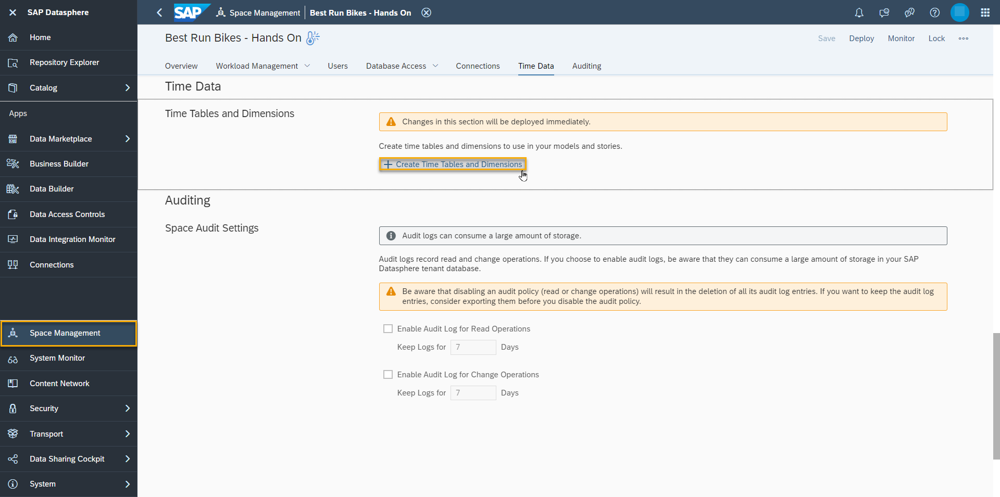

# Import a Dataset into SAP Datasphere
<!-- description --> One way to bring data into SAP Datasphere is by importing flat files. A flat file is a file that does not contain links to other files or is a non-relational database. It stands on its own, for instance, like a single text-only file. The most common flat files are .txt and .csv files.

## Prerequisites
- You have an application user in Datasphere which is assigned to a space. 
## You will learn
  - How to use the Data Builder
  - How to import multiple datasets into your Space
  - Which connections are supported in SAP Datasphere
    
  This tutorial is based on [a Datasphere mission](https://developers.sap.com/mission.data-warehouse-cloud-get-started.html), in which you try to help Best Run Bikes to to get a holistic view of their sales data by using the power of SAP Datasphere. You will get the sales data of Best Run Bikes and it is your mission to use the features of SAP Datasphere to help the bike suppliers make the best possible business decisions. 

  This diagram shows how you acquire data from sources, prepare and model it in SAP Datasphere, and expose it for consumption in SAP Analytics Cloud, Microsoft Excel, and other clients, tools, and apps.

  

  The tutorials show different aspects and functionalities of Datasphere which are depicted in the overview, such as Analytic Models, the Data Marketplace, Flows and SAP Analytics Cloud integration.
  
---

### Get to know the Data Builder

SAP Datasphere has two modelling layers tailored for different user groups: the data layer is the area where data engineers can create their models with a technical approach, whereas the business layer is the area for business users who create their models using a more semantic approach. This allows business users to work independently from data engineers, while still being able to collaborate and share data with them.

To access the Data Builder, simply click on the Data Builder icon on the left-hand side menu of SAP Datasphere. Here you select your space. 

 

### Import CSV files

Now it's time to import the CSV files from the Best Run Bikes scenario, so you can get active with SAP Datasphere. The CSV files can be found in Step 3 of the [Get Ready for Your SAP Datasphere tutorial](https://developers.sap.com/tutorials/data-warehouse-cloud-1-begin-trial.html) (Sales Orders, Sales Order Items, Addresses, Business Partners).
Alternatively, all the dataset files can be found [here](../dsp_modeling_1-import-dataset/datasets-dsp_modeling_1-import-dataset)

1.  Simply click on the import CSV icon as shown in the image below

    

2.  Then, select your source file from your system

3.  Quickly review your data and then click deploy once done

4.  Give the table a technical name(`T_<SalesOrders/SalesOrderItems/Addresses/BusinessPartners>_<YOUR_USER_ID>`) and a business name and then wait whilst the table is deployed

5.  You can then add your remaining CSV files by repeating the process

    

### Generate Time Data
Time table and dimensions views can be created in a space to provide standardized time data for you analysis. 
1. Go to the section **Time Data** in **Space Management**. If you see **Create Time Tables & Dimensions** (as displayed in the screenshot), continue with step 2 and 3 as no time data has been generated fro the space yet. If time data has already been generated, select the pencil icon to see more details on the configuration. 
   
  
  
2. If you create time tables & dimensions, you don't need to change any values. Click **Create**
   
  

3. Wait till the confirmation message **Time data created** appears. Users assigned to your space can now use the views as dimensions by creating associations to them from their entities containing time data.
   
4. The Time Dimensions that were added can be viewed from the Data Builder. Select the view `Time Dimension - Day` and open the data preview.

   

---
