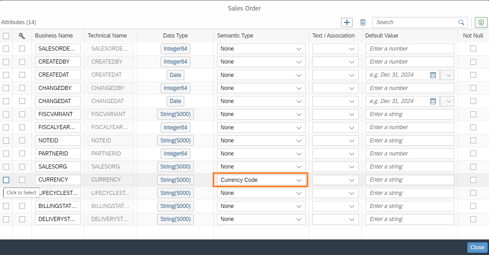
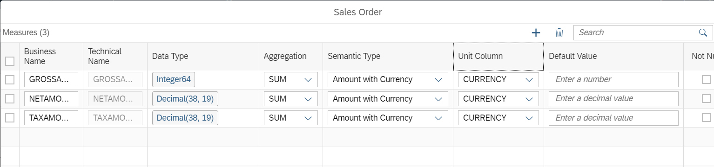
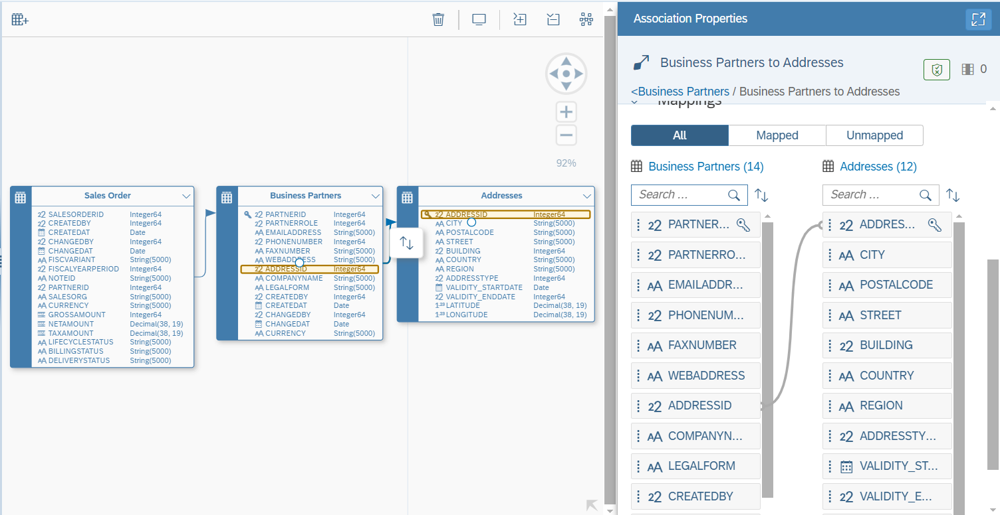
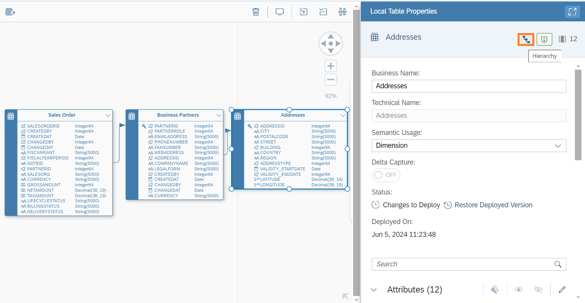

# Create an Entity Relationship Model in SAP Datasphere
<!-- description --> An entity-relationship model (or E/R model) describes interrelated things of interest in a specific domain of knowledge. You can use an E/R model to better understand a subset of the entities in your space, and to communicate this information to other stakeholders. By using an E/R Model in Datasphere, you can maintain relations between your entities which will be leverage in the reporting later.

## Prerequisites
 - You have [imported your dataset into your Space.](../dsp_modeling_1-import-dataset/dsp_modeling_1-import-dataset.md)

## You will learn
  - Overview of E/R Models
  - How to create an E/R Model
  - How to associate data columns
  - Finalise an E/R Model and deploy

---

### Understand the basics of E/R models

An E/R model provides a diagram for organising your data entities (tables and views) in relation to one another. You can:

•	Add entities from the repository or import them from a connection or a CSN file, as well as creating new entities directly

•	Modify the properties of your entities including adding human-readable business names and creating associations directly in the diagram

•	Save and deploy all the contents of your model with a single action

The work that you do in an E/R model benefits all the users in your Space as they can use the entities that you import or enhance as sources in their views

A data model is a way to organise the data and define the relationship between the data elements you have, to give it a structure. This structure must be aligned with your team's needs to generate reports and queries.

### Create an E/R model

1.	Go to the Data Builder and click on the **New Entity-Relationship Model** button

    

2.	This takes you into the graphical modelling interface. Since you imported the sample data manually via CSV, your data can be found under the **Repository**
3.	Click and drag the table `T_SalesOrders_<USER_ID>`, `T_SalesOrderItems_<USER_ID>`, `T_BusinessPartners_<USER_ID>` and `T_Addresses_<USER_ID>` onto the canvas

    

5.	With the data tables in your modelling interface, you are now ready to create the relevant associations and deploy your E/R model.

### Adjust Semantic Types

1. Each entity (tables and views) have a property called `Semantic Usage`. This property is used to indicate the type of data contained in the entity. Select the table `T_SalesOrderItems_<USER_ID>` and set the Semantic Usage to `Fact`. This indicates that your entity contains numerical measures that can be analyzed.
2. Drag the measures `GROSSAMOUNT`, `NETAMOUNT`, `TAXAMOUNT` and `QUANTITY` from the **Attributes** section into the **Measures** section

  

3. After maintaining the semantic type of the table in the first step, specify the semantic types for the measures and attributes now. Semantic types include values, quantities, dates, and geo and textual information. Click on the **Edit columns** pencil icon for attributes and select the according `Semantic Type` for `CURRENCY` and `QUANTITYUNIT`

  

4. Next, click on the **Edit columns** pencil icon for measures. Assign `Semantic Type` and `Unit Column` as displayed in the screenshot

  

5. Set the `Semantic Usage` of the table `T_SalesOrders_<USER_ID>` to `Fact`

6. Specify `GROSSAMOUNT`, `NETAMOUNT`, `TAXAMOUNT` as measures

7. Set the semantic type of the attribute `CURRENCY` to `Currency Code`

8. Modify the semantic types of the measures similiar to the previous step 3

9. Adjust the semantic type of `BusinessPartners` to `Dimension`. This indicates that your entity contains attributes that can be used to analyze and categorize measures defined in other entities

10. After adjusting the semantic type, a yellow validation warning is displayed as Dimension entities need at least one key attribute. Define `PARTNERID` as key attribute by clicking on **More** when hovering the attribute

  

11. Adjust the semantic type of `T_Addresses_<USER_ID>` to `Dimension`

12. Set `ADDRESSID` as key attribute 

13. Save and deploy the entities of E/R Model by clicking the according buttons on the upper left corner. Set the technical name to `ER_Sales_<USER_ID>`. When saving entities in Datasphere, they are stored as design-time definition. Deploying an entity creates a run-time version

  

### Associate Data Columns

Associations are created and maintained in the E/R model editor, in the table editor or in the graphical view/SQL editor. As we are modifying associations between multiple tables, we will use the E/R model editor.
They are used to e.g. associate master data, text or time objects to fact data.

1. Click on the `T_SalesOrders_<USER_ID>` table and then click on the **Create Association** arrow icon

2.	Drag it over to the `T_SalesOrderItems_<USER_ID>` table to create an association between the two tables

3.	Ensure that the created association is between the columns `T_SalesOrderID_<USER_ID>` in the **Association Properties** panel

4.	Drag and drop to connect the sales column from one table to the other if it's not done already

     

5.	Next, create an association from `T_SalesOrders_<USER_ID>` to `T_BusinessPartners_<USER_ID>` using the `T_PartnerID_<USER_ID>` column. `T_BusinessPartners_<USER_ID>`  contains information on Best-Run Bikes customers, which is useful when connected to the sales data

    

6.	Now create an association between the `T_BusinessPartners_<USER_ID>` and `T_Addresses_<USER_ID>` tables using the `T_AddressID_<USER_ID>` column (drag the association from `T_BusinessPartners_<USER_ID>` to `T_Addresses_<USER_ID>`)

    

### Create Hierarchy for Addresses
1. Select the hierarchy table and click on the **Hierarchy** Icon on the right side
   
   
   
2. Adding a hierarchy enable drill-down and drill-up in BI clients. A Level-Based hierarchy is non-recursive, has a fixed number of levels, and is defined by specifying two or more level columns within the dimension. Define a hierarchy for the location
   
  

### Create Time Association
After creating associations between the imported data entities, add an association to the already existing time dimension. This allows you to work with this date data at a granularity of day, week, month, quarter, and year, and to drill down and up in hierarchies. In this part of the exercise, we will have a look at the generated data. We won't create anything new.

1. Drag the view `SAP.TIME.VIEW_DIMENSION_DAY` onto the modelling canvas and view the properties. This generated dimension includes different predefined hierarchies

    

2. In the **Association** section, different associations to text entities are displayed. Have a look at the association to table  `Translation Table - Day ` and open it in a new tab. A entity with the semantic usage `Text` must to have one identifier , one language identifier and one text attribute. Open the data preview to see the data records

    

3. Return to your Entity-Relationship Model. Create an association from the column `CREATEDAT` of `T_SalesOrders_<USER_ID>` to `Date` of `Time Dimension - Day`. Validate using the data preview that the date format of the two columns is the same as this is required for the mapping
   
  
 

### Save and deploy

Save and deploy your Entity-Relationship Model again to activate the recent changes (e.g. associations).

---
