 
# Create a Graphical View in SAP Datasphere
With SAP Datasphere, you can use a graphical interface to create data views. You can drag and drop sources, join them as appropriate, add other operators to transform your data, and specify measures and other aspects of your output structure in the output node.

## Prerequisites
- You have [imported your dataset into your Space.](../dsp_modeling_1-import-dataset/dsp_modeling_1-import-dataset.md)
- You have [adjusted the Semantic Types and created Associations using the Entity-Relationship Model](../dsp_modeling_2-create-relationships/dsp_modeling_2-create-relationships.md)

## You will learn
  - What graphical views are
  - How to create a graphical view
  - How to rename columns in your graphical view
  - How to restore columns in your graphical view
  - How to deploy a graphical view

---

### Get to know the graphical views

In SAP Datasphere, you can use the graphical view builder to easily create data views. This allows you to work intuitively without having to be familiar with SQL statements.

In the graphical view builder, you have many possibilities to model your data, like combining data from many sources, removing or creating columns, filtering or aggregating data and specifing measures. 

>If you are comfortable writing SQL code or want to use SQL Script to create your view, you can use the SQL View editor.

Both tables `SalesOrders` and `SalesOrderItems` contain information about sold items. While `SalesOrders` contains details on the business partner, `SalesOrderItems` provides insights on the sold product. To have references to the business partner as well as details on item level available for analysis, we create a view to combine data from both tables.

### Create a Graphical View

1.	Go to the **Data Builder** and click on the **New Graphical View** button (`V_SalesOrderDetails_<USER_ID>`).

    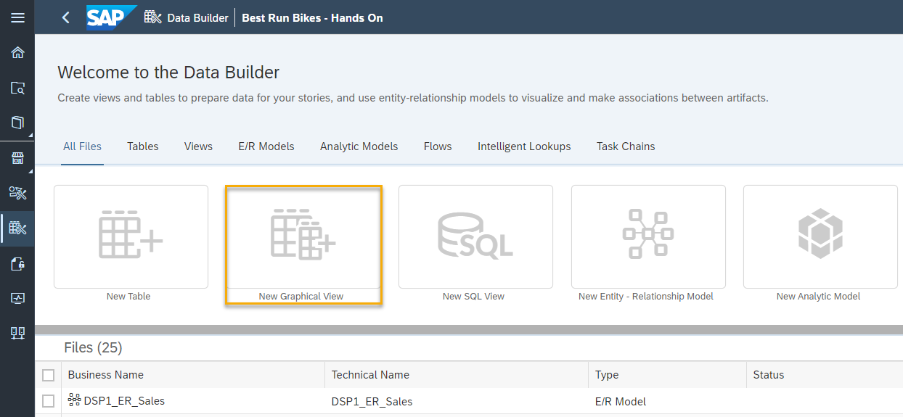

2.	Now that you are in the graphical model builder, it's time to find the data. As you have already imported CSV files, your data is under **Repository**, on the top right-hand side of the screen.

    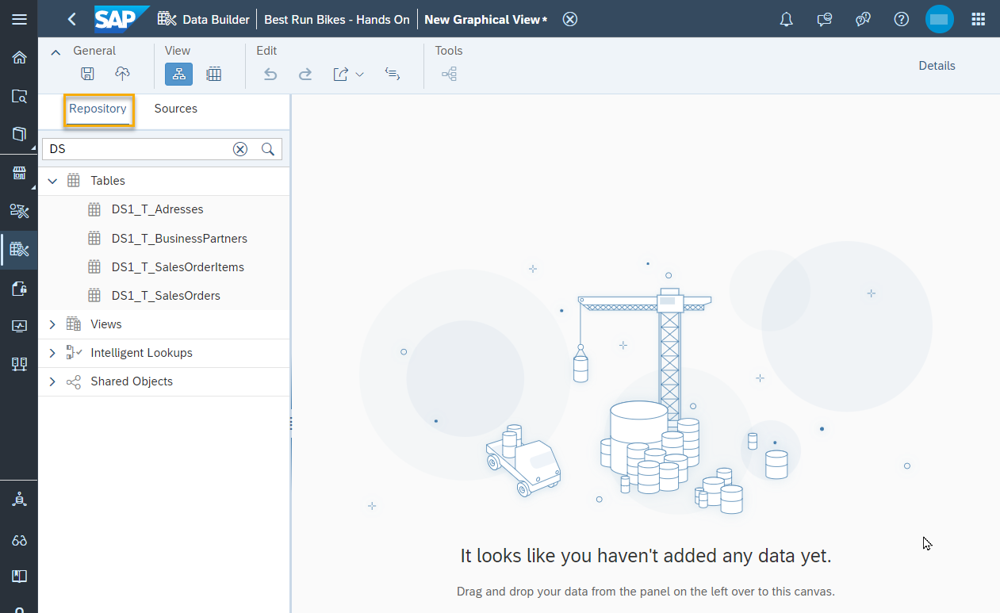

3.	To start building your model, click and drag the `T_SalesOrders_<USER_ID>` table onto the canvas.

    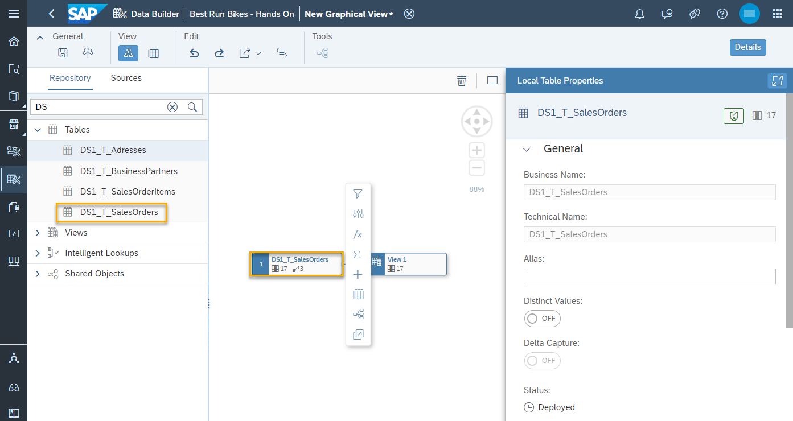

4.	As you can see, an output node appears on the canvas as soon as your drop your table in it. The output node is where all of our join table information will appear once you've completed the model.
5.	Click on the output node and then click on the data preview button to see a preview of the sales orders data.

    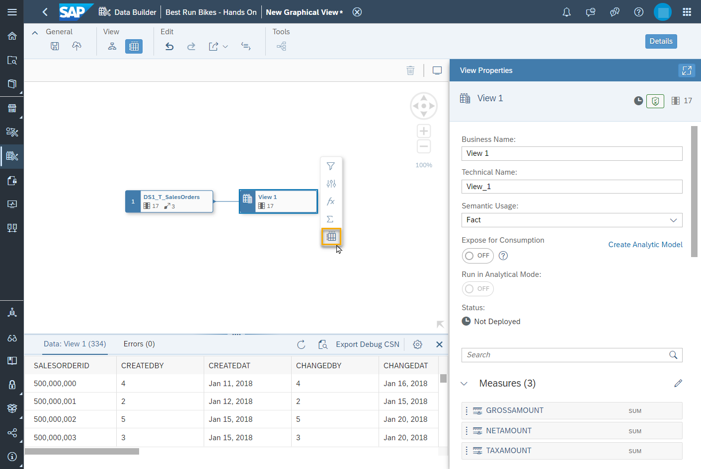

6.	Next, drag the table `T_SalesOrderItems_<USER_ID>` on top of the `T_SalesOrders_<USER_ID>` table to join the two tables. The icon that has appeared is our join node called Join One. The column `T_SalesOrderID_<USER_ID>` from both tables is automatically joined.

    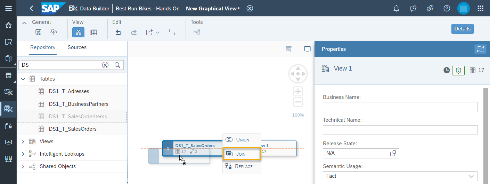

7. Set the Join Type to "Inner" and the cardinality to "One (0,1)" for `T_SalesOrders_<USER_ID>` and "Many (*)" for `T_SalesOrderItems_<USER_ID>`. Each sales order consists of one or multiple sales items.

    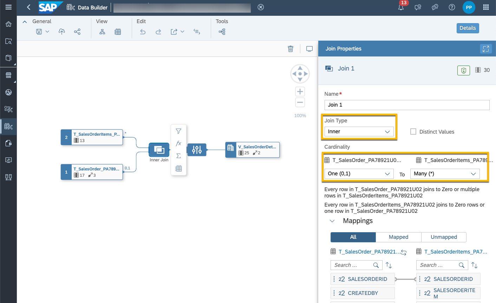

Now you've joined all the tables for this mission.

### Rename and Restore Columns

With the graphical view in place, rename some columns to help others understand better what the data is about. Rename the `Grossamount` column from the `T_SalesOrders__<USER_ID>` table and from the `T_SalesOrderItems__<USER_ID>` table so you can tell them apart.

1.	To do this, click on the projection one node immediately on the right-side of the output node.

    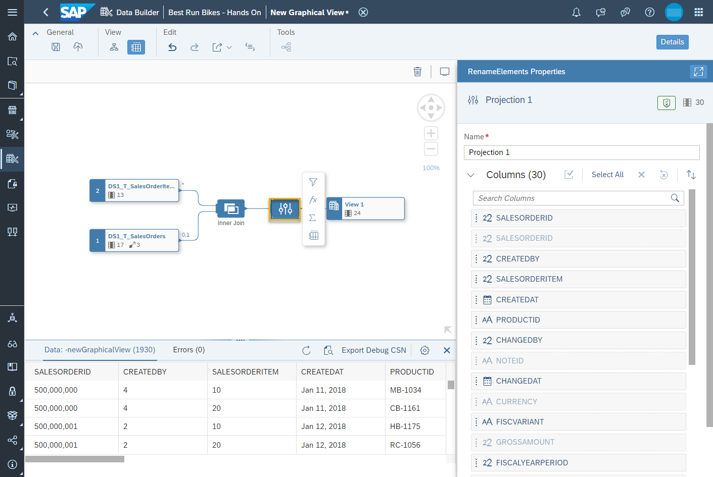

2.	Search for the `GrossAmount` column in the projection properties panel.

3.	If one of the columns is greyed out, this means the column has been automatically removed. Click on the dots next to it and select **Restore column**.

    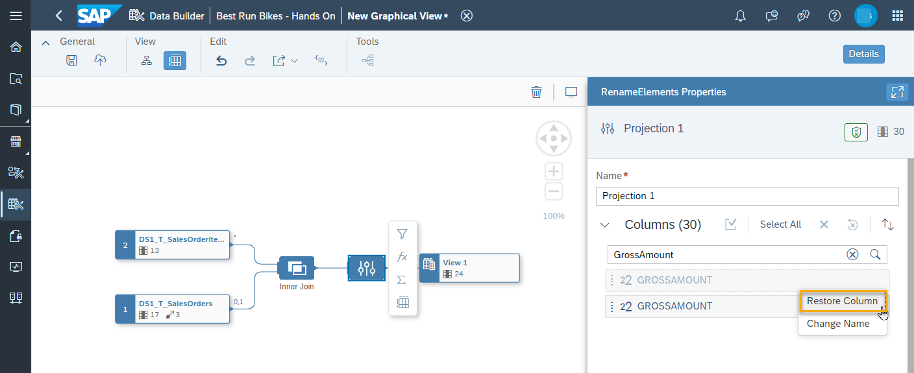

4.	Next, click on the column name. On the canvas, you will see a highlight that shows you exactly where the column originates from.

     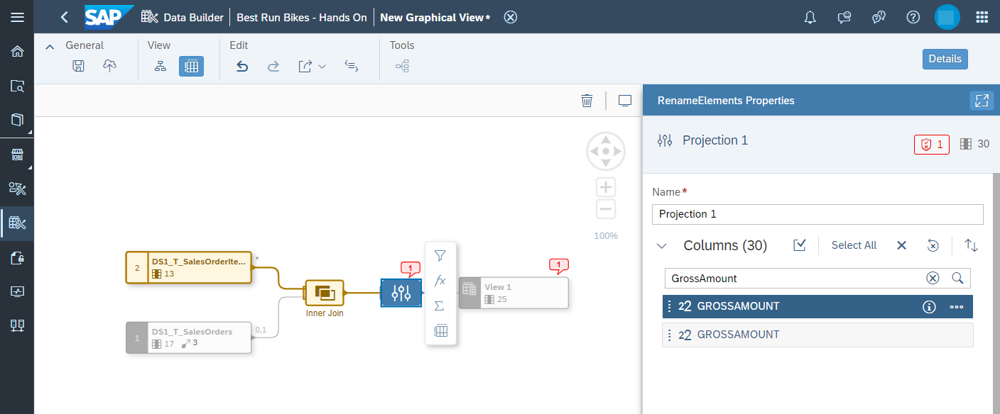

5.	Rename the `GrossAmount` column originating from the `T_SalesOrderItems_<USER_ID>` table to `GrossAmount_items`.

    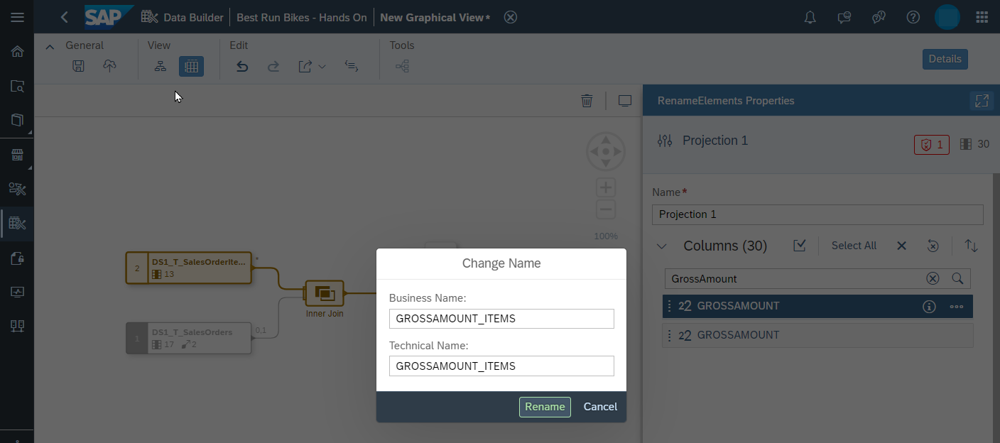

6. Then rename the `GrossAmount` column originating from the `T_SalesOrders_<USER_ID>` table to `GrossAmount_orders`.

### Modify View Properties
1. Validate that **Semantic Usage** is set to **Fact**. This indicates that your entity contains numerical measures that can be analyzed.

2. Verify that the columns which are measures are displayed in the **Measures** section. 

    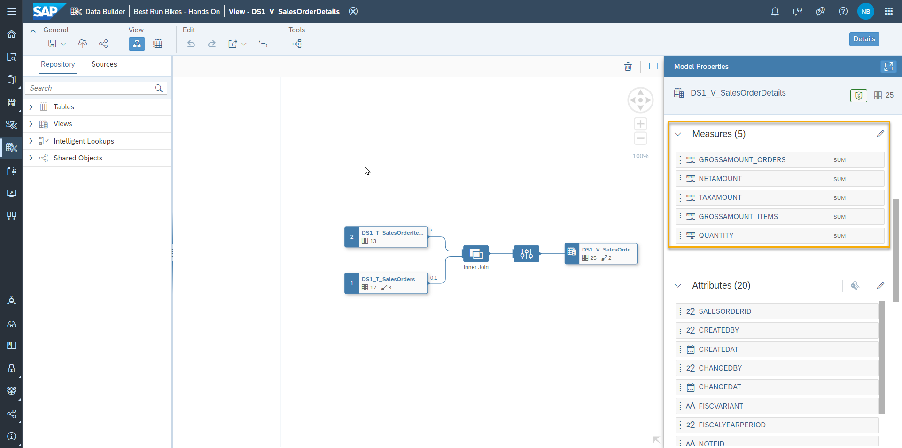

3. Add business information.
Open the business purpose panel under attributes. Here, fill in the description and purpose of this model, was well as the business contact person, responsible team and relevant tags.

4. Business names of measures and attributes as well as the semantic type can be changed in the window which comes up when pressing the pencil icon. Check that the semantic types of measures and attributes are correct (information is derived from the source tables).

5. There are no associations defined in this view. Select **Copy from Source..**

    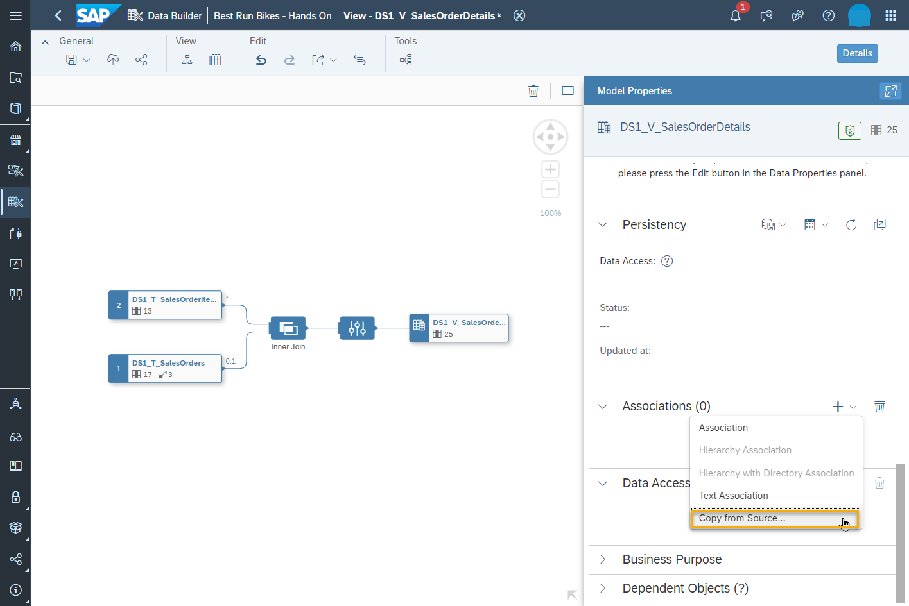 

6. Two source accociations are proposed (`T_BusinessPartners_<USER_ID>` and `Time Dimension - Day`). Select both of them and and click **Create** it. 

    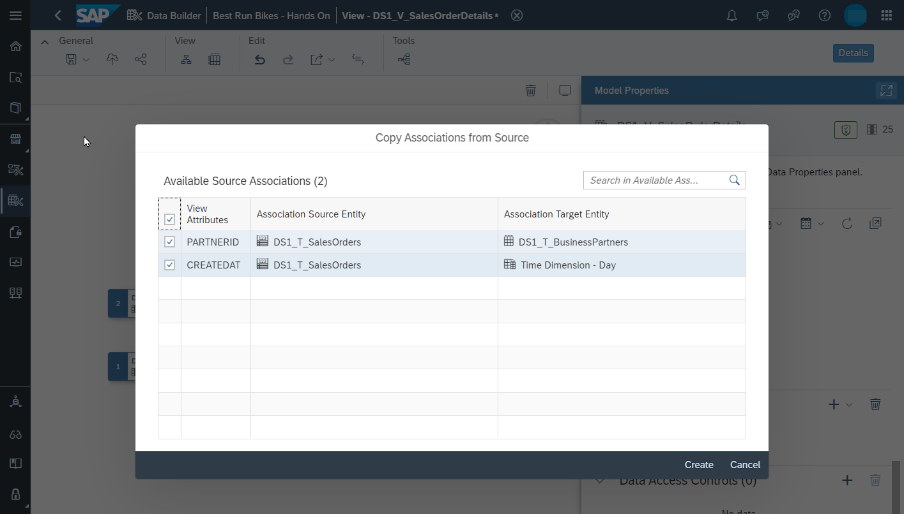 

### Save and Deploy

You have successfully created your graphical view. Save and then deploy your view (`V_SalesOrderDetails_<USER_ID>`). When you save an object, it is stored in the SAP Datasphere repository, which contains the design-time definitions of all your objects. When you deploy an object, you are creating a run-time version for use in the SAP Datasphere database.

---
