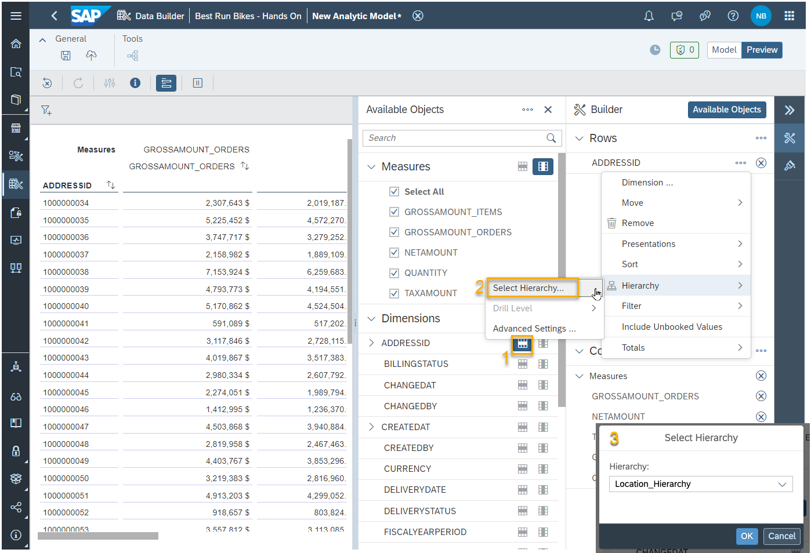

 
# Create an Analytic Model
Analytic models are the analytical foundation for making data ready for consumption in SAP Analytics Cloud. They allow you to create and define multi-dimensional models to provide data for analytical purposes to answer different business questions. Pre-defined measures, hierarchies, filters, parameters, and associations provide flexible and simple navigation through the underlying data.

## Prerequisites
 - You have [imported your dataset into your Space.](https://github.com/SAP-samples/hda-cross-pm-samples/blob/main/tutorials/partner-workshop-content/dsp_modeling_1-import-dataset/dsp_modeling_1-import-dataset.md) 
- You have [adjusted the Semantic Types and created Associations using the Entity-Relationship Model](https://github.com/SAP-samples/hda-cross-pm-samples/blob/main/tutorials/partner-workshop-content/dsp_modeling_2-create-relationships/dsp_modeling_2-create-relationships.md)
- You have [created a graphical view combining data about Sales Orders and Sales Order Items](https://github.com/SAP-samples/hda-cross-pm-samples/blob/main/tutorials/partner-workshop-content/dsp_modeling_3-create-graphical-view/dsp_modeling_3-create-graphical-view.md)

## You will learn
  - How to design Analytic Models including dimensions and measures.
  - How to use the data preview.
  - How to create different types of new measures.

---

### Create an Analytic Model
1. Open the Data Builder and select **New Analytic Model**.

    

2. In the editor, you can add any Fact Model as fact source. Select your previous created graphical view `V_SalesOrderDetails_<USER_ID>` and drag it into the edtior. Select all attributes, all measures and the proposed associated dimension to be added to the Analytic Model.
   
  
  
4. The fact source and the dimensions for business partners are displayed. Now, add additional reachable dimensions and their attributes. Select the dimension `T_PARTNERID_<USER_ID>` and select `ADDRESSID` in the section **Associated Dimensions**.

    

 5. When accessing this data model, Datasphere will automatically create the necessary database joins to let users drill-down by even the farthest of dimensions. This way, modelers can carefully design what parts of the data model to expose for a given analytics use case. Check that the attributes `CITY`, `COUNTRY` and `REGION` are selected as visisble attributes in the dimension `T_ADDRESSES_<USER_ID>`.

 6. Access the **Preview** (button in the top right corner). This rich analysis environment allows you to constantly check the modelling outcome and see exactly how SAP Analytics Cloud users will see your model.

 7. Select `ADDRESSID` as dimension. When hovering over `ADDRESSID` in the section **Rows**, choose **Hierarchy** and **Select Hierarchy**. Select your before configured hierarchy. 

    

8. You can drill down using this hierarchy and for example validate the calulation of the measures. 

    

9. Switch back to **Model**. In the measures section of the properties panel you can add the following types of custom measures to your model: Calculated Measures, Restricted Measure, Count Distinct Measures and Currency Conversion Measure.

10. Create a Calculated Measure which computes how many product types were sold over 10 times. Calulcated Measures are  based on other already existing measures which are calculated and aggregated at first.
Enter the expression `QUANTITY > 10`. This expression will return the boolean value 0 if the quantity is smaller/equals 10 or 1 if the quantity exceeds 10.

    

11. As the measure should reflect the number of product types with a quantity higher than 10, a specific aggregation by PRODUCT ID is required. Configure an Exception Aggregation with type `SUM` and the Exception Aggregation Dimension `PRODUCTID`. Now, all results of the defined expression are summed up by the Product ID even if the Product ID is not selected in a report and visible in the drill-down.
    
  

12. Restricted measures use existing measures and apply flexible filter expressions. They allow to for example create an aggregated measure for the quantity, but only considering specific Product IDs. Create a restricted measure which is aggregated on the source measure `GROSSAMOUNT_ORDERS` with the restriction REGION = EMEA

  

13. Validate the two new measures in the data preview. 

14. Save and deploy your Analytic Model using the technical name `AM_SalesReport_<USER_ID>`.

---
