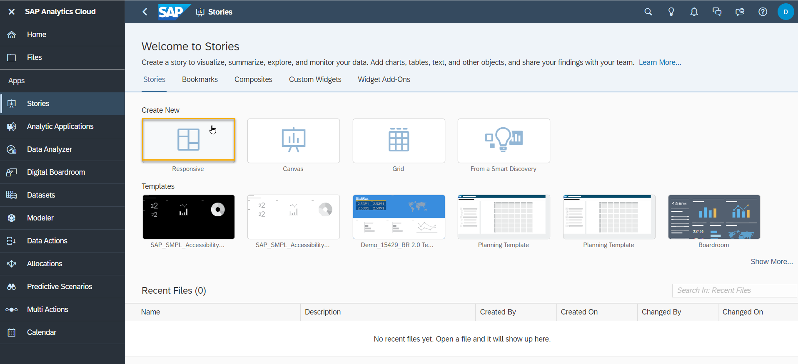
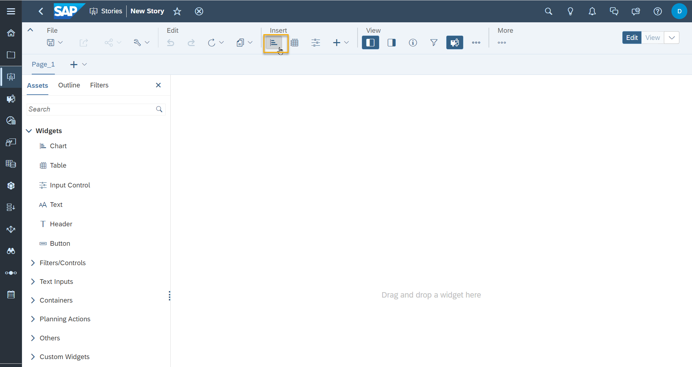
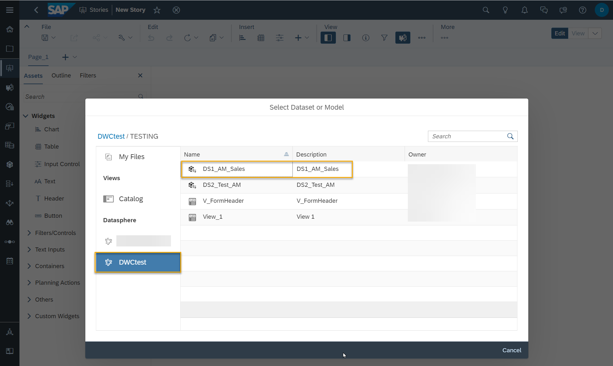
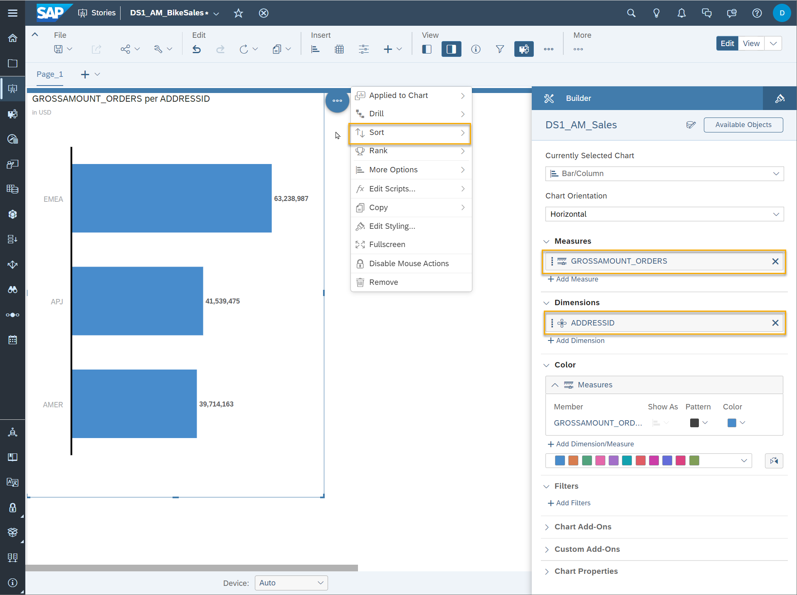
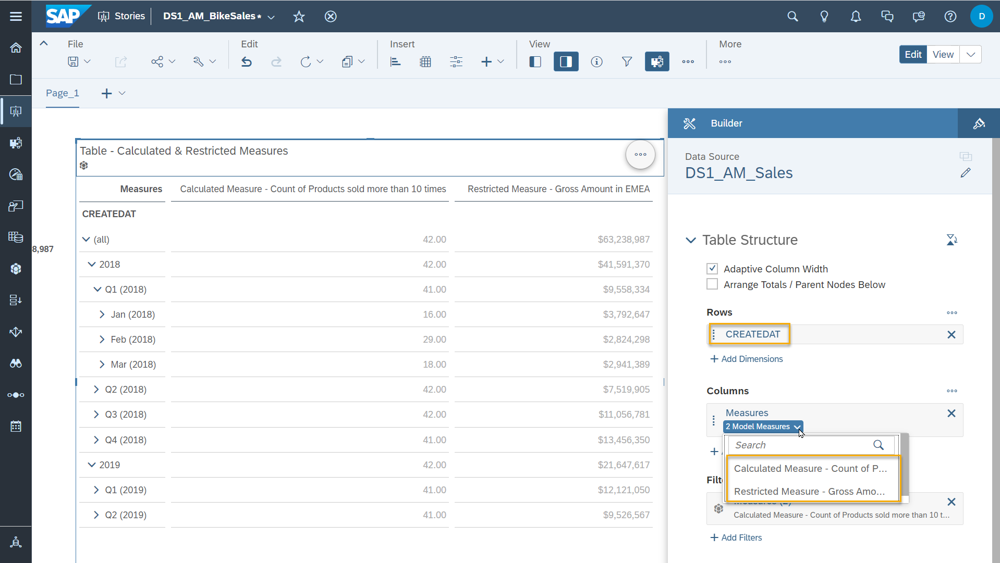

# SAP Analytics Cloud Story

SAP Analytics Cloud consumes data from SAP Datasphere via a live connection to create stories and analytic applications. 
## Prerequisites
 - You have [imported your dataset into your Space.](/dsp_modeling_1-import-dataset/dsp_modeling_1-import-dataset.md)

- You have [adjusted the Semantic Types and created Associations using the Entity-Relationship Model](/dsp_modeling_2-create-relationships/dsp_modeling_2-create-relationships.md)

- You have [created a graphical view combining data about Sales Orders and Sales Order Items](/dsp_modeling_3-create-graphical-view/dsp_modeling_3-create-graphical-view.md)

- You have [created an Analytic Model](/dsp_modeling_4-create-analytic-model/dsp_modeling_4-create-analytic-model.md)

## You will learn
  - Prerequisites to create a live connection between SAP Analytics Cloud and Datasphere.
  - Creating a story accessing data from Datasphere.
  - Utilizing semantics and measures which have been defined in DSP before.

---

### Access SAP Analytics Cloud & Connectivity to Datasphere
1. If the product switch between SAP Datasphere and SAP Analytics Cloud has been configured, you can use the product switch button in the top right of the shell to easily navigate between both solutions. 

2. In SAP Datasphere, the URL of the SAC system needs to be added as a Trusted Origin. 

2. In SAP Analytics Cloud, a live connection has been created so that data from SAP Datasphere can be accessed. You can validate this in the **Connections**.

### Create a new Story
1. In **Stories**, create a new story of the type **Responsive**. Responsive pages adapt to different screens sizes. Select the design mode "Optimized Design Experience". 

    

2.  Insert a new chart.

    

3. Select the connected Datasphere tenant. You see all spaces your Datasphere application user is allowed to access. Select your space and the Analytic Model which you created in the previous exercise.

    

 4. The bar chart should display the grossamount of  all orders for the different regions and sorted by grossamount. Select `GROSSAMOUNT_ORDERS` as measured and `ADDRESSID` as dimension. Set the hierarchy to "Level 2" so that you see the three different regions products were sold to displayed. Configure the sorting of values for measures `GROSSAMOUNT_ORDERS` by selecting the chart.  

    
 
5. Insert a table, which will display your two in the Analytic Model created measures along time: The calculated measure counting how many product types were sold more than 10 times and the restricted measure calculating gross amount in Europe.
Select the dimension `CREATEDAT` to be displayed as row and the measures `Calculated Measure - Count of Products sold more than 10 times` and `Restricted Measure - Gross Amount in EMEA` as columns.

    

6. You can see the different behaviour of the created measures. The restricted measure is filtering on gross amount in EMEA without the need of any filter to be set. 
The calculated measure counts how many product types were sold more than 10 times. When drilling down on **2018 -> Q1 (2018)**, we see that more types of products were sold over 10 times compared to January and February. The configured exception aggregation aggregates by product ID although this dimension is not visible in the drill-down.
Grossamount is displayed with the according currency type as you configured the semantic types for measures and attributes in Datasphere before.

### Optional: Ideas for Model Extensions
If you'd like to discover more modelling functionalities of Datasphere and SAP Analytics Cloud, here are some ideas to extend your current scenario:
- In SAC, visualize the gross amount of sold product types.
- Extend the data model by importing additional  files like texts for the products: (https://github.com/SAP-samples/datasphere-content/tree/main/Sample_Bikes_Sales_content/CSV)

---