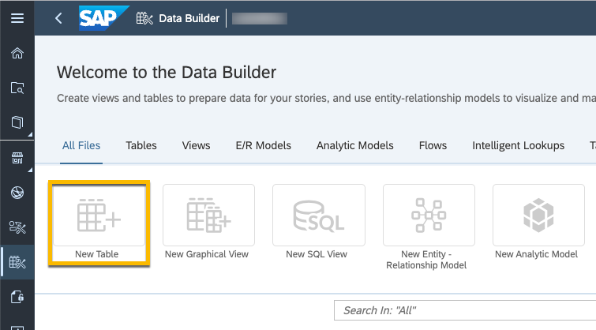
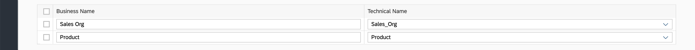

# Data Access Control

Defining data access controls is essential for securing a company's data, ensuring compliance, enabling effective collaboration, and improving decision making. It's a key element in responsible data management and plays a critical role in driving trust and transparency within an organization. In order to comply with all these requirements, SAP Datasphere offers the ability to define Data Access Controls.
In this exercise, the data model created in the previous exercises for sales orders is protected using Data Access Controls to ensure that users only see the result they are authorized for. 

## Prerequisites
 - You have [imported your dataset into your Space.](../dsp_modeling_1-import-dataset/dsp_modeling_1-import-dataset.md)
 - You have [adjusted the Semantic Types and created Associations using the Entity-Relationship Model](../dsp_modeling_2-create-relationships/dsp_modeling_2-create-relationships.md)
 - You have [created a graphical view combining data about Sales Orders and Sales Order Items](../dsp_modeling_3-create-graphical-view/dsp_modeling_3-create-graphical-view.md)
 - You have [created an Analytic Model](../dsp_modeling_4-create-analytic-model/dsp_modeling_4-create-analytic-model.md)

## You will learn
  - Prerequisites to create a Data Access Control in Datasphere.
  - Creating a Permissions Entity to define the criteria that must be met based on the business requirements.
  - Creating a Data Access Control to limit what a user can see when visualizing the information both in Datasphere and SAP Analytics Cloud.

---

### Get to know Data Access Controls

Data access controls allow users to apply row-level security to Datasphere objects. When a data access control is applied to a data layer view or a business layer object, any user viewing its data will only see the rows for which they are authorized, based on the specified criteria.

In order to be able to create a Data Access Control, a **Permission Entity** is required. You can define a Permission Entity in different ways based on business requirement and current landscape. Some options to be considered are the following:

 - Defining the criteria for the row-level security in a table or view that lists SAP Datasphere user IDs (in the form required by your identity provider) and assigns them to one or more criteria (fields used for filtering the data).

 - Recreate permissions/authorizations from the source system where possible, including via import for SAP BW.

You can create one or more data access controls that consume each permissions entity, and select one or more columns in each data access control to specify the criteria that it will enforce. You can apply a single data access control to multiple views. Each view protected in this way will filter the results available in its data preview to only those rows meeting the criteria for the current user.

### Create a Permission Entity

For the sake of simplicity, in this exercise, we will create a table manually in Datasphere and populate it with the required information. However, the data can also be imported from a remote source if that information is already available in an existing source system.

1. Go to the **Data Builder** and click on the **New Table** button. 

    

2. Add a new column to store the `User ID` by clicking in the **+** button. 

    

3. Set the newly created column as `Key` by ticking the checkbox.

    

4. Repeat the **Step 2** to create 2 additional columns to store the `Sales Org` and `Product` values. You will be using that criteria to limit the access to data for your own user.

5. Your table definition should look like the following.

    

6. Click on the **Save** icon on the top left and give your table an appropriate name, `T_Permissions<USER_ID>`.  Once done, click on the **Deploy** icon next to the **Save** icon to deploy your table.

### Populate the newly created table

Before defining the Data Access Control, the Permissions Table must be populated with the right information. In this example, you will act as a **Sales Responsible** focused on selling the bike **Mt Discovery Ulti** `(MB-1034)` for **Americas** `(AMER)` organization.

1. Once the table has been successfully deployed, you can go into `Edit Mode` and start adding data manually. In order to do this, click on `Data Editor` on the top right.

    

2. Click on the `Add` button.

    

3. The table/view defining the criteria for the Data Access Control needs to contain the SAP Datasphere user IDs in the form required by your identity provider. If no custom identity provider is connected, the email address of the DS user is used. You find your email address in the user settings.
    
    

4. And fill in the data for `ID`, `Sales Org` and `Product` columns as in the screenshot below.

    - `ID`: email used to login to SAP Datasphere
    - `Sales Org`: AMER
    - `Product`: MB-1034 

    

5. Click on the `Save` button on the top left.

You have successfully created a new entry on the table that will be used to filter the data based on the values inserted.

### Create New Data Access Control

Now that the **Permission table** `T_Permissions<USER_ID>` has been defined and populated, a new Data Access Control can be defined.

1. Go to the **Data Access Controls** and click on the **New Data Access Control** button. 

    

2. Click on the **Permission Entity** dropdown box menu. 

    

3. Use the **Search** bar to find the previously created table `T_Permissions_<USER_ID>`, and **select** it. Then check the boxes besides the columns that contain the criteria values. Once done, click **Select**.

    

4. Use the dropdown menu to select the **Identifier Column**.

    

5. Click on the **Create** button twice to add the two criteria (`Sales Org` and `Product`) defined on the Permission Table.

    
    

6. Click on the **Save** icon on the top right and give your data access control an appropriate name, `DAC_SalesOrg_Product_<USER_ID>`.  Once done, click on the **Deploy** icon next to the **Save** icon to deploy your data access control.

### Add Data Access Control to View

Now that you have created the **Data Access Control**, you need to create a data access control restriction on top of the previously created view [V_SalesOrderDetails_<USER_ID>](../dsp_modeling_6-define-data-access-control/dsp_modeling_6-define-data-access-control.md).

1. Go to the **Data Builder** and open `V_SalesOrderDetails_<USER_ID>` view. 

    

2. On the **Model Properties** panel, scroll down, and  Add a new data access control restriction by clicking in the **+** button of the `Data Access Control` section. 

    

3. Select the **Data Access Control** and click the **OK** button.

    

4. On the **Model Properties** panel, create the mappings by dragging and dropping the corresponding columns. `SALES_ORG` to `Sales Org` and `PRODUCTID` to `Product.`

    

5. Click on the **Save** icon on the top left. Once done, click on the **Deploy** icon next to the **Save** icon to re-deploy your view.

### Viewing data to confirm restrictions are applied

Now it is time to check that the restrictions are applied when visualizing the data. 

1. Click on the **view** `V_SalesOrderDetails` on the canvas, and then click on the **Data Viewer** button on the top bar.

    

2. You should only see 11 records showing data from **AMER** for the **MB-1034** product.

    

---

### Optional: Refreshing the SAC Story and confirm the data is now restricted based on the Data Access Control definition.

You can also see how restrictions are immediatly applied to any SAC Story that is accessing any Analytic Model based on the modified view `V_SalesOrderDetails`.

Simply re-open the story created in **Step 8** of the exercise [Create SAC Story](../dsp_modeling_5-create-sac-story/), and confirm that only values for `Sales Org = AMER` and `Product = MB-1034` are shown in the dashboard. If the DAC was created correctly, the restricted measure filtering on EMEA displays no values as your user is not authorized.

