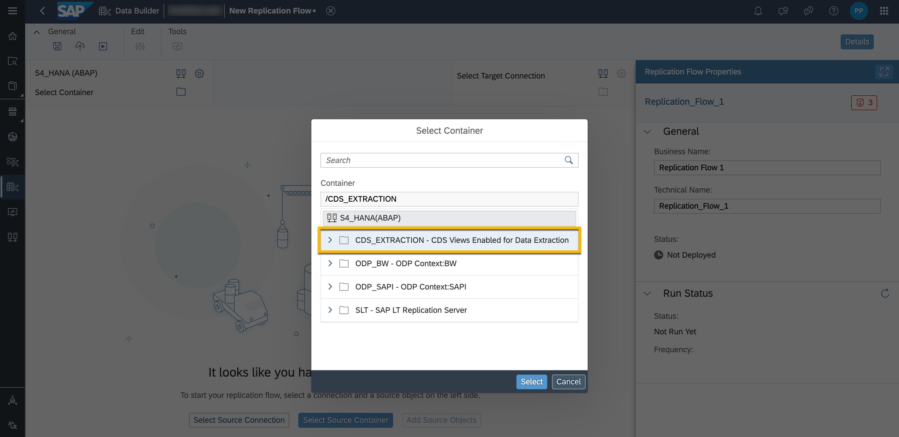
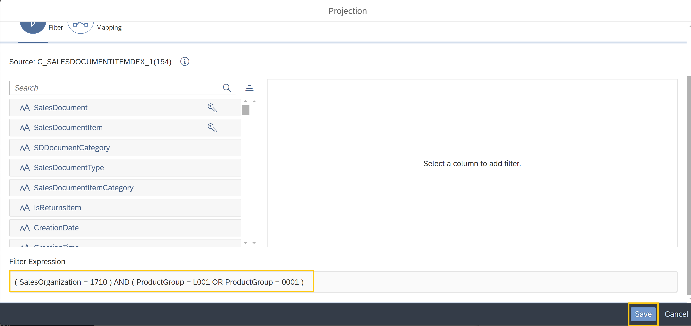

# Integrate S/4HANA Data for Sales Analysis in SAP Datasphere
Overall Intoduction to Sales Analysis exercise: Your company would like to grow their business in a particular subsidiary. However, there have been reports that the products are being quoted lower than in other locations. For this reason, your company wants to analyze the Sales quotation data.
This data is available in SAP S4/HANA. Using the integration capabilities of SAP Datasphere, we will bring in the data and analyze it to derive the maximum business value. We will further integrate this data with geographical data from Data marketplace to provide the location context to it. Finally, the model from the business content with our own S4/HANA data will be visualized in an SAC story. We will learn how using SAP Datasphere allows users to easily customize and extend the data model based on the needs of the end-user.  

In this exercise, you will learn one example of how business content helps to jump start your project and how to integrate data from S/4HANA using Replication Flows. By merely replicating the S4/HANA data into the already existing business content, we can already lay down the foundation for thorough analysis of the data.

## Prerequisites
- You have an application user in Datasphere which is assigned to a space. 
- A connection to a S/4HANA system is created.

## You will learn
  - How to configure currency conversion in SAP Datasphere.
  - How to replicate data from CDS Views in S/4HANA. 
  - How to configure and monitor Replication Flows. 
   
---
## Import Data Model

Business content for SAP Datasphere offers ready to run pre-configurations that accelerate the progress of your project.
It is available as part of the application `Semantic Onboarding`. This exercise will use a part of the business content "Sales Analysis for SAP S/4HANA and SAP S/4HANA Cloud". 

Some modifications applied to the content, for example we use an input parameter instead of taking the current date as we are not working with productive, up-to date data in this example.
Instead of importing this content via the Content Network, each user imports the data model as CSN in their own space.

1. Download the according CSN file (by Location) for your workshop from [folder](https://github.com/SAP-samples/hda-cross-pm-samples/tree/main/tutorials/partner-workshop-content/dsp_sales_analysis_1-s4-integration/data_model-dsp_sales_analysis_1-s4-integration).

2. **Before importing this file**, open the CSN file in a text editor of your choice. This CSN document contains references to the space (including a specific space name) for the currency conversion, please search and replace **all 9 occurrences of `XXSPACEXX`** with your space name. This step is very important so that the currency conversion calculation uses the correct entities.

3. Import the modified file to your space in Datasphere.
    

4. Select all objects to be imported. You should see `Selected: 25` in the header. Afterwards, select `Import CSN`. If you receive the popup window `Your selection depends on a number of non-selected objects that are already present in the repository.`, select `Yes`.

    

5. After import, the entities are not deployed automatically. Open the Analytic Model `Sales Quotation Item (RL)` (`SAP_SD_RL_SalesQuotationItm_V2`) and select `Deploy`. This will deploy the Analytic Model as well as all dependent entities you imported before.

The abbreviations in the entity names have the following meanings:
- `IL` - Inbound Layer
- `HL` - Harmonization Layer
- `RL` - Reporting Layer
- `LT` - Local Table

More details on the layered modeling approach and naming conventions are available [here](https://www.sap.com/documents/2021/09/8a0fc7ca-f67d-0010-bca6-c68f7e60039b.html). 

## Generate Currency Conversion Views
To run currency conversion, specific entities need to be available in the space. Currency conversion views and the necessary supporting objects can be created based on an SAP connection, tables shared from another space, or manually.

As part of the workshop, the currency information has been imported into a central space and populated with data. It is shared from that space to the spaces of the participants. Now you can follow the next steps to generate own currency conversion views in your space reading the data from the space which shared the artifacts with you:

1. In your space, choose to create the Currency Conversion views. 

    

2. Select the space sharing the currency conversion view with you as source and select create, look at the similar icon as displayed in the screenshot with the space name "PA118413U00". If you're not doing this exercise as part of a workshop, select `Manual`. In this case, you need to upload the according CSV file [which you can find here](https://github.com/SAP-samples/hda-cross-pm-samples/tree/main/tutorials/partner-workshop-content/dsp_sales_analysis_1-s4-integration/data-dsp_sales_analysis_1-s4-integration) to each table generated in your space.  

    

3. Open the view `SAP.CURRENCY.VIEW.TCURR.`. Note that the SQL Script is accessing a table located in a different space (the one that shared the view with it) and not the same space as itself.

    

## Create Replication Flow
The imported content includes local tables in the inbound layer, which are designed to be filled using Replication Flows. It is customer specific, how a Replication Flow will be designed, which CDS views should be replicated in one Replication Flow and which data should be replicated with a delta or which with the full upload option.

In general: There are some prerequisites for the usage of Replications Flows, for example the CDS View needs to have the "dataExtraction" annotation. To replicate the CDS View in a delta mode, the annotations "dataExtraction" and "changeDataCapture" are required. More information is available in [Note 3223810](https://me.sap.com/notes/3223810/E) and [Note 2890171](https://me.sap.com/notes/2890171/E) (focus on ABAP Integration).

In this part of the exercise, the Replication Flow extracts transactional data from the CDS view `C_SALESDOCUMENTITEMDEX_1`to the local table `SAP_SD_IL_C_SALESDOCUMENTITEMDEX_1` and master data from the CDS view `I_CUSTOMER` to the local table `SAP_LO_IL_I_CUSTOMER`.

1. In the Data Builder, click on `New Replication Flow` to launch the creation of a new Replication Flow.

    

2. Select source system `S4_HANA (ABAP)`.

     

3. Select container `/CDS_EXTRACTION`.

     

4. Select for the object `C_SALESDOCUMENTITEMDEX_1`. Click `Next`, in the next screen select `Add Selection`. This starts fetching the source object details from the source.

     

5. The selected CDS View is now added to the Replication Flow. Set `Load Type` to `Initial and Delta` and the `Delta Load Interval` to 24 hours.

     

6. Click on `Select Target Connection`. In the following popup window, select `SAP Datasphere` as target connection.

      

7. The target connection details are now updated in your Replication Flow. The target container is automatically updated with the space in which your user is logged in. It shows the new target local tables that will be created in SAP Datasphere automatically. As you already imported a local table at the beginning, please select `Map to Existing Target Object`.

    

8. A new window will appear, select the existing target table named `Sales Document LT`(`SAP_SD_IL_C_SALESDOCUMENTITEMDEX_1`). Afterwards, your Replication Flow should like displayed in the screenshot.

    

9. Projections can be created for each source object. Add one for the source object.

    

10. Define a filter to limit the scope of your replication flow to reduce the load for the exercise. Set the following filter for SalesOrganization: `SalesOrganization = 1710` and `ProductGroup = 0001 OR ProductGroup = L001` and name the projection `Filter_SalesOrg` as shown in the two pictures below.  

    
	
	
	
11. The projection conditions look as shown in the picture below. Click on 'Save' after checking that the condition is created properly as `( SalesOrganization = 1710 ) AND ( ProductGroup = L001 OR ProductGroup = 0001 )`.

	

12. Add a second source object to the Replication Flow. Search for the CDS View `I_CUSTOMER` and select it as source object.

13. As done for the other source object in the steps 5 - 8, set the load type to `Initial and Delta`. Select `SAP_LO_IL_I_CUSTOMER` as target table in your space.
    
    

14. Set the `Delta Load Interval` to 24 hours. Name the Replication Flow `IL_RF_S4_SALES_ANALYSIS` and save and deploy it.

    

## Run and Monitor Replication Flow
1. Run the Replication Flow `IL_RF_S4_SALES_ANALYSIS` and click on the monitoring icon.

    

2. Here, you can see the execution details of your flow. In the left panel the runs of the flow are displayed, their corresponding messages in the right panel. Select the flow in the left panel to view its details. The run details contain messages for all runs and metrics for the current run. For successful runs, the metrics provide the record count for source and target tables used in the flow. In the screenshot, the initial run already finished for `I_CUSTOMER` while it's still running for `C_SALESDOCUMENTITEMDEX_1`. Confirm that the number of `Ìnitial Load Operations` increases. If the status switches to `Retrying`, the initial load finished. In the section `Message` you can read when the replication run will restart the next time. This delta load interval was configured by you in the Replication Flow before.

    

3. While the initial load is running, please continue with the next exercise. 

## Lineage of the Analytic Model
Let's have a look at the lineage of the Analytic Model you imported as part of the CSN. 

1. In the Data Builder, select the Analytic Model `Sales Quotation Item (RL)` and click on `Ìmpact and Lineage Analysis`. 

     

2. The tab `Data Analysis` focuses on data movements and transformations. Search for your replication flow (either by looking at the different names or using the search bar on the top) and follow the flow in the diagram. The target table of the Replication Flow is consumed by different graphical views. The view `Sales Quotation Item (HL)` is used in the Analytic Model. Select the view `Sales Quotation Item (HL)` and display details. You can see the semantic type (fact) and more details like number of defined associations.

     

3. The tab `Dependency Analysis` additionally displays objects connected through associations and data access controls. Search for "customer" to highlight the lineage of the master data which is extracted from the according CDS View. This data is associated to the transactional data.

    

3. Go to the Data Integration Monitor, open the run of your Replication Flow and verify that the replication of both source objects has the status `Retrying`. As the initial loads finished successfully, you can preview the output of the Analytic Model.

## Data Preview in the Analytic Model

1. Open the Analytic Model `Sales Quotation Item (RL) (SAP_SD_RL_SalesQuotationItm_V2)` and select the data preview.
2. Confirm that the variable `Quotation Expiry Period (Days)` is set to 50, `Sales Organization` & `Company Code` to 1710 and 1710.
3. Select the dimension `Sold-to Party` and the measure `Open Sales Quotation Items`.

    
