# Acquiring a Data Product from the Data Marketplace
We have integrated data from the S/4HANA system within our organization. Now let us learn how to acquire third-party data using the SAP Datasphere Data Marketplace.

SAP Datasphere Data Marketplace serves as an excellent tool for organizations on their data journey. It offers a rich and diverse ecosystem of external data providers and products, providing a wide array of data assets waiting to be harnessed. Organizations can easily integrate available third-party data to their datasets. The data comes in form of data products that can be used in one or several spaces of your SAP Datasphere tenant. Data products are either provided for free or require the purchase of a license at a certain cost. Some data products are available as one-time shipments, other data products are regularly updated by the data provider.

We would like to enrich our data for customers with the geographical coordinates. This enables us to visualize the data on a geo-map in an SAC story. 

## Prerequisites
- You have [imported the business content and replicated data via Replication Flows.](../dsp_sales_analysis_1-s4-integration/dsp_sales_analysis_1-s4-integration.md)

## You will learn
  - How to import a Data Product.
  - How to create a Geo-Spatial Column in SAP Datasphere. 

--- 
## Extend Data Model with Data From Data Marketplace
1. Click on the `Data Marketplace` tab from the navigation panel on the left side and click on the Landing Page option.

    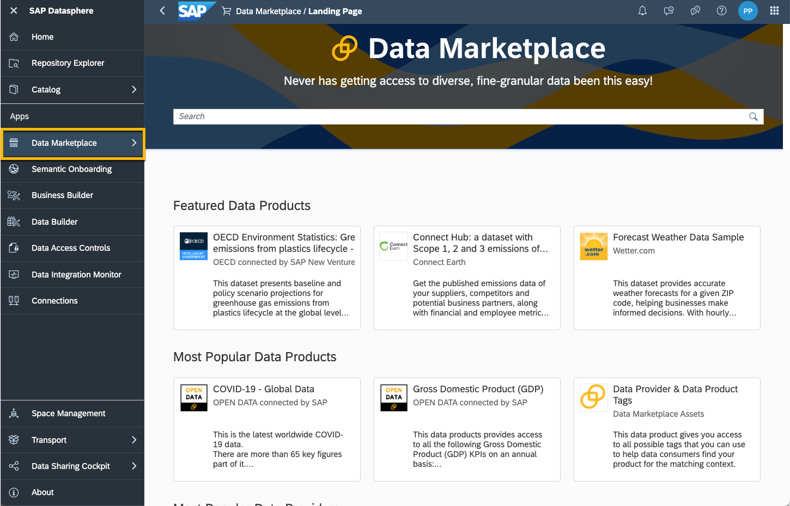

2. Use the Search bar to look for the desired data product i.e. `Global Country Identifier Data by DCA`. Select the first the product shown. Note that this data product is free of cost. Note that there are more comprehensive search options on the left that can be employed to filter for specific needs, if required.

    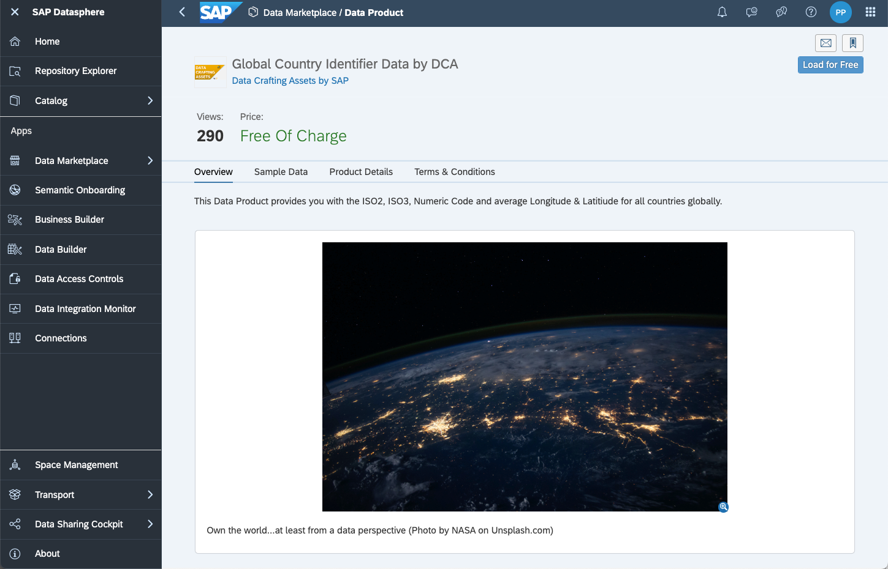

3. The delivery mode of this data product is `One Time Replication`. This one-time mode is used if the nature of the data doesn't require a refresh on the consumer side. For example, a snapshot of historical facts. With this mode, no data updates are periodically released to the consumer. However, if the consumer needs to receive data corrections, they can still re-load the data through My Data Products re-initialization. The mode `Full Replication` delivers updates to the data using replication, `Live Access` delivers data within the same tenant without replication (the data view is shared live with the target space). Click on `Load for Free` to begin the import. Search the name of the space where the data product needs to be imported and then click on `Load Product`.

    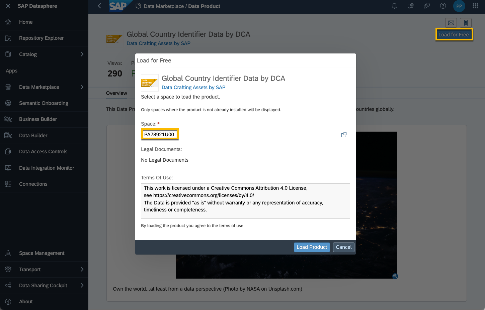

4. You will be notified when the Data Product has been successfully imported in the chosen space. 

    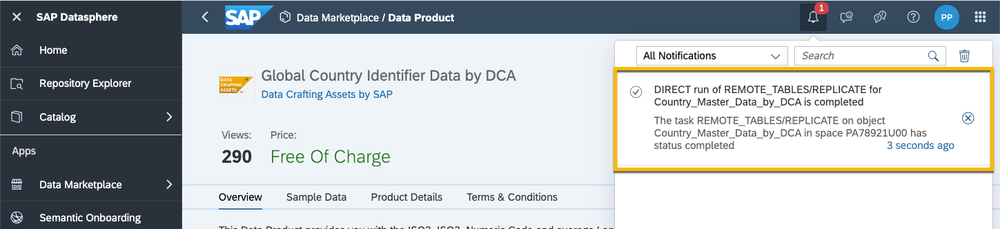

5. The remote table `Country_Master_Data_by_DCA` has been created which can be found in the Data Builder. The acquired data can be pre-viewed.

    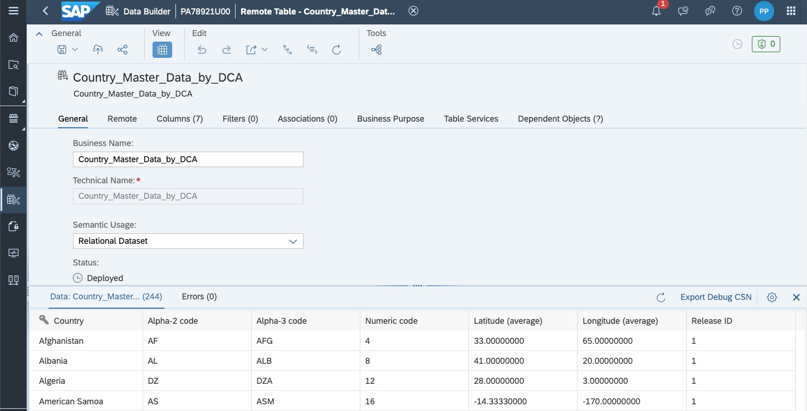
    

## Join Imported Data to Customer Dimension
1. Open the existing Graphical View `Customer` (`SAP_LO_Customer_V2`). Drag the remote table `Country_Master_Data_by_DCA` from the left side on the source view and join the data.

    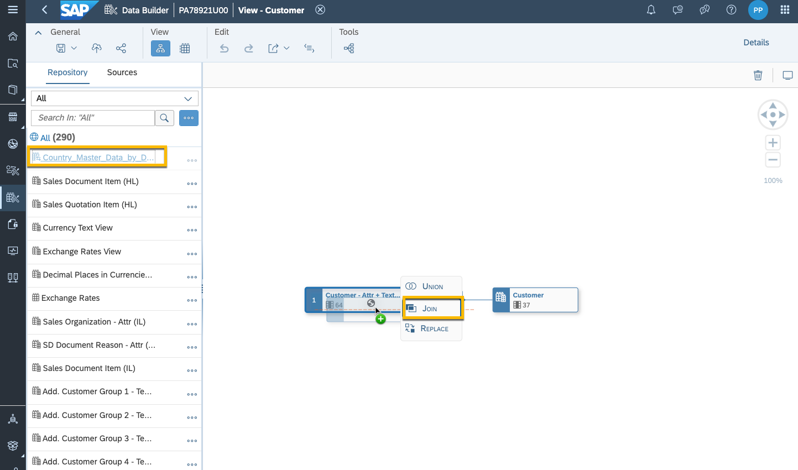

2. Select `Left` as join type so that all rows from `SAP_LO_Customer_V2` are returned with the matched rows from `Country_Master_Data_by_DCA`. The columns that have to be joined are `Country/Region Key` to `Alpha-2 code` (not `Country` from `Country_Master_Data_by_DCA`). Please maintain the cardinality as displayed in the screenshot.

    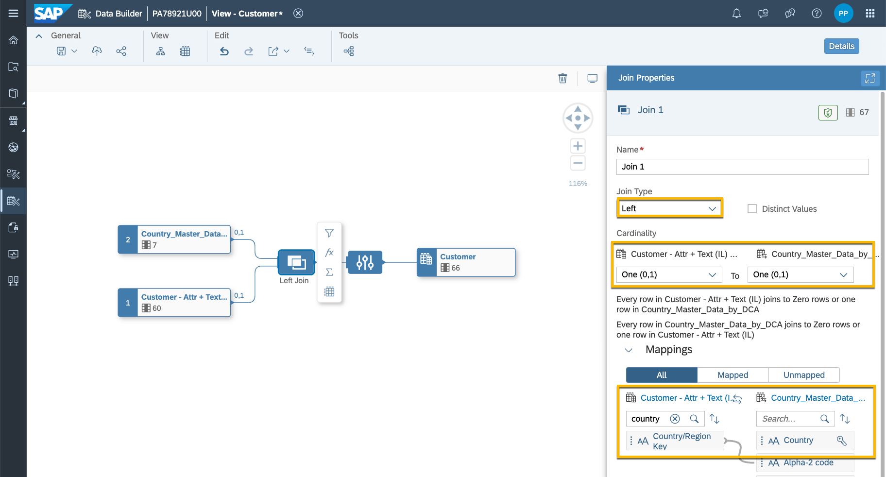

3. Create a Geo-Coordinates column. To create Geo-Coordinates column, the semantic type of the view/table needs to be `Dimension`.

    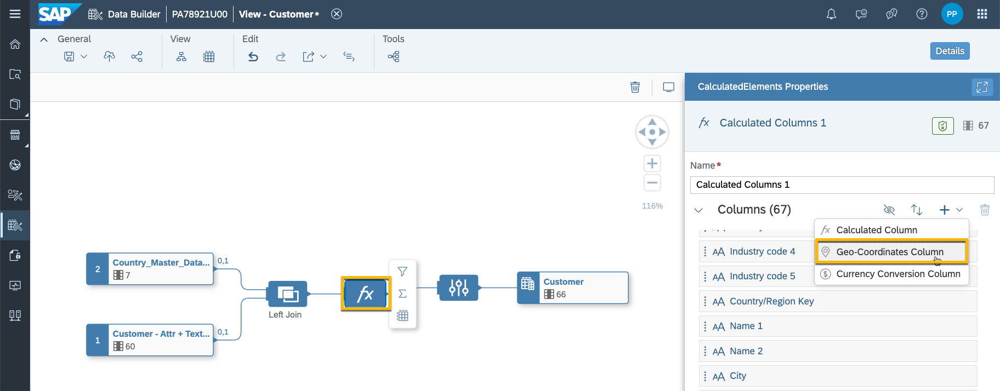

4. Validate that columns for latitude and longitude are selected accordingly. Name the column `Location_Country`.

    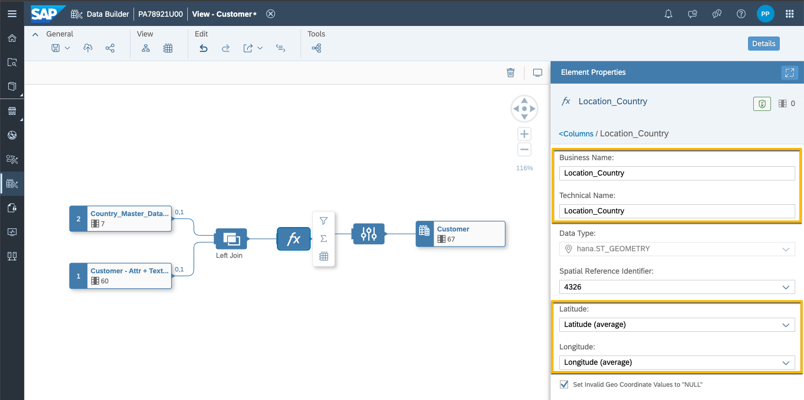

5. Save and deploy the view `Customer` (`SAP_LO_Customer_V2`).

## Make Attribute visible in Analytic Model
1. You added an additional attribute to the dimension which should be exposed to SAP Analytics Cloud via the already existing Analytic Model `Sales Quotation Item (RL)`(`SAP_SD_RL_SalesQuotationItm_V2`). Open this Analytic Model and click on `Sold-to-Party`. Select the attributes `Location_Country`and `Customer Full Name`.

    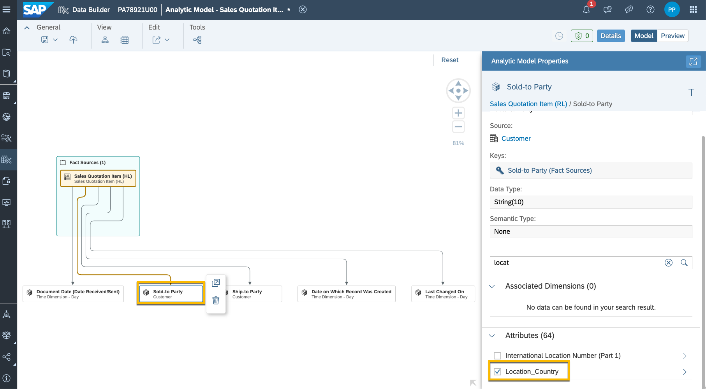

2. Save and deploy the Analytic Model.

## Create Story in SAP Analytics Cloud

1. Use the product switch button to access the SAP Analytics Cloud tenant. 

    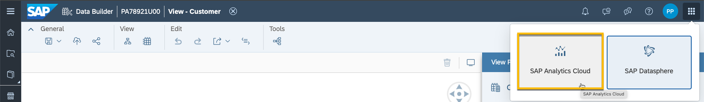

2. Access the **Stories** app and create a new responsive story. Select the `Optimized Design Experience`.

3. Add a new Geo map. 

    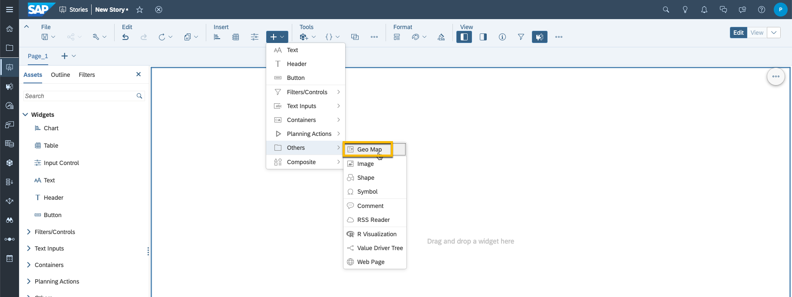

4. Select a model.

    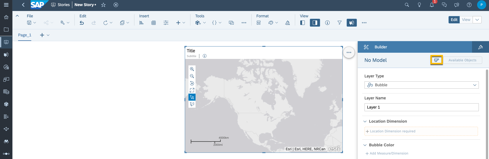

4. Select the Datasphere connection, your space and the Analytic Model `SAP_SD_RL_SalesQuotationItm_V2`. (Input Parameters: `Quotation Expiry Period (Days)` = 50, `Sales Organization` & `Company Code` = 1710)

    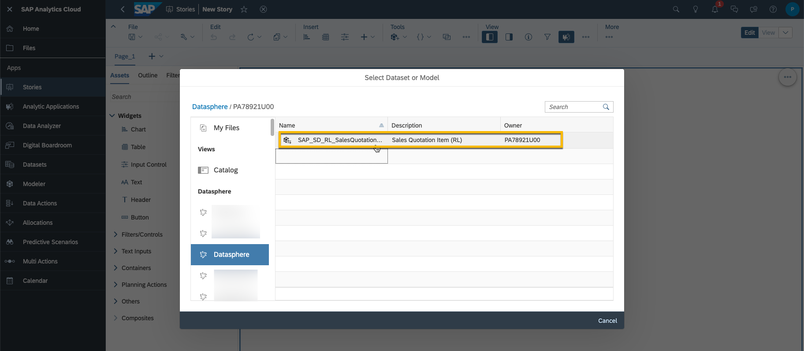

5. On the right side in **Geo Map Layers**, select **Add Layer**.

6. Select `Location_Country` as **Location Dimension**, `Product Group`as **Bubble Color** and `Open Sales Quotation Amount in Company Currency Code`as **Bubble Size**.

    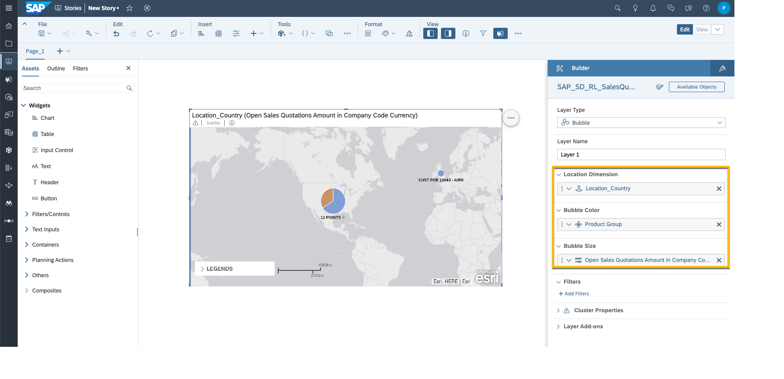

7. Save the SAC Story with the name `OpenSalesQuotation_CustomerGeo`.

    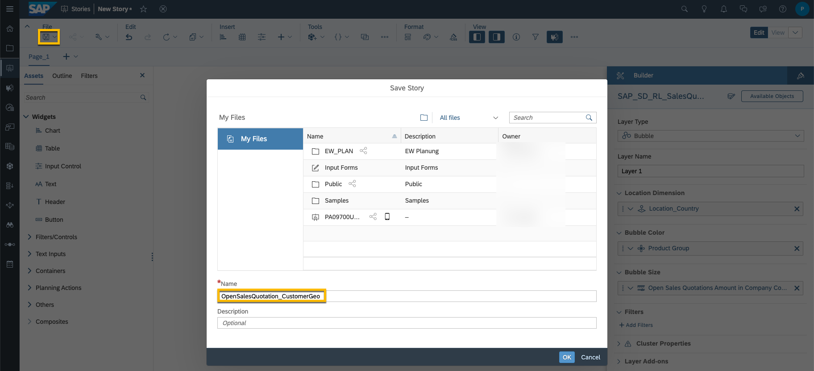

## Summary 
You have visualized the amount of open sales quotations in SAP Analytics Cloud for the location of the customer. The data for sales quotations and customer details is replicated in delta mode from S/4HANA using Replication Flows. The geographical data for countries is downloaded from Data Marketplace and mapped to the data model. The data model was imported as CSN file in the beginning. 
