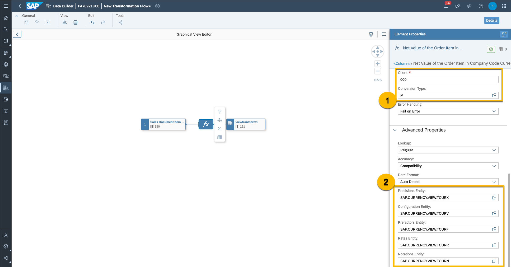

# Transformation Flows in SAP Datasphere
In the previous exercises, we integrated data from S/4HANA and the Data Marketplace using business content to extract more business value from our data. We have answered the question “Which regions provide the highest sales opportunities for our company?”

In this exercise, we would like to convert the net value of the order item to the sales organization's company currency. This would help us represent the net value of the order item from the sales organization's perspective for all future representations and comparisons.
i.e. Take for example that one of the sales wings in Bulgaria would like to compare the selling values of the sales orders. It would be difficult to compare it in the when the transaction currency is always different. Converting it to the selling organization's currency will increase transparency for that organization.
This is how it will be achieved in this exercise: You will create a transformation flow which loads data from the delta enabled table `Sales Document Item (LT) (SAP_SD_IL_C_SALESDOCUMENTITEMDEX_1)`, transforms the currency for `Net Value of the Order Item` applying a currency conversion and persists the data in a target table.
We want to use the static value `SalesDocumentDate` as the reference date. Hence, the currency needs to be transformed only once in its lifetime. Fluctuating currency rates are irrelevant for this scenario.

In the business content that you imported earlier, the fact view `Sales Document Item (HL) (SAP_SD_HL_SalesDocumentItem_V2)` uses a calculated column to transform the source amount column `Net Value of the Order Item` from the document currency to the sales Organization currency. This transformation runs each time the view is called by a user (e.g. via the Analytic Model in DSP or in a story in SAC). 
The view could be persisted, but the persistency would always run as a full snapshot replication. Hence, transformation flows suit best for the scenario in this exercise since they perform SQL transformations on delta data, and this transformation will only run once for new records.

## Prerequisites
- You have [imported the business content and replicated data via Replication Flows in a delta mode.](../dsp_sales_analysis_1-s4-integration/dsp_sales_analysis_1-s4-integration.md)

## You will learn
  - How to create a Transformation Flow.
  - Use cases for Transformation Flows.
   
---

## Create a Transformation Flow
Create a transformation flow to load data from one or more source tables, apply transformations (such as a join), and output the result in a target table. You can load a full set of data from one or more source tables to a target table. You can add local tables and also remote tables located in BW Bridge spaces.  

1. In the side navigation area, click  **Data Builder**, select your space if necessary, and click **New Transformation Flow** to open the editor. The system displays the **New Transformation Flow** screen.

    

2. Create a graphical view transform to load data from source tables and to transform data. To create a graphical view transform, click the Graphical View Transform button (see Create a Graphical View Transform). 

    

3. Now you are in the **Graphical View Editor**. Search for the local table `Sales Document Item (LT)` (`SAP_SD_IL_C_SALESDOCUMENTITEMDEX_1`) and drag it into the editor.

   

4. You have various different possibilities to add nodes for transformations to this view. Create a new `Currency Conversion` Column.

   

5. Name the new column `Net Value of the Order Item in Company Code Currency` (business name) and `NETAMOUNT_CC_CUR` (technical name). In **Currency Properties**, set source amount to `NetAmount` (this is the net value of the order item in document currency), steps to `Convert`, source currency to `TransactionCurrency`, target currency to `Currency`and reference date to `SalesDocumentDate`. We calculate the converted source amount for new records added to the source table.

    

6. In **Advanced Properties**, select the `SAP.CURRENCY.VIEW.TCUR*` views which you generated [in the first part of the exercise](../dsp_sales_analysis_1-s4-integration/dsp_sales_analysis_1-s4-integration.md). Please check that you select `SAP.CURRENCY.VIEW.TCUR*`and not `SAP.CURRENCY.TABLE.CUR*` Set `Client` to 000 and `Conversion Type`to M. 

    

7. Add a Filter on the view called ´FilterByProfitCenter´ as shown in the figure below using the condition **ProfitCenter='YB110'**
      
    
8. Click the Back button to return to the Transformation Flow Editor. 

    

9. Create a new target table and name it `HL_T_SalesQuotationItems_CurrencyConversion`. Delta capture is enabled.

    

10. Save the Transformation Flow with the name `HL_TF_SalesQuotationItems_CurrencyConversion` and deploy it.

    

## Run a Transformation Flow
1. Run the Transformation Flow.
2. Access the logs to confirm that the run of the Transformation Flow finished successfully.

    

3. If you run the Transformation Flow a second time, only the updates are read as delta records. 

    

4. Instead of manually starting a Transformation Flow, it can be scheduled individually or run as part of a task chain.

## Value Proposition of a Transformation Flow
Transformation Flows enable loading delta changes (including deleted records) from one source table to a target table and applying transformations to these changes. This capability is especially powerful for join operations. 

Applying transformations to data is also possible in a view (Graphical view and SQL view). The difference is that a view is a stored SQL function. The transformations are run for each read access to the view. It's possible to persist a view, but this functionality can't detect delta changes. So a view persistency is always run as a full snapshot at the point in time of the persistency run. The Transformation Flows are especially helpful if a join is done on two tables, where one table can be configured as the leading table (Delta Capability). Overall, this reduces the number of records that need to be retrieved in a join as not a full table scan needs to be performed on the leading table.

Please note: The Delta Capture Table is an internal table whose structure can incompatibly change at any time. It is not permitted for external data access and is only consumed by the above SAP Datasphere internal apps. Using the internal delta capture columns (Change Date or Change Type) or their content directly or indirectly for external delta replication outside the Premium Outbound Integration is also not permitted

--- 

