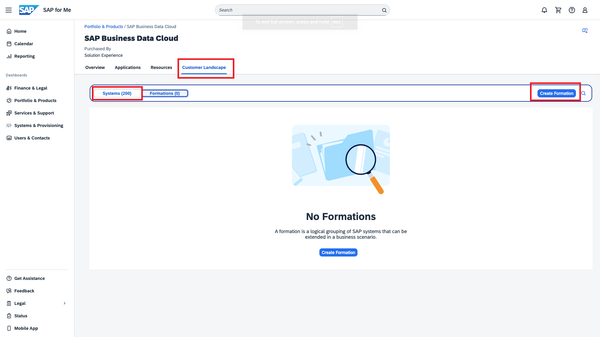

# Basic Configuration SAP Business Data Cloud
Organizations that need to make data-driven decisions today face three big challenges:
- Performing complex data management activities that span multiple systems and highly distributed IT landscapes.
- Facilitating collaboration across analytics and data science teams.
- Connecting analytics and AI generated insights to meaningful impacts.

SAP Business Data Cloud was built to address these key challenges.

## Persona 
Actors:  
 

## Use Case
In this chapter, we navigate the task of configuring the SAP Business Data Cloud cockpit. This cockpit will serve as a one-stop-shop control tower to provision the different cornerstones of the SAP Business Data Cloud offering.

## Section Overview
- [Prerequisites](#prerequisites)

- [Steps](#steps)
    * [System Provisioning Steps](#system-provisioning-steps)
    * [Outbound steps in S/4HANA PCE system, BTP and SCC](s4-config-steps.md)
        - [Application of all the relevant SAP notes](s4-config-steps.md#1-application-of-all-the-relevant-sap-notes)
        - [Generation of a signed client certificate (CSR) and PSE](s4-config-steps.md#2-generation-of-a-signed-client-certificate-csr-and-pse)
        - [Generation of the S/4 technical user credentials](s4-config-steps.md#3-generation-of-the-s4-technical-user-credentials)
        - [Importing Certificate Response from the BDC Formation in the S/4HANA PCE system](s4-config-steps.md#4-import-certificate-response-from-the-bdc-formation-in-the-s4-system)
        - [RFC Destination Setup in S/4HANA PCE system](s4-config-steps.md#5--rfc-destination-setup-in-s4)
        - [Register Outbound Connection in SAP S/4](s4-config-steps.md#6--register-outbound-connection-in-sap-s4)
        - [Cloud Connector Configuration to enable BDC to communicate with S/4HANA PCE System](s4-config-steps.md#7-cloud-connector-configuration)
    * [Creating a Formation](#creating-a-formation)

## Prerequisites
 - An SAP for Me account
 - Successful purchase of the SAP Business Data Cloud product and the corresponding entitlements
 - Optional: You can already start with the S/4HANA PCE preparation steps that are documented [here](s4-config-steps.md). Alternatively, you can begin with the preparation 
 steps when prompted to do so.

## System Provisioning Steps

### SAP Business Data Cloud in SAP for Me
1. In the SAP for Me account, under the **Portfolio & Products** Tab, the tile **SAP Business Data Cloud** tile is visible since the product has been purchased and the commercial entitlement for SAP Business Data Cloud also exists in your URM organization. By clicking it, you can explore all the technical entitlements, also known as Eligibilities. that is, the set of eligible applications that are part of the BDC product.

 

2. You can choose to provision them whenever needed and as many times as needed. To start provisioning, choose 'Enable' as shown in the following image.

 

### Provisioning of SAP Business Data Cloud Cockpit

1. To start provisioning the SAP BDC apps, you must first enable the SAP Business Data Cloud Core product. By doing so, the apps will become enabled and available for provisioning. SAP BDC Core product pertains directly to the application SAP BDC Cockpit.

 

2. After adding general information, by default a new SAP BDC tenant is initiated for provisioning.

 

3. Then, you provide the relevant input parameters using a guided wizard. This wizard is generated on the fly, based on configuration placed by the application owner.

 
 
4. Finish the setup.  
 

5. When the provisioning is complete, you can explore the solution and tenant resources that were just created for the app. Information on each resource is displayed, including the allocated quota and the status. Finally, you can launch the provisioned application. <b> The provisioning of the SAP Business Data Cloud Cockpit is successful.</b> 

 

6. In the **Resources** tab that opens, the application SAP BDC Cockpit displays. You can view the solution and the tenant resources that were just created for the cockpit application, including the quota and the allocated status. The status shows as **Processing** and then changes to **Ready**.
 

7. In the **Customer Landscape** tab, you can see the provisioned tenant as an available system. Note the message that SAP Business Data Cloud Cockpit has been successfully enabled. You can launch it from **Access information** directly and log onto it. Now, you can continue with the Applications tab to continue further provisioning of other applications.

 

### Provisioning of SAP Analytics Cloud/SAP Datasphere
In a SAP Business Data Cloud Landscape, other than the data source systems (currently S/4HANA Private Cloud Edition), other products can be provisioned to leverage the different capabilities that are provided.
SAP Analytics Cloud serves as the consumption layer where the intelligent applications reside which are powered by the underlying data products.
SAP Datasphere is the runtime where the data products can be installed and then enhanced.
SAP Databricks is the workbench which powers the machine learning scenarios.

All the systems can be provisoned in SAP for Me and then added to a Formation. To understand the concept of Formation, please refer to this [documentation](https://help.sap.com/docs/btp/sap-business-technology-platform/including-sap-systems-in-formation).
Every SAP BDC Formation must (can) have:
1. One or more S/4HANA PCE systems (data source): we will add this in the next step.
2. Zero or one SAP Analytics Cloud.
3. Zero or one SAP Datasphere.
<!-- 4. Zero or more SAP Databricks. --> 

We learn how to create a Formation in the next section.
> [!NOTE]  
> SAP BDC cockpit (as installed in the previous step) is implicitly in the Formation. SAP Datasphere and SAP Analytics Cloud can be used only in one Formation. However, the S/4HANA PCE system and SAP Databricks can be used across different Formations.

Let's see how we can provision these systems by looking at the example provisioning of SAP Analytics Cloud.
1. In the Applications tab, choose on the *Start Provisioning*, as shown in the following image.

 

2. Provide an appropriate name for the application and assign it to the proper resource Group and continue to the next step.

 

3. A new SAP Analytics Cloud instance is provisioned by default.

 

4. In the provisioning wizard, add the information about required information. In the provisioning wizard,  the app expects to receive the number of users as input with certain conditions, as defined in the application's configuration. The calculation of the derived capacity units is done in the wizard and reflected to the users in SAP Analytics Cloud. 

 
 
> [!NOTE]
> SAP Analytics Cloud must be provisioned in the same region as the SAP Business Data Cloud Core product.

5. Once the provisioning request is created, you can explore the solution and tenant resources that were just created for the app. Information on each resource is displayed, including the allocated quota and the status. Finally, you can launch the provisioned application. <b> The provisioning of the SAP Analytics Cloud is successful.</b>  

 

 

6. In the Customer Landscape, SAC is shown as provisioned. Also, the systems integration is visually represented so that it is easy to navigate the customer landscape. 
<!--  -->

In the same way SAP Datasphere and SAP Databricks can also be provisioned for leveraging them in the BDC landscape.

### Outbound steps in S/4HANA PCE system, BTP and SCC
S/4HANA Private Cloud Edition system, which acts as a data source in SAP BDC landscape, must be prepared accordingly. All the required steps that need to be performed have been documented [here](s4-config-steps.md). There is some back and forth required between this setup and the S/4 setup, so follow the instructions accordingly.

### Creating a Formation
Formations allow you to combine SAP solution systems to simplify the connectivity setup and to provide a unified view of all components required for the implementation of your integration or enhancement scenario. Let us now look into the process of creating an SAP Business Data Cloud Formation.

1. **Customer Landscape > Systems** tab lists all the systems that are available or linked to the SAP For Me account. You can add specific systems to the Formation. To create a Formation, navigate to the **Customer Landscape > Formations** tab and select **Create Formation**.

 

2. Assign a meaningful name to the Formation and select the Formation type as **Integration with SAP Business Data Cloud**. Choose Next.
 

3. A specific order needs to be followed while creating the Formation. The sequence is as follows:
    - Add the newly activated SAP Business Data Cloud into the Formation first and create the Formation.
    - To the newly created Formation, add the systems in the following order:
        1. SAP Datasphere
        2. S/4HANA PCE system
        3. SAP Analytics Cloud

4. Add SAP BDC Core Tenant to the SAP BDC Formation first. Choose **Next**. After reviewing, choose **Create**.  
 
 

5. The initial Formation has been created. The other systems can be added to this SAP BDC Formation.  
 

6. Add SAP Datasphere to this existing Formation by choosing **Include Systems**. Choose **Next** and then **Include**.
 
 

7. SAP Datasphere is now added to the Formation.
 

8. Next, add the S/4HANA PCE system into the Formation by choosing **Include Systems**. Choose **Next Step**. 
 

 

9. You are asked to input different values. Let's take a deeper look at each of the parameters required and where you can find it:
    - S/4HANA PCE Client CSR: Certificate Signing request from the S/4HANA PCE Client that was generated in this [step](s4-config-steps.md#2-generation-of-a-signed-client-certificate-csr-and-pse)
    - Instance Number: Instance Number that was recorded in this [step](s4-config-steps.md#determine-the-instance-number-for-s4-pce-system)
    - Cloud Connector LocationId: ID of the cloud connector is a optional input which needs to be provided only if there are multiple cloud connector accounts.
    - S/4HANA PCE Username and User Password: S/4HANA PCE Technical user credentials created in this [step](s4-config-steps.md#3-generation-of-the-s4-technical-user-credentials)

 

10. SAP Analytics Cloud can be added to the Formation in a similar fashion as we did with SAP Datasphere.

11. Review and finish the setup. The Formation is now in **Synchronizing** state. Once the Formation is in **Ready** state, SAP Business Data Cloud tenant is ready for use.
 

## Next Steps
All the configurations are now in place. In the next [exercise](../02-install-intelligent-applications/README.md), you learn how an SAP BDC Admin can install an Intelligent Application and start deriving insights from all the valulable business data. In the subsequent exercises, we also learn how to  install data products.
