# Configuration of the S/4HANA system and SAP BDC Configuration for Integration
This section offers resources for configuring the S/4 system in preparation for inclusion in the BDC Formation. It also describes some back and forth with S/4 and the parameters/ configuration from the BDC components.

## Persona 
Actors: System Admin

## Prerequisites
* Productive S/4HANA Private Cloud Edition system which is already available on Unified Customer Landscape.
* If the S/4HANA Private Cloud Edition system does not appear in UCL, then you need to check if the Lifecycle Status of the S/4 PCE system is set to value LIVE in Cloud Reporting Tool (SPC). For example, for a customer called CUSTOMER_1 open SPC as follows: https://spc.ondemand.com/open?SYS=S4PCE_SYSTEM_NUMBER_OF_CUSTOMER_1. Then, navigate to the **Tenants** tab and look up the S/4 tenant that the customer wants to use. Here, the Lifecycle Status of the S/4 PCE system in question must be set to value **LIVE**.
* All compatible versions of the S/4 systems are listed in this [SAP Note](https://me.sap.com/notes/3500131)

## Section Overview
- [Application of all the relevant SAP notes](#1-application-of-all-the-relevant-sap-notes)
- [Generation of a signed client certificate (CSR) and PSE](#2-generation-of-a-signed-client-certificate-csr-and-pse)
- [Generation of the S/4 technical user credentials](#3-generation-of-the-s4-technical-user-credentials)
- [Importing Certificate Response from the BDC Formation in the S/4 PCE system](#4-import-certificate-response-from-the-bdc-formation-in-the-s4-system)
- [RFC Destination Setup in S/4 PCE system](#5--rfc-destination-setup-in-s4)
- [Register Outbound Connection in SAP S/4](#6--register-outbound-connection-in-sap-s4)
- [Cloud Connector Configuration to enable BDC to communicate with S/4 PCE System](#7-cloud-connector-configuration)
- [Determine the Instance Number for S/4 PCE system](#8-determine-the-instance-number-for-s4-pce-system)

## Resources

Here are some additional useful documents for the steps involved:

* [ABAP Platform documentation of transaction STRUST](https://help.sap.com/docs/ABAP_PLATFORM_NEW/1531c8a1792f45ab95a4c49ba16dc50b/4c5bdb17f85640f1e10000000a42189c.html?locale=en-US&version=202310.001)

* [SSL Client PSEs](https://help.sap.com/docs/ABAP_PLATFORM_NEW/1531c8a1792f45ab95a4c49ba16dc50b/6176893a9b323778e10000000a11402f.html?locale=en-US&version=202310.001)

* [Creating Identities](https://help.sap.com/docs/ABAP_PLATFORM_NEW/1531c8a1792f45ab95a4c49ba16dc50b/4545fd71d51d5b40e10000000a1553f6.html?locale=en-US&version=202310.001)

* [Creating PSEs](https://help.sap.com/docs/ABAP_PLATFORM_NEW/1531c8a1792f45ab95a4c49ba16dc50b/596b653a0c52425fe10000000a114084.html?locale=en-US&version=202310.001)

* [Signing PSEs](https://help.sap.com/docs/ABAP_PLATFORM_NEW/1531c8a1792f45ab95a4c49ba16dc50b/3b6e89fcda784b6c8d645740f644a602.html?locale=en-US&version=202310.001&)

* [Adding trusted CAs to the certificate list](https://help.sap.com/docs/ABAP_PLATFORM_NEW/1531c8a1792f45ab95a4c49ba16dc50b/798e9421e00b4dc1ade3d4199ac60837.html?locale=en-US&version=202310.001)

## Steps

### **1. Application of all the relevant SAP notes**
* The umbrella [SAP Note](https://me.sap.com/notes/3500131) has to be applied to S/4 system in the preparation. These notes install the new Push Framework and the Tenant Mapping(TM) modules in the S/4 system.
> [!Note]
> You can also refer to the SAP Note [3539174](https://me.sap.com/notes/3539174), as some of this content is based on the contents of the Note. Alternatively, you may choose to follow the instructions in this document.

### **2. Generation of a signed client certificate (CSR) and PSE**
* Call the transaction **strust** in the system as shown in the following image.<br/>
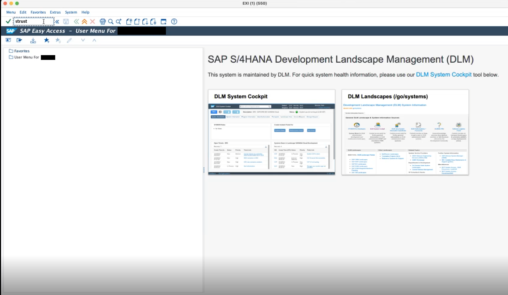

* Open the tab **Environment > SSL Client Identities of System** as shown in the following image. Here, we need to define the client identity of the system. <br/>
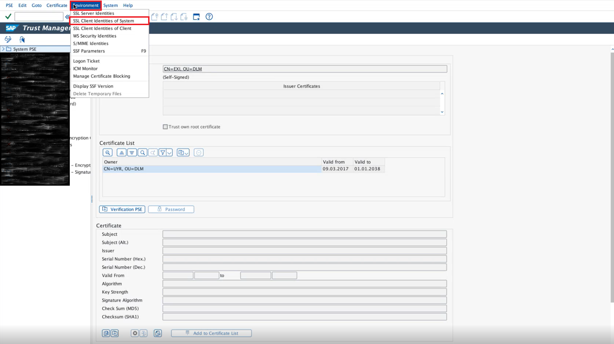

* Select **Choose**. <br/>
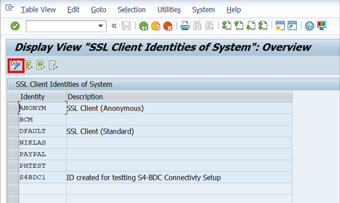

* Select **New Entries**. <br/>
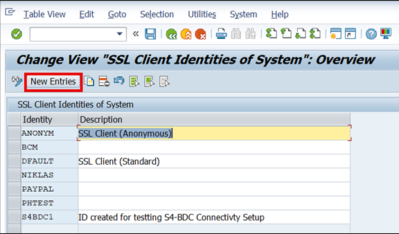

* Add a new entry in the table with a name of your choice. Save and Exit. Choose a meaningful string name to identify the entry. <br/>
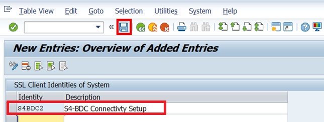

> [!Note]
> If the creation of New Entry is disabled or does not work, then here is a workaround: Edit through transaction **scc4** – set to `Changes to repository and cross-client customizing allowed` or make this change in the admin client. After creating the PSE, switch this value back.

* Select the newly created PSE node and right-click **Create**. Information on how to create the PSE (Private Secure Environment) can be found [here](https://help.sap.com/docs/ABAP_PLATFORM_NEW/1531c8a1792f45ab95a4c49ba16dc50b/596b653a0c52425fe10000000a114084.html?locale=en-US&version=202310.001). <br/>

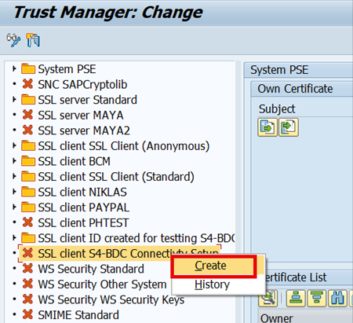

* In the pop-up that appears, choose **Revise DN** (Distiniguished Name) by choosing the edit button (pencil icon). <br/>
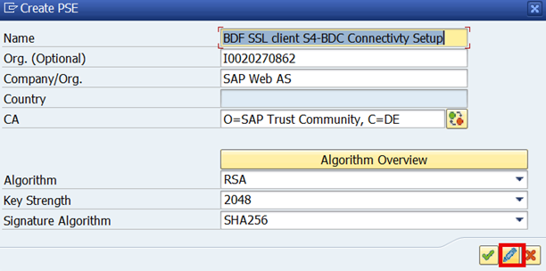

* Enter the component of the Distinguished Name (DN) of the system in the corresponding fields and choose Enter. There are various attributes with fixed and variable values. 


#### Sample subject patterns which need to be defined in the CSR

Here is a sample subject pattern:

```
CN=staging, L=<tenantId>, OU=XXXXXXXX-XXXX-XXXX-XXXX-XXXXXXXXXXXXX, OU=SAP Cloud Platform Clients, O=SAP SE, C=DE
```

**Additional Consideration:**

For cf-eu10-canary, an additional key value pair needs to be included as shown here:

```
CN=staging, L=<tenantId>, OU=XXXXXXXX-XXXX-XXXX-XXXX-XXXXXXXXXXXXX, OU=Canary, OU=SAP Cloud Platform Clients, O=SAP SE, C=DE
```

C, O, OU will be static. Only the OU will change per regional deployment of BDC/FOS- you must be aware in which region (EU/US) the formation is being created. 

OU is the Global Account ID of BDC(FOS) and is different per landscape:

* cf-eu10-canary: `e48c7cf9-a4e0-4dcc-bc62-4a3d88f58bb0`
* cf-eu10 (Live): `3c869ade-ce89-4ee1-a2ff-a6e617e56fdf`
* cf-us10 (Live): `7ebe6a33-3f74-47a7-998b-e16fa688d739`
* cf-jp10 (Live) (not yet operational): `7f8747f0-f87e-4283-8aa4-34bdac27a895`

For example, if EU-10 and US-10 have different provider subaccounts, you would need to refer to documentation matrix broken down per region + hyperscaler.
The only tenant specific information would be in L.

The following is how another sample subject might look like:

```
CN=staging, L=850432635, OU=3c869ade-ce89-4ee1-a2ff-a6e617e56fdf, OU=SAP Cloud Platform Clients, O=SAP SE, C=DE
```

**Additional Consideration:**
For cf-eu10-canary, an additional key value pair needs to be included as shown in the following image. Hence, a sample subject would be as follows.

```
CN=staging, L=<tenantId>, OU=e48c7cf9-a4e0-4dcc-bc62-4a3d88f58bb0, OU=Canary, OU=SAP Cloud Platform Clients, O=SAP SE, C=DE
```

Note that in certain cases, S/4 System ID might have a “$” in the beginning, for example, "$0204398045”. We need to remove “$” from the beginning and use the remaining part only.


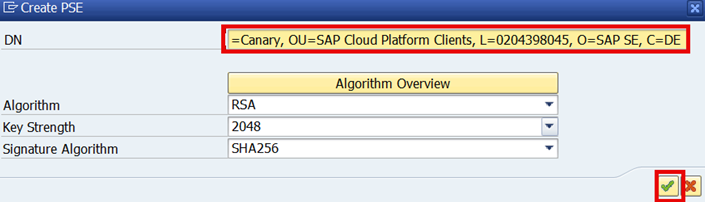

> [!NOTE]
> When the PSE was created, it also created the private key for the corresponding PSE. This results in a private key and a self-signed certificate which can be used to create a certificate signing request.

* With the private key and the signed self-signed certificate, we will create a certificate signing request using **Create Certificate Request**. Double-click on the PSE node to open the dialog.<br/>
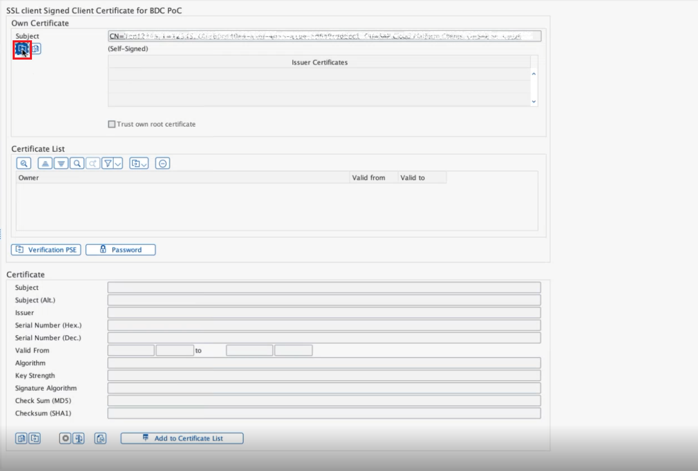<br/><br/><br/>

* Keep the default for the signature algorithm (PSE Algorithm) and choose Enter. <br/>
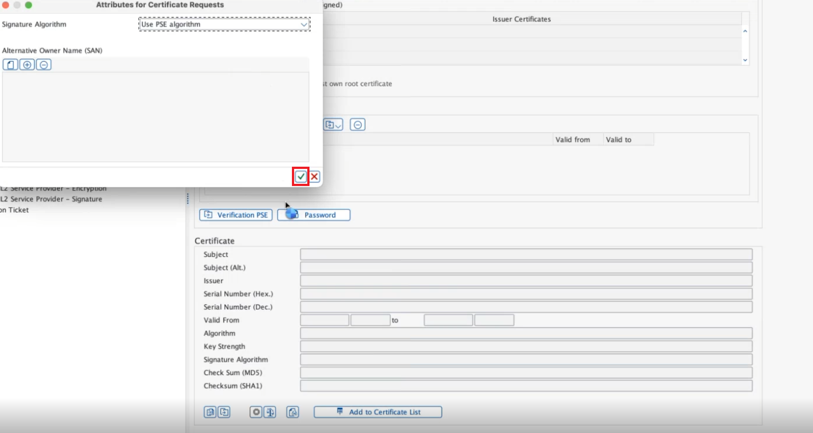<br/>

* A dialog appears with the contents of the CSR.

> [!TIP]
> **Make a note of (save) the CSR contents as this will be required later, when adding the S/4 System to the Formation in BTP.**

> [!Note]
> The Private Key stays in the PSE and only the CSR will be used outside. That is, as an input for the Formation.

* Choose **Continue**. The generated CSR can be used later for the SAP BDC Formation. This Certificate Signing Request can be sent to the Certificate Signing Authority through SAP Business Data Cloud.


### **3. Generation of the S/4 technical user credentials**
* Create a technical user (transaction SU01) for inbound communication for calling API and assign respective authorizations.

* This is the Technical user that is required for the BDC Formation. It must be created with all the relevant roles and authorizations by the S/4 admin. A password must also be chosen for the technical user and the type of the user is **System**. 

* For a more detailed guide about the technical user creation, please refer to this [section](user-setup-guide.md).

### **4. Import Certificate Response from the BDC Formation in the S/4 system**
* Creation of the BDC Formation can be performed as per [this section](README.md#steps) of the Configuration [chapter](README.md).

* After the Formation is created, in the **Formation** tab in SAP for Me, view the configuration for the added S/4 system as shown in the following image.
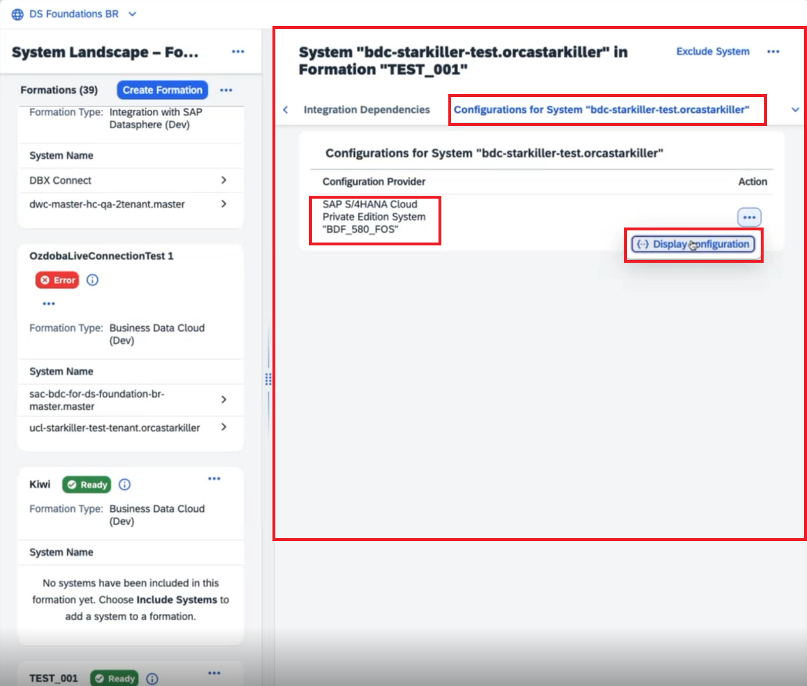<br/>

* View the different parameters that are generated here as shown in the following image.
    - systemMapping: this configuration has to be imported in the Cloud Connector.
    - additionalAtrributes -> S4AdditionalAttributes: Host, Port and Path Prefix are required for the configuration of the RFC destination in S/4 system.
    - additionalAtrributes -> S4AdditionalAttributes: clientCertificate: The clientCertificate contents must be imported as the response for the PSE that was generated in the second step.
    - authenticationMetadata: Required for the configuration of SCC (SAP Cloud Connector).
    <br/>

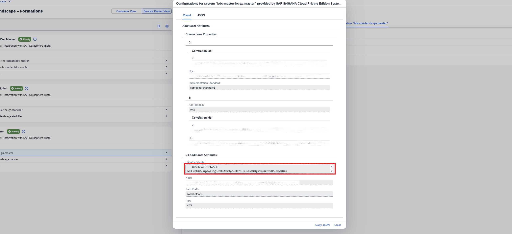<br/>

> [!Tip]
> Save the contents of this Configuration Parameters because the different elements are required for the upcoming steps in the setup.

* Copy the certificate contents and paste/import it as the response of the generated PSE.
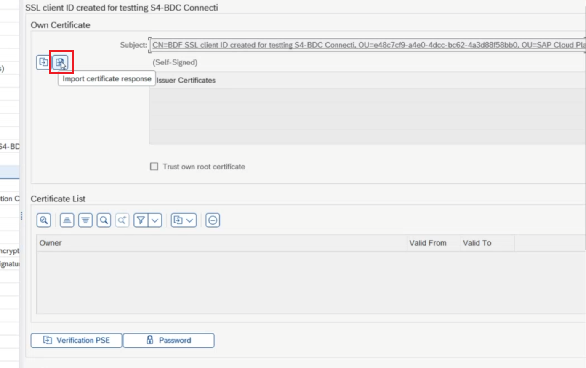<br/>

> [!Note]
> This certificate is complete up to Root CA.


#### **4.1 Import Digicert Certificates**
* In the S/4HANA system, we need to import two Digicert certificates in the trusted certificates list. 

* The certificates can be downloaded from the Digicert website from the links below:
    * [DigiCert Global Root CA](https://cacerts.digicert.com/DigiCertGlobalRootCA.crt.pem)
    * [DigiCert Global Root G2](https://cacerts.digicert.com/DigiCertGlobalRootG2.crt.pem)
    * [DigiCert TLS RSA4096 Root G5](https://cacerts.digicert.com/DigiCertTLSRSA4096RootG5.crt.pem)
    
* In the transaction **strust**, choose **Import** as shown in the following image and import each of the certificates that were downloaded in the previous step, by selecting the certificate from the saved location and then choosing **Add To Certificate List**. Save your changes.

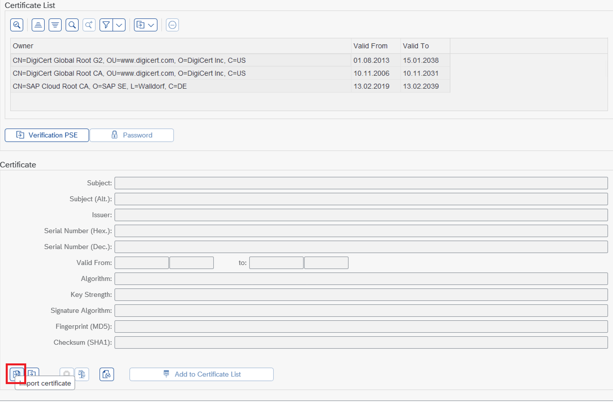<br/>

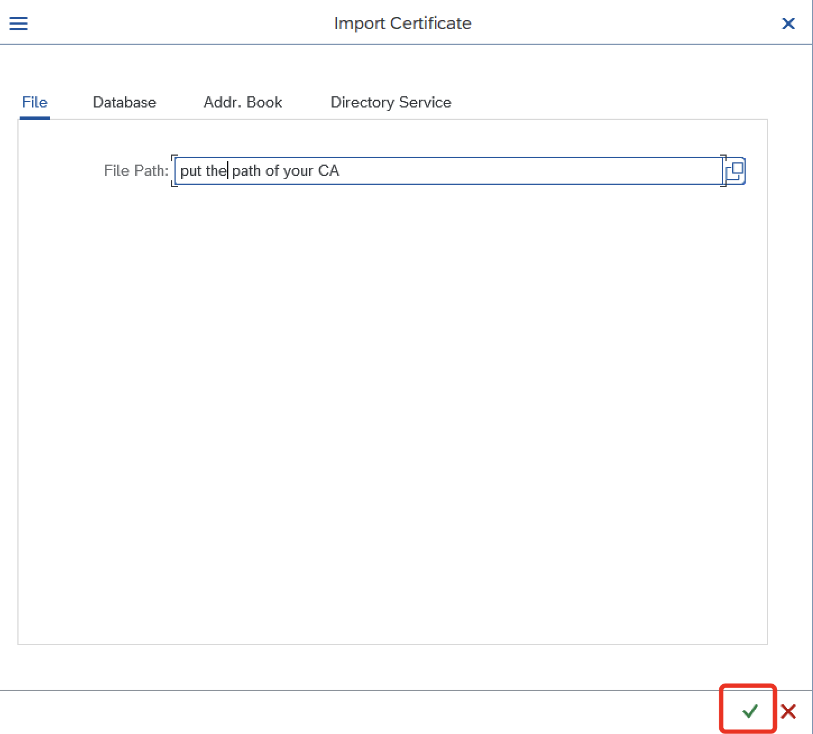<br/>

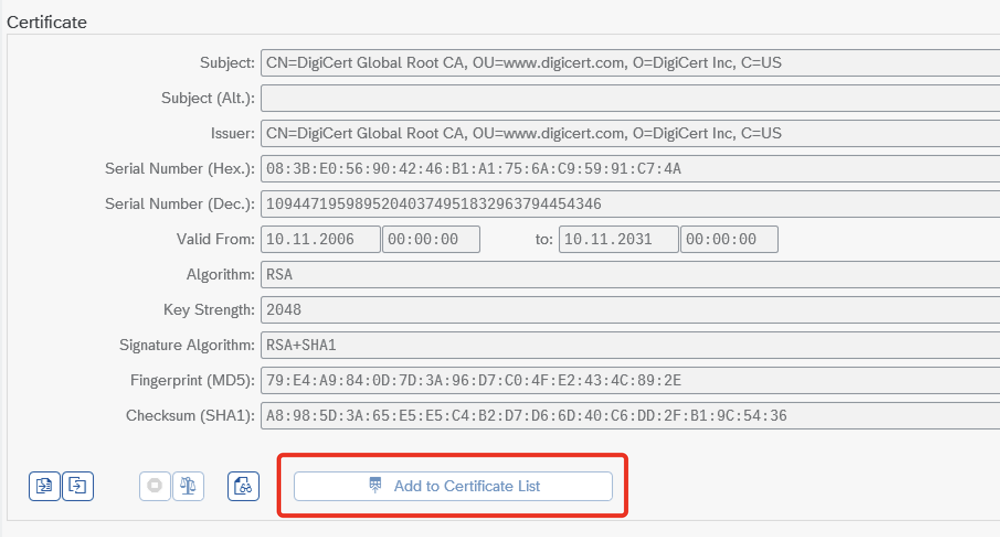<br/>


### **5.  RFC destination setup in S/4** 
* As mentioned in the earlier tip, the  S4AdditionalAttributes: Host, Port and Path Prefix are required for the addition of the RFC destination. We take these property values and create a Destination in S4.

* Open the S/4 system and start RFC transactions (Transaction SM59).

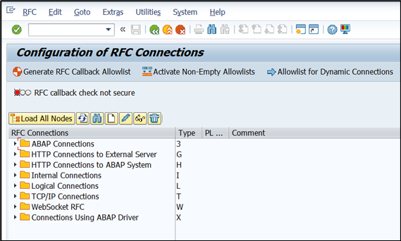<br/>

* Choose Create.

    - Enter an RFC destination name. For example - BDC_RFC_S4.  

    - Choose Connection type as **HTTP Connection to External Server** (G). 

    - Choose Enter. 

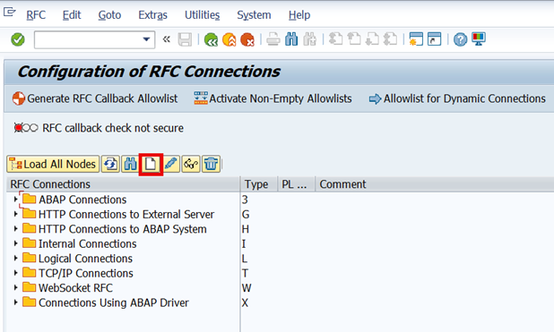<br/>
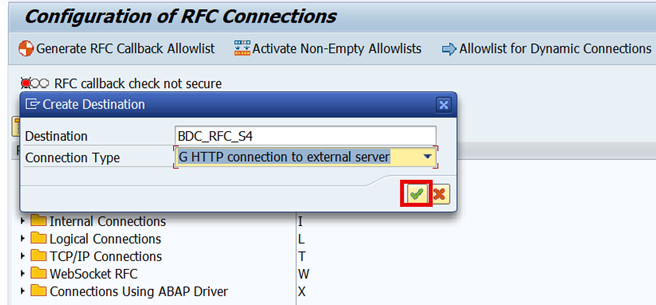<br/>

* Enter a description. <br/>
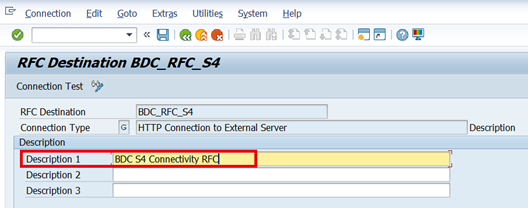<br/>

* Go to the Technical Settings tab and enter the Host, Port and Path Prefix that you noted previously.<br/>
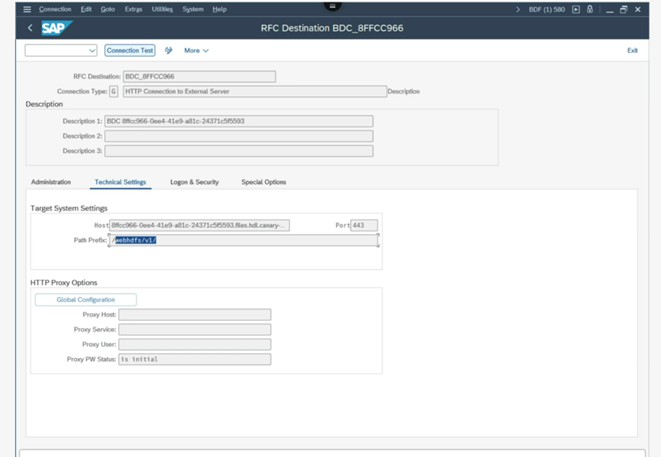<br/>

* If relevant, select the Logon & Security tab and enter the security settings as required. That is, make sure that the correct PSE ID (and not the Default one) is selected for the certificate that was imported while creating the PSE and that SSL is set to **Active**.
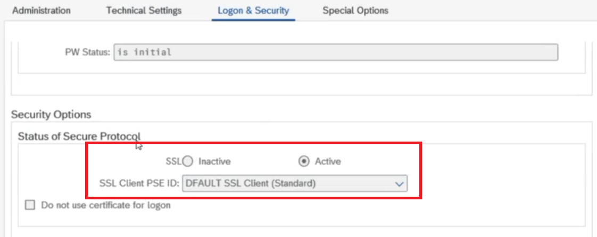<br/>

* Go to the Special Options tab and check the following settings.
    - HTTP Version - HTTP 1.1
    - Compression - Inactive
    - Compressed Response - Yes

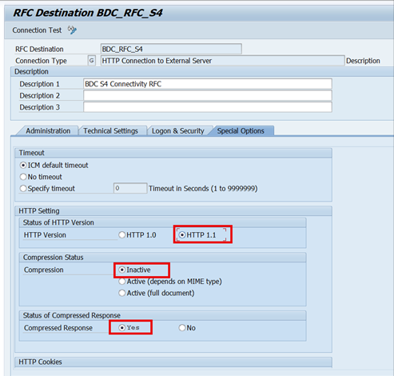<br/>

* Save the RFC Destination.

### **6.  Register Outbound Connection in SAP S/4** 
Once RFC connection is created, an outbound connection must be registered in **ABAP Integration: Monitoring and Support Cockpit** in SAP S/4HANA Cloud Private Edition. It is an administration tool for different scenarios regarding the extraction of data from an SAP system.
Use a user-created RFC connection to create a virtual connection that allows Business Data Cloud Integration to connect to the cloud file storage system. In edit mode, you can create a virtual connection and system will add this virtual connection to the list of outbound connections.

> [!Note]
> To use Monitor and Support Cockpit and perform expert functions, user must have a custom role created from template role SAP_DI_ABAP_USER.

* Start **ABAP Integration: Monitoring and Support Cockpit** (transaction DHADM).
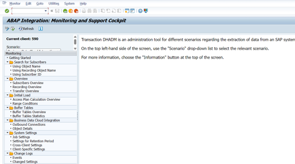<br/>

* Choose the Outbound Connections in SAP Business Data Cloud Integration menu folder. In edit mode, choose **Register**.
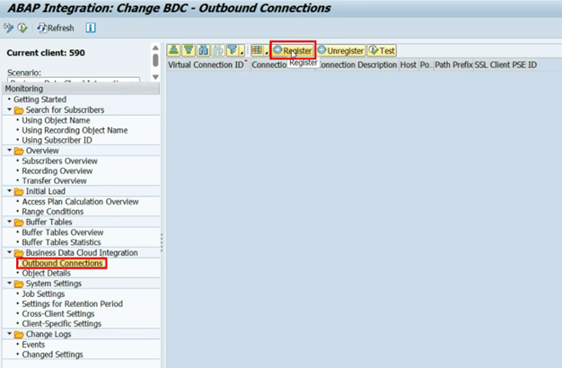<br/>

* In the pop-up box, use RFC Destination, created in this previous step, as Virtual Connection ID and Connection ID and press enter.
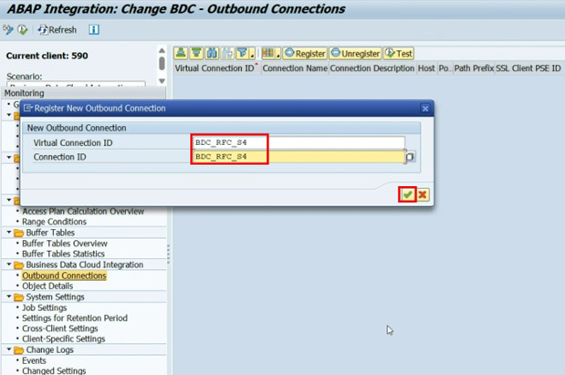<br/>

* To test the connection, select the relevant connection and choose **Test**.
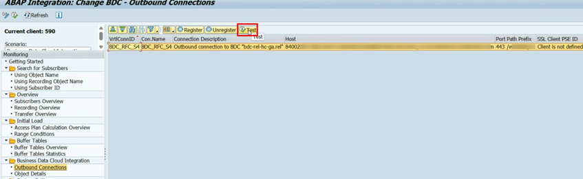<br/>

* If the connection test is successful, you see the following message:
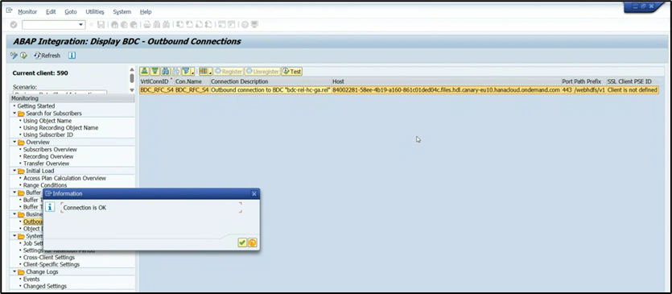<br/>

### **7. Cloud Connector Configuration** <br/>
***7.1 Add the subaccount in the SAP Cloud Connector (SCC)***
> [!Note]
> Documentation about installation of SAP Cloud connector can be found [here](https://help.sap.com/docs/connectivity/sap-btp-connectivity-cf/installation?locale=en-US).

* Save the contents of **authenticationMetadata** token from the previous step as a file with name *authentication.data*. We need this token to add the BTP subaccount in SCC.
* In the SCC Adminstration tool, choose the **Connector** and choose **Add Subaccount**. <br/>
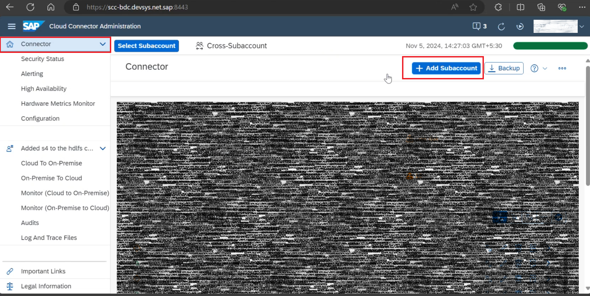<br/>

* Select the option to upload the metadata from a file. <br/>
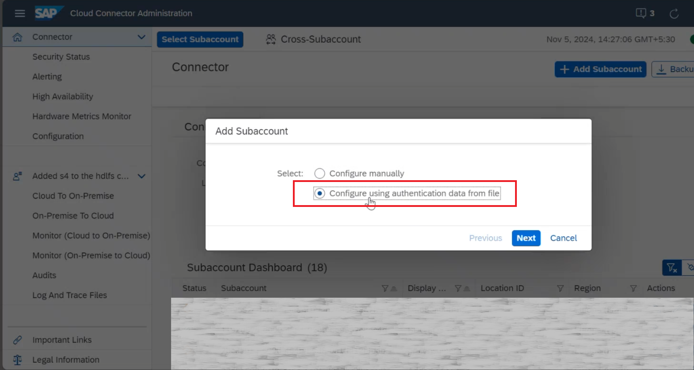<br/> <br/> <br/>
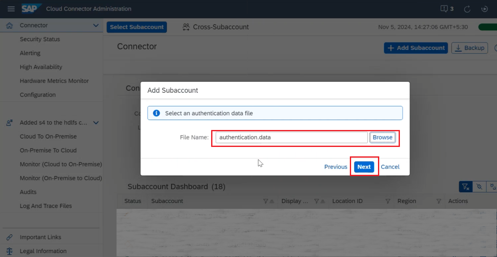<br/>

> [!Tip]
> If necessary, add a meaningful description for easier troubleshooting if support teams need to be notified. An example for a good description would be "#Name of S/4 PCE system# #Internal Hostname# Business Data Cloud".

> [!Caution]
> This is a time sensitive step. The contents of  **authenticationMetadata** token from the SAP BDC formation must be uploaded into Cloud Connector within 10 hours of token generation. 

* Finish the setup. Subaccount gets successfully added.<br/>
<br/>

***7.2 Add the configuration parameters from the BDC Formation into SCC.***
* We have to prepare the account configuration file that can be imported in the SCC. The contents of the *systemMapping* parameter starting at the **backends** parameter must be saved in a file called *account_config.json*. 

> [!Note]
> The configuration has to be appended with brackets to match the required json format. This is a requirement for SCC. If you want to view a sample account_config.json file, refer to this [sample](others/).

```
{"backends": [{
    "sid": "BDC",
    "authMode": "NONE_CERTIFICATE_LOCAL",
	"protocol": "TCP",
	"cloudhost": "kymaxxxxx",
	"localhost": "xxxxxx.devsys.net.sap",
	"localPort": "xxxx",
	"resources": [],
	"backendType": "abapSys",
	"description": "DESCRIPTION",
	"creationDate": 1730796401642,
	"hostInHeader": "virtual",
	"allowedClients": [],
    "blacklistedUser": []
    }
]}

```

* Create a zipped folder for the *account_config.json* file with the configuration parameters.

> [!Tip]
> The name of the file has to be account_config.json and the contents have to be prepared in the format as suggested previously. The name of the zipped folder is not relevant. 

* Using the **Select SubAccount** button, select the newly added BTP subaccount in SCC. Under the tab **Cloud to On-Premise** system, upload the account configuration file (zipped). <br/>
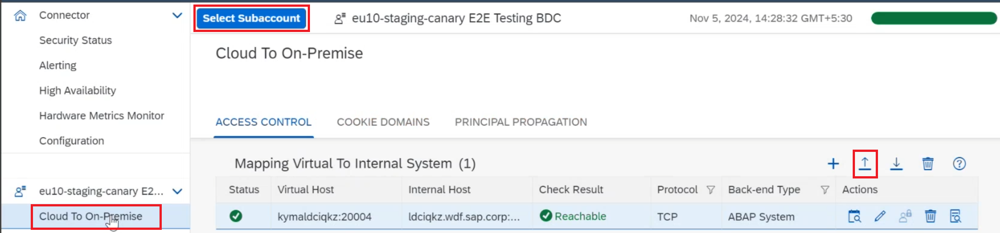<br/>

* Browse to the zipped folder and upload it as shown in the image below. <br/>
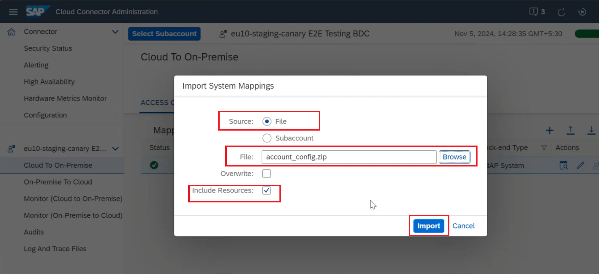<br/>

> [!Note]
> If this step fails, you can skip to the [workaround](#workaround)


* Once the system mappings are imported, the access control to the on-premise system is still in *Unreachable* status. <br/>
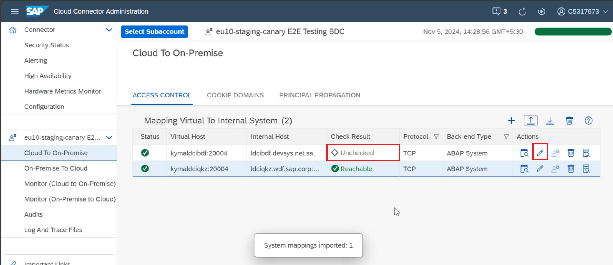<br/>

* Select the **Check Internal Host** checkbox and choose **Save**. The system changes to *Reachable* status. <br/>
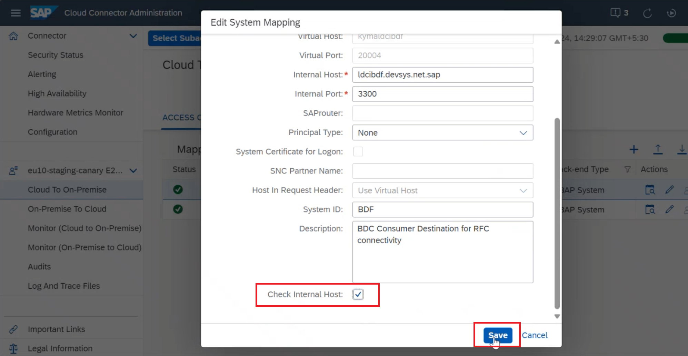<br/>

### Workaround
If the upload of the zipped file is not successful, then you can update the parameters manually. The contents of the *systemMapping* parameter from the previous step will also be required for the workaround.

* Using the Select SubAccount button, select the newly added BTP subaccount in SCC. Under the tab Cloud to On-Premise system, use the Add (+) button to add the parameters manually.
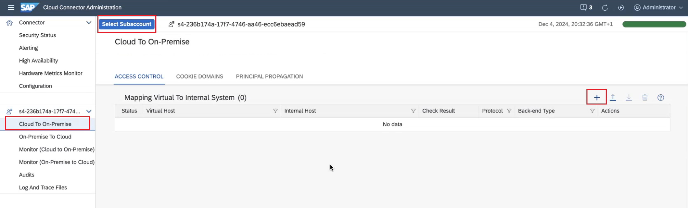<br/>

* Backend System-Type must be set to **ABAP System**. Choose **Next**.
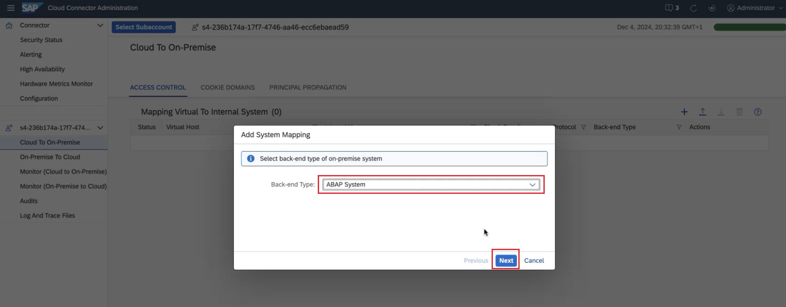<br/>

* The Protocol must be set to **TCP**. Choose **Next**.
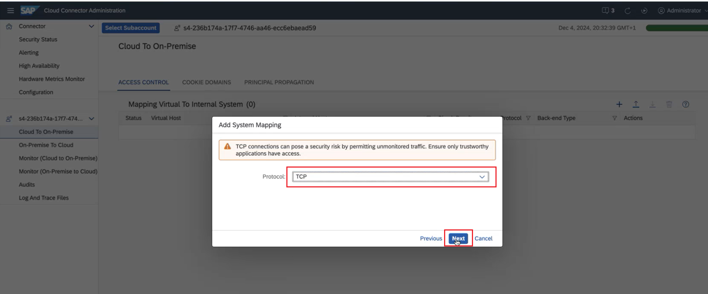<br/>

* The Internal host is the **localHost** name from the *systemMapping* parameter that was saved from the previous step. **3300** is the Gateway port.
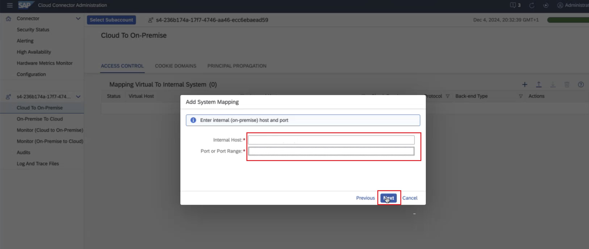<br/>

* The Virtual Host and Virtual port values are the **cloudHost** and **cloudPort** values from the *systemMapping* parameter.
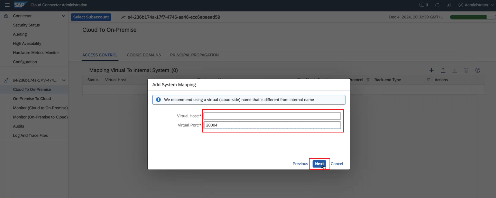<br/>

* Select the **Check Internal Host** checkbox and choose **Finish**.
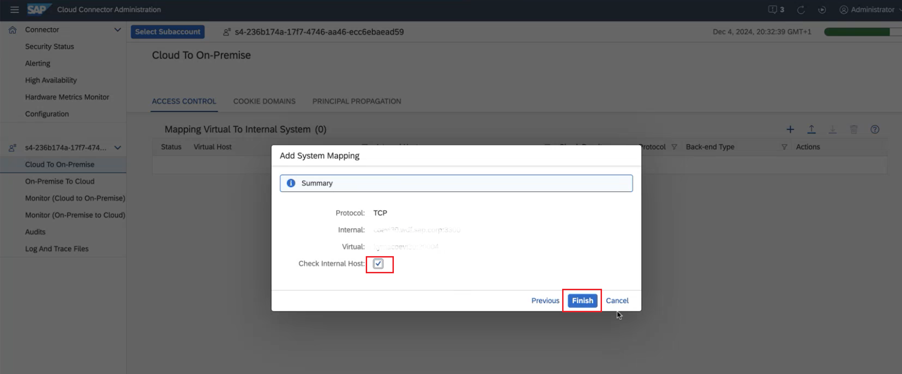<br/>

* The destination added must be *Reachable* as shown in the following image.
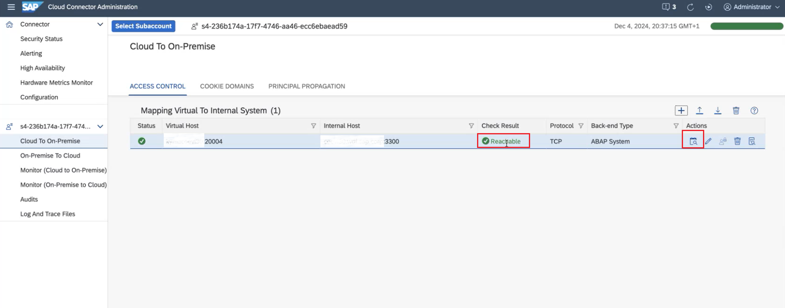<br/>

### **8. Determine the Instance Number for S/4 PCE system** <br/>
* For the creation of the SAP BDC Formation in a later step, you will be prompted to enter the S/4 PCE instance number. Note down the instance number for later use as follows.<br/>
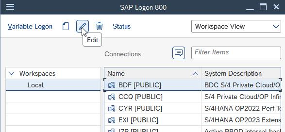<br/>

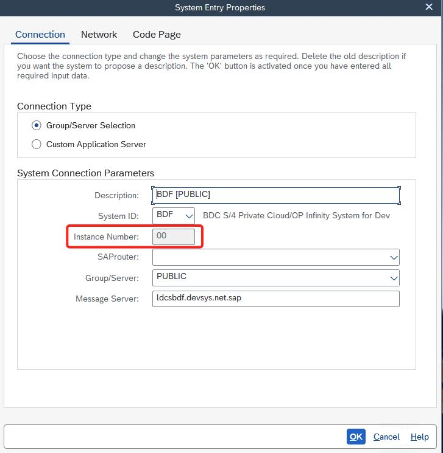<br/>

## Next steps
The outbound steps are now completed. Continue with steps of creating the SAP BDC Formation, as mentioned [here](README.md##creating-a-formation).
