# Install Intelligent Applications

Intelligent Applications are a premium offering exposed through SAP Business Data Cloud. They are innovative applications designed to streamline data analytics processes from observation to action. 
Intelligent Applications are intended to provide comprehensive dashboards, facilitate data analysis, and suggest viable actions based on the analysis; using artificial intelligence when applicable. The market entry version of BDC offers one SAP-managed intelligent application. In this exercise, let us look at how we can install one of these intelligent applications called the **Working Capital Insights** so that we can start using the insights and the underlying data products to their full potential.

## Persona 
Actor:  
 
Stakeholders:  

## Prerequisites
You have completed the configuration of the SAP BDC Cockpit which can be found [here](../01-basic-config-bdc/README.md).

## Use Case
This exercise describes the installation of the Intelligent Application called Working Capital Insights. This exercise also describes how the content authorisation is configured.

Working Capital Insights provides:
<ul>
<li>overview of financial positions, such as:
<ul>
<li>Accounts Payables/ Receivables</li>
<li>Cash & Liquidity</li>
<li>Inventory, and so on</li>
</ul>
</li>
 <li>
KPIs to assess working capital management performance such as:
<ul>
<li>NWC/TNS: Net Working Capital/ Total Net Sales</li>
<li>Cash Conversion Cycle</li>
<li>DSO/DPO: Days Sales Outstanding/ Days Payables Outstanding, and so on.</li>
</ul>
</li>
</ul>

Following illustration gives an impression of the look and feel of this intelligent application:  
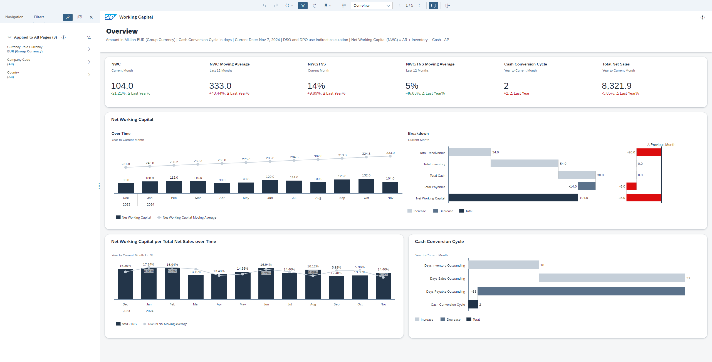 

## Explanation
In this next section, we learn how to install the intelligent application. But before that, let us take a deeper look at the different key elements that make up this intelligent application. This intelligent application is powered by the data from S/4 PCE data products, SAP Datasphere models and SAP Analytics Cloud stories. All of this is comprised in the **Details** section of the intelligent application.
1. Data Products: As shown in the following image, the intelligent application is powered by data from 35 data products, which are highly curated datasets with rich semantic purpose.
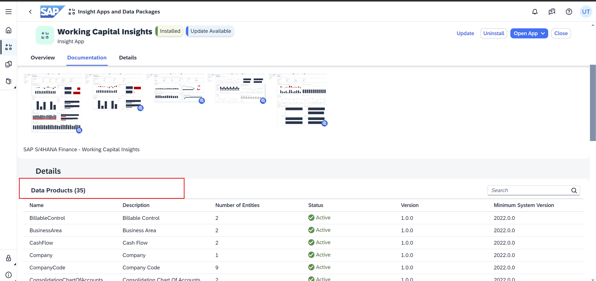 

2. Content:
- SAP Analytics Cloud: The stories that are comprised in this intelligent application will be created in SAC in a folder called SAP_SAC_WCI. You can find this under the Files > Intelligent Applications > SAP S/4HANA > Finance tab. This folder is SAP-managed and will be read-only. 

- SAP Datasphere: The installation creates and deploys three spaces in the underlying SAP Datasphere. 
    * SAP_WCI - This space contains all the analytic models that form the foundation of the SAC stories.
    * SAP_S4H - This space contains all the modelling artifacts required to build the analytic models, such as views, data access controls etc.
    * SAP_S4H_ING - This space contains all the local tables and their corresponding replication flows. The data from the data products reside in these local tables.   
    
> [!NOTE]
> The new version of the intelligent application does not require its own ingestion space. It reuses the ingestion space that is used for all data product installation. The SAP_S4H_ING space is obsolete as of Wave 9. If the tenant has updated to the new version of the intelligent application, you will not see this space.

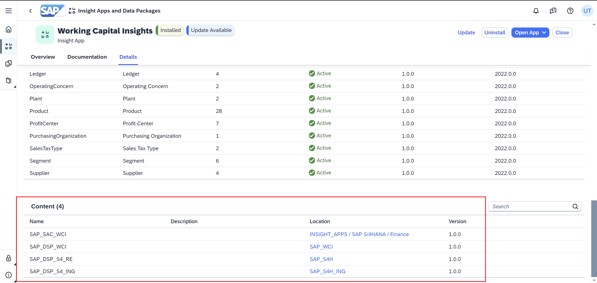 

## Steps
1. In SAP Business Data Cloud cockpit, you can create the users in the Security> Users tab and assign them the following roles can be assigned:
    - BD Viewer: This role is required to view the Cockpit
    - BD Administrator: This role is required to install data packages and intelligent applications
    - Catalog User: This role is required to view the **Catalog & Marketplace** tab inside SAP BDC Cockpit which refers to the One Data Catalog concept of SAP Business Data Cloud
    - Catalog Administrator: This role is required to install data products.

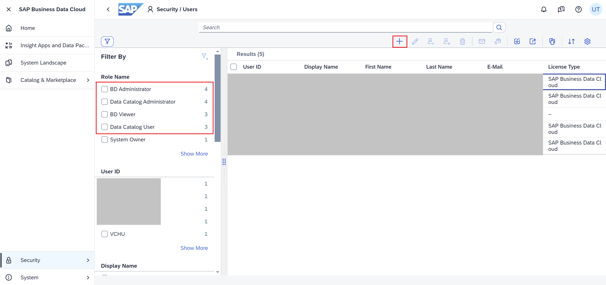 

2. Open the **Intelligent Applications and Data Packages** module in SAP Business Data Cloud. 
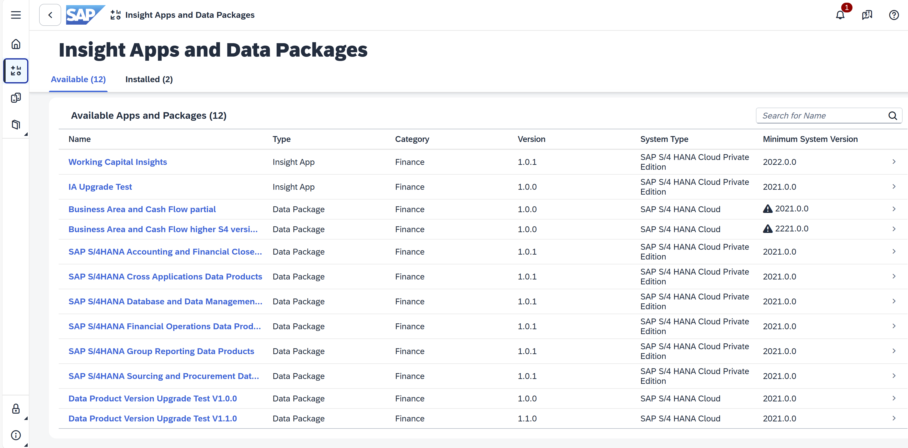 

3. This module shows the **Working Capital Insights** Intelligent Application which is available for installation. You can also search for the same in the search bar above.
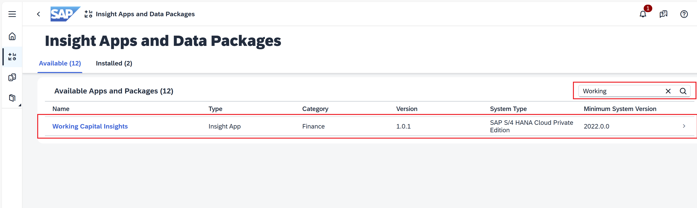

4. Opening the overview page shows the corresponding data products and the SAP Datasphere and SAP Analytics Cloud content that will be installed as a result of its installation. 
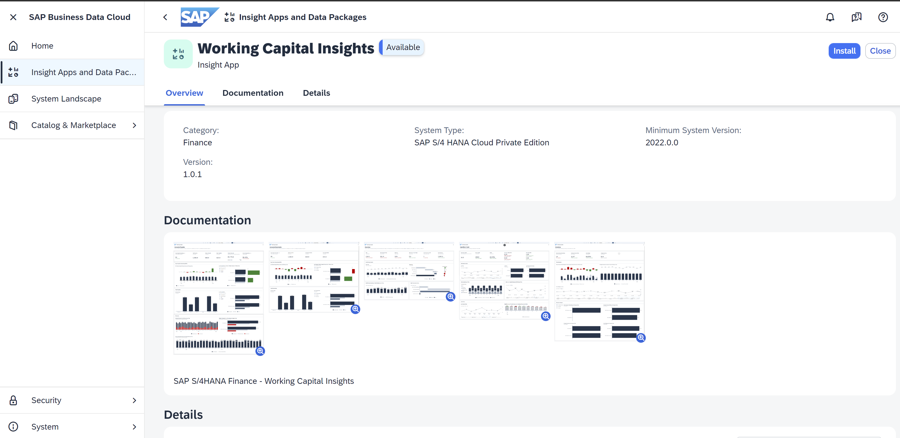

5. Choose the 'Install' button to kick off the installation. A dialog opens up to confirm the installation details. Choose 'Install' again to confirm.
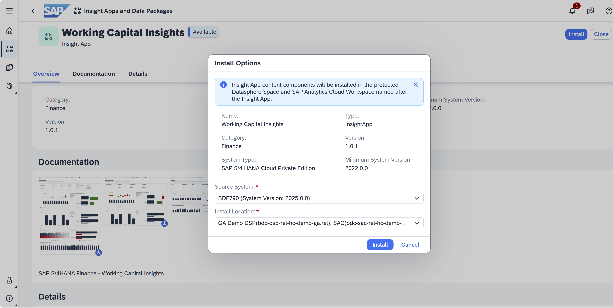
> [!NOTE]
> This saves the related content in an SAP-Managed spaces in SAP Datasphere (DSP) and an SAP-Managed folder in SAP Analytics Cloud (SAC).

> [!IMPORTANT]
> SAP Business Data Cloud uses a singleton SAP Business Data Cloud Cockpit to govern multiple formations. One cockpit can be used to install intelligent applications and packages in different environments, for example, dev, test and prod. Hence, during installation it is asked to specify which source system supplies the data to fuel the intelligent application and which SAP Datasphere & SAP Analytics Cloud constellation is used for the installation. Source System and Install Location must be specified.

6. The status of the installation changes to 'Installing' and then 'Active' when the installation has finished. 
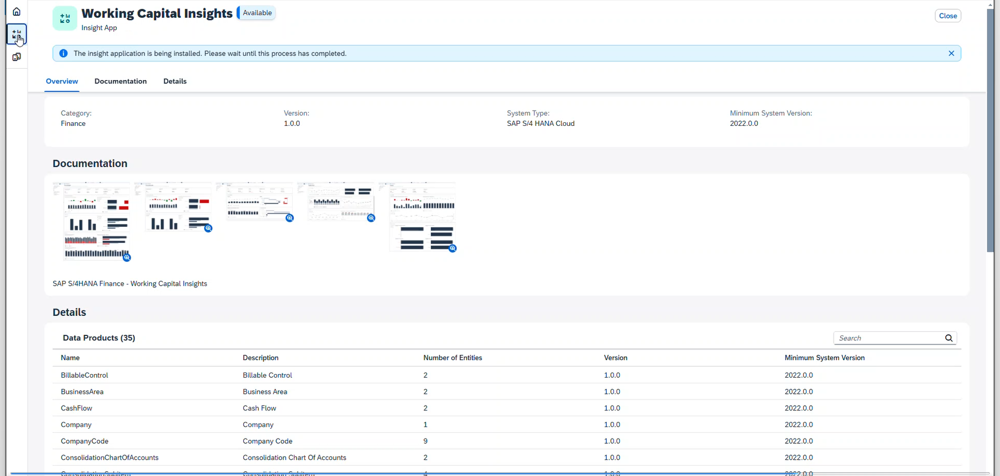

7. After installation you will find **Working Capital Insights** under the Installed Apps and Packages.
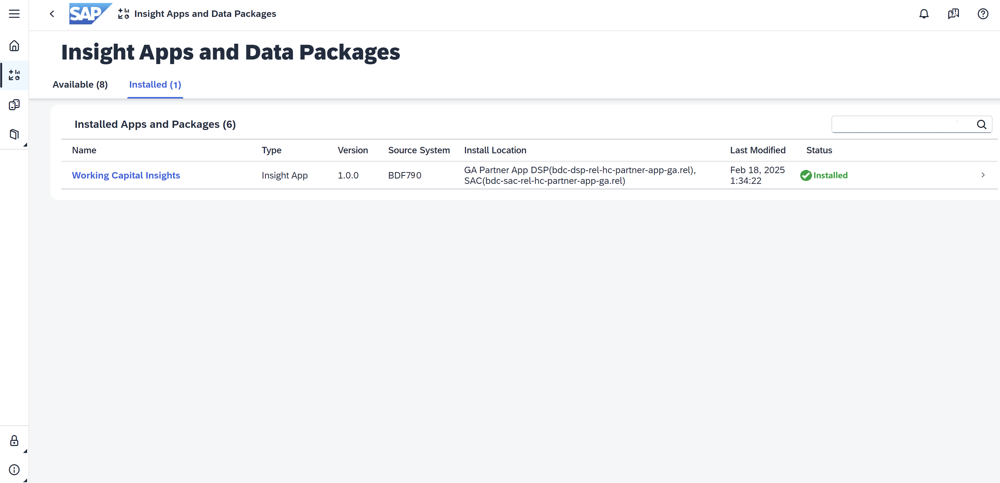
> [!NOTE]
> This step can take from several minutes to a few hours, because the step also entails fetching all the underlying data products data into the storage and semantic layer of BDC.

8. To view the content in SAP Datasphere, you can open it from the System Landscape Tab by navigating from the relavant formation.

9. In the **Security> Roles** tab, two new scoped roles have been created on installation of the Intelligent Application. The scoped roles have the newly created spaces `SAP_S4H`, `SAP_WCI` and `SAP_S4H_ING` as the scopes. The two newly generated scoped roles are `BDC_Scope_Space_Admin` and `BDC_Scope_Consumer`.
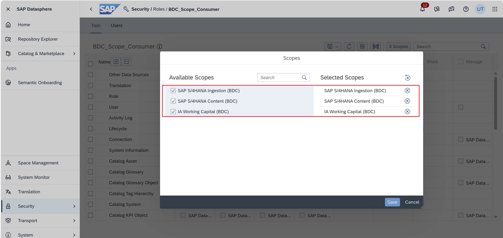 
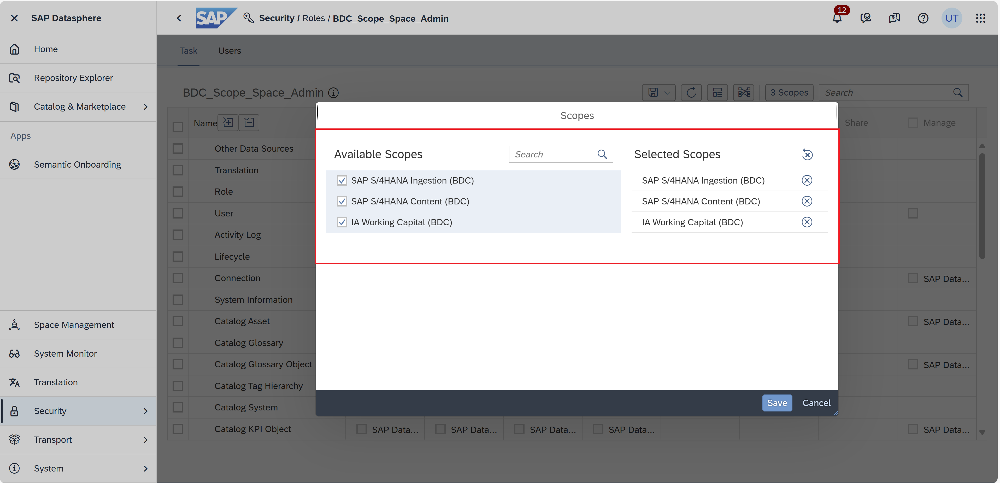 
> [!NOTE]
> The scoped role `BDC_Scope_Consumer` needs to be assigned to the users if they want to see data in the SAP Analytics Cloud story.

10. In **Space Management**, navigate to each of these spaces and assign users to the two above mentioned scoped roles.
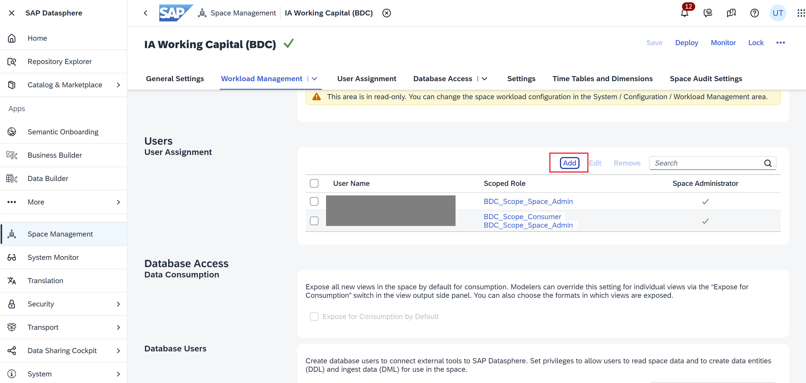 
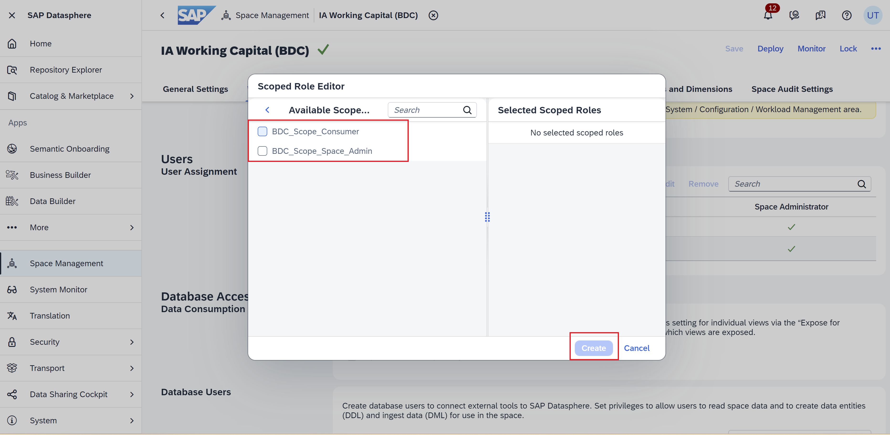 

11. To maintain Data Access Control for the installed Intelligent Application, open the Data Builder and open the `Central Permissions Table` in the space `SAP_S4H`. You can upload the permissions in the form of a CSV file. For a sample CSV file, please refer to the format [here](other/WciAuthorizationList_set.csv)  
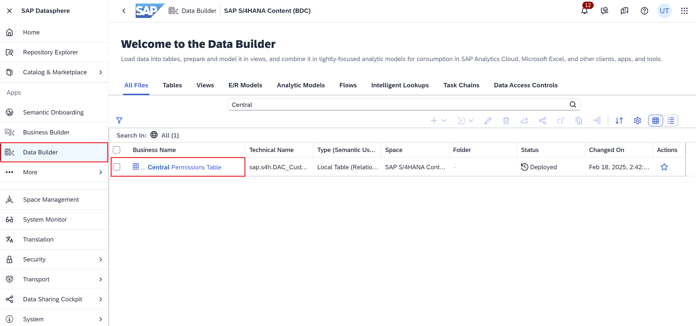 
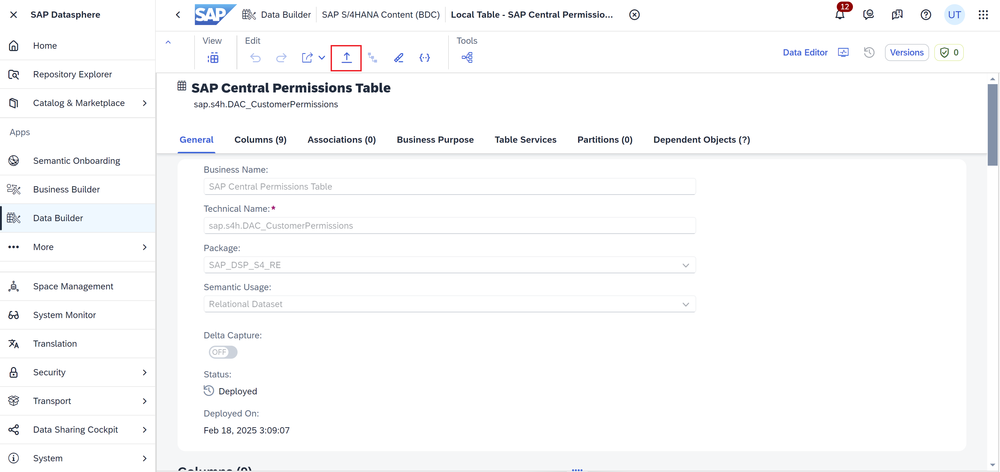 

    - Explanation:
    If the Data Access Control is not properly populated, the users will not be able to see any data (that is, in the data preview in SAP Datasphere, or in Story consumption). Let us take a deeper look into this CSV file. There are 12 rows governing 12 criterion. If five users need access, then the e-mail addresses of all five users must be repeated with each of these 12 criterion. That is, 5*12 rows where the column `User_Id` will contain the user's email address. The names of the columns or criterion cannot be changed and must be uploaded accurately.

12. On installation, the replication flows fetch the data in the local tables. However, for the data to be populated in the views, the task chains and the corresponding transformation flows need to be run. Before running the task chains, grant yourself access to do so, as follows.
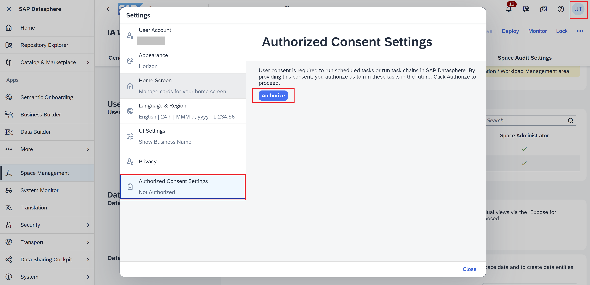 

13. In the space, `SAP_S4H`, there are two task chains. Run both task chains as follows:
  - Run task chain sap.s4h.TC_InitWCIConfiguration 
  - Configure the sap.s4h.IL_FinancialDataModelConfiguration table with G/L Account Hierarchy
  - Run task chain sap.s4h.TC_NWCPersis
  - You can find more information [here](https://help.sap.com/docs/business-data-cloud/viewing-insight-apps/2fe6d4074470414585326125c2661428.html)

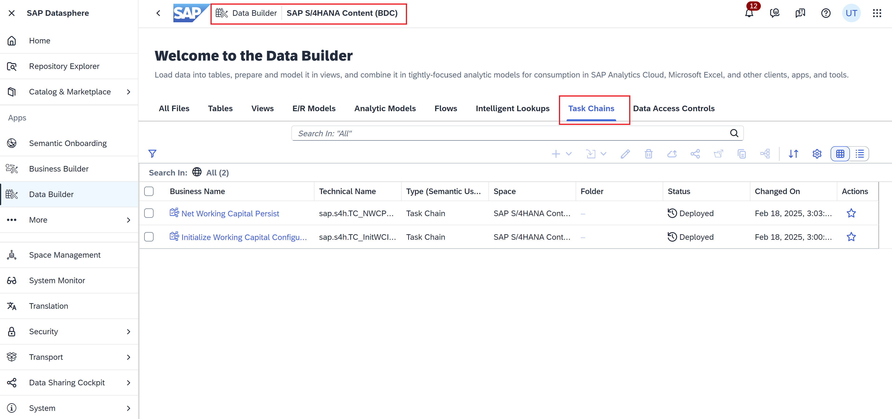 
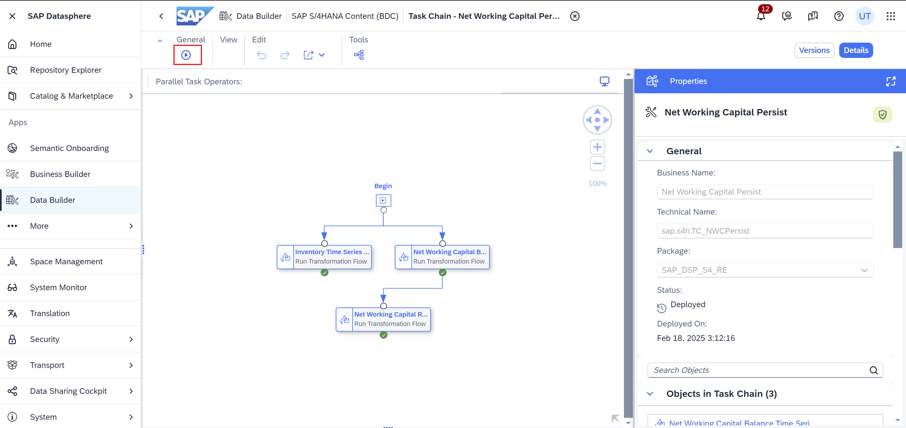 

15. The task chain runs can be monitored from the **Data Integration Monitor** > **Task Chains** tab.
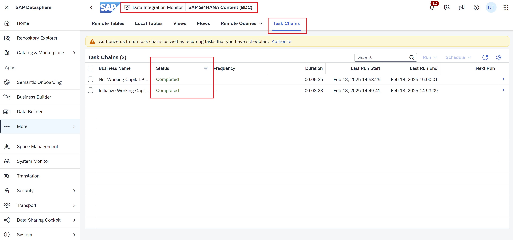 
> [!NOTE]
> If running either of these task chains results in an OutOfMemory exception, refer to the following recommendations. In the **System > Configuration > Workload Management** tab, change the setting of the two spaces `SAP_S4H` and `SAP_S4H_ING` to custom, as shown in the following image.   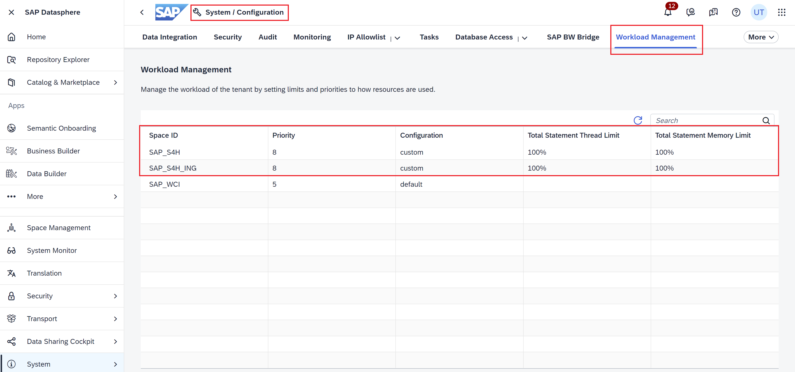 

15. To run all the transformation flows, open the space `SAP_S4H` in Data Builder and navigate to the **Flows** tab. There are five transformation flows that have to be run.  
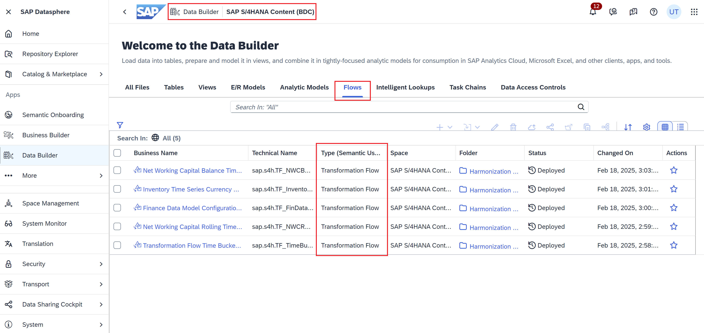 

16. Open and run each of the Transformation Flows. 
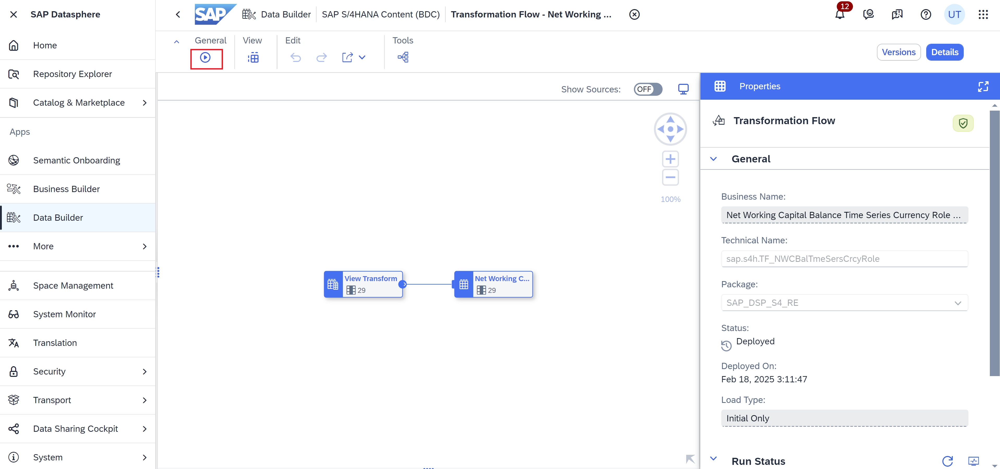 

17. The transformation flow runs can be monitored from the **Data Integration Monitor** > **Flows** tab.
  
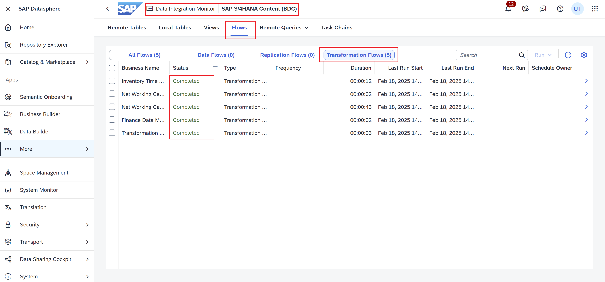 

18. Next, we have to manage the access in SAP Analytics Cloud. Open SAP Analytics Cloud using the Product Switch button. In SAC, in the **Security>Users** tab, add all the relevant users who will need access to content in SAC and so that the content can be shared with them.
    
> [!NOTE]
> An admin role, like **BI Admin** or **Admin**, is required to view the Intelligent Applications tab. Hence, for sharing the intelligent application story for the first time, one of these admin roles is required. For subsequent users, the intelligent application can be shared with them as shown in the following steps.
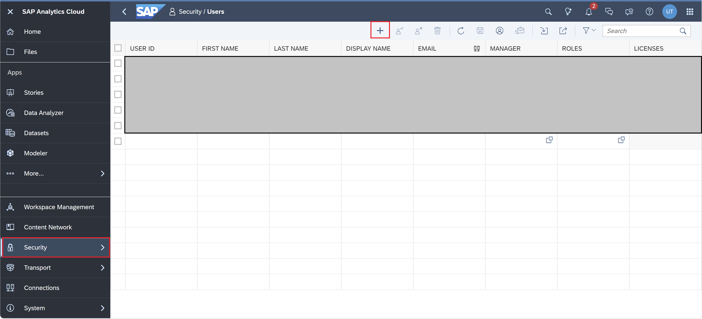 

19. From the Managed content folder in the file repository, grant the access rights to all relevant users. Go to Files > Intelligent Applications > SAP S/4HANA > Finance 
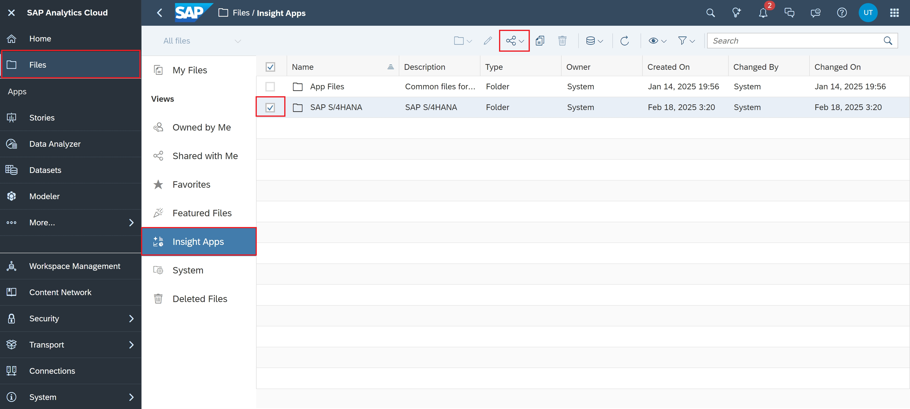 
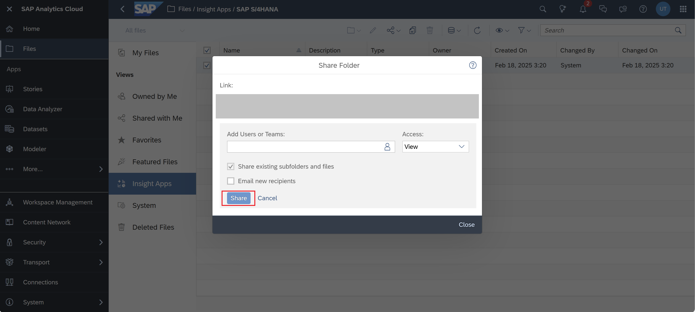 

**Working Capital Insights** Intelligent Application is now available for consumption.

## Updating the Intelligent Application
Please refer to this collection [SAP Note](https://me.sap.com/notes/3606495) for all updates related to Working Capital Insights.

## Next Steps
In the next [exercise](../03-consuming-intelligent-applications/README.md), you learn how a business user can start consuming the Intelligent Application to draw meaningful insights from the underlying data products data.
