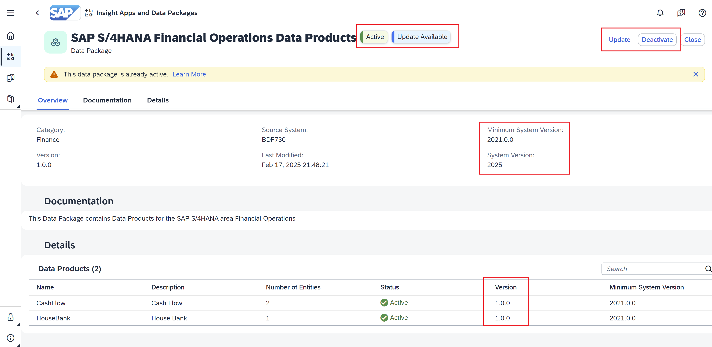

# Consumption of Intelligent Applications

Working Capital Insights is an integrated solution based on SAP Datasphere Analytical Models, SAP Analytics Cloud capabilities and powered by the SAP Business Data Cloud data products that visualize working capital KPIs based on data from different SAP S/4HANA financial areas based on the **Finance Foundation for SAP S/4HANA and SAP S/4HANA Cloud**. You can use it to discover new insights, trends, and predictions through powerful analytics based on cross-data models. It offers quick time to value, and low total cost of ownership through pre-delivered integration and KPI rich content available out-of-the-box.

Documentation of the capabilities can be found [here](https://help.sap.com/docs/SAP_ANALYTICS_CLOUD/42093f14b43c485fbe3adbbe81eff6c8/819a965dd7d643de8e28e125ed22a3a6.html).

## Persona
Actors:

## Prerequisites
You have completed the configuration of the BDC Cockpit described [here](../01-basic-config-bdc-cockpit/README.md) and completed the installation of the Intelligent Application, which can be found [here](../02-install-intelligent-applications/README.md).

## Use Case
An Intelligent Application called **Working Capital Insights** has been installed successfully by the BDC Admin. How can the insights be consumed as-is? This chapter highlights the power of Intelligent Applications, pre-built SaaS applications designed to deliver critical business signals and actionable recommendations, built on SAP’s unified data model. Specifically, we will cover **Working Capital** which is a use case for  **ERP Analytics**. 

## Steps
1. Installing the Intelligent Application, therefore, also installs all the underlying data products. In the SAP Business Data Cloud Catalog, you can find all the data products that are available. In the Catalog screen, under the tab **SAP Business Data Cloud Data Products** tab, you can find all the data products that can be now installed in the consumption spaces in SAP Datasphere. 

2. By filtering for 'Active', we are shown the list of data products that are available to explore and enhance in a familiar SAP environment. 

3. In the 'Intelligent Applications and Data Packages' Option under the 'Installed' tab, you can view all the installed intelligent applications and data packages. Take, for example, this data package which has already been activated as a result of the intelligent application installation. Let us take a closer look at the different key pieces of information shown in this page:
- Active: This tag signifies that the data package has been activated and the comprising data products can be installed.
- Update Available: A newer version of the data package is available.
- Update: This button can be used to get the latest version of the data package.
- Deactivate: This button is used to offboard the data package that was activated.
- Minimum System version: This is the minimum version of the S/4 PCE system as a data source where such a data package can be activated.
- System Version: Version of the data source S/4 PCE system.
- Version: The current version of the data package that has been activated.

4. Also, in the 'Installed' tab, you can find the newly installed intelligent application 'Working Capital Insights'. By choosing 'Open Application', you navigate to the SAP Analytics Cloud stories that form the vibrant consumption layer of this intelligent application.

5. You have a range of Stories showing insights using a vareity of KPIs and Metrics. For example, the following images show the stories in the Intelligent Application which showcase **Cash Flow**. 
- Actual Cash Flow per Calendar Week (default for three months data).
- Bank Balance per Time for Forecast and ΔYesterday (Forecast Cash Flow): Forecast Bank Balance in the near future.
 

Other Stories include the following:

We learn how to enhance these models and corresponding content in the upcoming exercises.  

## Next Steps
In the next [exercise](../04-onboard-data-products/README.md), you learn how a data product can be onboarded without a corresponding Intelligent Application. In subsequent exercises, you also learn how to integrate Databricks to enhance the data products and Intelligent Applications.
