# Activating Data Packages in Business Data Cloud Cockpit & Installing Data Products in SAP Datasphere

## Persona 
Actors:  
 
 

## Use Case

SAP Business Data Cloud Data Products can be used to:
- Build Analytic Models in SAP Datasphere
- Create custom stories in SAP Analytics Cloud based on a new data model
- Share them with Databricks for ML/AI processing

In all the cases listed above, the activation of a Data Package in SAP BDC Cockpit is a prerequisite to make it available for business users in the Catalog (covered in this exercise). The Data Products of this package are visible in the Catalog after this activation. They can be either shared with Databricks for AI/ML use cases or installed in SAP Datasphere which is required for modeling in SAP Datasphere.

## Overview
This exercise is separated into three sections:
- [Explore Data Products in the Catalog](#explore-data-products-in-the-catalog) (Explanation of the difference between active and inactive Data Products.)
- [Activate Data Packages in BDC Cockpit](#activate-data-packages-in-bdc-cockpit) (Prerequisites to share Data Products with SAP Databricks or to install them in SAP Datasphere.)
- [Install Active Data Products via the SAP Datasphere Catalog](#install-active-data-products-via-the-sap-datasphere-catalog)  (Installation of data products in SAP Datasphere for usage in modeling is explained in this exercise. Sharing a data product with Databricks is another use case which is described in an upcoming exercise)

## Prerequisites

- You have completed the configuration of the SAP BDC Cockpit which can be found [here](../01-basic-config-bdc-cockpit/README.md).

## Data considerations
In this exercise, the results will be best presented if and only if there is sufficient data available in CDS view **I_HouseBank** and its underlying tables. 

## Explanation
In the next section, we will learn how to activate a Data Package in SAP Business Data Cloud cockpit and then install the included Data Products in the corresponding SAP Datasphere tenant. But before we do that, let's take a closer look at what a Data Package is and its key elements.

### Data Package 
A Data package contains sets of related data products for use in modelling projects and pro-code applications. All Data packages are available in the SAP Business Data Cloud Cockpit in the [Catalog & Marketplace](#explore-data-products-in-the-catalog).

### Main components of the Data Package

#### Overview
The Overview section provides the following information about the package:
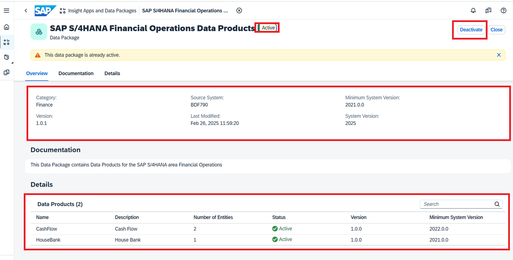

- Activate: Activation of a Data Package in SAP BDC Cockpit is a prerequisite to make it available for business users in the Catalog (covered in this exercise). Deactivation can also be performed here which is currently represented in this example. 

- Category : categories help in organizing and filtering data efficiently, ensuring that users can easily find relevant information related to specific areas like finance or sales.

- Version: Displays the version of the data package.

- Source System: Displays the SAP S/4HANA Cloud Private Edition system that provides the business data which populate the data products.

- Last Modified : Displays the date on which the data package was activated or last modified (appears for active data packages).

- Minimum System Version: This column appears for available data packages only and displays the minimum version of the SAP S/4HANA Cloud Private Edition system required for the data package to be installed. If the current SAP S/4HANA Cloud Private Edition version included in your 'SAP Business Data Cloud' formation is lower than the minimum version required by the data product, the data product cannot be installed.

- System Version: Appears for activated data packages and displays the current version of the SAP S/4HANA Cloud Private Edition system.

- Update: if there are updates available, they will also be shown at the data package level, and you could trigger an update.

####  Activation of a data package
After activating the Data package, the included Data products will become available in both the Business Data Cloud Catalog and SAP Datasphere. These Data Products can be installed exclusively from the Catalog within SAP Datasphere.
- As illustrated, in this precefing example, the Data package contains two Data products tailored to the Financial Operations business use case.

####  Installation of a data product
Installing a Data product for the first time in the corresponding SAP Datasphere tenant will automatically create and deploy an SAP-managed space in the underlying SAP Datasphere.

- SAP-managed Space (or Ingestion space): This space contains all local tables and their corresponding replication flows. Data from the Data products resides in these local tables and are replicated once into this space.
- Custom Space (or Consumption space): This is a user-defined space where the user chooses to install the Data product. The tables in this space are shared copies from the SAP-managed space.

## Observations

### Explore Data Products in the Catalog
> :books: If you are participating in a SAP BDC training, the creation of your SAP BDC Cockpit user has already been done. This next section is just for observations, feel free to click through and learn.  

The catalog in BDC Cockpit provides a structured inventory of business data, while the SAP Datasphere Catalog offers powerful tools for discovering, evaluating, and installing data products, with features that enhance data lineage and integration across various SAP and non-SAP sources.

1. In SAP Business Data Cloud Cockpit, you can create the users in the Security> Users tab and assign them the following roles.
    - BD Viewer: This role is required to view the Cockpit
    - BD Administrator: This role is required to install data packages and intelligent applications
    - Catalog User: This role is required to view the **Catalog & Marketplace** tab inside SAP BDC Cockpit i.e One Data Catalog concept of SAP Business Data Cloud
    - Catalog Administrator: This role is required to install data products.
> 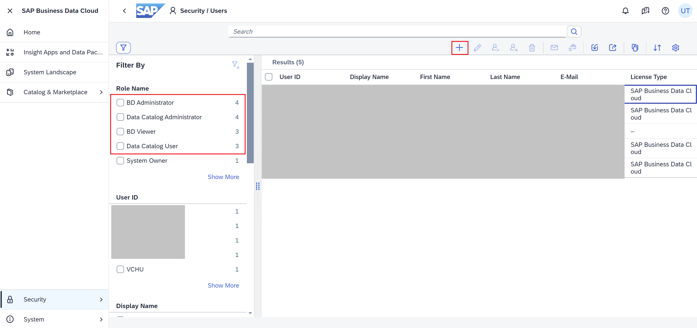

2. Access the application ***Catalog & Marketplace*** from the SAP Business Data Cloud Cockpit.
> 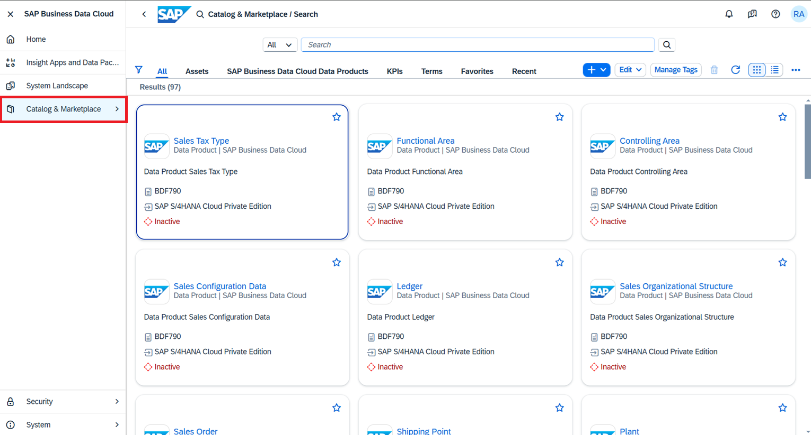

3. Select the tab named  ***SAP Business Data Cloud Data Products***. You see all Data Products available. In the Catalog screen, under the tab SAP Business Data Cloud Data Products tab, you can find all the data products that can be now installed in the consumption spaces in SAP Datasphere. They cannot be installed from here. This is just for exploration and sharing with DBX.
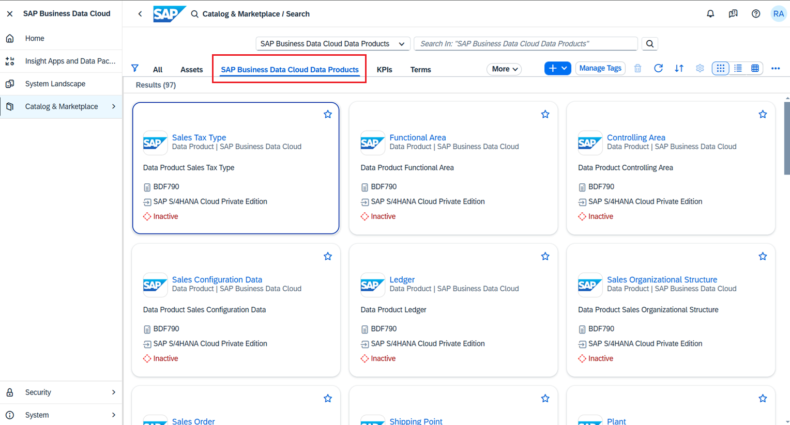

4. You can apply a filter to only see the data products provided from a specific source system. In the example displayed on the screenshot, we filter for the source system ***BDF790***, which is a S/4HANA PCE tenant. **Please note that in your system, the name might be different**
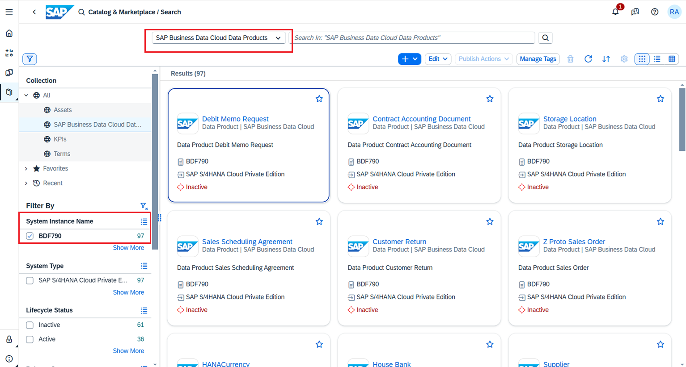

5. Data products are either ***active*** or ***inactive*** as displayed in the overview. 
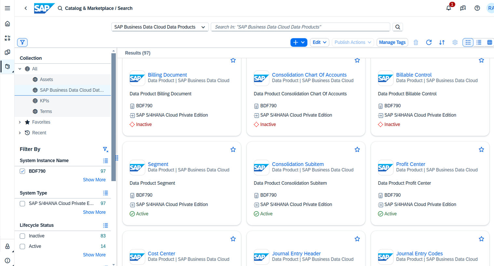

6. If you select an inactive data product (in the example displayed on the screenshot: **Plant**), the banner on top displays that this data product is disabled and not available for consumption. This means it is not installed for your system yet. It needs to be installed by the BDC Admin in the BDC Cockpit, as explained in the following steps.
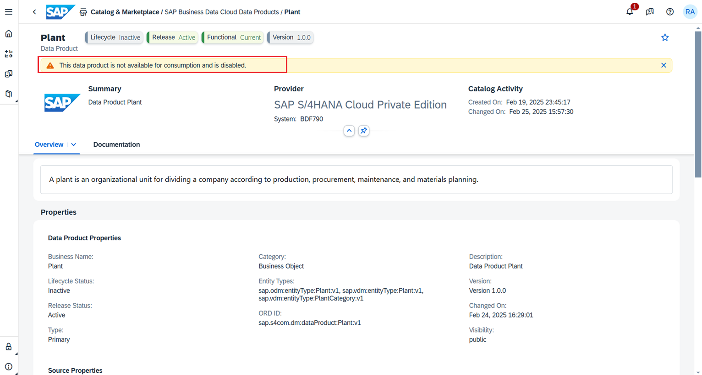  

> [!NOTE]
> If a data product is not available for consumption yet, its definition is derived from the standard ORD definition. The ORD specification provides a structured way to describe data products. Please find more information about ORD [here](https://open-resource-discovery.github.io/specification/) .

## Steps
### Activate Data Packages in BDC Cockpit

> :books: If you are participating in a SAP BDC training, the activation of Data package was already done for you. Read the following chapter and continue [Install Active Data Products via the SAP Datasphere Catalog](#install-active-data-products-via-the-sap-datasphere-catalog).

> [!Note]
As part of your SAP BDC training, you will install the Data Product ***House Bank*** in SAP Datasphere. The trainers of the workshop have already performed the necessary one-time activation of the corresponding Data Package, ***SAP S/4HANA Financial Operations Data Products***. To familiarize yourself with the steps involved, you can read through the following chapter. 

> 

1. Log into the SAP Business Data Cloud Cockpit.
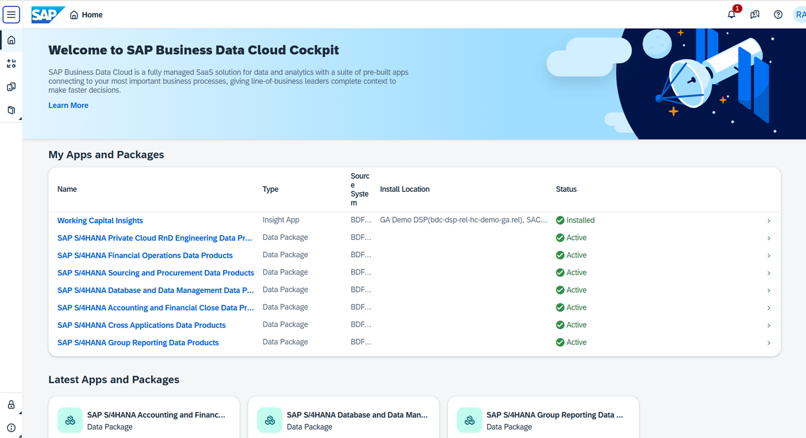

2. In the cockpit, open the tab **Insight Applications and Data Packages**. This tab shows all the Intelligent Applications and Data Packages that are available for installation.  
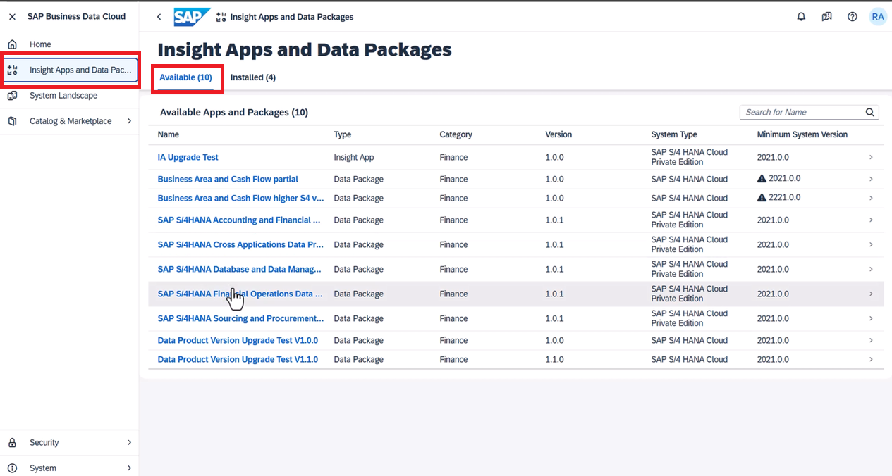

3. Search for the Data Package that you want to activate. In this exercise, we will activate the **SAP S/4HANA Financial Operations Data Products**. This data package is available for activation and includes two data products. 
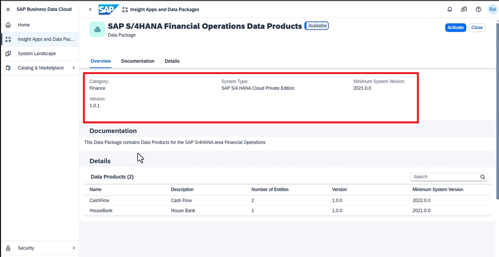

> [!IMPORTANT]
When activating a data package, make sure the source system is correctly identified and accessible. Check that the source system's version meets or exceeds the minimum required by each data product in the package. Data products will only activate if their minimum version requirements are met. For example, if one product requires version 2021 and another requires 2025, and your S4 system is on version 2024, only the product requiring version 2021 will activate. Additionally, the data package itself may have a minimum version requirement; if the source system doesn't meet this, no data products will install. The installation of data products can be partial or full based on the source system's version compatibility.

4. Click on ***Activate*** to start the installation process. You will be asked to select the source system. Activating the Data Package will make the Data Products available in the Catalog. :wrench:  
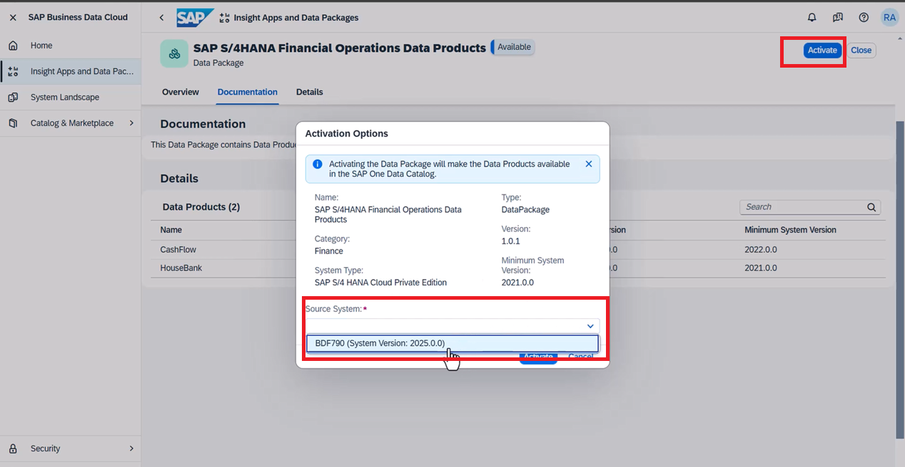
 

5. The status changes to **Activating**. This takes some time depending on the volume of the data in the underlying source system. SAP Business Data Cloud takes care of the data extraction and processing in the background. Once, the activation completes, the Data Products that are comprised in this Data Package are available for consumption. :wrench: 
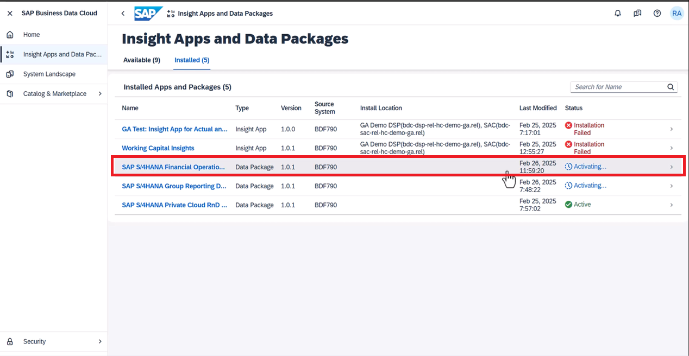

6. The Data package and the Data Product comprised in it is now **Active**,if there are updates available, they will also be shown at the data package level, and you could trigger an update. 
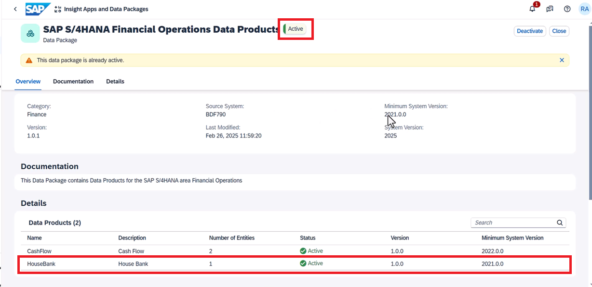

7. After installation of the data package **SAP S/4HANA Financial Operations Data Products**, you will find under the **Installed** tab in Intelligent Applications and Data Packages.
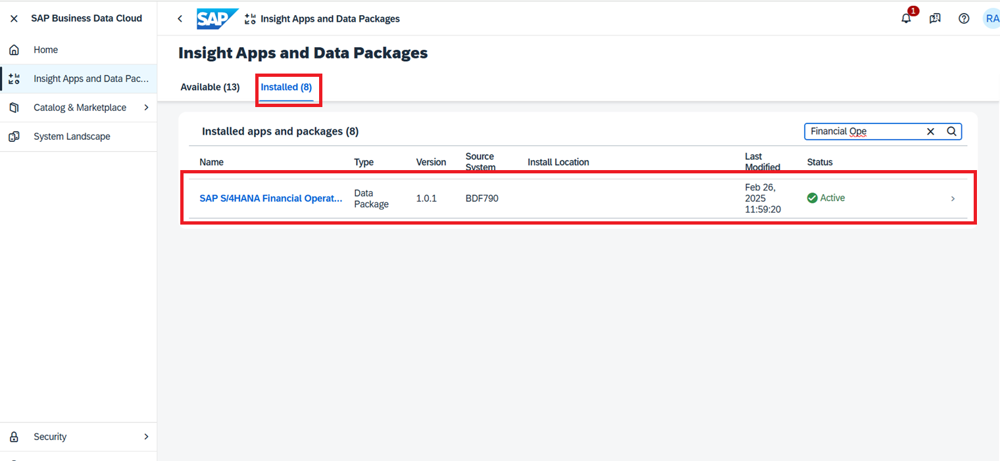

### Install Active Data Products via the SAP Datasphere Catalog 

> [!Note]
> The Data Product needs to be installed from SAP Datasphere Catalog once its corresponding Data package has been activated in Business Data Cloud Cockpit. Data product can be directly shared to Databricks through SAP BDC cockpit if Databricks is part of the formation.

1. To install the Data Product in SAP Datasphere, switch to SAP Datasphere through  **System Landscape** Tab by navigating from the relavant formation.
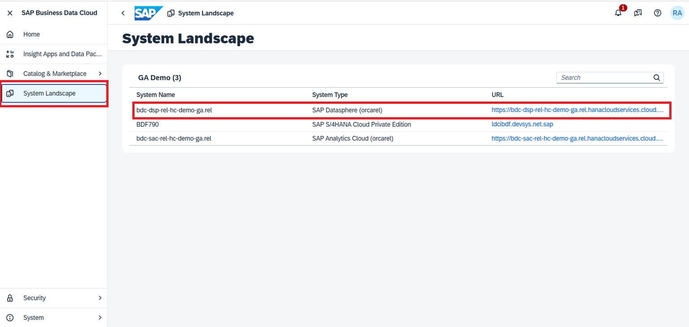.

> :books: If you are participating in a SAP BDC training, the step 2 has already been completed by the trainers, as it requires admin roles. Please continue with step 3.

2. Before installing the Data Product, we need to add the custom space where we want to install our required Data product to the System > Business Data Products tab and select the correct source system.  Follow these steps for your custom space(consumption space) where the data product will be installed:

- Navigate to the **System** menu.
- Select the **Business Data Products** tab.
- Add the custom space where you intend to install the Data Product.
- Ensure that you select the correct source system for accurate integration.

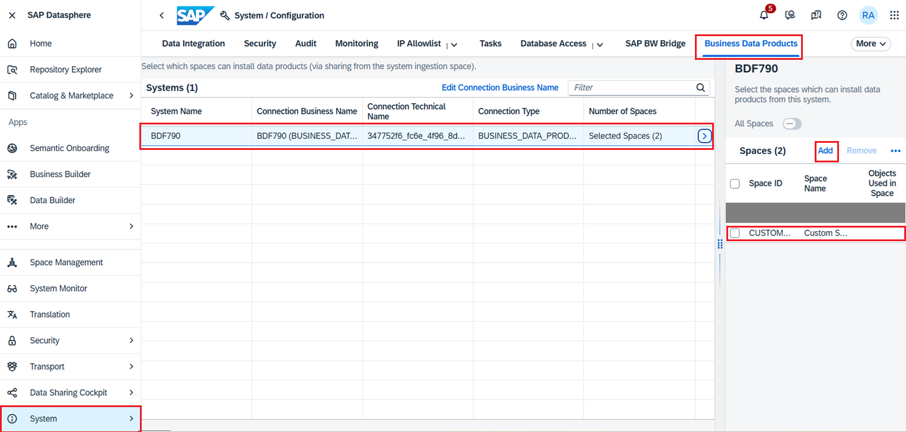

3.In the Catalog & Marketplace **SAP Business Data Cloud Data Products** tab search for the Data Product ***House Bank*** which was already activated in the BDC Cockpit.  
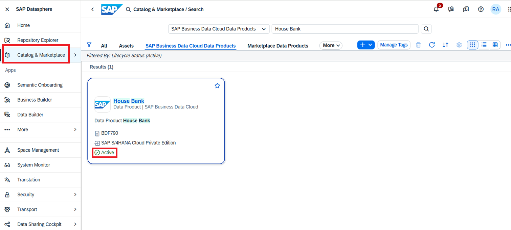

4.Open the Data Product ***House Bank***.
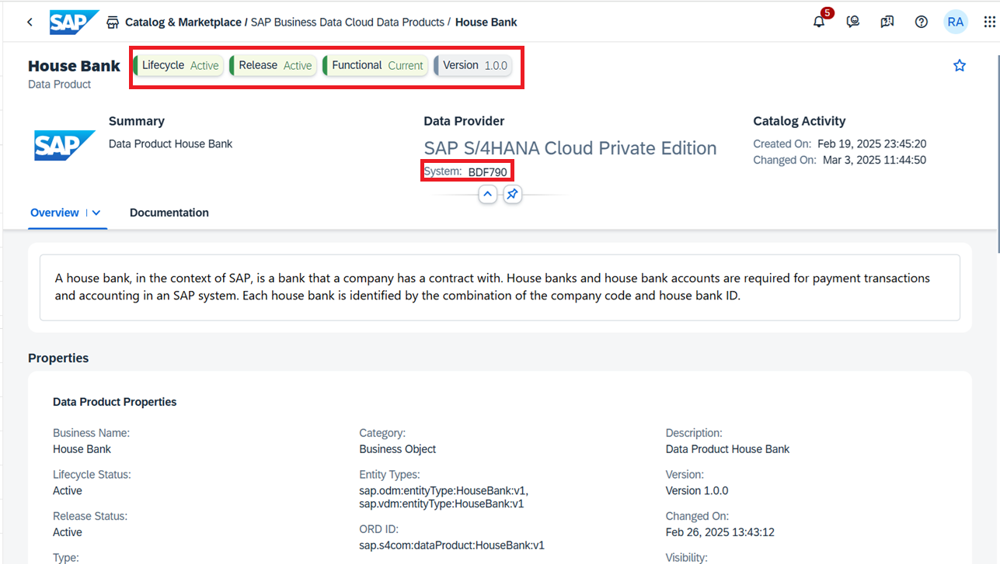

5.This data product is active as displayed in the header. 
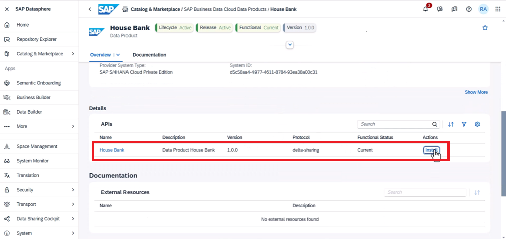

6.Choose the 'Install' button to start the installation. 
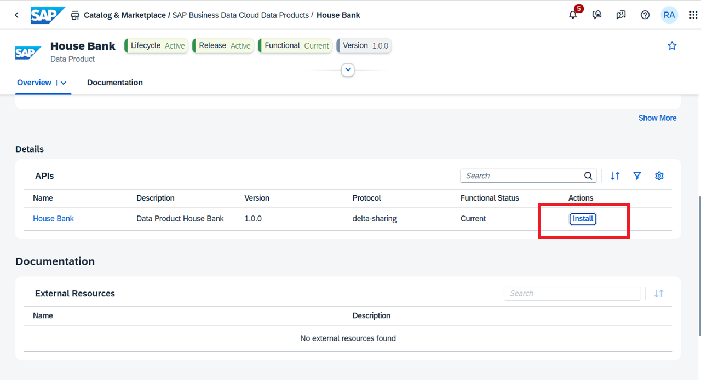

7.Select target space **Custom Space**, and click on ***Next Steps***.
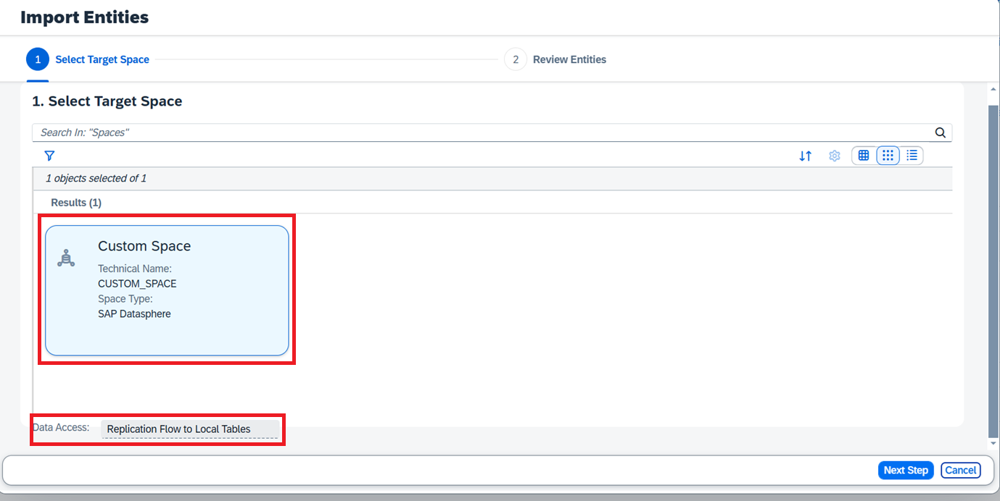

8.Review the entities (replication flow and local table) and run the import selecting ***Start Import and Deploy***.  
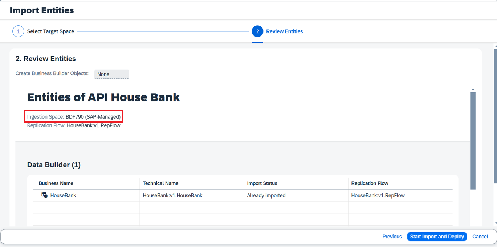 

9.You see the message ***Importing entities. Check the notifications for the status of the import.***.

10.Notifications display that the import started and also that the import completed successfully.

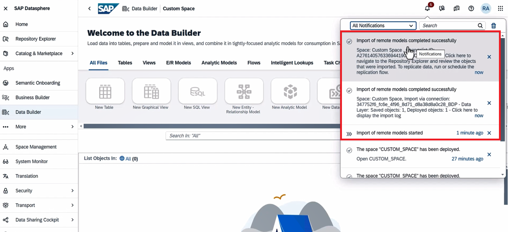

>[!Note]
>When you install a Data Product in SAP Datasphere, it sets up and deploys entities in an ingestion space or an SAP-managed space. Importantly, this does not create a second copy of the data. Instead, it shares the data from the ingestion space. This space is created when the first data product for the application instance is installed into DSP, either by a customer installing the data product in DSP or through the successful installation of an Intelligent Application. This approach ensures efficient resource use and keeps the data accurate and centralized.
>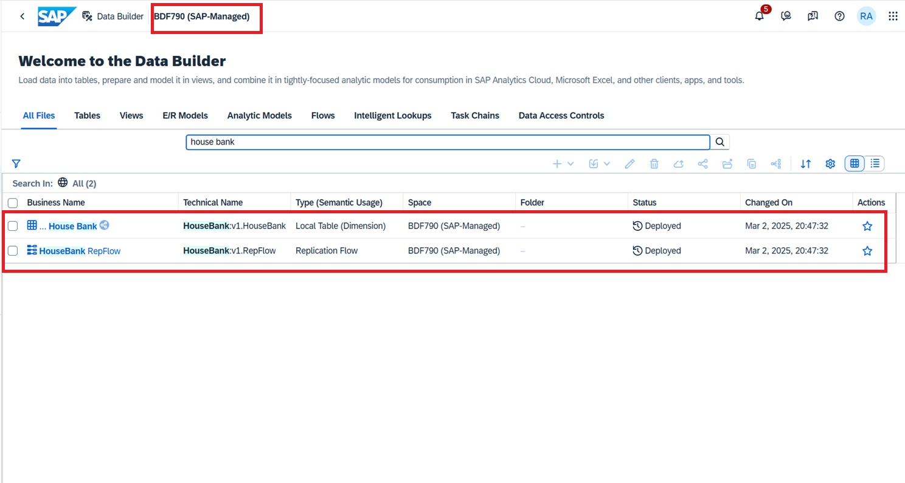

11.In your assigned space, create a new **Graphical view** for Datapreview.

>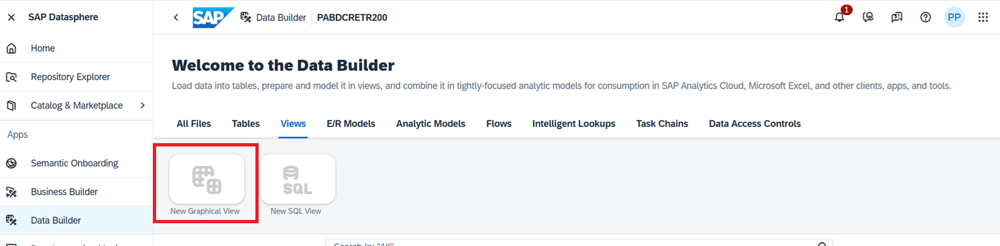

12.Drag the table ***Master Data For House Bank*** into the view and save it as ***HouseBank_DataPreview***

>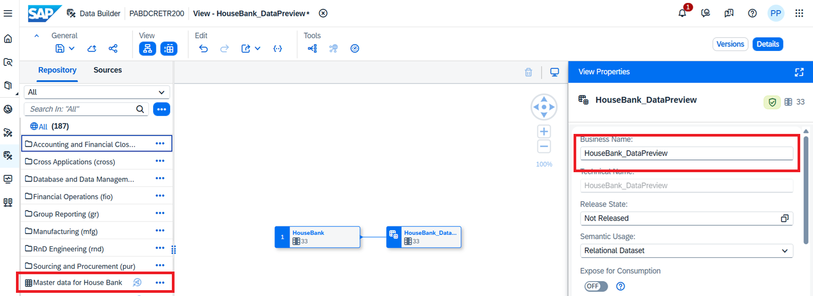

13.Preview the data in the ***HouseBank_DataPreview*** view.

>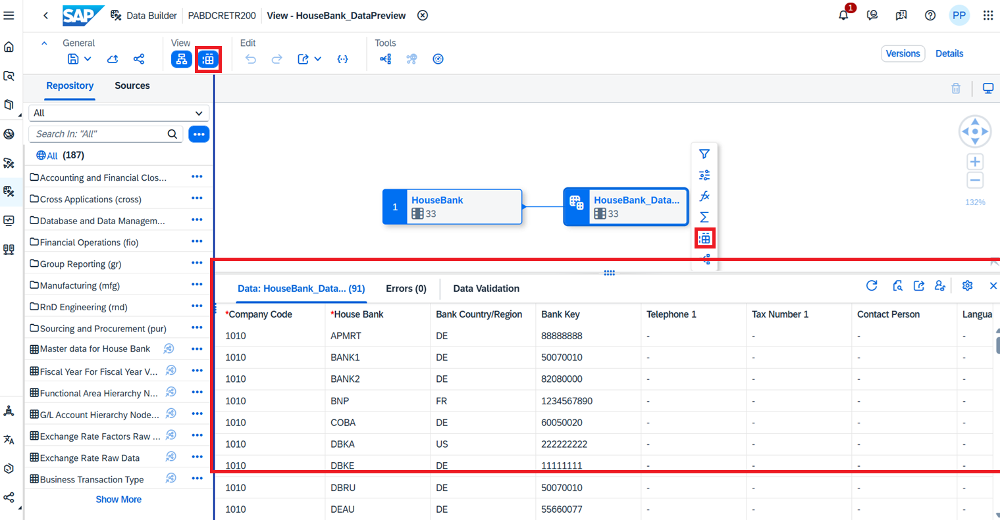

>`[Note]
As the table Master Data For ***House Bank*** is shared from the SAP-managed space. The table is automatically populated by the Replication Flow, so you don't need to manually start a run. 

You can now enhance the business use case by building on top of the installed data product.

## Next Steps
 If the integration with Databricks is available, you will learn how a data analyst can enhance the out-of-the-box data products with machine learning capabilities that the BDC integration with Databricks has to offer. You can have a look at the [exercise here](../05-enrich-data-products-with-databricks-ml/README.md).

 Until the integration is available, continue with the exercise about customizing a model delivered as part of an Intelligent Application [here](../06-enhance-analytic-model/README.md).
