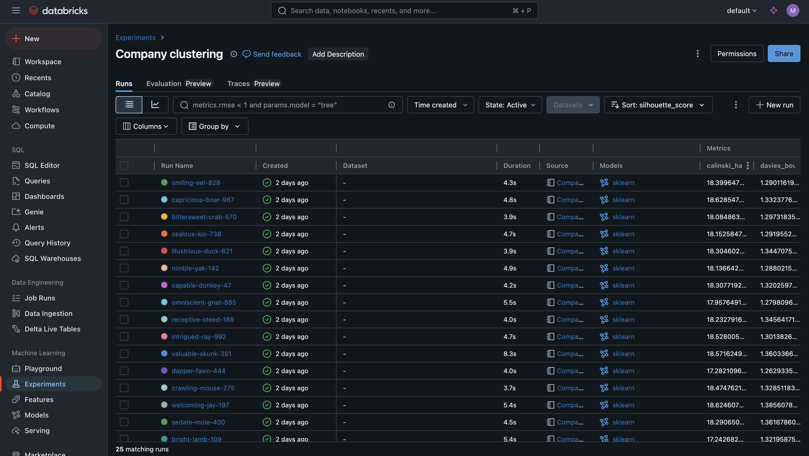
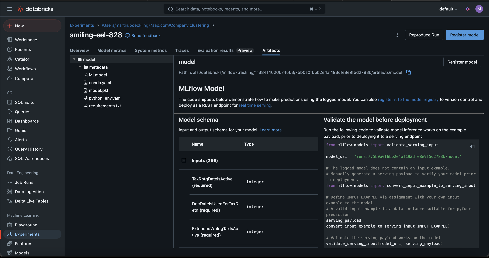
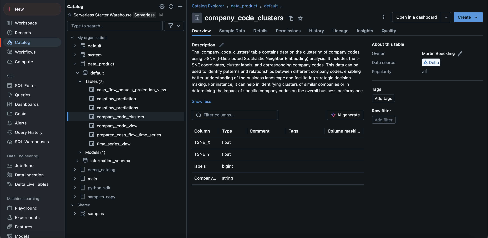
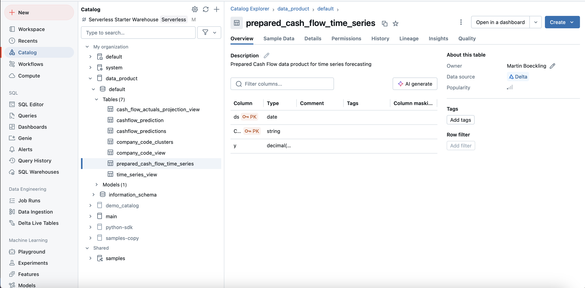
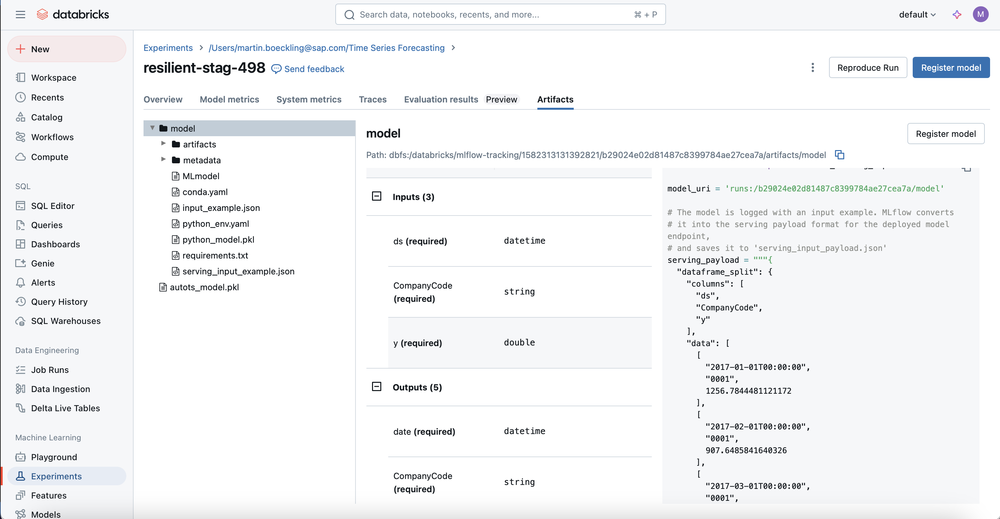
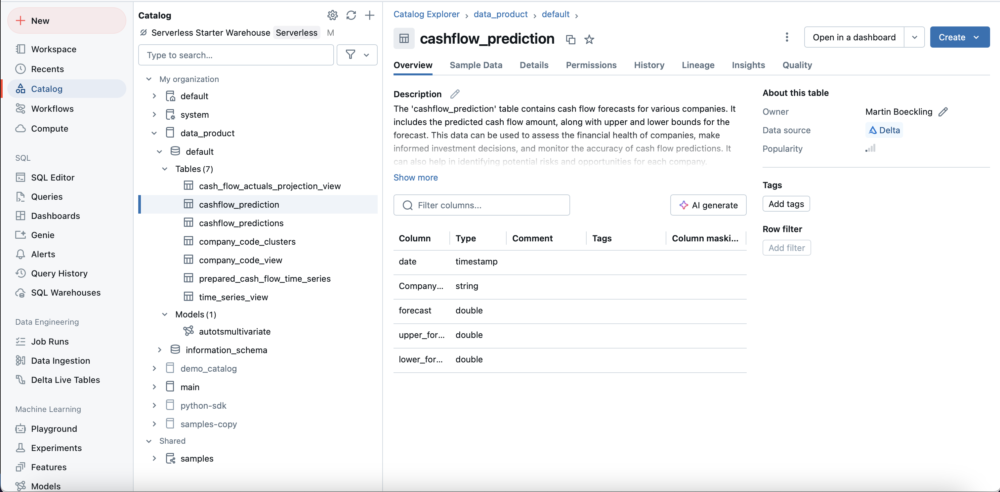

# Enrich Data Products with ML Capabilities coming through Databricks

> [!CAUTION]
> All versions of the Databricks Notebooks are based on pre-beta data products. The final data products might look different. The created notebooks do not represent official documents of SAP showcasing the best possible way to perform Machine Learning on Data Products. All notebooks represent sample files showcasing the end to end workflow between SAP and Databricks

## Persona 

## Use Case
- Hyperparameter Tuning of Time Series algorithms to predict future cash liquidity
- Log best model in MLflow using the capabilities in Databricks
- Load model from MLflow and predict future cash flow for upcoming periods

## Prerequisites
> Priviliges needed might change during the development process between Beta and GA release
* Knowledge about Databricks and Python required
* Knowledge about ML and ML metrics desirable
* [Basic Configuration of the SAP BDC Cockpit](01-basic-config-bdc-cockpit/README.md) 
* [Onboard Data Products](04-onboard-data-products/README.md) / [Install Insight Apps](02-install-insight-apps/README.md) / [Expose Dataset to Databricks]()
* Assign the following privileges to the Databricks user:
  * CREATE_CATALOG
  * CREATE_SHARE
  * USE_RECIPIENT
* In order to expose a data product from SAP BDC to Databricks, please follow the steps outlined in section [Share Data Product with Databricks](share_bdc_databricks.md#share-data-product-with-databricks)

## Steps
1. Navigate to the Databricks Workspace
2. Click on the Create Button in order to create a new folder and select the option of New Folder
3. Specify within the pop-up window the name of the folder and click on create
4. Right Click on the screen and select the option `Import`
5. Drag and drop the following notebooks and files to the newly opened window
   1. [Company Clustering Notebook](Company_Clustering.ipynb)
   2. [Cash Liquidity Data Preparation](Cash_Liquidity_Data_Preparation.ipynb)
   3. [Cash Liquidity Training Notebook](Cash_Liquidity_Training.ipynb)
   4. [Cash Liqudity Forecast Notebook](Cash_Liqudity_Forecast.ipynb)
   5. [Cash Liquidity Scheduling Notebook](Time_Series_Forecast_Notebook_Schedule.ipynb)
   6. [ORD and CSN generator](generate_ord_and_csn.py)

In the following sections we will outline on the individual flow of each notebook and provide a background of the different notebooks.
### Company Clustering
> [!NOTE]
> Clustering company data involves grouping similar pieces of data together based on common patterns or attributes. For example, clustering can help group customers with similar purchasing behaviors, segment products based on features, or categorize business locations by performance metrics. These groups, called clusters, help businesses identify meaningful patterns in their data.

1. Within the [notebook](Company_Clustering.ipynb) we first install the necessary Python packages and import the packages into the notebook environment
2. We use SQL functions in order to create a new catalog called `data_product` and set it as the default catalog
3. We then consume the exposed data product from SAP BDC and assign it to a variable in order to further process it in the notebook
> [!IMPORTANT]
> Change the string for the read command to the exact path of the exposed Company data product. This path might differ from tenant to tenant.
4. The data is going to be prepared in order to be able to run the clustering on the data product. This involes general data cleansing steps together with OneHotEncoding in order to have within each column a numeric representation, which is needed for clustering algorithms
5. We then perform a [hyperparameter optimization](https://en.wikipedia.org/wiki/Hyperparameter_optimization) with the help of the [Bayesian Search optimization](https://en.wikipedia.org/wiki/Bayesian_optimization). For the clustering we use the [Affinity Propagation](https://en.wikipedia.org/wiki/Affinity_propagation) algorithm
6. After the hyperparameter optimization is performed, the model with the highest [silhouette score](https://en.wikipedia.org/wiki/Silhouette_(clustering)) is applied as the best model to the prepared clustering dataset
7. The resulting clustering labels are stored and merged together with a [T-SNE](https://en.wikipedia.org/wiki/T-distributed_stochastic_neighbor_embedding) based representation of the input dataset. The T-SNE representations allows the consumer of the derived data product to visualize it within a dashboard using a scatter plot
8. The resulting dataset is written to a Delta Table on Databricks. After this, we create a Delta Share and add the clustered company data to the Delta Share
9. After the data is added to the Delta Share, we import the method from the [ORD and CSN generator](generate_ord_and_csn.py) to generate the ORD and CSN document needed for the SAP BDC consumption of the derived data product
10. We open the provided Notebook on the Databricks tenant and select the following values to be able to expose the derived data product to SAP BDC
    1. Name of the Delta Share
    2. Full path to the ORD definition file
    3. Full path to the CSN definition file

#### Walk through of generated details
- When navigating to the Experiments tab, the runs of the hyperparameter optimization can be viewed with its details:

- Model overview with the logged artifact from scikit-learn

> [!NOTE]
> A model stored on MLflow can be registered using either the [UI Workflow](https://mlflow.org/docs/latest/model-registry.html#ui-workflow) or the over the interfaces from the Python package with the [`register_model`](https://mlflow.org/docs/latest/model-registry.html#adding-an-mlflow-model-to-the-model-registry) method
- Written cluster results can be enhanced using an AI generated description. This information is going to get populated in the generated ORD description field. If it is not generated or filled on the Delta Table directly, the user input is taken:

### Cash Flow Forecasting
> [!NOTE]
>Time series prediction for cash flow involves using historical financial data to forecast future cash inflows and outflows over a period of time. It leverages trends, patterns, and seasonal variations in past data to predict upcoming financial positions.
1. The notebook [Time Series Forecast Notebook](Time_Series_Forecast_Notebook_Schedule.ipynb) runs all related Time Series notebooks in the following order:
   1. [Time Series Data Preparation](Cash_Liquidity_Data_Preparation.ipynb)
   2. [Time Series Training](Cash_Liquidity_Training.ipynb)
   3. [Time Series Prediction](Cash_Liqudity_Forecast.ipynb)
2. The steps of the data preparation of the time series forecasting is outlined in the following:
   1. We first read in the exposed Data Product in the Notebook

   2. We floor the `PostingDate` column dates to the beginning of the month. For instance a field like 2018-09-12 becomes 2018-09-01 
   3. Each individual Cash Flow statement is aggregated by using the floored `PostingDate` values and CompanyCodes as groups. The value for the column `AmountInGlobalCurrency` is summed up
   4. Under the assumption that not every Company contains for each month a Cash Flow statement, we assign for missing months (Time Series Gaps) 0 as a value for the Cash Flow at those missing months
   5. After finishing the data preparation, we store the prepared Cash Flow Time series in the Feature store of Databricks, to be able to query it from the Training Notebook as well as the Prediction Notebook

3. The training of the Time Series involves a hyperparameter tuning of different models together with a generation of [Ensemble](https://en.wikipedia.org/wiki/Ensemble_learning) based on the [Cross Validation](https://en.wikipedia.org/wiki/Cross-validation_(statistics)) results.
   1. We retrieve the data stored in the feature store and transform it to a Pandas dataframe.
   2. After retrieving the data, we perform a Model Training for Time Series using the AutoTS library. The final model is stored and logged on MLflow, which we call `autotsmultivariate`.
   3. The trained model is logged in MLflow providing details on the input as well as the output of the data structure when inferencing it
   
4. The prediction of the Time Series sends the data stored in the Feature Store to the last logged run from the specific MLflow experiment. Once the model is inferred, we retrieve the prediction dataset. The inferred model is then stored as a Delta Table to our created Catalog

### Sharing from Databricks Delta Table to SAP BDC
In order to be able to enhance your datasets, please follow the steps outlined in section [Install Derived Data Product Shared by Databricks](share_bdc_databricks.md#install-derived-data-product-shared-by-databricks). In the [next exercise](/beta-pipeline/06-enhance-analytic-model/README.md) the process of dataset enhancement within SAP BDC is outlined using an analytical model.