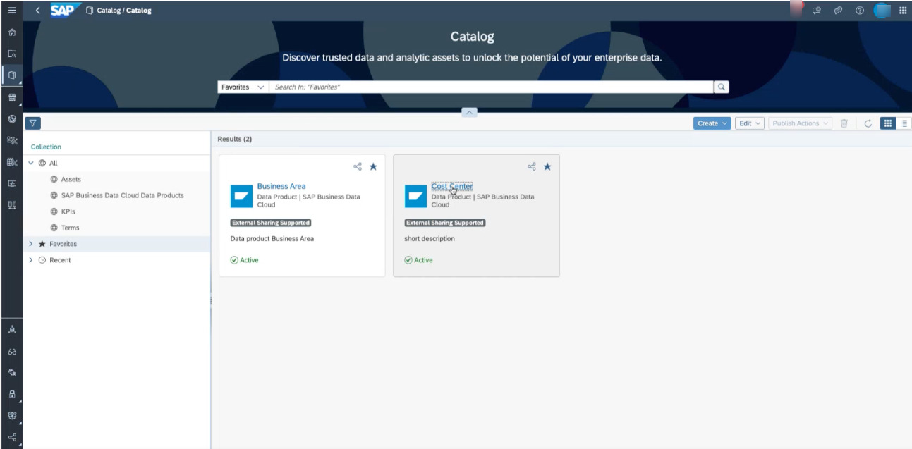
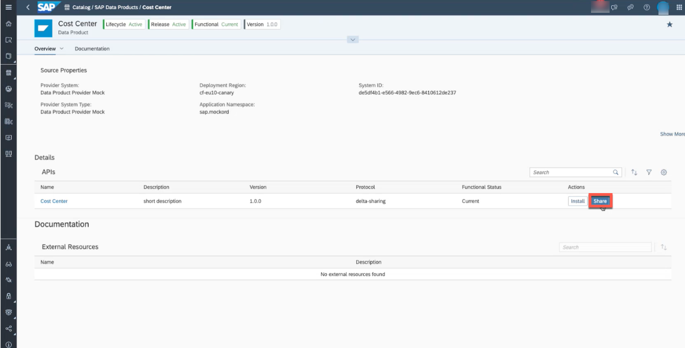
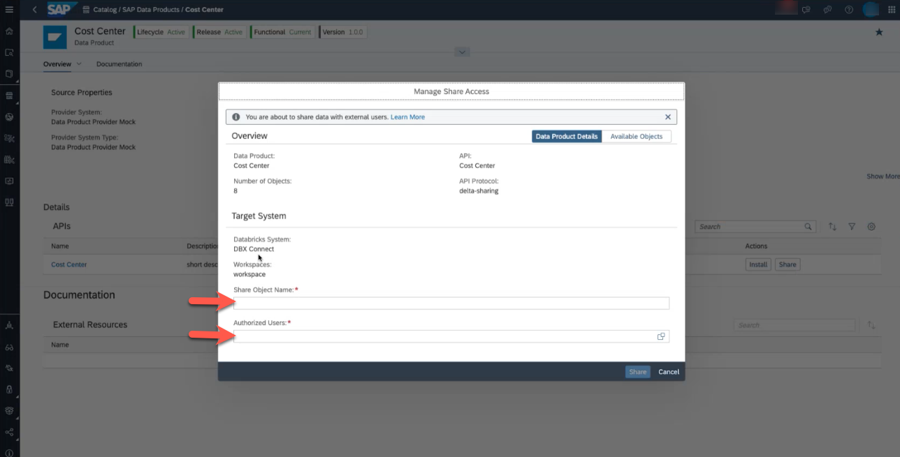

# Share Data Product with Databricks & Install Derived Data Product Shared by Databricks

> [!CAUTION]
> This chapter describes the steps how Data products in SAP Business Data Cloud are shared with 
> Databricks as well as how Data Products shared by Databricks can be consumed again in SAP BDC.  
>
> The names of the data products and screenshots need to be replaced. 
 
## Persona
Actors:

You will see their images in this exercise every time the leading persona switches. 

## Overview
* [Share Data Product with Databricks](#share-data-product-with-databricks)  
* [Install Derived Data Product Shared by Databricks](#install-derived-data-product-shared-by-databricks) (utilize Data Products in the Data Builder for modeling purposes)

## Steps

### Share Data Product with Databricks
 

> 

 

1. As a data scientist, my goal is to discover the right data which I want to use for my ML flows. I am using Databricks to access data in Business Data Cloud from withing my notebook to build, train, experiment and fine tune models.

2. In the Catalog, I can see the Data Products which are provided by the applications S/4HANA PCE and Databricks. The Data Products were either installed as part of an Insight Application or as a Data Package in the Business Data Cloud Cockpit.

3. Access a Data Product which is ***Active***. This Data Product should be made available in the Databricks environment. :wrench:

 

> 

 

4. The Databricks Admin shares this Data Product to the Databricks environment by clicking ***Share***.

5. Define a name for ***Share Object Name*** and select users in the section ***Authorized Users***. (For now, the the Databricks system cannot be selected - it is planned to enable this in the future.) To select authorized users, these users need to already exist on Databricks side.

6. This step takes care that the share is provisioned and accessible in Databricks. 

7. Now the data engineer and data scientist can continue in Databricks, click [here to jump back to the main flow of the exercise](/05-enrich-data-products-with-databricks-ml/README.md).

### Install Derived Data Product Shared by Databricks
Prerequisite: The data engineer created a share of the data set as a delta share from Databricks to SAP Business Data Cloud (as described [here](/05-enrich-data-products-with-databricks-ml/README.md)). This allows an easy integration of results of data engineering tasks executed in Databricks back into the SAP stack.

 

> 

 

1. Open the configuration page in the system app and navigate to ***Unified Customer Landscape***. Make the Databricks connection available to the enhancement space (copied before) in which the data modeler wants to enhance the Datasphere model. (Check that the DSP of the data modeler is already assigned to that space.)

 

> 

 

2. The Data Modeler accesses the catalog and opens the data product shared by Databricks.
3. He clicks ***Install***.
4. The Data Modeler selects the according space which was the result of the space copy. 
5. It is displayed which entities will be created to invoke the replication flow to land data in SAP Datasphere. 
6. Select ***Start Import and Deploy***. This process triggers the data replication from Databricks to SAP Datasphere based on Replication Flows.
7. The Data Modeler can now use this data to realize the custom-specific requirements. Continue with the next [exercise](/06-enhance-analytic-model/README.md)

You can now continue with the [next exercise](/06-enhance-analytic-model/README.md) which describes how to customize the delivered content through SAP Business Data Cloud by enhancing it with the result of the Databricks exercise. 

 
  
