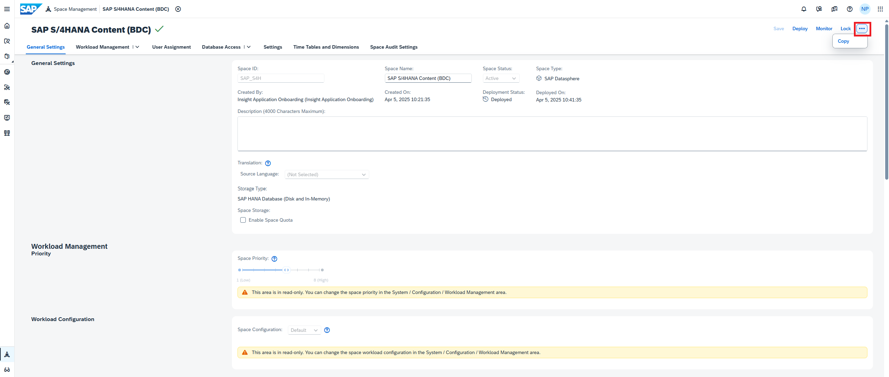
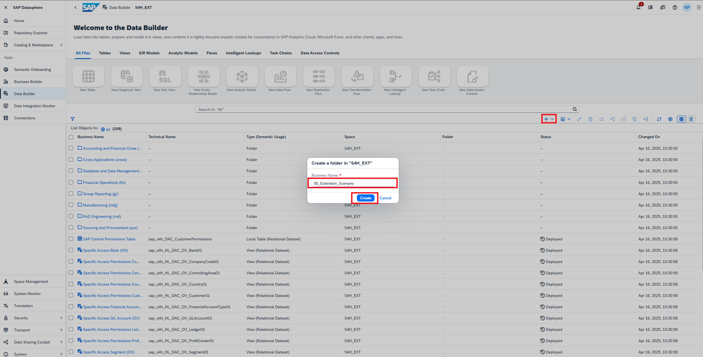
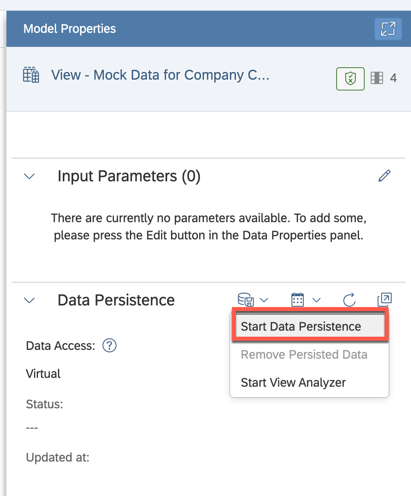
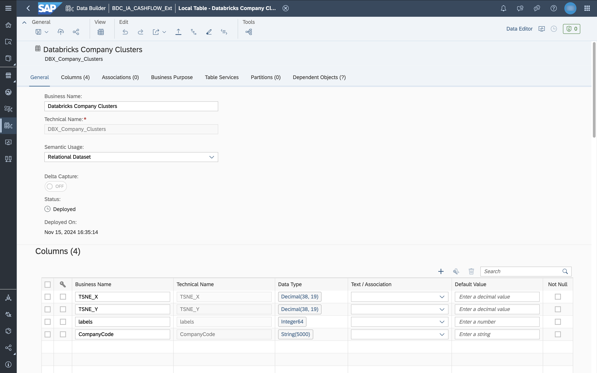

# Enhance an Analytic Model

## Persona 

Actors: <br/>


Stakeholder: <br/>


## Use Case
:warning: This exercise can be completed without Databricks as it uses sample mock data. Please note that it does not offer real ML insights into your data. This exercise will be updated once the ML functionality based on Data Product sharing is available, you can get a sneak preview [on the Databricks integration here](../05-enrich-data-products-with-databricks-ml/README.md).

When analyzing the Cash Flow, our business users want to better understand the company segmentation. The clustering algorithm is executed in Databricks and returns a cluster label for each company as well as the coordinates to visually interpret the company clusters.

We want to add the coordinates as visual representation to our report, therefore we need to add these as measures to our model.

To customize the delivered content through SAP Business Data Cloud as part of the Insight App, the space content onboarded via SAP Business Data Cloud needs to be transformed from SAP managed content into editable content using the space copy option. The Data Builder entities are originally protected by the "sap." namespace, where the namespace of the copied entities will be removed and they will become editable. In copied spaces, the "sap." will be renamed to "sap_" which indicates that it is now a customer-managed copied of the artifacts.

In this use case, you will enhance a cash flow related view with Databricks clustering data and as a result, the anayltic model will also be enhanced. The motivation for this exercise is to view the clustering results in SAP Analytics Cloud which will be done in the next exercise.

## Overview
This exercise consists of the following sections:
- [Copy SAP-Managed Space](#copy-sap-managed-space)
- [Prepare the Space for Enhancement](#prepare-the-space-for-enhancement)
- [Prepare Mock Data](#prepare-mock-data)
- [Enhance Fact View](#enhance-fact-view) 
- [Enhance Analytic Model](#enhance-analytic-model) 

## Prerequisites
* SAP Datasphere User Permissions: 
    - DW Admin Role to copy space - Persona ***BDC Admin*** 
    - DW Modeler to modify entities in the Data Builder - Persona ***Data Modeler***
	
## Disclaimer
> This is one of the methods of enhancing SAP-Managed content, though other approaches can also be used. Future releases can include new features designed to simplify enhancements further.

## Steps

> :books: If you are participating in a SAP BDC training, the space copy was already done for you (space name PA01XXXXXXX). Read the following chapter and continue with [Prepare the space for Enhancement](#prepare-the-space-for-enhancement). <br>

## Explanation
As we know from the previous chapters, the installation creates and deploys three spaces in the underlying SAP Datasphere. 
    * SAP_WCI - Analytic Modelling space: This space contains all the analytic models that form the foundation of the SAC stories.
    * SAP_S4H - Relational Modelling space: This space contains all the modelling artifacts required to build the analytic models, such as views, data access controls etc.
    * SAP_S4H_ING - Ingestion space: This space contains all the local tables and their corresponding replication flows. The data from the data products reside in these local tables.  <br/>

For this use case, we will be creating a new analytic model which will consume elements from an SAP Databricks data integration. For this purpose, we will be altering a Fact source which can be a potential basis for an Analytic Model and enhancing it with a dataset generated from SAP Databricks.

> :books: If you are participating in a SAP BDC training, SAP Databricks has not been provided as a component in the current SAP BDC setup provided to you. Hence, we will be using sample mock data.

The following is the setup envisioned for this use case:
* The space SAP_S4H (prep space or the relational modelling space) as **Consumption space** 
* A folder **00_Enhancement_Scenario** must be created in the Consumption space for all following modelling.
* Databricks dataset must be shared into this space inside the enhancement folder.
* Identify the fact source with which the Databricks dataset could be joined. In this use, we will use Cashflow related Fact view.
* In the enhancement folder, we will create a new analytic model with the above mentioned Fact view as basis.
* In the next use case, in SAP Analytics Cloud, we will add the new model and a new chart to visualize in the customer-managed insight app story.

### Copy SAP-Managed Space

> :books: If you are participating in a SAP BDC training, the space copy was already done for you (space name PA01XXXXXXX). Read the following chapter and continue with [Prepare the space for Enhancement](#prepare-the-space-for-enhancement). <br>

> 

1. Open the space created as part of the Insight App. We will be copying the prep space or the relational modelling space (named ***SAP_S4H***). If you are not sure of the space name, you can find it in the SAP Business Data Cloud Cockpit and jump directly to the space via the link.


2. Select the ***...*** button in the menu of the space in order to duplicate a space.


3. Select ***Copy***. You will need the **DW Administrator** global role to perform this action.


4. By default, the space name of the copied space is the same of the copied name. "_COPY" is appended. Objects in a copied space are not deployed automatically by default.


5. Replace "_COPY" with "_EXT". Select the option ***Deploy objects***. Also, note that the *SAP_* prefix must not be used to avoid conflicts.


6. You are navigated to the copied space. After the space is successfully deployed, you receive a notification and the status changes to ***Deployed***.


7. No user assignment to the copied space is run during the copy process. Scroll down to the section ***Users***.


8. Select user who you want to add to the space.

9. All scoped roles to which the source space (the space which was copied) was assigned to also contain the newly copied space. Select the scoped role ***BDC_Scope_Space_Admin***. In the next step, select the according users (like your own to proceed with the exercise).


> :books: If you are participating in a SAP BDC training, you have been given access to a new scoped role with only this space in the scope.

10. Log out and log in again to refresh the scoped role applied to the user.

11. Open the data builder of the copied space. You can see that all entities are deployed as you selected the according option.


12. In **System > Configuration > Business Data Products** tab, add the copied space as one of the selected spaces for installation of data products. 


> :books: If you are participating in a SAP BDC training, this step has also been performed for you already. This step is not relevant for this enhancement exercise. However, it might be needed if data products need to be installed in the space.

### Prepare the Space for Enhancement

> :books: If you are participating in a SAP BDC training, your enhancement space will have a prefix **AC_** or **PA_**
In the **Data Builder** tab, in your enhancement space **S4H_EXT** or **PXXXXXXXXXX**, create a new folder called **00_Enhancement_Scenario**. We will use this folder for all enhancements.


### Prepare Mock Data
This section is only necessary until the Databricks integration is available. Mock data will simulate the output of the Databricks clustering, it generates fake coordinates to allow a visualization later in SAC.

An SQL View is used to generate the mock data. Later, the Databricks result will be consumed as a local table populated by the Replication Flow generated as part of the Data Product Installation.

1. In the Data Builder, in your enhancement space in the folder **00_Enhancement_Scenario**, create a new SQL View. <br/>
<br/>

2. Paste the following SQL Code:

```sql
SELECT CompanyCode,
	ROUND(Rand() * 100, 2) AS TSNE_X,
	ROUND(Rand() * 100, 2) AS TSNE_Y,
	FLOOR(Rand() * 20) + 1 AS label
FROM (
		SELECT DISTINCT CompanyCode
		FROM "SAP_S4H_ING.Remote.S4H.CompanyCode:v1.CompanyCode"
	)
```
4. Validate the script and check that no issue is identified.

5. Run a data preview. <br/>


6. Set the following model properties for the view:
- ***Business Name*** View - Mock Data for Company Cluster
- ***Technical Name***: V_MockData_CompanyCluster

7. Save and deploy the view.<br/>

8. After the view is deployed, persist it once so that the records don't change: <br/>


9. Confirm that the persistency run completes by refreshing the data persistency status.<br/>


### Enhance Fact View

> 

1. :warning: To complete the exercise without Databricks, use the table or view with mock data created in the [section before](#prepare-mock-data). <br>
The local table ***Mock Data for Company Clusters*** was onboarded as part of the data product shared by Databricks. We want to add the details of the clusters like cluster label and coordinates to our Analytic Model for reporting. The coordinates ***TSNE_X*** and ***TSNE_Y*** will be visualized as a cluster in the SAP Analytics Cloud dashboard. <br/>



2. We will enhance a Fact view called `Actual Cash Flow Currency Role Currency (HL)` with technical name `sap_s4h_HL_CashActualFlowCrcyRole`. We have chosen this view due to the potential it provides with Cashflow actuals data, Company Code data and Currency data in one Fact view. Currently for the clustering algorithm, only the CompanyCode data is clustered and labelled.  The fact view can be found under: **All > Financial Operations > Harmonization Layer** <br/>


3. Enhance the above mentioned Fact view with the SAP Databricks dataset by joining the tables in the SQL view on the column ´CompanyCode´. Add the two attributes or co-ordinates 	´TSNE_X´ and ´TSNE_Y´ to the list of projected attributes as shown in the following image. Then 'Save' the view. This would ensure that the attributes appear in the projected attributes in the **Details** tab.


>[!Note]
> The next two steps describe deletion of the Data Access Controls since it is not relevant for this enhancement scenario. In this scenario, the Data Access Controls from the SAP-managed space are still being referenced in the stories in SAP Analytics Cloud. However, in the real-world scenario, the Data access controls must be updated with relevant rows secure the data. The process has been described in the step 11 [here](../02-install-insight-apps/README.md#steps).

4. In the **Details** tab, remove both the Data Access Controls (DAC) to view the data. Select the DAC by clicking anywhere on the added DAC and then select the delete button. Repeat this step for the second DAC.


5. The Data Access Control section must be now empty as shown in the following image.


6. In the **Details** tab, convert the two attributes from the SAP Databricks dataset to **Measures** by selecting the [...] button and selecting **Change to Measure**. Perform this step for both the attributes ´TSNE_X´ and ´TSNE_Y´


7. Deploy the view once both attributes have been changed to **Measures**.


### Create a new Analytic Model

> 

1. Open the Folder **00_Enhancement_Scenario** and select **New Analytic Model**.


2. From the Repository tab, navigate to the folder: **All > Financial Operations > Harmonization Layer**. Then, drag and drop the previously edited **Fact View** into the Analytic Model.


3. A popup appears with all the associations that will be created out of the box. Choose **Select** to finish adding the **Fact Source** for the Analytic Model.


4. Save and Deploy the Analytic Model under a different name like **Enhanced_AM**.

4. Preview the Analytic Model by using the attribute ´CompanyCode´ as a Row. The data is aggregated per CompanyCode. You can try out different attributes to query this model.


You have successfully enhanced the existing content to enhance it with a new dataset.

## Next Steps
You created a new Analytic Model in the copied space based on the content delivered as part of the Insight App. Now, the model is now available for the Business Analyst to be used in the report ([next exercise](../07-enhance-insight-apps/README.md)). 

This exercise focused on Company Clusters using mock data, you could redo the exercise in the future with the Data Product shared by Databricks. 

Fow now, continue with the ([next exercise](../07-enhance-insight-apps/README.md)) to customize and enhance the dashboard.
