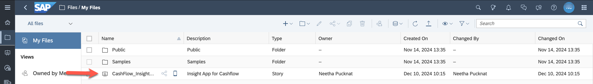
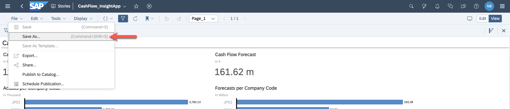
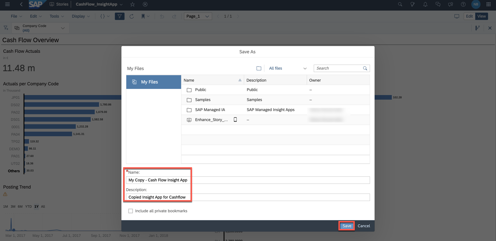

# Prerequisite: Save a Copy of the Insight App

The trainer of the workshop has copied the lean Insight App and shared the story with you (view access). This allows you to save the story with a new name and to customize it on your own.

1. In SAP Analytics Cloud, open the **Files** application.

2. In **Files**, you see the view **My Files**.

3. Open the story **CashFlow_InsightApp**.
 

4. Select **File** -> **Save as**.
 

5. Save the file in your private folder.
 

6. Continue with modifying the copied story as described in the [chapter **Modify and Enhance Copied Story** of the main use case description](./README.md#modify-and-enhance-copied-story).

