# Customize SAP Analytics Cloud Story of an Intelligent Application

## Persona 

Actor:
  

Stakeholder:  

## Use Case
Intelligent Applications are SAP-managed. This means that any enhancements that need to performed have to performed on the copies of the content. You can duplicate the SAP managed asset to create and modify own assets. From then on, we refer to such assets as customer-managed assets.

## Overview
This exercise is separated into three sections:
- [Story Copy](#story-copy)
- [Modify and Enhance Copied Story](#modify-and-enhance-copied-story) (Prerequisites to share Data Products with Databricks or to install them in Datasphere.)

## Prerequisites
- SAP Analytics Cloud User Permissions: 
    - BI Admin role or another Admin role is required to view the tab **Intelligent Applications** under the **Files**. Hence, one of the admin roles is required to view and copy the Intelligent Application.

## Steps

### Story Copy
1. Open the SAP Analytics Cloud tenant.

2. Navigate to ***Files*** -> ***Intelligent Applications*** inside of the SAP Analytics Cloud file repository.

3. Select the folder ***SAP Managed IA*** and click the ***copy*** button.

4. Navigate to the ***Public*** folder. Create a new folder **Copy Intelligent Application - YOURUSERID**.

5. Add "Copy" to the name and description, select ***Copy*** afterwards.

### Modify and Enhance Copied Story

1. Open the copied story in edit mode.
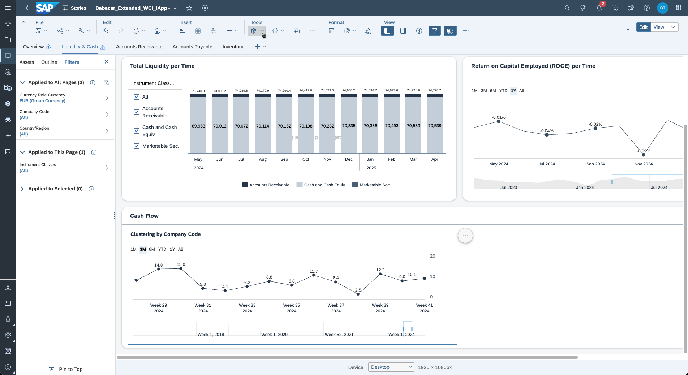

2. Select the ***Liquidity & Cash*** tab and duplicate the ***Cash Flow*** dashboard
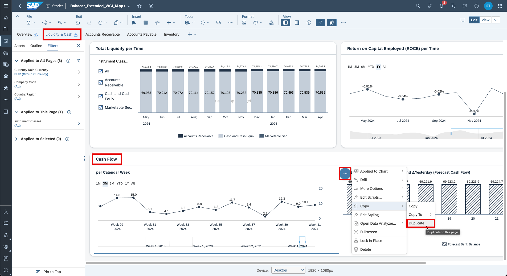

3. Rename it to ***Cash Flow Clustering by Company Code***
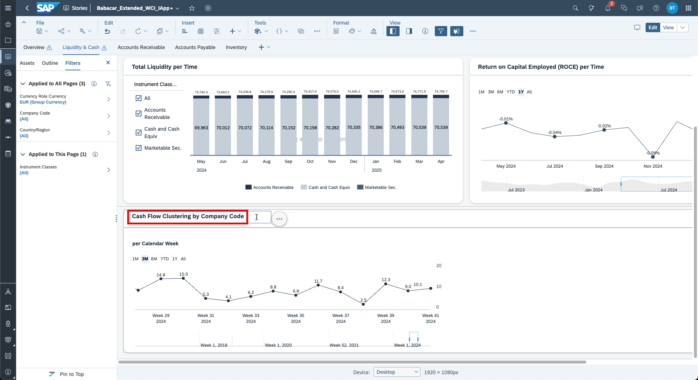

4. Click ***Tools*** -> ***Add new data***, 

5. Click on ***Data from an existing dataset or model***
 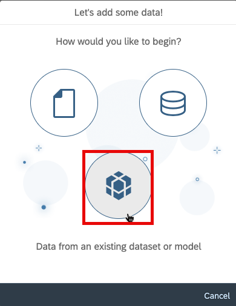 

6. Click on ***Select other Model***
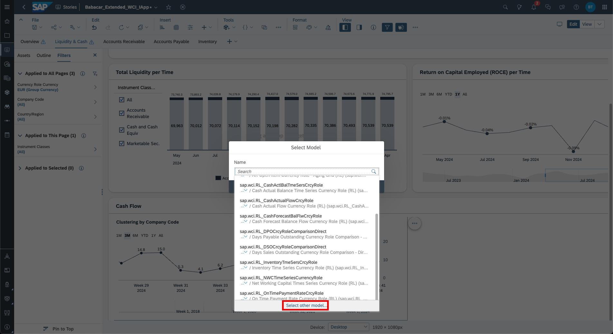

7. Navigate to the folder where you saved your enhanced analytic model and select it
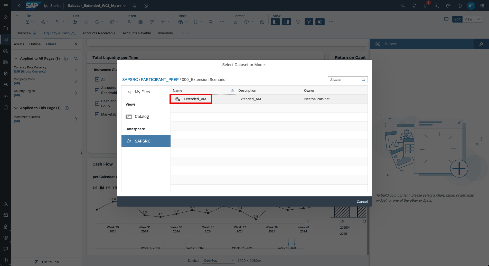

8. A warning is displayed that replacing a model will impact story settings, click ***OK***.
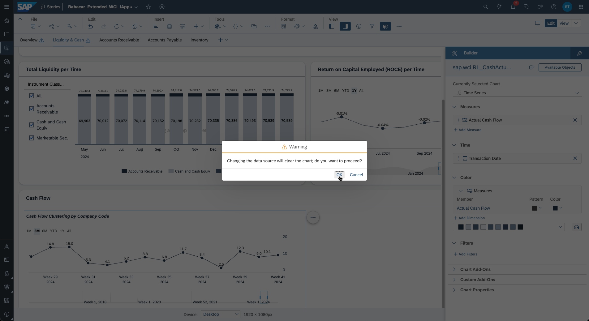

9. Select the ***Clustering Cash Flow by Company Code*** dashboard and replace the existing model by the enhanced one you imported in the steps above.
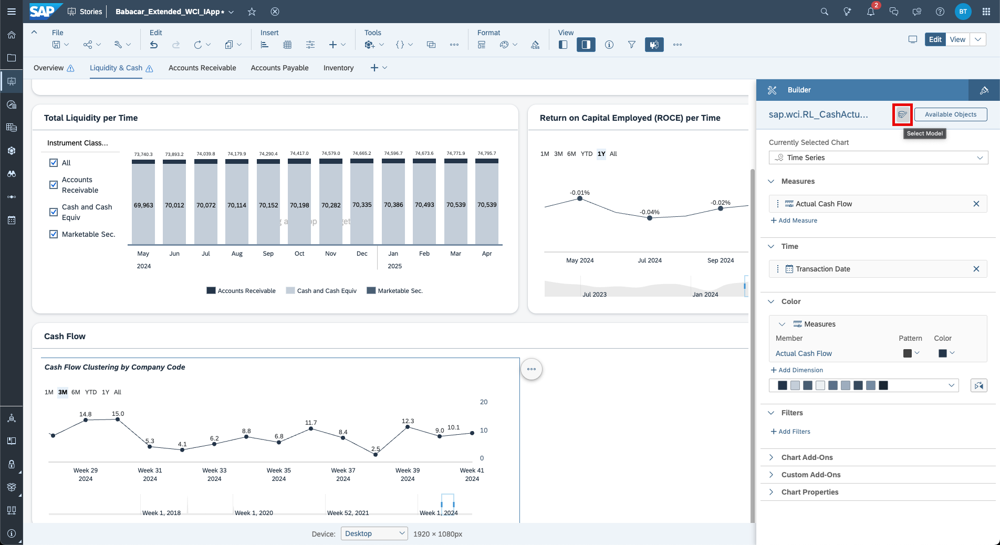

10. Select from the list your previously added model ***Enhanced_AM***.
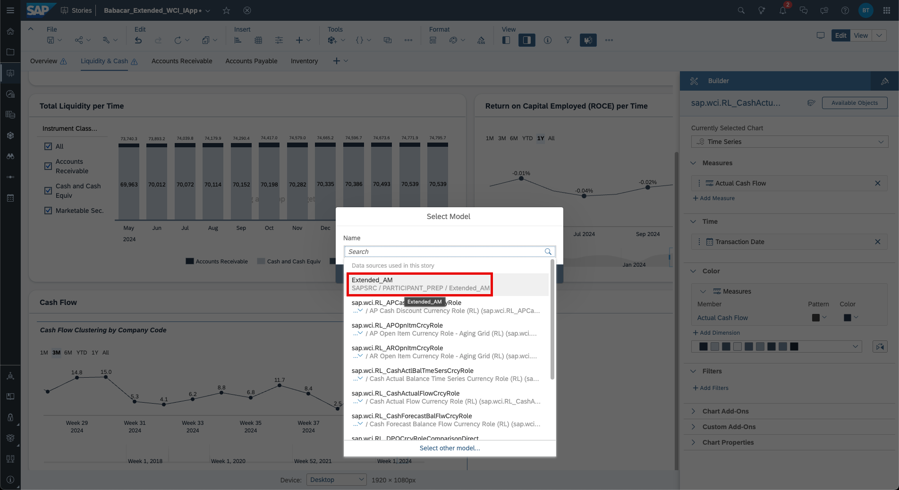

11. Insert a new chart.
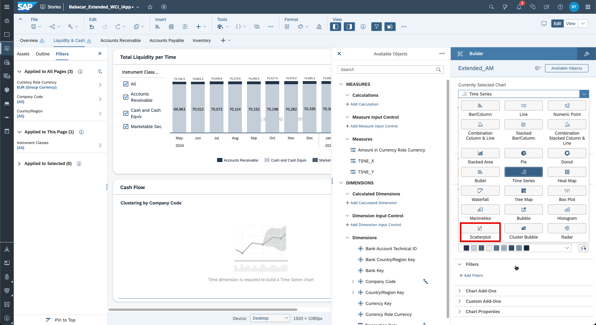

12. Configure the scatterplot by selecting measures and dimensions as displayed in the screenshot below.
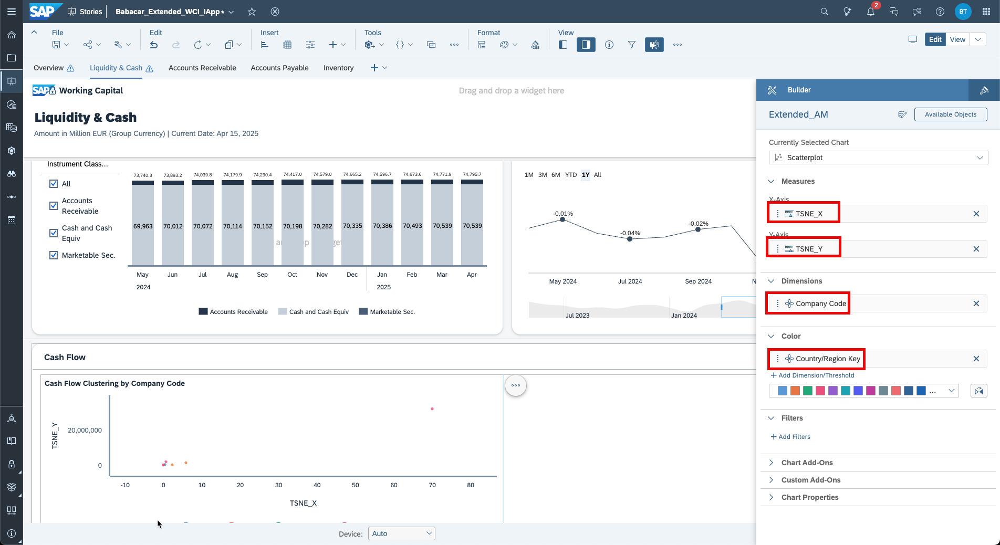

13. Save the story.

14. Open the preview for the story.
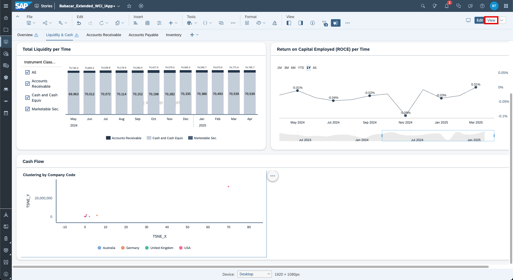

15. Filter for a dedicated company code.
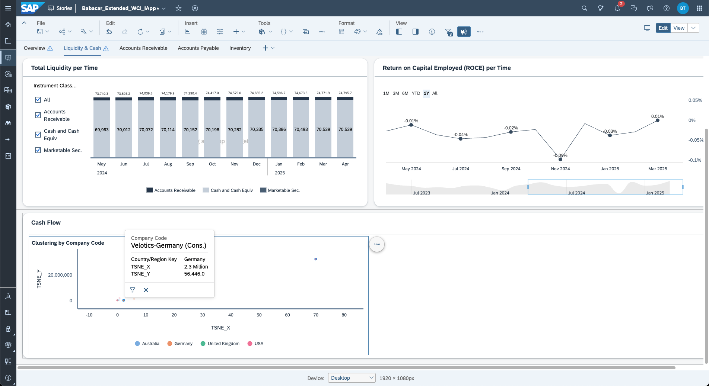

You have successfully copied the story and re-pointed to the Analytic Model within the copied space.

## Next Steps

Continue with the [use case about native data integration capabilities](../09-native-data-integration/README.md).
