# Native Data Integration 

## Persona 
Actor:

 
 

## Motivation
SAP Datasphere offers extensive default connections to access data from different sources, independent of the deployment (on-premise or cloud) or its origin (SAP or non-SAP). This exercise guides customers on how to integrate data into the Business Data Cloud that isn't readily available as a data product, part of an Insight App or resides in a third party solution.

You can use a wide range of data from both SAP and non-SAP sources to build your analytic use case through the help of native integration and built-in connectors. This allows you to easily integrate and consolidate data, making the most of your data to ensure that business insights are reliably conveyed. You can find the list of [supported connection types here](https://help.sap.com/docs/SAP_DATASPHERE/9f804b8efa8043539289f42f372c4862/bffbd58c15784a62af0520f171018ded.html).

Use the native integration capabilities in the following scenarios:
1. Standard CDS Views: which are not available as a data product.
2. Custom CDS Views: Customers often have custom CDS views tailored to their specific needs. These views are not available as data products, but customers may still want to integrate these data into Business Data Cloud.
3. Connect to SAP sources, using the available data integration capabilities: allows you to easily access and integrate data from different SAP systems for more business insights and efficiency.
4. Third-party: Integrate data from non-SAP sources with the business-critical data from SAP sources,in a familiar modelling environment.

## Overview
This exercise is separated into four steps:
- [Integrate S/4HANA CDS view for analysis in SAP BDC](#integrate-s4hana-cds-view-for-analysis-in-sap-bdcdatasphere)
- [Create Replication Flow](#create-replication-flow)
- [Run and Monitor Replication Flow](#run-and-monitor-replication-flow)
- [Data Preview in the Analytic Model](#data-preview-in-the-analytic-model)

## Prerequisites
* An established connection of type S/4HANA On Premise to a S/4HANA PCE system in the current space.

> [!NOTE]
> In general: There are some prerequisites for the usage of replications flows, for example, the CDS View needs to have the "dataExtraction" annotation set to ***true***. To replicate the CDS View in a delta mode, the annotations "dataExtraction" and "changeDataCapture" are required. More information is available in Note [3223810](http://help.sap.com/disclaimer?site=https://me.sap.com/notes/3223810) and Note [2890171](http://help.sap.com/disclaimer?site=https://me.sap.com/notes/2890171) (focus on ABAP Integration).

* You have an application user in Datasphere who is assigned to a space and has the necessary roles to create a replication flow (DW Modeler).

## Use case

A manufacturing company aims to optimize its procurement process by tracking and analyzing purchase orders (POs) in real-time. This provides the procurement team with comprehensive insights into PO details, ensuring the timely delivery of raw materials, efficient financial management, and improved supplier relationships.

This data is available in SAP S/4HANA. Using the integration capabilities of SAP Datasphere, we bring in the data and analyze it to derive the maximum business value. We will learn how using SAP Datasphere allows users to easily customize and extend the data model.

## Steps

### Integrate S/4HANA CDS view for analysis in SAP BDC(Datasphere)

 

> 

 

Once we have decided on the use case and the CDS view that we want to import, we shouldmust check the SAP Datasphere catalog to see if there is any data product available that fits our use case. If not, we will need to use the following steps to get data from the S/4HANA CDS view using the replication flow capabilities.

 1. Check the Datasphere Catalog for available, active, or inactive Data Products. If there is no Data Product available for your use case coming from SAP S/4HANA, then use the native integration capabilities of Datasphere through BDC.

2. There are different ways to access data from S/4HANA PCE, such as using a replication flow for replicated access or federated access through remote tables. New federation capabilities for CDS views of S/4HANA PCE are planned for Q1 2025 [(roadmap item)](https://roadmaps.sap.com/board?PRODUCT=73555000100800002141&range=CURRENT-LAST&q=abap%20sql#Q4%202024;INNO=E34CAB7714E51EDF9AEAEE1B3AE4C857). To apply the semantics of CDS views, you can use the *Import Entities* capability (part of *Semantic Onboarding*).  **This exercise focuses on data integration based on replication flows.**

3. Identify the CDS view that you want to import and check the prerequisites. 
> [!NOTE]
> Before using any CDS view from S/4HANA for replication in Datasphere you must ascertain that data replication prerequisites are installed in the S/4HANA system. Refer to the following SAP Note : [SAP ABAP Integration Central note](https://launchpad.support.sap.com/#/notes/2890171).

### Create Replication Flow

 

> 

 

In this scenario, we use S/4HANA PCE as a source. The design of a replication flow is tailored to each customer, including decisions on which CDS views to include in a single replication flow, and whether to replicate data using only delta or the full upload option.

>[!Note]
>Before using any CDS view from S/4HANA for replication in Datasphere you must ascertain that data replication prerequisites are installed in the S/4HANA system. Refer to the following SAP Note : [SAP ABAP Integration Central note](https://launchpad.support.sap.com/#/notes/2890171).

In this part of the exercise, the replication flow extracts transactional data from the CDS view `C_PURCHASEORDERDEX` to the local table.

1. In the Data Builder, choose ***New Replication Flow*** to launch the creation of a new replication flow.

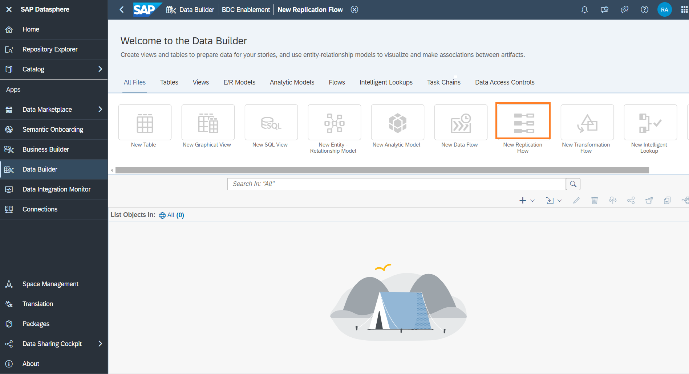

2. Choose ***source connection***.

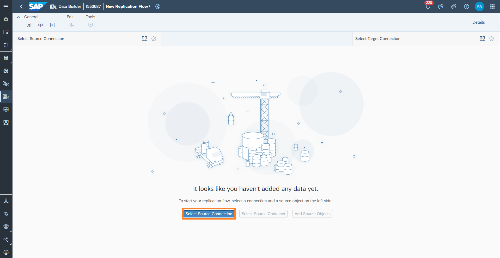

3. Select the S/4HANA PCE system as a source connection. In this example the connection to the S/4HANA PCE system in the space is called ***SSAP_S4HANA***. It may differ in your example.

> :books: If you are participating in a SAP BDC training, use the connection called `S4H_PUBLIC (SAPS4HANACLOUD)`.

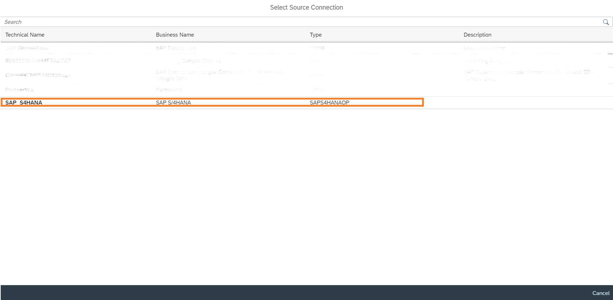

4. Select the container ***/CDS_EXTRACTION***

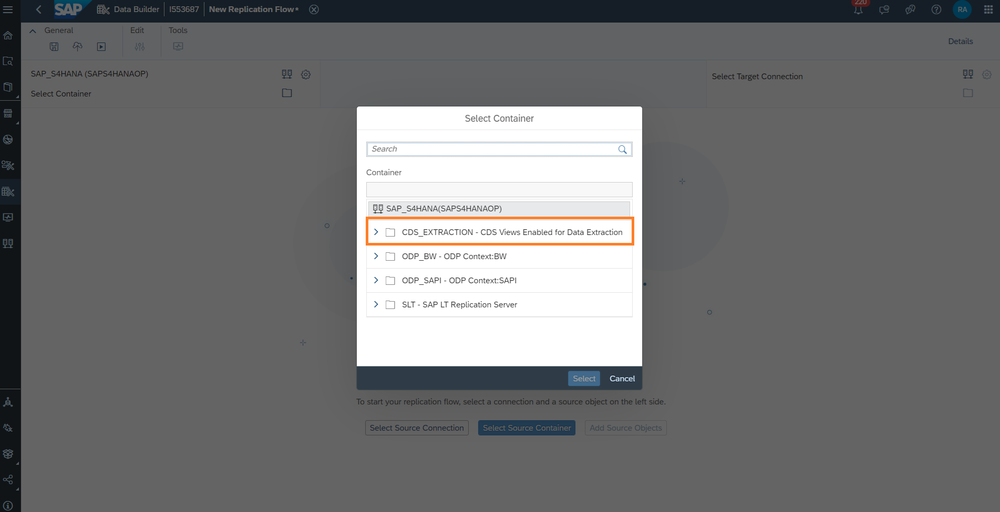

5. Select the object `C_PURCHASEORDERDEX`. Choose ***Next***. In the next screen select ***Add Selection***. This starts fetching the source object details from the source.

6. The selected CDS View is now added to the replication flow. Set ***Load Type*** to ***Initial and Delta*** and the ***Delta Load Interval*** to ***24 hours***.

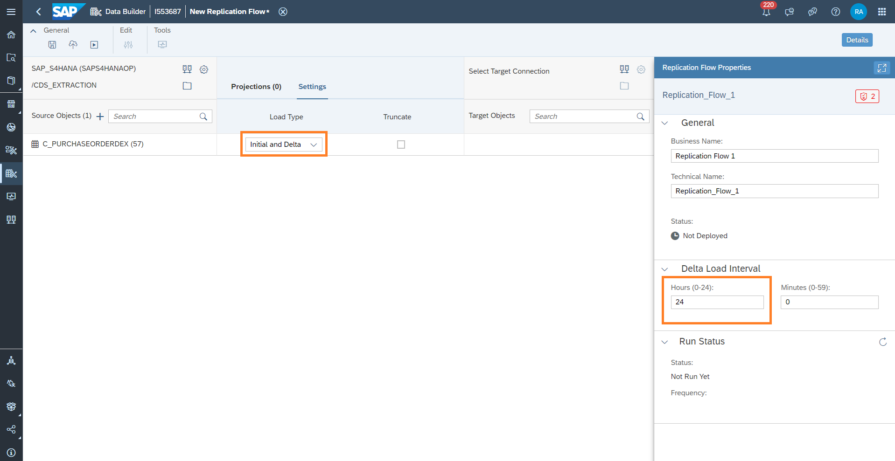

7. Choose ***Select Target Connection***. In the following popup window, select SAP Datasphere as target connection.

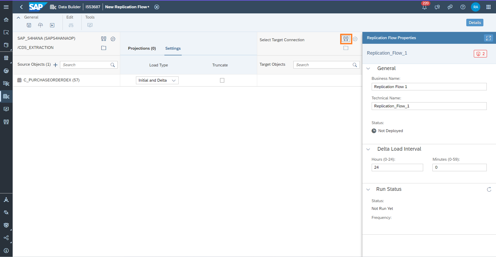

8. The target connection details are now updated in your replication flow. The target container is automatically updated with the space in which you created the replication flow. It shows the new target local tables that will be automatically created in SAP Datasphere.

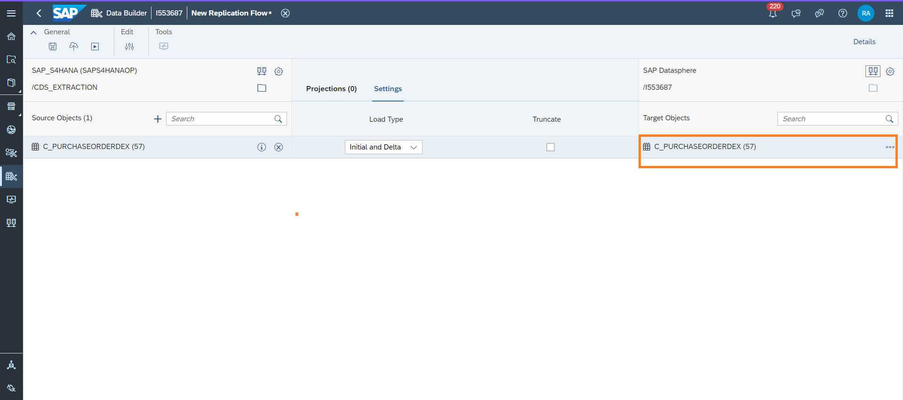

9. Set the Delta Load Interval to ***24 hours***. Name the replication flow `IL_RF_S4_Purchase Order `and save and deploy it.

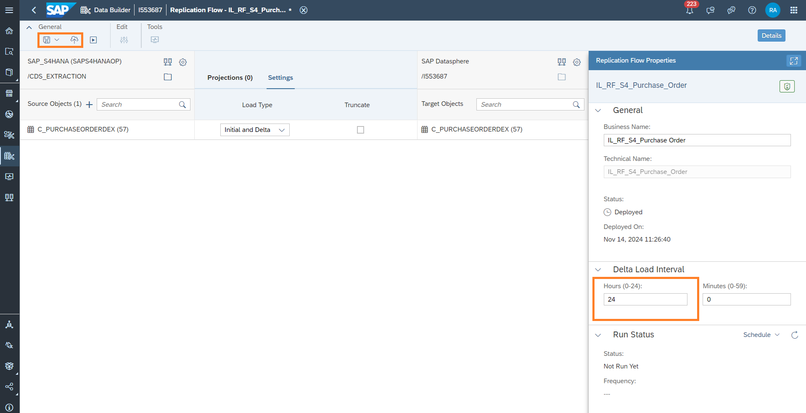

### Run and Monitor replication flow

 

> 

 

1. Run the replication flow `IL_RF_S4_Purchase Order` and choose the monitoring icon.

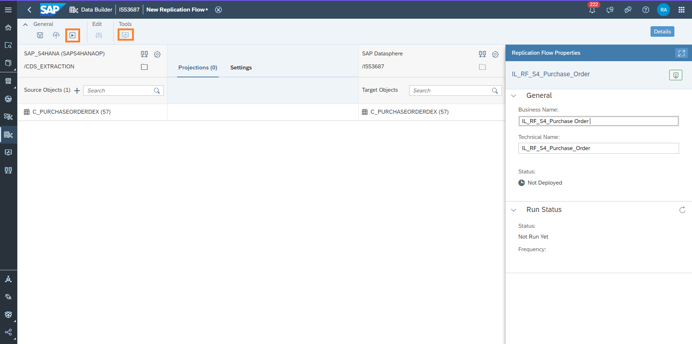

2. Here, you can see the execution details of your flow. In the left panel the runs of the flow are displayed and their corresponding messages are in the right panel. Select the flow in the left panel to view its details. The run details contain messages for all runs and metrics for the current run. For successful runs, the metrics provide the record count for source and target tables used in the flow. In the screenshot, the initial run already finished for `C_PURCHASEORDERDEX`. If the status switches to ***Retrying***, the initial load has finished. In the section ***Object Log***, you can read when the replication run will restart the next time. This delta load interval was configured by you in the replication flow before.

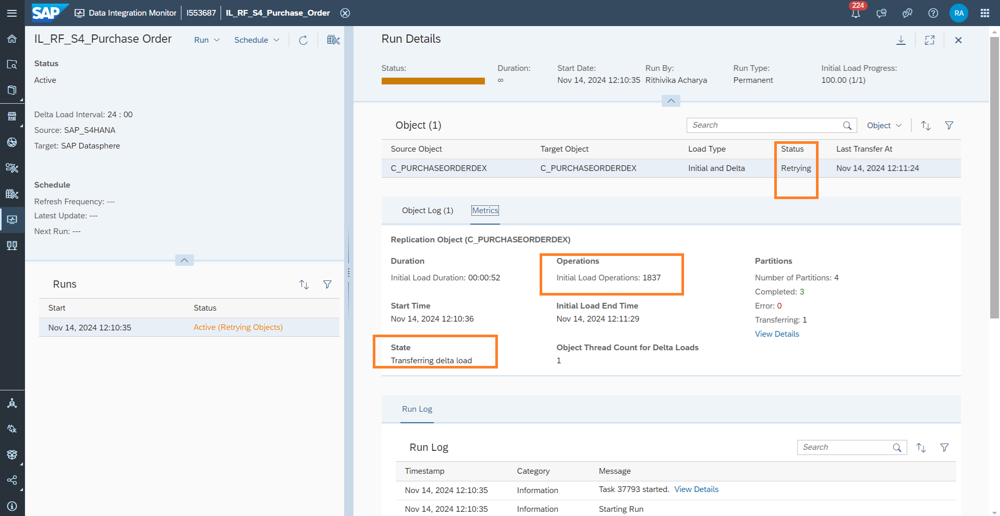

### Data Preview in the Analytic Model

 

> 

 

1. Open the Local table `Data extraction for purchase order (C_PURCHASEORDERDEX)` and change the semantic type of the table to ***Fact***. This indicates that your entity contains numerical measures that can be analysed.

2. After maintaining the semantic type of the table in the first step, specify the semantic types for the measures and attributes now. Semantic types include values, quantities, dates, and geo and textual information. Scroll to the attributes section and select the appropriate Semantic Type for ***CURRENCY***.

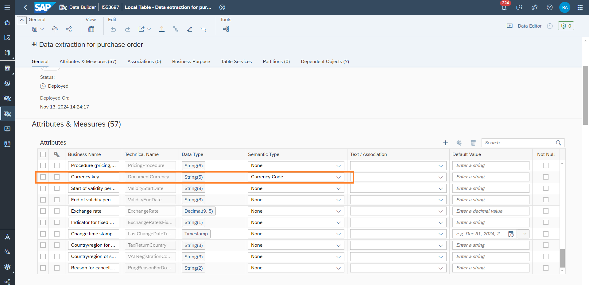

3. Drag the measures ***Down payment amount in document currency*** and ***Total value at time of release*** from the Attributes section to the Measures section. Next, assign Semantic Type and Unit Column as displayed in the screenshot.

4. Open the Data Builder and select ***New Analytic Model***.

5. In the editor, you can add any Fact Model as a fact source. Select your previously replicated Fact table, `Data extraction for purchase order (C_PURCHASEORDERDEX)`, and drag it to the editor. Select all attributes and measures proposed to be added to the Analytic Model. Save and deploy the model.

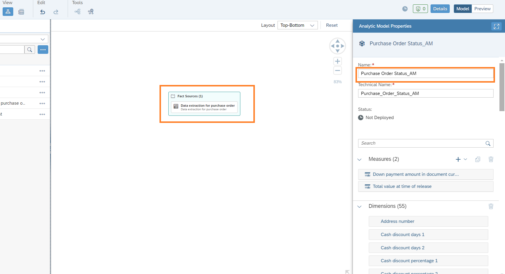

6. Select the dimension ***Purchasing organization*** and the measure ***Total value at time of release***.

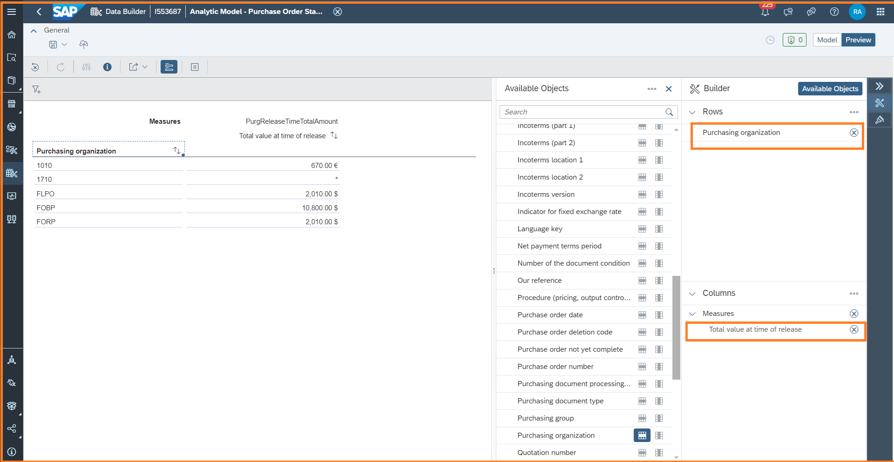

## Optional Enhancement

This was a simple use case showing the basic integration and modelling capabilities. This use case can be extended to bring in data from other CDS views to extend the business use case or even integrate any relevant data from other systems. The results can be used for reporting, using the visualization capabilities of SAP Analytics Cloud.

## Next Steps
You can now continue with the reading material that has been provided for [BW-Modernization](/10-bw-modernization/README.md).

