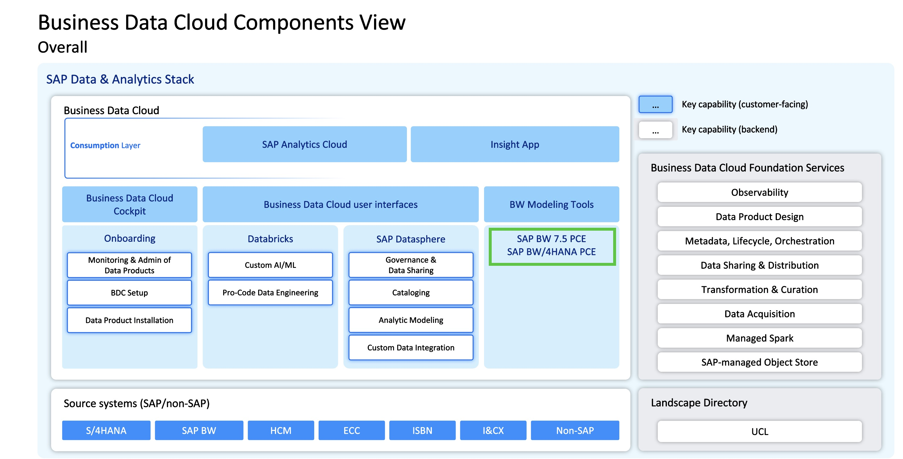
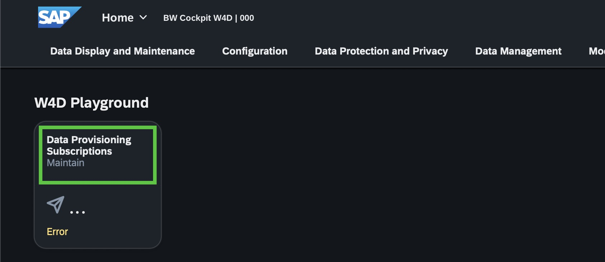
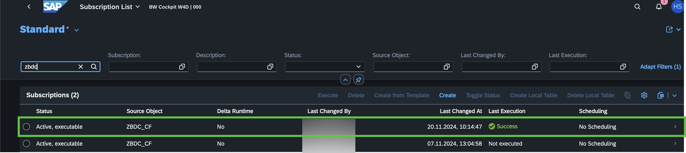
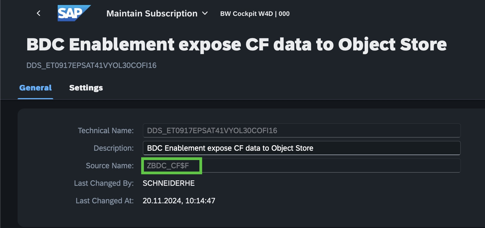
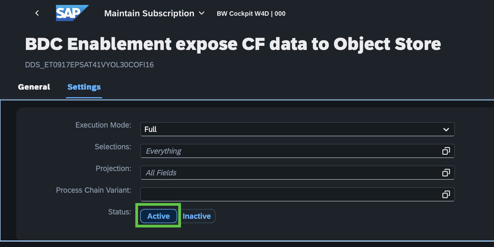

# BW Modernization

Due to the large number of customers relying on SAP NetWeaver BW 7.5 systems and SAP BW/4HANA, integration with SAP Datasphere was and still is key also under the new SAP Business Data Cloud (SAP BDC) product.

However, in the Beta phase of SAP BDC there are differences on how to integrate an SAP BW system into SAP BDC other than once the full integration and integration is delivered at a later point in time with the integration to the foundation Service of SAP BDC.

## Personas

Stakeholders:

Actors:

## As-Is situation (Beta phase)

During the Beta phase of SAP BDC you would like to integrate some data from SAP Netweaver BW 7.5 or SAP BW/4HANA in your scenario while being aware that the integration of SAP BW with SAP BDC via the SAP BDC Foundation is not available at this stage.

The chapter does not contain step-by-step instructions on how to build integration of SAP Datasphere and SAP BW 7.5/SAP BW/4HANA systems for possible testing in a dedicated Beta scenario.

In general, the following integration options are available to integrate SAP BW data and metadata: 
- Local Tables via Replication Flow or Data Flow using the Cloud Connector
- Remote Tables (optional: snapshot) using DP Agent
- Remote Tables incl. semantics and dependencies (optional: snapshot) via BW/4 Model Transfer using DP Agent and Cloud Connector for SAP BW/4HANA
- Remote Tables incl. semantics and dependencies via BW Bridge using Cloud Connector for SAP BW 7.5

During the Beta phase: If it comes to integrating data from an SAP BW 7.5/SAP BW/4HANA system, the preferred way would be to leverage the Replication Flow with the SAP BW system as a source and transfer the data to SAP Datasphere, since the Cloud Conenctor is the only component required and the installation and maintenance of the DP Agent is more complex.

## To-Be situation (Outlook post Beta)

Once the full integration with SAP BDC Foundations Service is available, existing InfoProviders residing in the SAP BW 7.5/SAP BW/4HANA system can be exposed to the delta share of SAP BDC, specifically the object store of SAP Datasphere, with a dedicated functionality in the SAP BW/4HANA Administration Cockpit:

Activities in the Data Provisioning Cockpit: 
- Establish a subscription in SAP BW Administration Cockpit, select the InfoProvider which needs to be exposed to the object store and activate subscription:

- Regular transfers to the delta share can be scheduled from the subscription using a BW Process Chain. With every execution of the BW Process Chain the data is pushed into the SAP Datasphere object store.

BW Data Products will be availabe in the catalog of SAP Datasphere for further usage in analytical use cases. 

## SAP BW PCE in SAP Business Data Cloud – Timeline (subject to change)
<table><thead>
  <tr>
    <th>GA</th>
    <th>Q1/2025</th>
    <th>Q2/2025</th>
    <th>Q3&amp;Q4/2025</th>
  </tr></thead>
<tbody>
  <tr>
    <td>
    <ul> 
      <li>Manual Provisioning of SAP BW[4] PCE in BDC (manual capture of the landscape details, and white-glove sales support). </li>
      </ul>    
    </td>
    <td>
        <ul>
  <li>Increasing the automation and scalability of the provisioning process in alignment with Rise Teams </li>
          <li> Data provisioning Cockpit to push SAP BW data into embedded Object Store of SAP Datasphere </li>
          <li> Manual Data Product Creation for sharing Data Products (Delta Share) with Databricks </li>
          <li> Manual integration into UCL in BDC </li>
           <li> Technical integration of existing PCE, PTO & HEC Customers</li>
</ul>
    </td>
    <td>
          <ul>
  <li>Increasing the automation and scalability of the provisioning process in alignment with Rise Teams </li>
          <li>Additional InfoProvider metadata exposure in Data Product – aggregations, associations, ...</li>
          <li> Mass operation for Data provisioning Cockpit (selection of multiple InfoProvider in one step) </li>
          <li> Optimized Workflow to push SAP BW data based on BDC personas </li>
           <li> Out of the Box UCL integration in BDC</li>
      </ul>
    </td>
    <td>
             <ul>
  <li>Cross monitoring and orchestration (BW<->BDC)</li>
          <li>Performance optimizations in data flow (file type, parallelization, ..)</li>
          <li>Workflow to request data products from SAP BW PCE from BDC Cockpit </li>
          <li> Pushing of Authorizations</li>
      </ul>    
    </td>
  </tr>
</tbody>
</table>

## Next Steps
You can now continue with the reading material that is provided about [accessing Data products from customized S/4HANA CDS views](../13-customized-cdsviews-s4hana/README.md).
