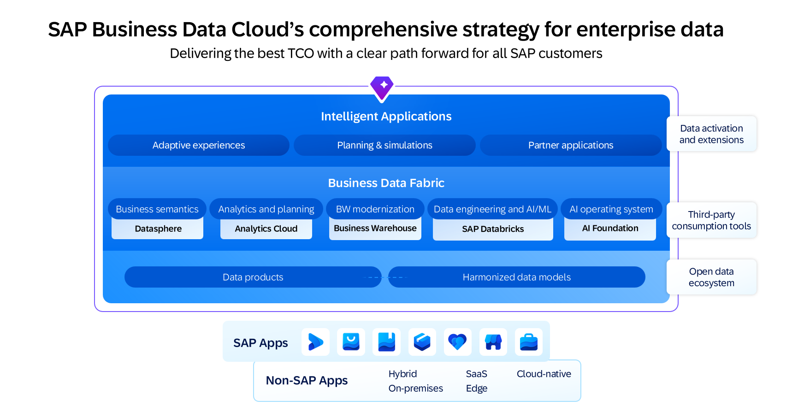
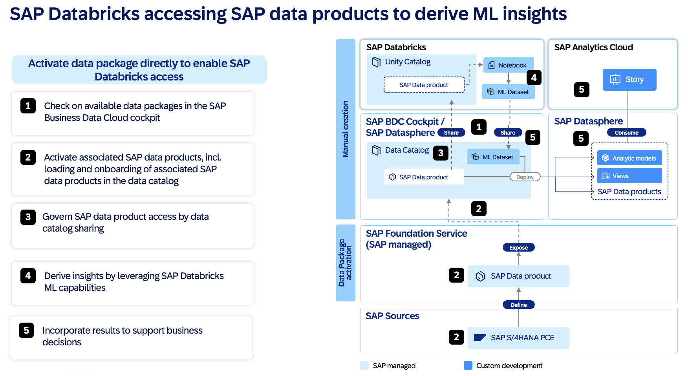

SAP Databricks is a special edition of Databricks available as an application in SAP Business Data Cloud. SAP Databricks provides Databricks' advanced AI and analytical capabilities, in an environment that is fully intergrated with your SAP landscape.

## Key Benefits

-   Using pre-configured Delta Sharing, access any data product in SAP Business Data Cloud from your SAP Databricks workspace without having to replicate them, eliminating the risk of data inconsistency.
-   Use SAP Databricks to combine your SAP data with your external data, perform analysis, and publish data products from SAP back into SAP Business Data Cloud.
-   Instantly provision SAP Databricks from SAP for Me with automatically integrated single sign-on and security, and manage your SAP Databricks account.
-   SAP Databricks is a serverless offering, and compute and storage are fully managed. No additional cloud resources are needed.
  
## Key Use Cases

-   Automated forecasting: Build time-series forecasts with the best algorithms and hyperparameters automatically selected.
-   Fine-tuning an LLM: Customize foundation models using your own data to optimize performance for your specific applications.
-   Exploratory data analysis: Use notebooks to collaborate in a multi-language work surface, allowing your to perform data science, visualizations, feature engineering, and ML model development.
-   Business Intelligence: Use the SQL editor to run optimized queries and create visualizations for BI reporting.

In the next **SAP Databricks** lessons we will:

- Review Data Product shared to **SAP Databricks** from **SAP Business Data Cloud**</li>
- Review enhanced / already populated catalog object (table) in **SAP Databricks**</li>
- Review the notebook used to populate this new table</li>
- Add the new table into Delta Share
- Use **SAP Business Data Cloud SDK** in a notebook to share this table back to **SAP Datasphere**
- Verify the new data product in **SAP Datasphere**</li>

