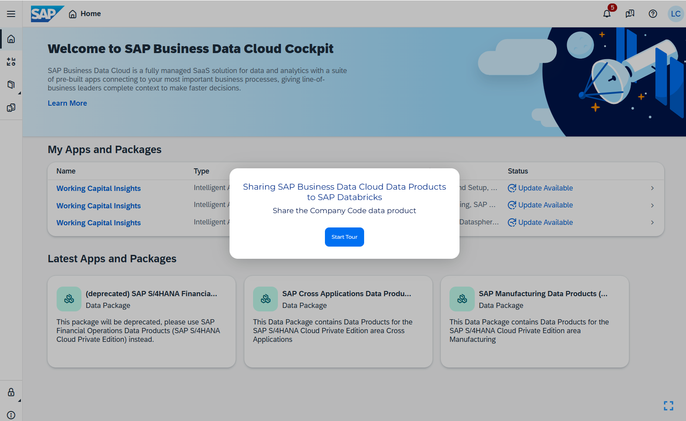

## Contents

  - Persona
  - Prerequisites
  - Share Data Products
 

## Persona 

>**Note**: The Data Catalog Administrator role is not assigned to your user. The instructions in this lesson is for read-only.

Documentation on sharing SAP Business Data Cloud data products to SAP Databricks can be found [here](https://help.sap.com/docs/business-data-cloud/sap-databricks/creating-delta-sharing-catalog-from-data-product-in-sap-databricks).

An SAP data product is a refined data set based on data ingested from an SAP solution. SAP data products are created, delivered and managed by SAP and are the foundation for the SAP Business Data Cloud Intelligent Applications.

Installing the Intelligent Application also installs all the underlying data products. In the SAP Business Data Cloud Catalog, you can find all the data products that are available.

To make data products available for consumption in SAP Databricks, you can share data products from the SAP Business Data Cloud catalog to SAP Databricks.

In this lesson you will share the Company Code data product to SAP Databricks, which will be used in the following lessons to generate clustering company data based on common patterns and attributes.

## Prerequisites
- The SAP Databricks tenant has been provisioned in the SAP for Me.
  
- You have completed the configuration of the SAP Business Data Cloud cockpit, and completed the installation of the Working Capital Insights Intelligent Application.

- You are logged on to SAP Business Data Cloud.

<!-- ["","",""] -->

## Share Data Products
   
1. Access the guided tour and follow the steps to share SAP Business Data Cloud data products to SAP Databricks.
   
   Start the tour [here](https://tour-viewer.platform.saleo.io/d12091f4-9842-4db1-8203-91ae4f657e38).
   
    

<!-- ["","",""] -->

**Congratulations!** You have explored the steps to share SAP Business Data Cloud data products to SAP Databricks.
