## Contents
  - Persona
  - Install Data Product

## Persona 

In this lesson we will install a data product in **SAP Datasphere** shared from **SAP Databricks**. In the previous exercise you published your own data product from SAP Databricks. 

We will be using a previously published data product because of 2 reasons:
-   You can continue with rest of the lessons, even if you did not complete the previous Databricks lesson
-   It reduces the number of duplicate data products within the SAP-Managed space in SAP Datasphere

<!-- ["","",""] -->

## Install Data Product

Log On to SAP Datasphere if not already.

1. Open a Chrome browser or Microsoft Edge browser and enter the **SAP Datasphere** URL.
   
   Alternatively, click <a href="{link|dwc}" target="_blank">here</a>.
   
    <!-- Access **SAP Datasphere** using the link in **SAP Business Data Cloud** under **System Landscape** in the **Basic Trial BDC** formation. 
    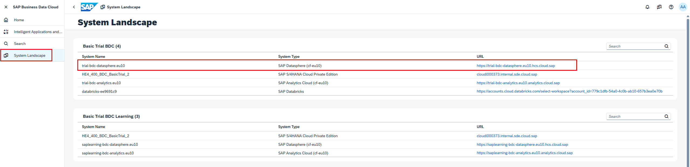-->

2. Login with your user credentials. 
   
   Username: **{placeholder|userid}**

    Password: **enter provided password**

   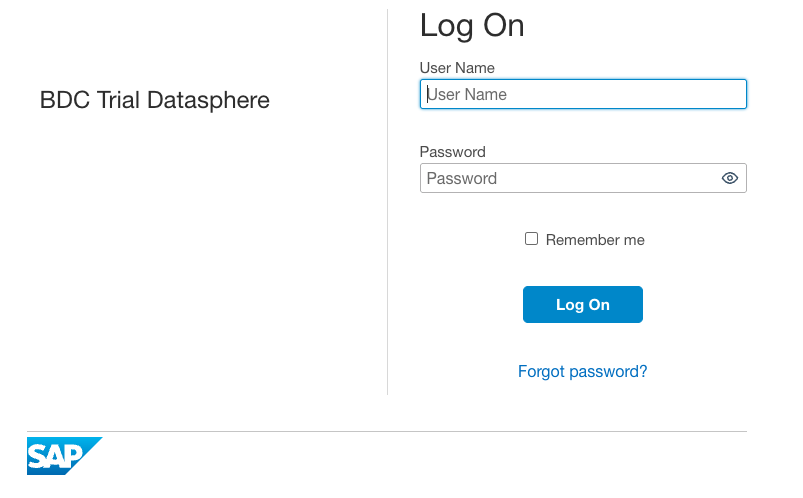

<!-- ["","",""] -->

Search for the Data Product to install.

3. Select **Catalog & Marketplace** from the **side navigation area**, then **Search**.
   
   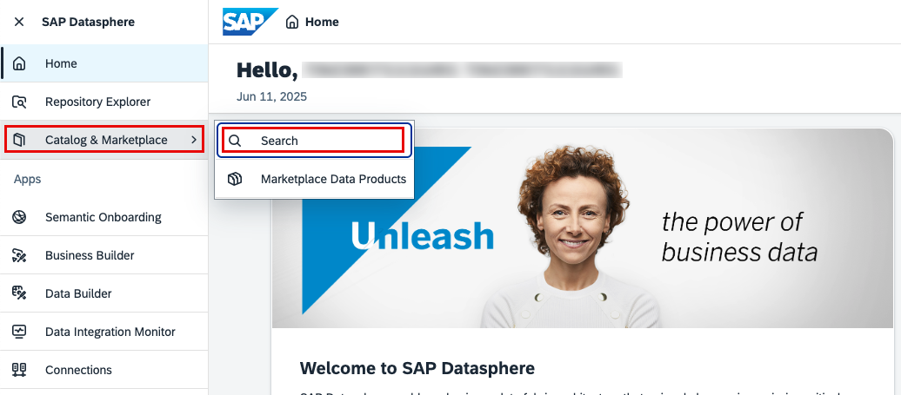

4. Select the **Filter** icon and filter on **All->Data Products** and **databricks-ee9691c9** System Instance Name.
   
    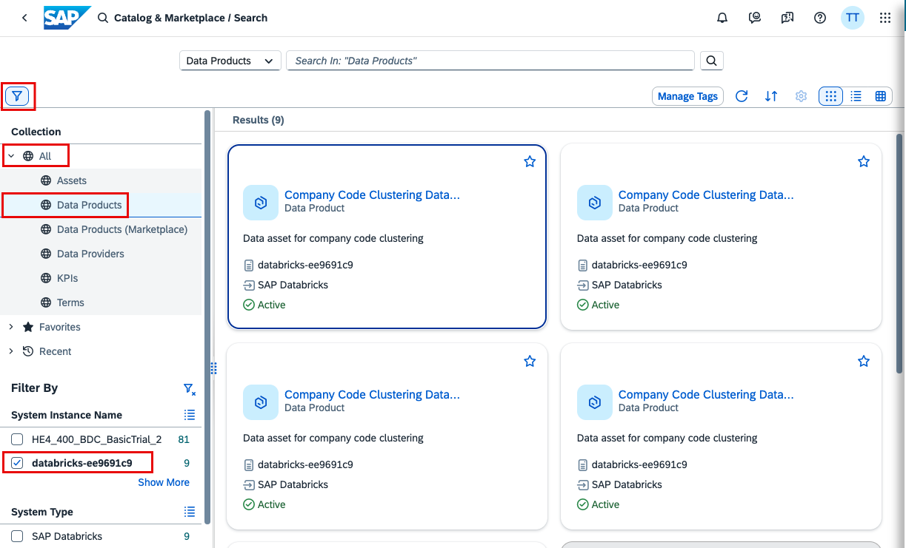

5. In the search bar type **cluster** and select the **Company Code Clustering Data Product** `without` a username in the title.
   
    > **Note:** When publishing a data product from SAP Databricks to SAP Datasphere for the first time, there might be a latency for the initial flow of data because the procedures run in predefined intervals. That's another reason why we are installing a previously published & used data product so we can continue the exercise without waiting.

    <!--- 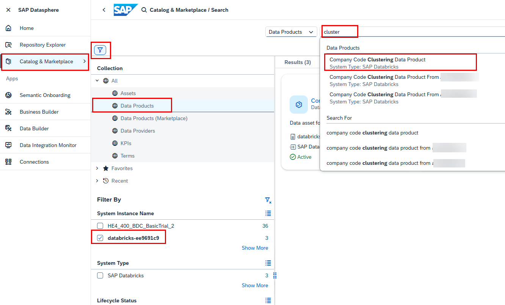 --->

    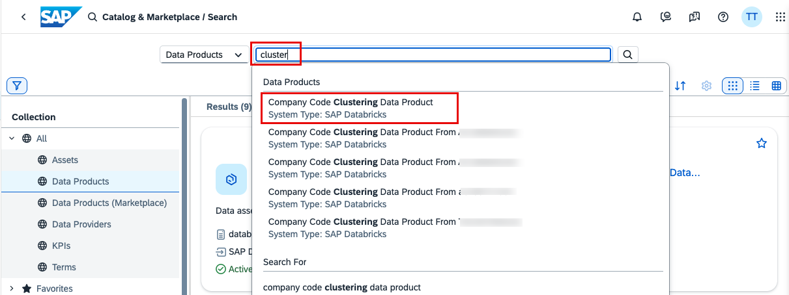

<!-- ["","",""] -->

Install the Data Product.

6. Verify you chose the correct data product (no username in the title) and select **Install**.

    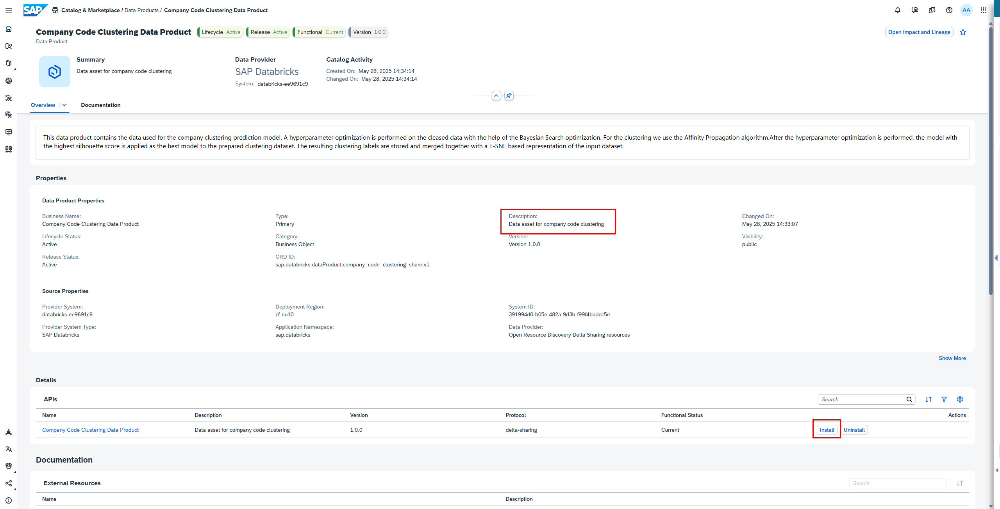

    If you pressed **Enter/Return** or selected **Search** after typing **cluster** (instead of choosing the data product directly from search suggestions), then it will list all data products with **cluster** in the name. To easily locate the correct data product switch to **List View** using the icon shown in the screenshot. The data product `without` your username is the one we will be installing (the first data product). Select it a continue with Install.

    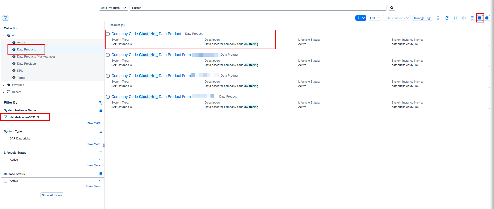

7. Select the **{placeholder|userid}** space and continue with **Next Step**.

    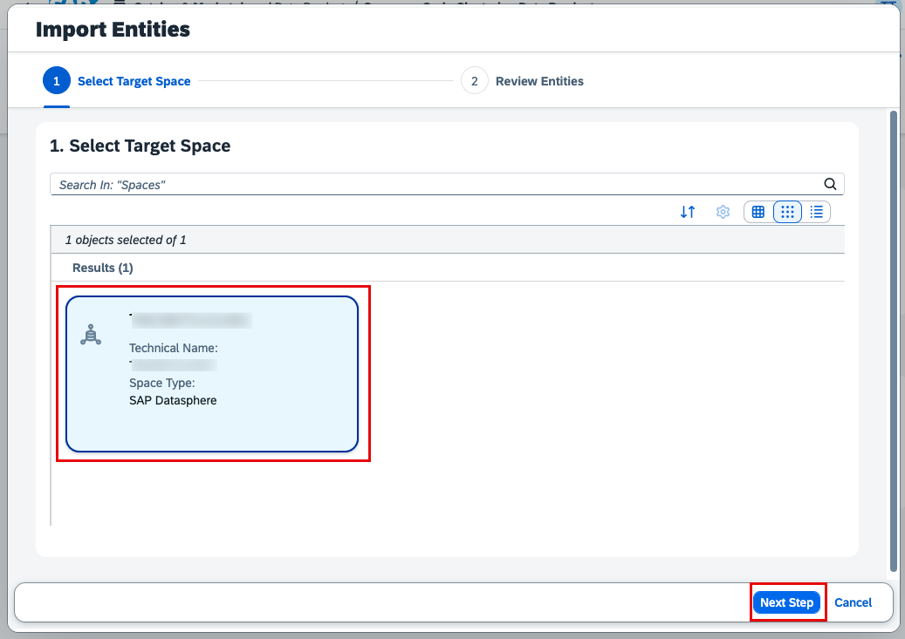

8. Select the **company_code_cluster** data product and **Start Import and Deploy**.

    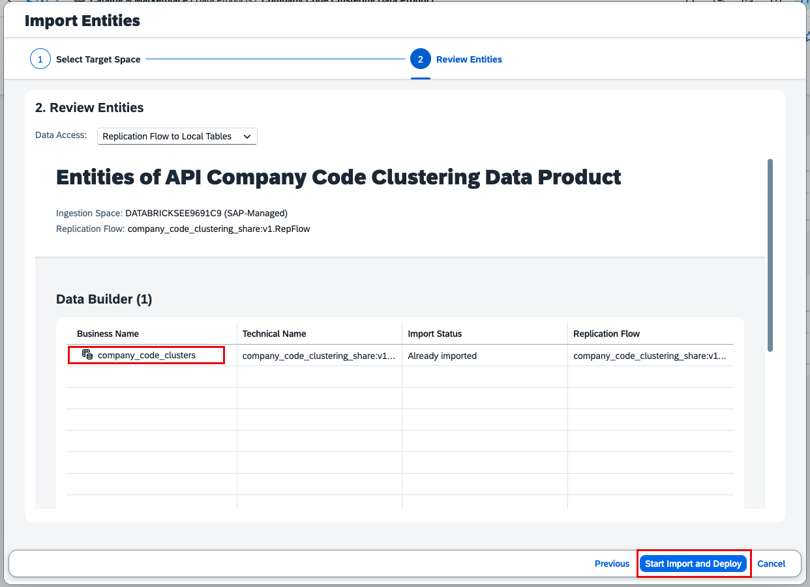

9.  Under **Data Builder** select your space **{placeholder|userid}**.

    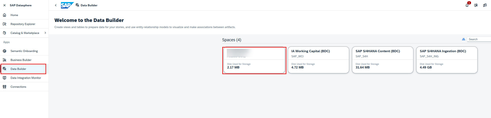

10. The new data product is now available in your space. 
    
    Notice that the data product is in **SAP-Managed** space and shared with you. The reason for this is to prevent data duplication. Even if the data product is installed many times by multiple users, data will be shared from SAP Databricks to SAP Datasphere only once.

    > **Note:** Installation and deployment might take up to a minute. If you don't see the data product, then refresh the page.

    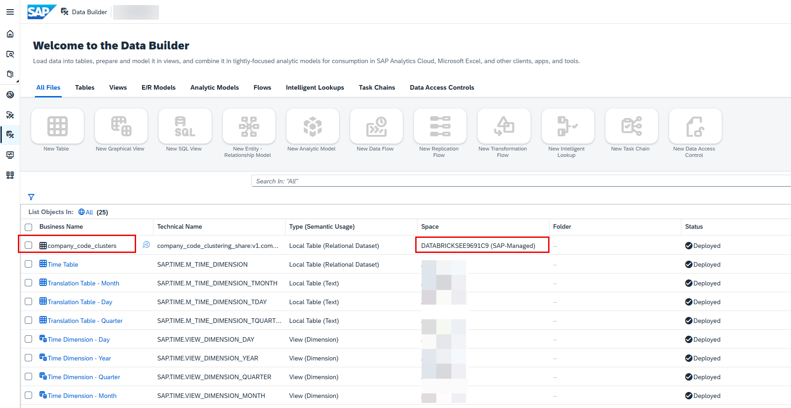

11. Go back to **Home**.

    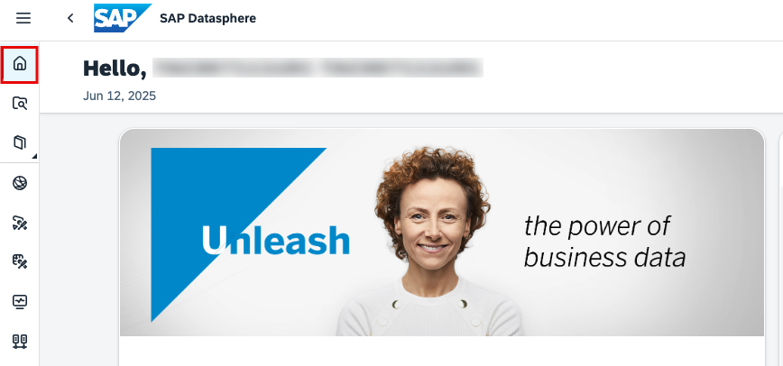

<!-- ["","",""] -->

 

**Congratulations!** You have successfully installed a Data Product.

 