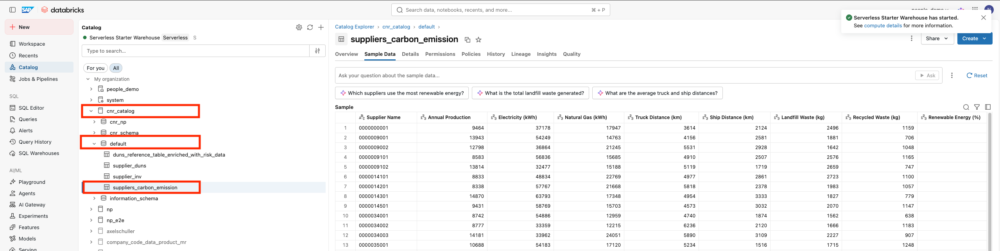

# Integrate non-SAP data into SAP Business Data Cloud (READ-ONLY)

There are many different ways of integrating external data into SAP Business Data Cloud for analytics and AI/ML purposes.
1. Using a vareity of connectors that SAP Datasphere offers
2. Using a vareity of connectors that SAP Analytics Cloud offers
3. Connecting an S3 bucket to SAP Databricks etc. 

The list is non-exhaustive. 
In this use case, we require some sustainability data for each supplier for the AI/ML and analytics purpose. The data is thought to be external within the organization.
For the purpose simplicity in this Hands-on, we have provided the data directly in the catalog in SAP Databricks.

  
