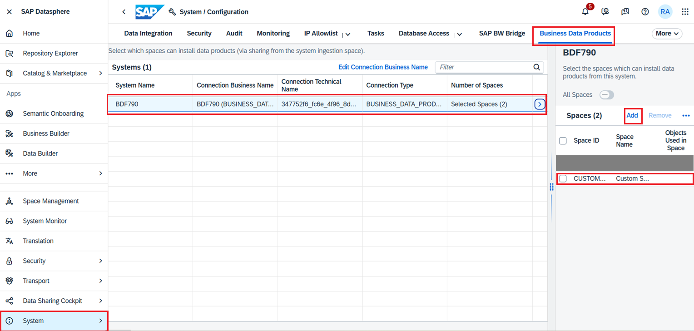
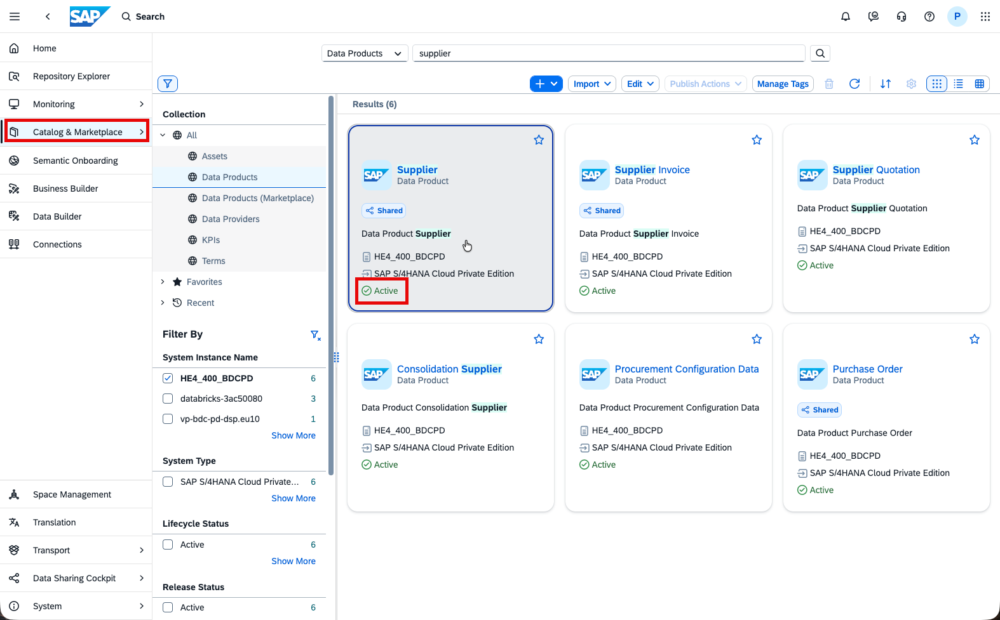
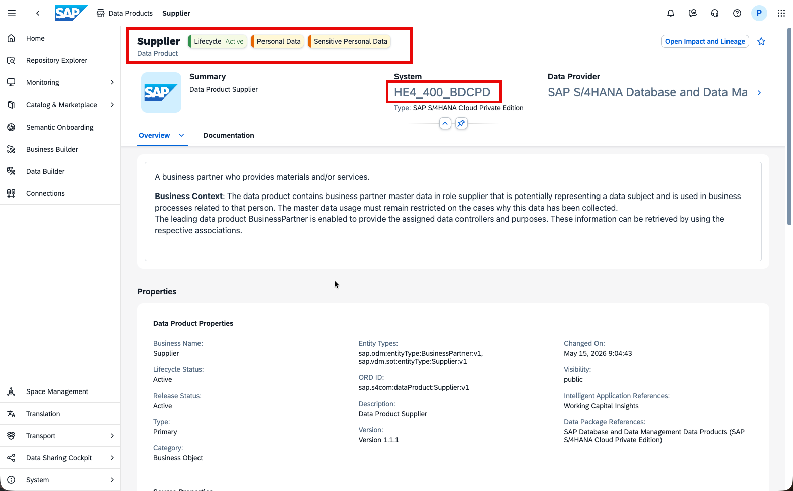
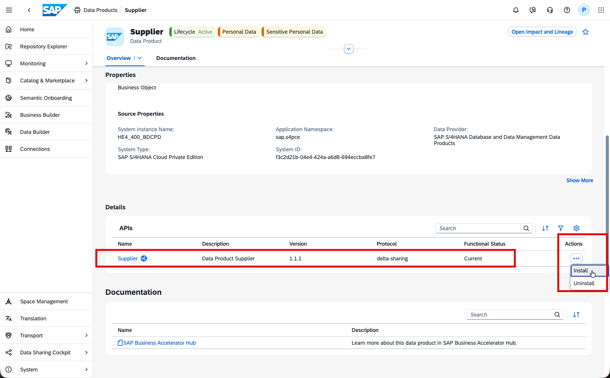
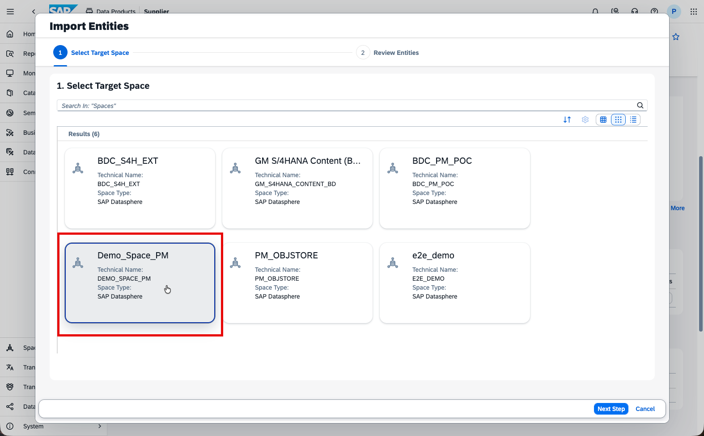
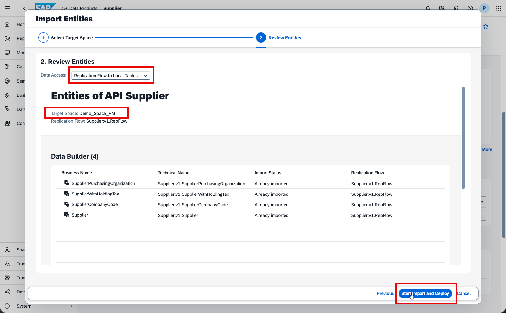
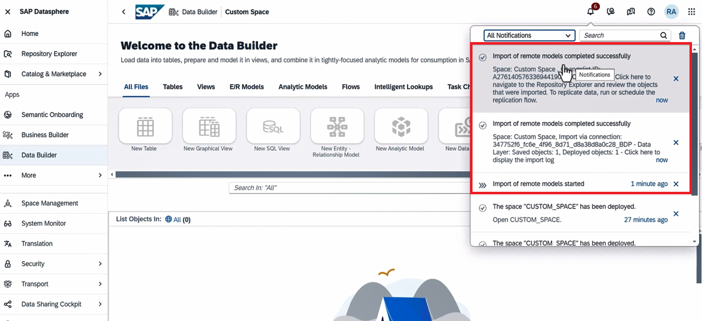
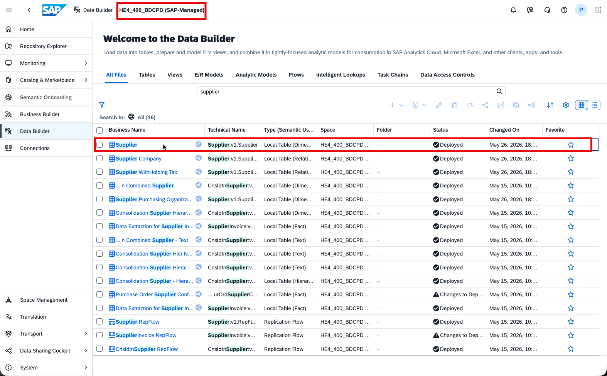
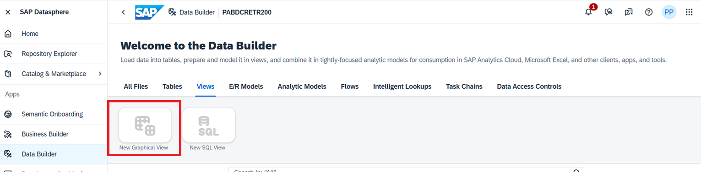
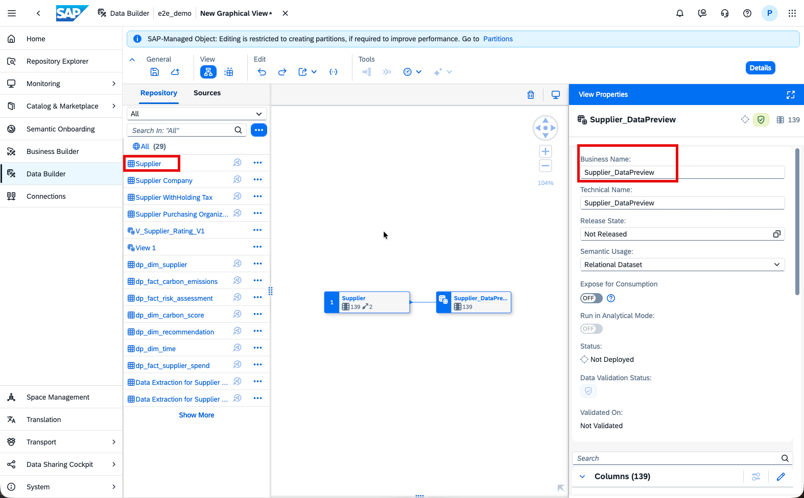

# Install Supplier Data Product in custom space in SAP Datasphere

This task involves two steps:
1. Enabling custom space in SAP Datasphere to install data products
2. Installing data product in the custom space

> :books: If you are participating in a SAP BDC training, part 1 has already been completed by the trainers, as it requires admin roles. Please continue with part 2.

## Enabling custom space in SAP Datasphere to install data products (READ-ONLY)
Before installing the Data Product, we need to add the custom space where we want to install our required Data product to the System > Business Data Products tab and select the correct source system.  Follow these steps for your custom space(consumption space) where the data product will be installed:

- Navigate to the **System** menu.
- Select the **Business Data Products** tab.
- Add the custom space where you intend to install the Data Product.
- Ensure that you select the correct source system for accurate integration.

 

## Install Data Product in custom space (HANDS-ON)

1.In the Catalog & Marketplace **SAP Business Data Cloud Data Products** tab search for the Data Product ***Supplier*** which was already activated in the BDC Cockpit.  
  

2.Open the Data Product ***Supplier***. 
 

3.This data product is active as displayed in the header. Choose the 'Install' button to start the installation.  
 

4.Select target space **Custom Space**, and click on ***Next Steps***.  If you are in a SAP BDC Training, your custom space will be **AC327XXXXXXX** for example.
 

5.Review the entities (replication flow and local table) and run the import selecting ***Start Import and Deploy***.  

>[!Note]
>Please ensure that the Data Access is set to **Replication Flow to Local Tables** only.  

  

6.You see the message ***Importing entities. Check the notifications for the status of the import.***. 

7.Notifications display that the import started and also that the import completed successfully. 

 

>[!Note]
>When you install a Data Product in SAP Datasphere, it sets up and deploys entities in an ingestion space or an SAP-managed space. Importantly, this does not create a second copy of the data. Instead, it shares the data from the ingestion space. This space is created when the first data product for the application instance is installed into DSP, either by a customer installing the data product in DSP or through the successful installation of an Intelligent Application. This approach ensures efficient resource use and keeps the data accurate and centralized.
 

8.In your assigned space, create a new **Graphical view** for Datapreview. 

 

9.Drag the table ***Supplier*** into the view and save it as ***Supplier_DataPreview***  

 

10.Preview the data in the ***Supplier_DataPreview*** view. 

>[!Note]
As the table ***Supplier*** is shared from the SAP-managed space. The table is automatically populated by the Replication Flow, so you don't need to manually start a run. 

You can now enhance the business use case by building on top of the installed data product.
