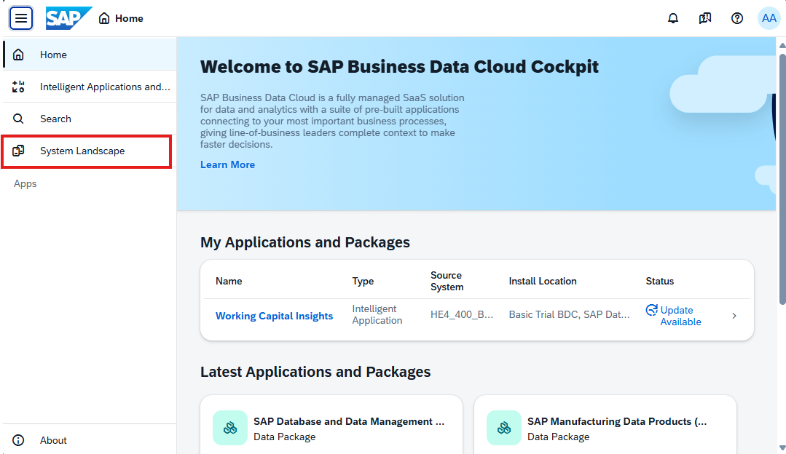
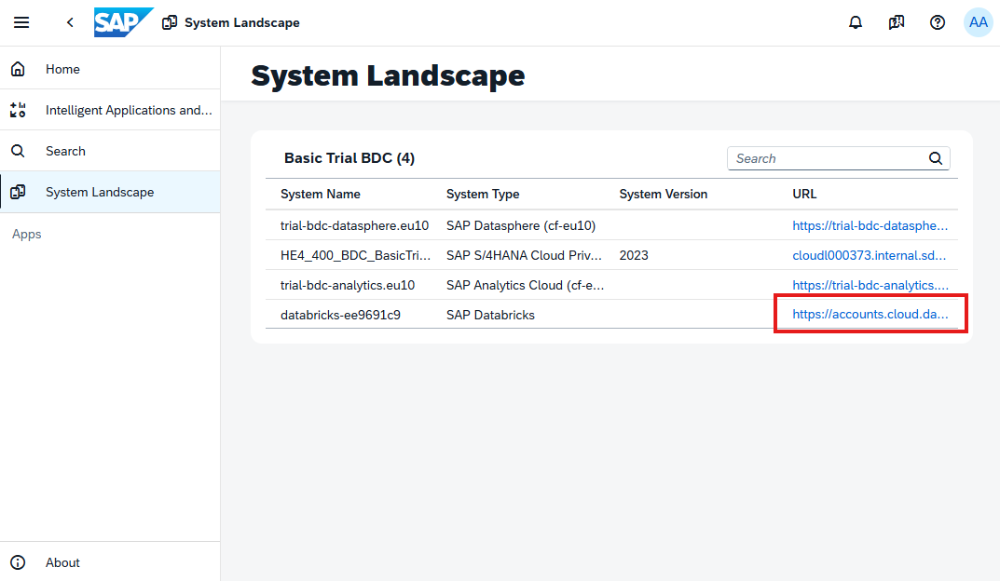
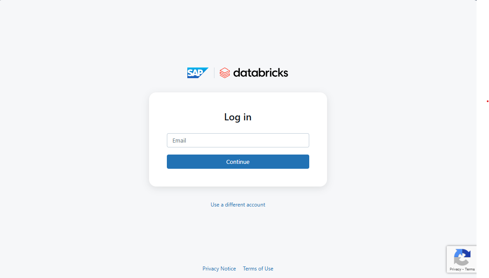
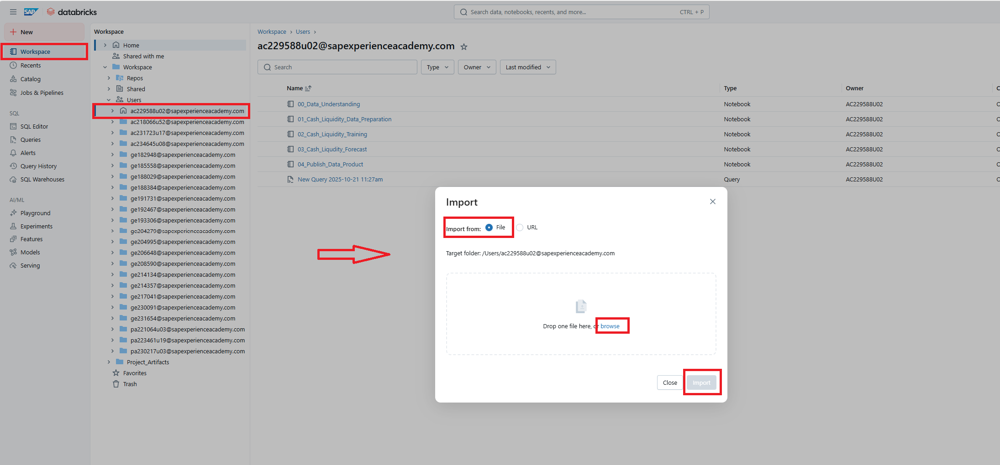
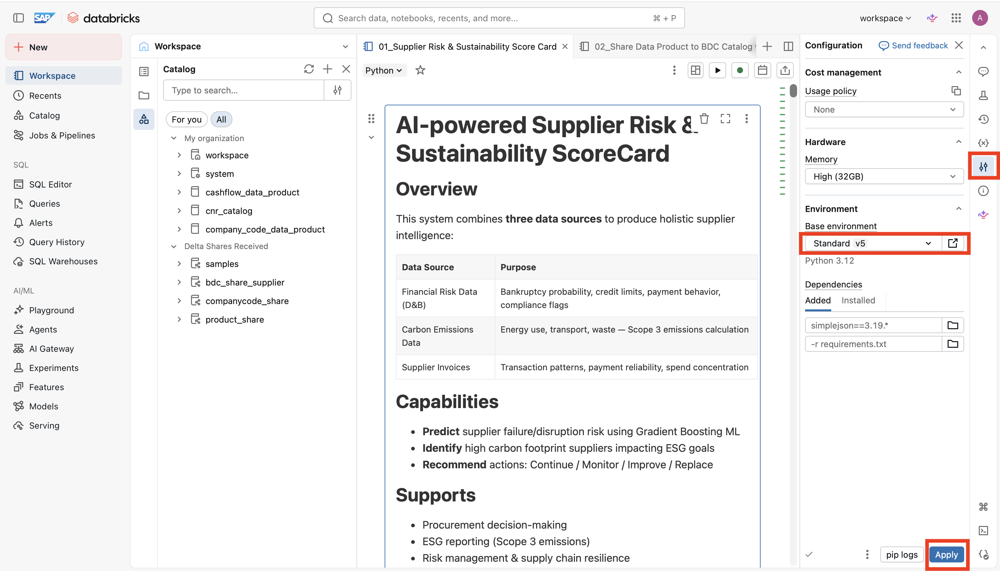

## Preparation for the ML portion
In this section, you will learn how to log in to SAP Databricks and how to upload the notebooks in order to proceed.

## Persona 
 

## Log in SAP Databricks instance and apply first setups
1. Users and Password for SAP Databricks
    - Username: **Will be Provided**
    - Password: **Will be Provided**
2. Access to SAP Business Data Cloud Cockpit: URL will be provided in the training
    - 
3. In the `System Landscape` page click on the SAP Databricks link to access the instance. 
    - 
4. Login with the provided user creditials. 
   - 

5. Download this github repository into your local PC.
6. To import the notebook, navigate to your own folder (same as the user email assigned to you) under the `Workspace> Users` tab. In the whitespace, right-click or use the context menu and select `Import`. Then import the file in question from your system's File Explorer. There are two notebooks to be imported.
    - [Notebook 1 for ML enrichment](./01_Supplier Risk & Sustainability Score Card.ipynb)
    - [Notebook 2 for Data Product Creation](./02_Share Data Product to BDC Catalog with BDC SDK.ipynb)
    - 
 
7. For the Python environment, switch to the latest version available
    - 

## Next Steps
We will now move on to uploading the notebooks in the SAP Databricks environment and executing them.