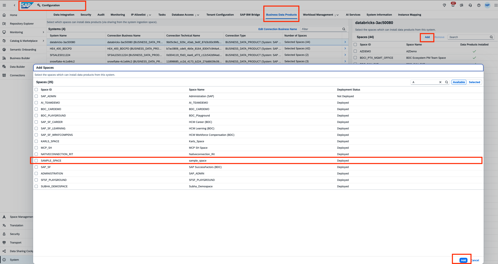
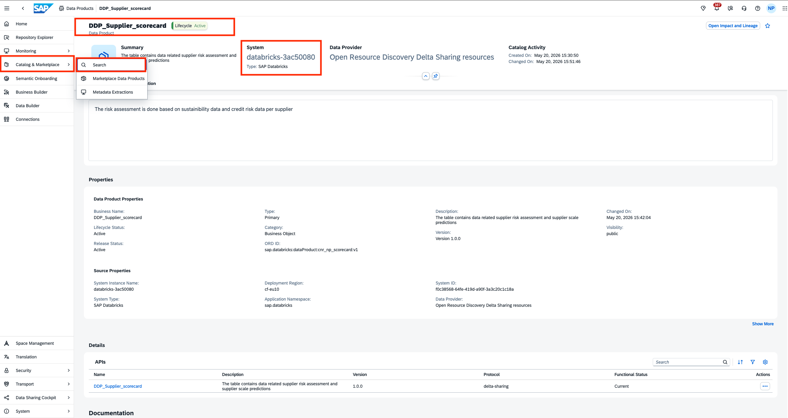
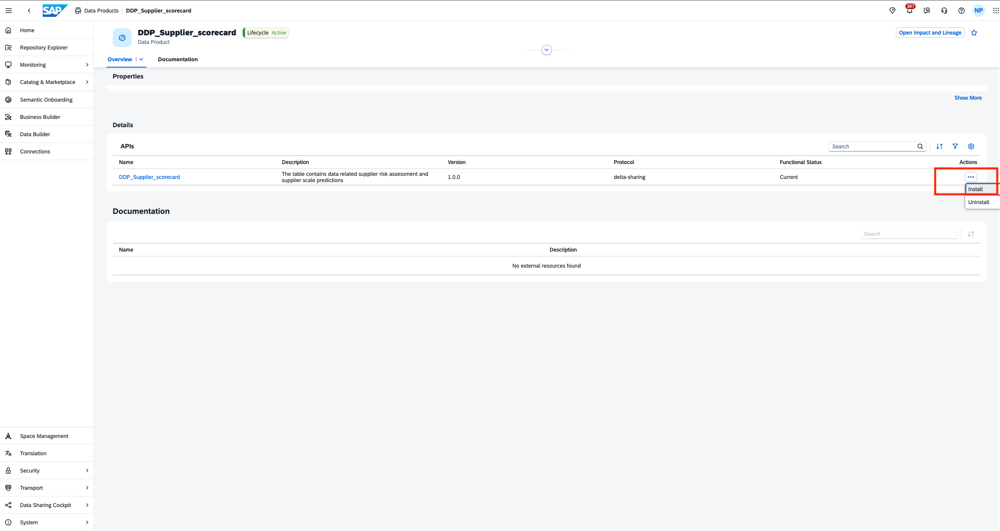
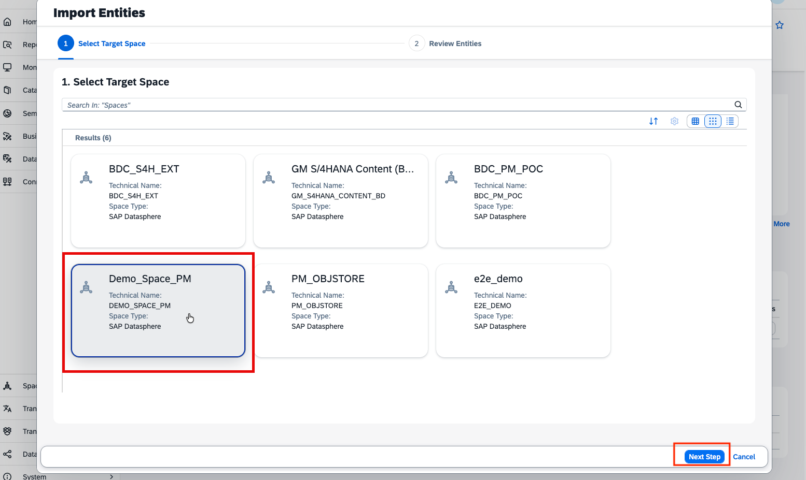
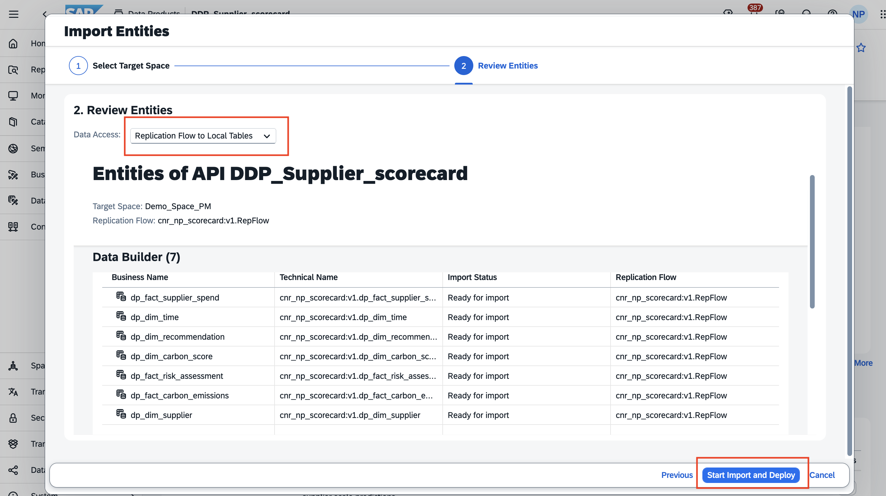
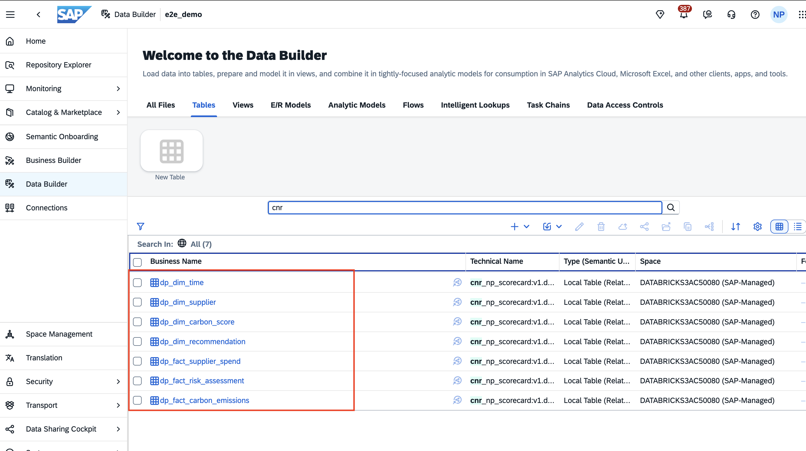

# Install custom SAP Databricks Data Product in custom space in SAP Datasphere

This task involves two steps:
1. Enabling custom space in SAP Datasphere to install data products
2. Installing data product in the custom space

> :books: If you are participating in a SAP BDC training, part 1 has already been completed by the trainers, as it requires admin roles. Please continue with part 2.

## Enabling custom space in SAP Datasphere to install data products (READ-ONLY)
Before installing the Data Product, we need to add the custom space where we want to install our required Data product to the System > Business Data Products tab and select the correct source system.  Follow these steps for your custom space(consumption space) where the data product will be installed:

- Navigate to the **System** menu.
- Select the **Business Data Products** tab.
- Add the custom space where you intend to install the Data Product.
- Ensure that you select the correct source system for accurate integration.
 

 

## Install Custom Data Product in Custom Space (HANDS-ON)
1.In the Catalog & Marketplace **SAP Business Data Cloud Data Products** tab search for the Data Product ***DDP Supplier Scorecard***. Open the data product. 
  

>[!Note]
> If you have created your own data product, then search with the name that you specified. Please note that the custom data products might take upto 5 minutes to appear in the catalog. Feel free to use the data product that has been already provided.

2.This data product is active as displayed in the header. Choose the 'Install' button to start the installation.  
 

3.Select target space **Custom Space**, and click on ***Next Steps***. 
 

4.Review the entities (replication flow and local table) and run the import selecting ***Start Import and Deploy***.  
  

>[!Note]
> You can either choose to replicate the data or use it via remote table (delta share). In either case, the tables are shared entities from the SAP Databricks ingestion space. This is an SAP-managed space where all the managed data products from SAP Databricks get ingested centrally.

5. After the successful notification is received, you can view that the tables from the managed data product have been successfully shared to your own custom space  
  

6. In the next step, we will use this custom data product to build our integrated data model.