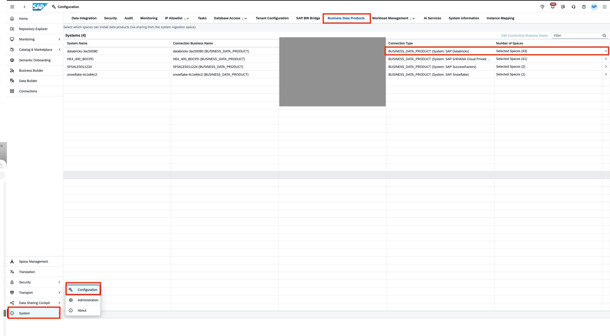
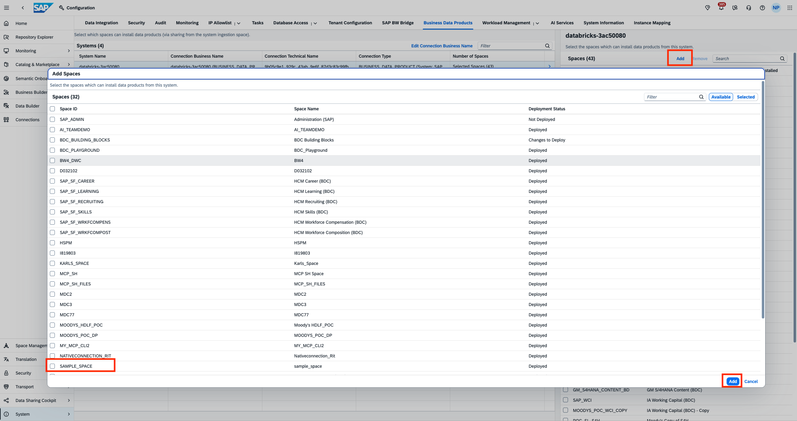
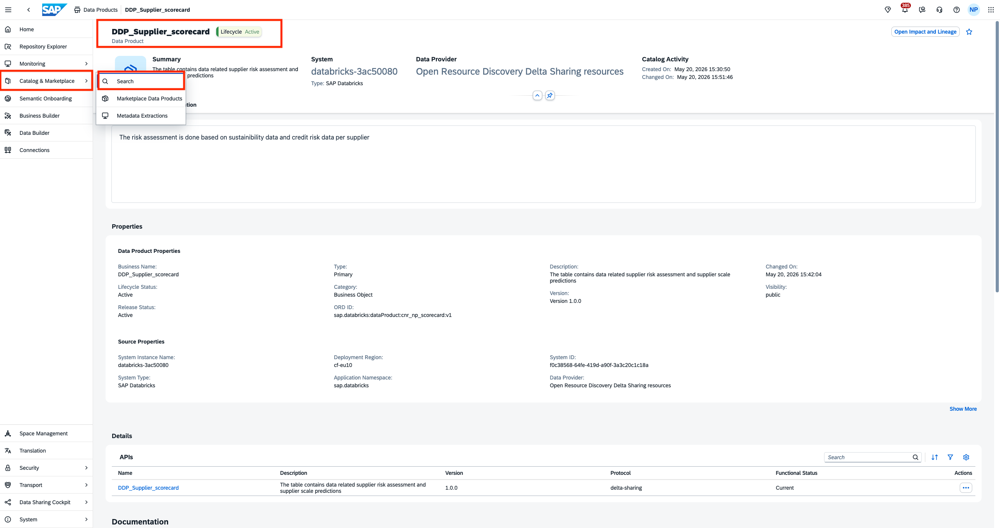
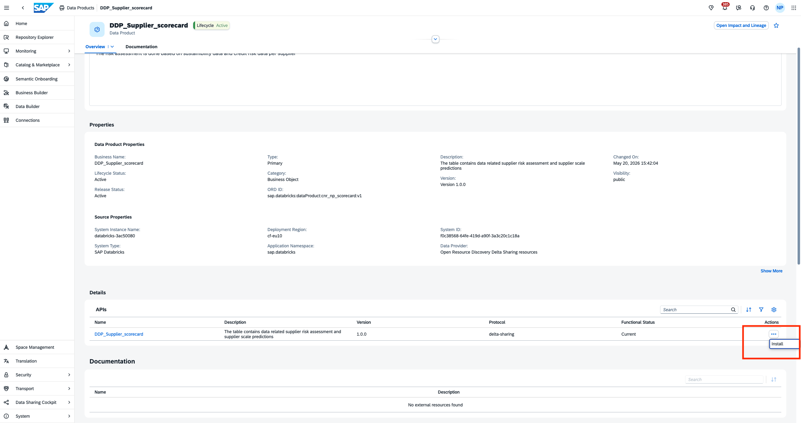
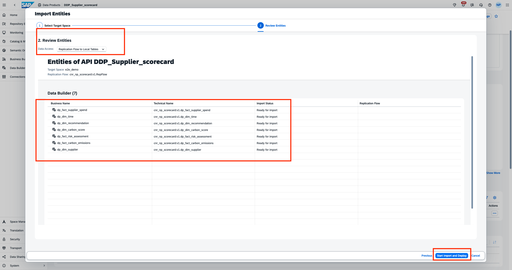
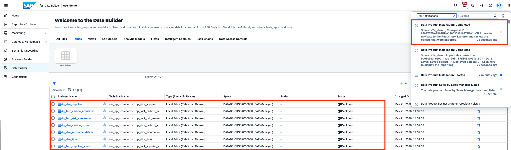

# Install ML-enriched data product in SAP Datasphere
We will now install the newly created and published data product in SAP Datasphere.
This consists of two steps:
- Enable the SAP Datasphere space to receive data products
- Install the data product in your space

## Persona 
Actors:  
 
 

## Enable SAP Datasphere space to receive Data products (READ-ONLY)

> :books: If you are participating in a SAP BDC training, this step has already been completed by the trainers, as it requires admin roles. Please continue with the next step.

Before installing the Data Product, we need to add the custom space where we want to install our required Data product to the System > Business Data Products tab and select the correct source system. Follow these steps for your custom space(consumption space) where the data product will be installed:
- Navigate to the System menu.
- Select the Business Data Products tab.

 

- Add the custom space where you intend to install the Data Product.
- Ensure that you select the correct source system for accurate integration.

 

## Install the data product in your space (HANDS-ON)
In the section, we will install the new custom data product in our own space. 
- Navigate to Catalog > Search
- Search for the data product that you have published `Supplier_scorecard` with your user id.
>[Note]
The newly published data product requires some time until it is listed on the SAP BDC Catalog. If it does not show up, you can also use the already published data product which has been created by trainers.

 

- Click on Install. Select the space provided to you. It will be named after your user id or log in username.  
 

>[Note]
This data product can be installed either in a delta share fashion or be replicated in the ingestion space. Select replication for performance reasons. As this data product is used by many people all at once, we will use the replicated data product from the ingestionm space.

- Finish installation by clicking 'Start Import and Deploy' 
   

- After about a minute, the data product should be installed. 
 

## Next Steps
Now you have successfully installed the custom data product. In the next exercise, we will create the fact views and models required for deriving insights
