# Create Data Model
In this section, we will create an integrated Fact View using the Supplier Data product and the ML-enriched custom data product
## Persona 
Actors:  
 

## Creation of Graphical View(DataSphere)

- Click on the "Data Builder".  
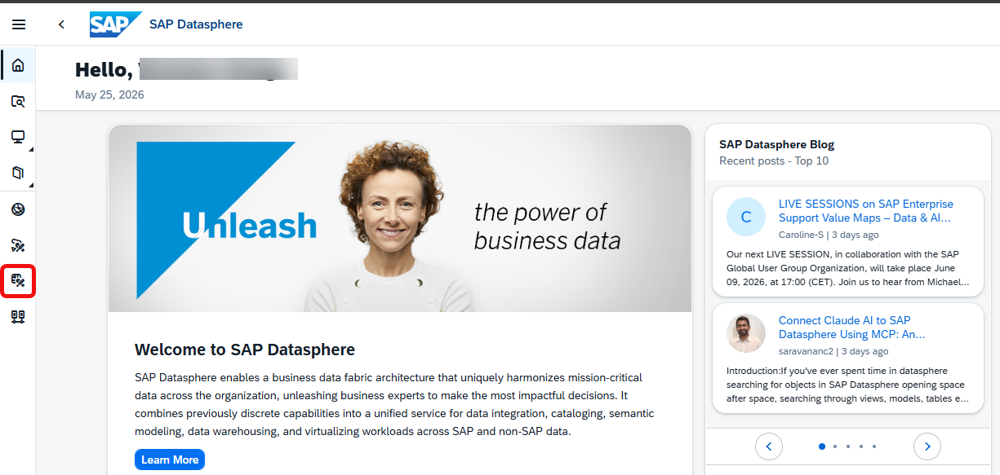 

- Search for the respective space(if you have not selected any Space in pervious exercises).

- Select "Views" tab from Data Builder Welcome Screen.

- Click on "New Graphical View" button as shown below. 
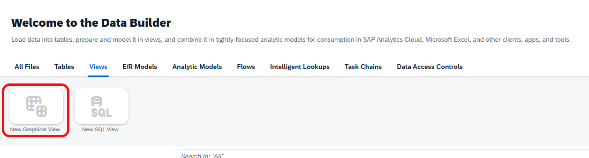 

- Select Repository tab.

- Search for Supplier table as shown below. 
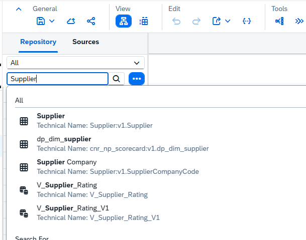 

- Drag and Drop "Supplier" to the builder(center) pane.

- Click on the Supplier node and add "Projection" node as shown below.  
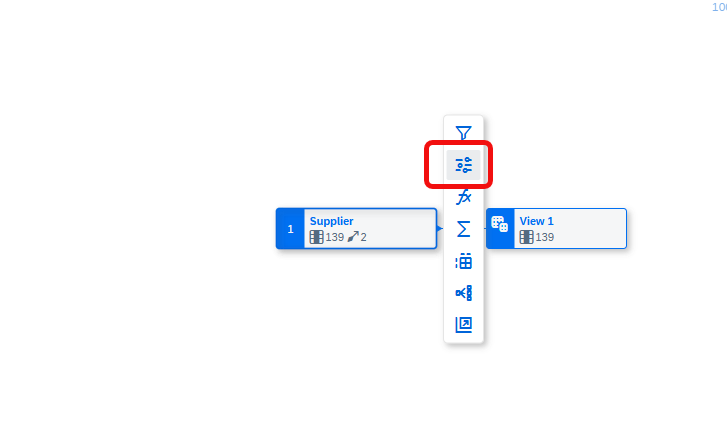 

- Go to Projection Properties Pane 

- Click on "Select All" button then click "Exclude Selected Columns" button as shown below. 
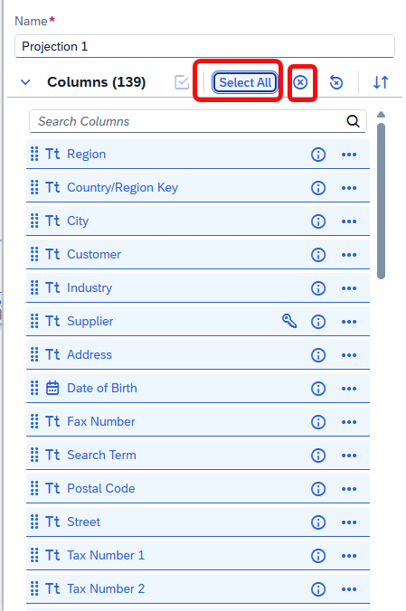 

- Now Search for "Supplier" Column and Restore it.(Click on ...) as shown below. 
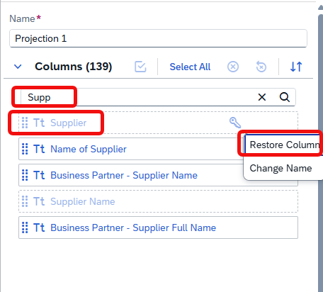 

- Repeat the same procedure for following Columns as well:
    - Account Group
    - Name of Supplier
    - Business Partner-Supplier Name
    - Business Partner-Suppler Full Name
    - VAT Registration No.
    - Tax Jurisdiction
    - Industry
    - Tax Number 1
    - Posting Block
    - Purch. Block
    - Address
    - Region
    - City
    - Postal code
    - Street
    - Country/region Key

- Again click on Repository tab(left side) and Search "dp_fact_carbon_emissions" table.

- Drag & Drop onto the pojection1 node.(Inner join node actomatically created) as shown below. 
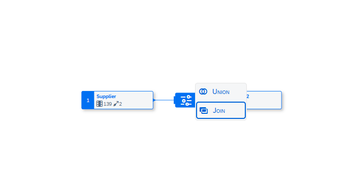 

- Select Inner Join node and map Supplier columns from both the tables as shown below. 
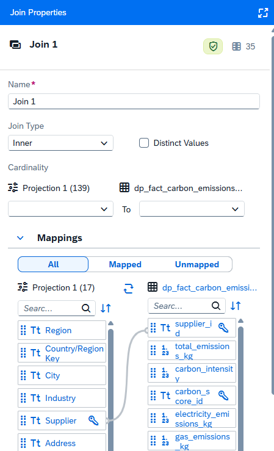 

- Click on Join node and add projection node.

- Exclude followin columns
    - `supplier_id`
- In the Repository tab, Search for "dp_fact_risk_assessment" table

- Drag & Drop onto the projection2(Inner Join node get generated) as shown below. 
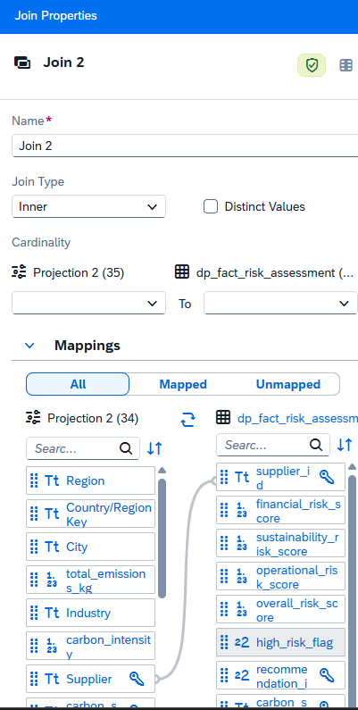 

- Click on join node and make sure inner join has created between Supplier column only.(If anyone other fields get joined, please remove it)

- Goto Projection node and exclude "Supplied_id" from dp_fact_risk_assessment table

- Got to Repository tab and search for "dp_fact_supplier_spend" table.

- Drag & Drop on Projection3, join node should get generated automatically. 
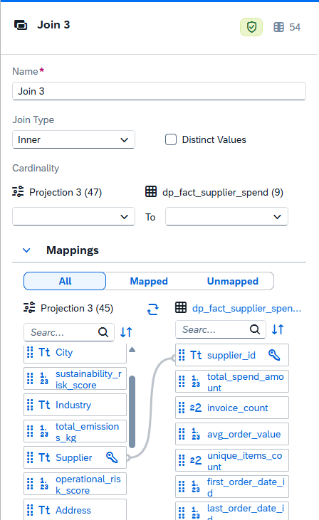 

- Click on newly generated Inner Join node and make sure join has made between Supplier column(if not, make a join between them)

- Again go to Repository and search for "dp_dim_recommendation" table and drag and drop onto Projection4, join should get generated automatically.

- Click on join node, change join type to left join and Select Distinct Values check box.(As shown below) 
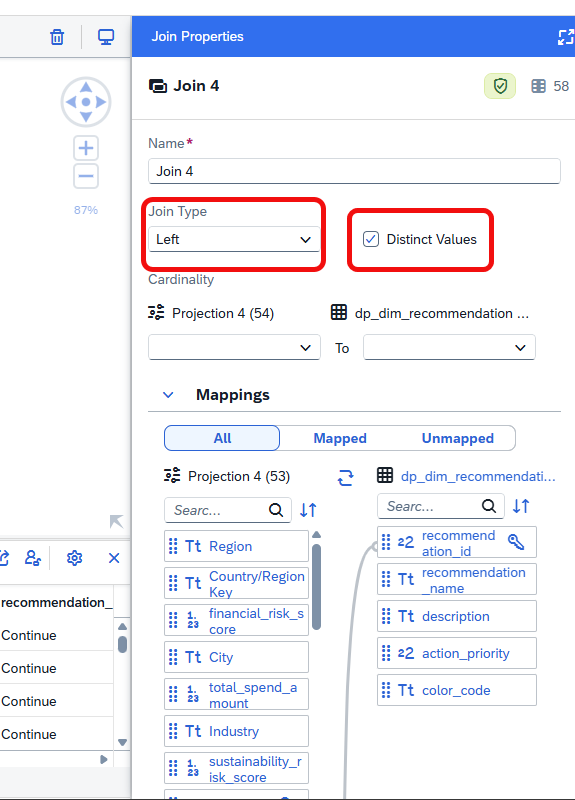 
- Make sure "dp_dim_recommendation" table should right table

- Make sure join has made between recommendation_id.

- Provide Business Name as V_Supplier_Rating_V1

- Move following Attributes to Measure sectiona and assign appropriate aggregation type.(Hint: *_pct,*_score(None type),_flag(Max) 
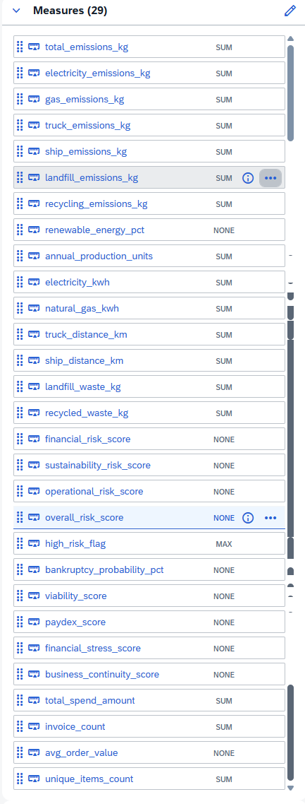 

- Maker sure Semantic type should be Fact.(As shown below) 
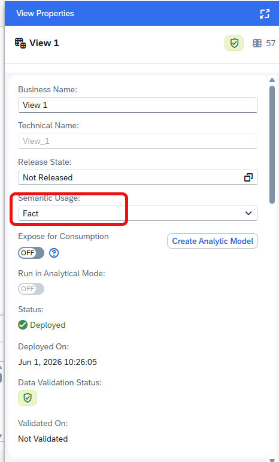 
- Final model shoud look like as shown below.
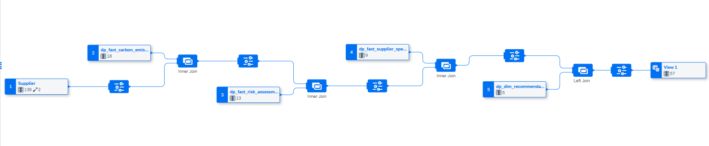 

- Save & Deploy the model.

- # Creation of Analytical Model
- Select Data Builder from Data Sphere home screen. 
 

- Select respective Space(if it prompts)

- Click on "Analytical Models" button from Data Builder homescreen(shown below) 
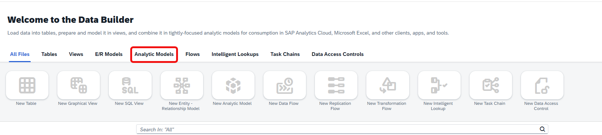 

- Select "New Analytical Model" option. 
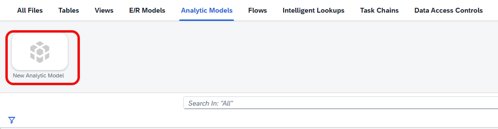 

- From Repository, Search the Graphical view created in the previous step.

- Drag and Drop the view to builder pane, if there is any prompt for assocications, please select "add" button.

- Provide the name for the Analytical Model(As shown below) 
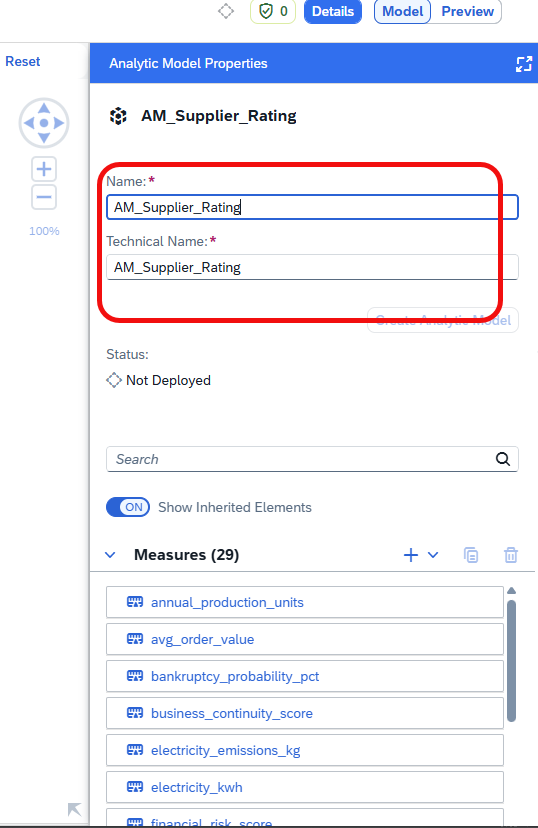 

- Deploy it.

- Make sure, Model deployed successfully( as shown below) 
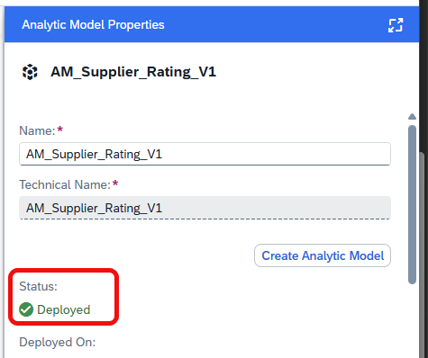 
