# Creating a Story in SAP Analytics Cloud

## Overview

In this exercise, we will visualize the results from the previous steps in a Dashboard in SAP Analytics Cloud. We will create a story with some essential charts to draw some key insights.

A Story in SAP Analytics Cloud is a reporting and visualization tool that allows users to analyse data through charts, tables, filters, and interactive dashboards. Stories can be created using imported or live data models and can be shared across the organization. The end result of this exercise will be as below.

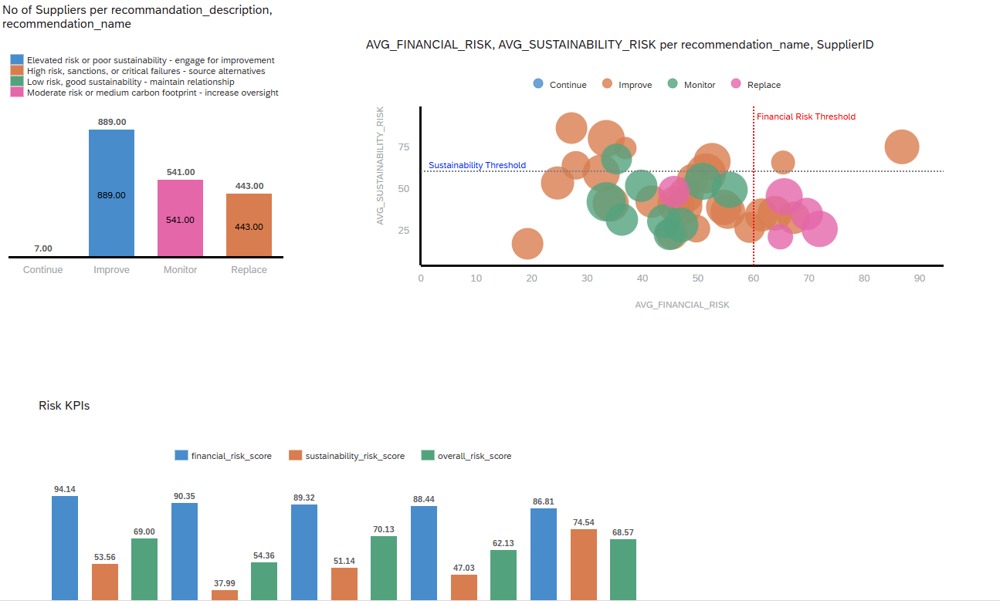<br/>


## Prerequisites

Before creating a story, ensure that:

- You have access to SAP Analytics Cloud.
- A data model is available and accessible. (from the previous exercise)
- You have the required permissions to create and save stories.
- The data source contains the necessary dimensions and measures.


## Create story and import Model from SAP Datasphere
### Step 1: Create a Canvas Story
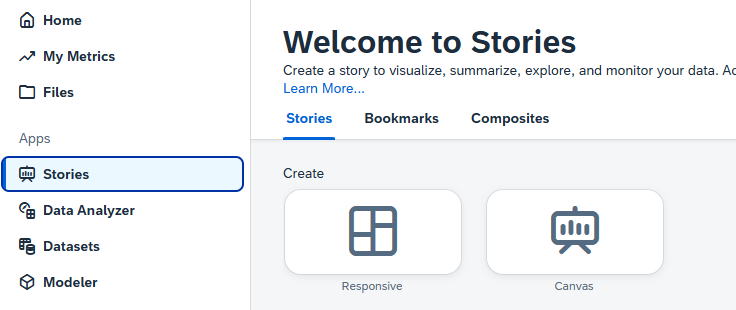<br/>

1. From the SAC home screen, select **Story**.
2. Choose **Canvas Story**.
3. Click **Create**.


### Step 2: Select a Data Source/ Import Model
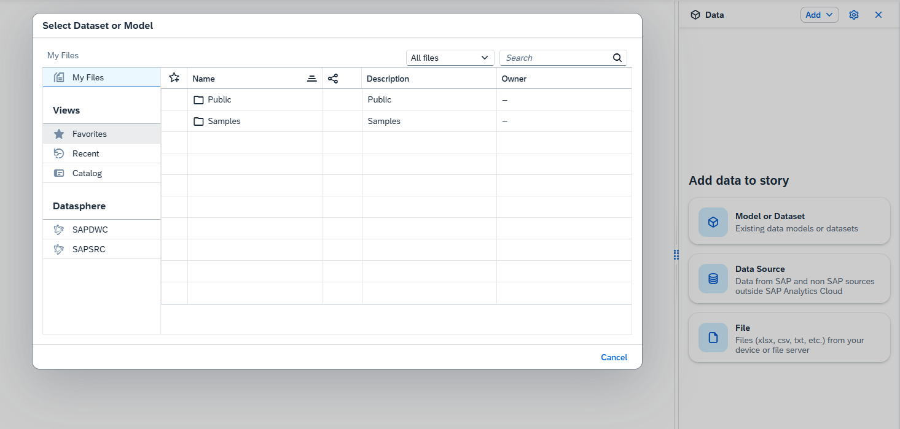<br/>

1. Click **Add Data** on the right side.
2. Select the **Dataset or Model**.
3. Click **SAPDWC**.
4. Search for the model that you created in the previous chapter and select it.
   > In this example, the model is named `AM_Supplier_Rating1`.
5. The data is now connected to the story.

In the next section, we will create three charts.


## Chart 1: No of Suppliers Chart Per Recommendation Category:
The chart aggregates and displays the **Number of Suppliers per recommendation category**, broken down by `recommendation_description` and `recommendation_name`. 

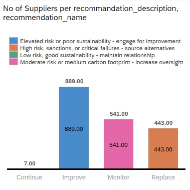<br/>


### Step 1: Add a Chart

1. Click **Insert Chart** or select **Chart** from the left side Widgets. Drag the chart onto the canvas to your preferred location.
### Step 2: Open the Builder Configuration

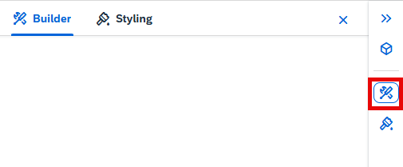<br/>

- Select the chart type — **Stacked Bar/Column** is used in this exercise.
### Step 3: Assign **Measures** and **Dimensions**: 
> [!Note]
> See the image after step 4 for reference. This image shows the target state of builder configuration that we want to achieve

   **Measure** — `No of Suppliers` (a Calculated Measure):
   1. Click **Add Measures**.
   2. Click **Add Calculation**.
   3. Select the type and give it a name. >  > In this example, the type is `**Count Dimension**` due to calculate number of Suppliers.
   <br/>
   4. Select the operation.   > In this example, the operation named `**aggregation**`.
   5. Select the aggregation dimension — > In this example`**SupplierID**`.
   6. Click **OK**. The measure will be added.

   **Dimension** — `Recommendation Name`

### Step 4: Assign a Color

1. Click **Add Dimension/Threshold** to differentiate the categories of your chart.
   > In this exercise, the differentiating dimension is **Recommendations**.

   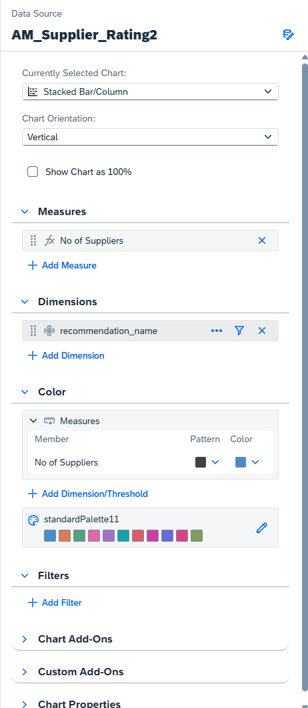<br/>


### Step 5: Save the Story

1. Click **Save**.
2. Enter:
   - Story Name: Select a name for the story with your user id. Eg. SupplierScoreCard_ACXXXXXXX
   - Description
   - Folder Location
3. Click **Save**.


## Chart 2: Sustainibility Risks

This task covers adding a second chart — a **Bubble Chart** — to your SAP Analytics Cloud dashboard to visualize supplier sustainability and financial risk.

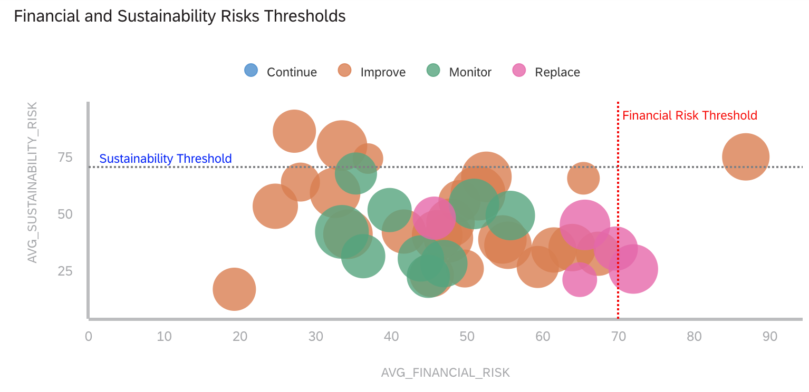<br/>


### Step 1: Add a new Chart
- Click on **Insert** from the ribbon at the top of the dashboard.

### Step 2: Open the Builder Configuration

<br/>

- The Builder panel opens on the right side for the new chart.
- Select the chart type **Bubble**.

### Step 3: Assign Measures
> [!Note]
> See the image after step 5 for reference. This image shows the target state of builder configuration that we want to achieve

This chart uses **Calculated Measures** for both axes.

##### X-Axis: `AVG_FINANCIAL_RISK`

1. Under **Measures**, click **+ Add Measure** and select **Calculated Measure**.
2. Name it `AVG_FINANCIAL_RISK`.
3. In the **Edit Formula** area, enter:
   ```
   ["AM_Supplier_Rating1":financial_risk_score] / [#COUNT_SUPPLIERS]
   ```
4. Click **OK** — the measure is added to the X-Axis.

##### Y-Axis: `AVG_SUSTAINABILITY_RISK`

1. Repeat the same steps to create a second Calculated Measure.
2. Name it `AVG_SUSTAINABILITY_RISK`.
3. In the **Edit Formula** area, enter:
   ```
   ["AM_Supplier_Rating1":sustainability_risk_score] / [#COUNT_SUPPLIERS]
   ```
4. Click **OK** — the measure is added to the Y-Axis.

##### Size: `total_spend_amount`

- The **Size** property controls the bubble size.
- Assign `total_spend_amount` as the size measure — larger bubbles represent higher spend with that supplier.


##### Reference Lines
| Line | Axis | Value |
|---|---|---|
| **Sustainability Threshold** | Y-Axis | ~60 (horizontal dotted line) |
| **Financial Risk Threshold** | X-Axis | ~60 (vertical dotted line) |
- Suppliers positioned **above** the Sustainability Threshold and **to the right** of the Financial Risk Threshold are high-priority for review or replacement.


### Step 4: Assign Dimensions

| Role | Dimension | Description |
|---|---|---|
| Dimension | `SupplierID` | Each bubble represents one unique supplier |


### Step 5: Assign Color

- Under **Color**, click **+ Add Dimension/Threshold**.
- Select `recommendation_name` to color-code each bubble by its recommendation category (Continue, Improve, Monitor, Replace).
  
  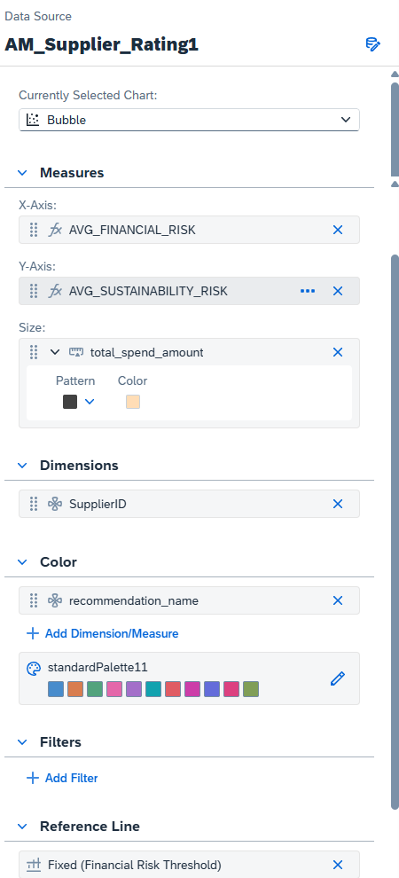<br/>
- ##### Builder Summary

| Property | Value |
|---|---|
| Chart Type | Bubble |
| X-Axis | `AVG_FINANCIAL_RISK` (Calculated Measure) |
| Y-Axis | `AVG_SUSTAINABILITY_RISK` (Calculated Measure) |
| Size | `total_spend_amount` |
| Dimension | `SupplierID` |
| Color | `recommendation_name` |

> [!Note]
> Both `AVG_FINANCIAL_RISK` and `AVG_SUSTAINABILITY_RISK` are calculated by dividing the respective risk score by the count of suppliers (`[#COUNT_SUPPLIERS]`), giving an average risk score per data point. The bubble size (`total_spend_amount`) adds a third dimension — highlighting high-spend suppliers that may also carry elevated risk.

### Step 6: Save Changes

Click **Save** to save changes.


## Chart 3: Sustainibility Risks vs. Credit Risk
### Chart Overview
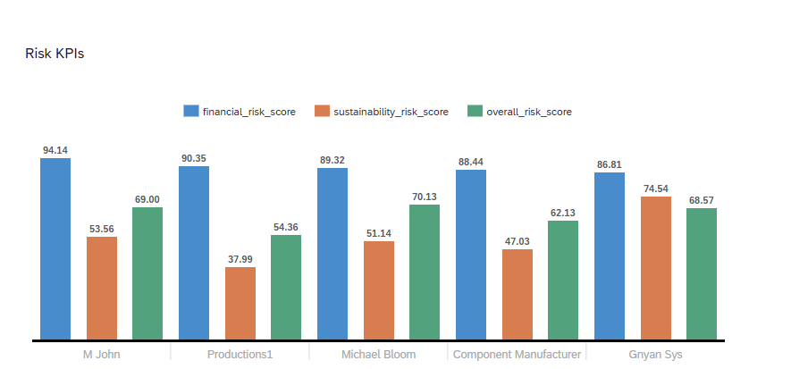<br/>

The Risk KPI Chart displays three risk scores side by side for each supplier, enabling direct comparison of **financial**, **sustainability**, and **overall** risk across business partners.


### Step 1: Insert a New Chart

1. Click **Insert** from the ribbon at the top of the dashboard.


### Step 2: Open the Builder Configuration
<br/>


1. The **Builder** panel opens on the right side for the new chart.
2. Select the chart type **Bar/Column**.


### Step 3: Assign Measures
> [!Note]
> See the image after step 5 for reference. This image shows the target state of builder configuration that we want to achieve


Under **Measures**, click **+ Add Measure** and select each measure. In this exercise:

- `FINANCIAL_RISK_Score`
- `Sustainability_Risk_Score`
- `Overall_Risk_Score`


### Step 4: Assign Dimensions

Under **Dimensions**, assign the following dimension:

- **Business Partner — Supplier Name**


### Step 5: Assign Color

1. Under **Color**, click **+ Add Dimension/Threshold**.
2. Assign a desired color to each member to differentiate them more easily.

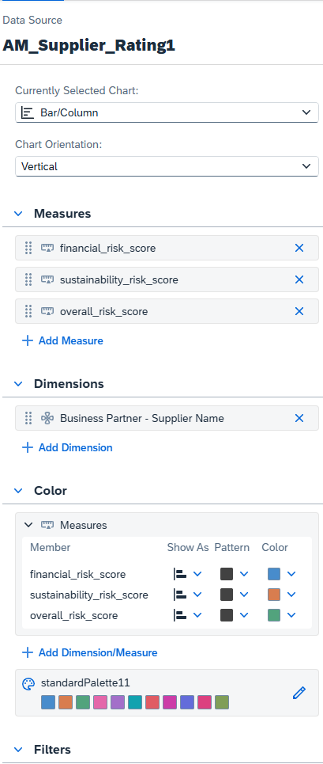<br/>   

### Step 6: Save Changes

Click **Save** to save changes.   


## Share the Story (READ-ONLY)
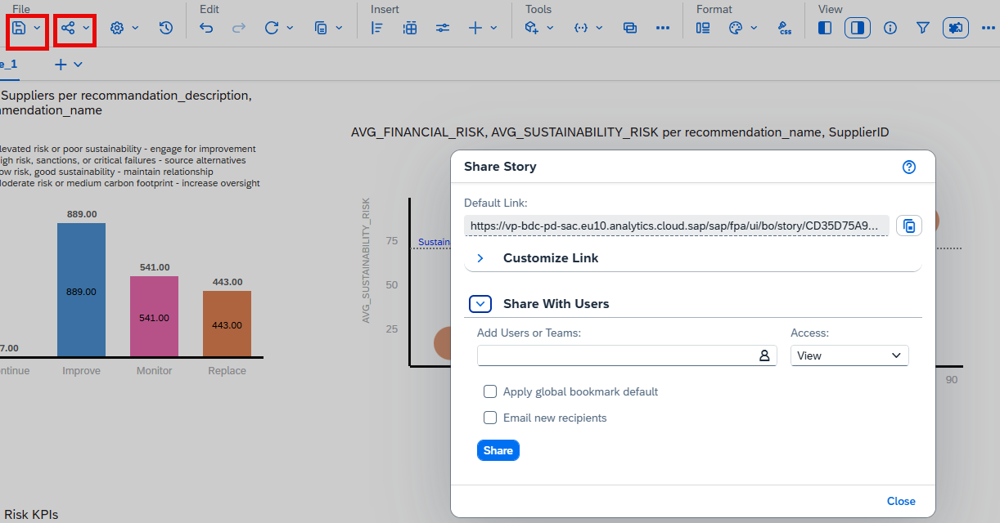<br/>

Finally, when all the charts have been added and saved the story can be shared if necessary

1. Click **Share**
2. Select users or teams
3. Assign permissions:
   - View
   - Edit
   - Full Control
4. Send the shared story


