# Basic Configuration SAP Business Data Cloud
Organizations that need to make data-driven decisions today face three big challenges:
- Performing complex data management activities that span multiple systems and highly distributed IT landscapes,
- Facilitating collaboration across analytics and data science teams, and 
- Connecting analytics and AI generated insights to meaningful impacts.

SAP Business Data Cloud was built to address these key challenges.

## Persona 
Actors:  
 
 

## Use Case
In this chapter, we will navigate the task of configuring the Business Data Cloud Cockpit. This cockpit will serve as a one-stop-shop control tower to provision the different cornerstones of the Business Data Cloud offering.

## Section Overview
- [Prerequisites](#prerequisites)
    * [Systems](#systems)
    * [For BTP Global Account](#prerequisites-in-btp-global-account)
    * [For SAP Datasphere](#prerequisites-in-datasphere)
    * [For SAP Analytics Cloud](#prerequisites-in-sac)
- [Steps](#steps)
    * [Outbound steps in S/4 PCE system, BTP and SCC](s4-config-steps.md)
        - [Application of all the relevant SAP notes](s4-config-steps.md#1-application-of-all-the-relevant-sap-notes)
        - [Generation of a signed client certificate (CSR) and PSE](s4-config-steps.md#2-generation-of-a-signed-client-certificate-csr-and-pse)
        - [Generation of the S/4 technical user credentials](s4-config-steps.md#3-generation-of-the-s4-technical-user-credentials)
        - [Importing Certificate Response from the BDC Formation in the S/4 PCE system](s4-config-steps.md#4-import-certificate-response-from-the-bdc-formation-in-the-s4-system)
        - [RFC Destination Setup in S/4 PCE system](s4-config-steps.md#5--rfc-destination-setup-in-s4)
        - [Register Outbound Connection in SAP S/4](s4-config-steps.md#6--register-outbound-connection-in-sap-s4)
        - [Cloud Connector Configuration to enable BDC to communicate with S/4 PCE System](s4-config-steps.md#7-cloud-connector-configuration)
    * [Creation of Formation](#creating-the-formation)
    * [Prepare S/4HANA PCE connection for use in SAP Datasphere spaces(required for Data Product Installation)](#prepare-s4hana-pce-connection-for-use-in-sap-datasphere-spacesrequired-for-data-product-installation)

## Prerequisites
### Systems
Please make sure that the required systems are all provisioned and available for use and the conditions are met. The systems that are required are:
- One SAP Datasphere Tenant (DSP)
- One SAP SAC Tenant (SAC)
- One or multiple S/4HANA Tenant in the private cloud (S/4HANA PCE) 
- Optional: Databricks Component for ML use cases
- BDC Cockpit (This will be available automatically once the formation has been created. This is addressed later in this chapter)

### Prerequisites in BTP Global Account
 

> 

 

- The S/4 PCE system must be registered and visible on UCL.
- Logon to the BTP Global Account and go to **System Landscape** -> **Systems**. The S/4 PCE system in question should be visible there. 
- If the S/4 PCE system does not appear in UCL, then you need to check if the Lifecycle Status of the S/4 PCE system is set to value LIVE in Cloud Reporting Tool (SPC). E.g. for a customer called CUSTOMER_1 open SPC as follows: https://spc.ondemand.com/open?SYS=S4PCE_SYSTEM_NUMBER_OF_CUSTOMER_1. Then, navigate to the **Tenants** tab and look up the S/4 tenant that the customer wants to use. Here, the Lifecycle Status of the S/4 PCE system in question must be set to value **LIVE**.

> [!CAUTION]
> Please be aware that there are some manual steps are requried to prepare the S/4 system to communicate with SAP Business Data Cloud. During the course of this exercise, you will be prompted to perform steps mentioned in another section. Continue as directed with the rest of the exercise. For the S/4HANA Tenants, all the prerequisites have to be fulfilled before the configuration of the BDC Cockpit can be done. The prerequisites are documented [here](../README.md#requirements). 

> [!NOTE]
> All components need to be available in the same global account in BTP cockpit and should have been provisioned from the same hyperscaler by the SAP DevOps team. :wrench: For Beta the DSP and SAC tenant are dedicated greenfield tenants provided by SAP Cloud Ops team. 

Identify the SAP Datasphere and SAP Analytic Cloud tenants. Check the​ connections and required privileges/roles needed to integrate​ them and to create a [Formation](https://help.sap.com/docs/btp/sap-business-technology-platform/including-sap-systems-in-formation).
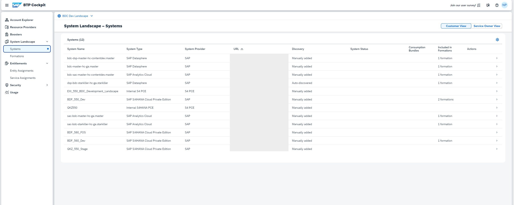

### Prerequisites in Datasphere

 

> 

 

- In the tab switcher, there is a tab for Business Data Cloud and one for SAC​
- In Beta the App Switcher needs to be manually configured by adding the tenant links in the Administration same as it can be done for standard SAC integration​
- SAC connection is available in Administration → App Integration → Trusted Origins​
- On the Roles page, the "SAP Business Data Cloud" section is available with two global roles, "BDC Administrator" and "BDC Viewer"
- Clicking into a Datasphere or BDC role, the new privileges "BDC Data Packages" and "Cloud Data Product" are visible in the table
- BDC roles can have permissions on "BDC Data Packages" and nothing else. Datasphere roles can have permissions on anything except "BDC Data Packages"
- On tenants with INFRA_BDC_COCKPIT = false or with thresholdBusinessDataCloudUser = 0, BDC roles do not appear on the roles page 

### Prerequisites in SAC
 

> 

 

- In Connections, there have to be connections to Datasphere (here, SAPSRC)
- Please make sure that the SAP-icons style is manually added in SAC, if not already done so.
    * To add the new font, open SAC -> System -> Administration -> Default Appearance.
    * Add Font using the + icon with the URL **https://ui5.sap.com/resources/sap/ui/core/themes/base/SAP-icons.css**
    * Click Save

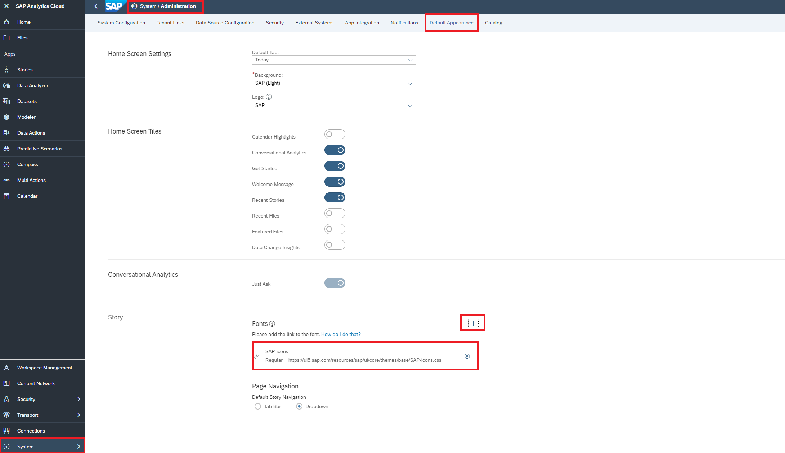

## Steps

### Creating the Formation

 

> 

 

1. Prerequisite: Before the creation of the Formation, we will need to prepare the S/4 system and perform other outbound steps. Please find all the necessary steps in [this section](s4-config-steps.md).
2. In BTP -> System Landscape ->  Formations, use the **Create Formation** button to begin the creation of the required Formation. A formation is a logical grouping of SAP systems that can be extended in a business scenario. Formations allow you to combine SAP solution systems and a subaccount in SAP BTP to simplify the connectivity setup and to provide a unified view of all components required for the implementation of your extension scenario. To create a fully functional formation, you can use a two-step wizard. At the first step, you specify a custom formation name and assign a subaccount to it. At the second step, you can include an SAP solution system in the formation. You do this configuration once and you can change it anytime.
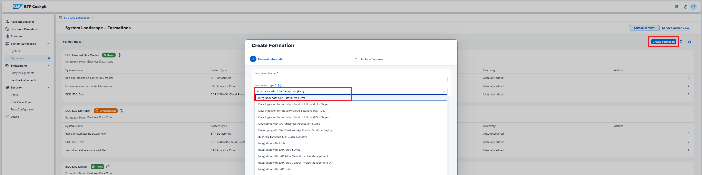

> [!IMPORTANT]
> The Formation type will be **Integration with SAP Datasphere (Beta)** during the Beta Phase.

3. The Formation has to be created by adding only SAP Datasphere to it first. Then **Create** the formation. The formation is instantly created since there is no interaction with another system required so far. 
> [!IMPORTANT]
> To create a Formation it is important to add the tenants step-by-step. You have to start with only SAP Datasphere in the Formation. The other systems cannot be added at this step. The reason is that there is a limitation that the S/4PCE system requires a lot of input parameters from the end user and hence, can be added only once the Formation has been saved in "Draft" state. 
> 
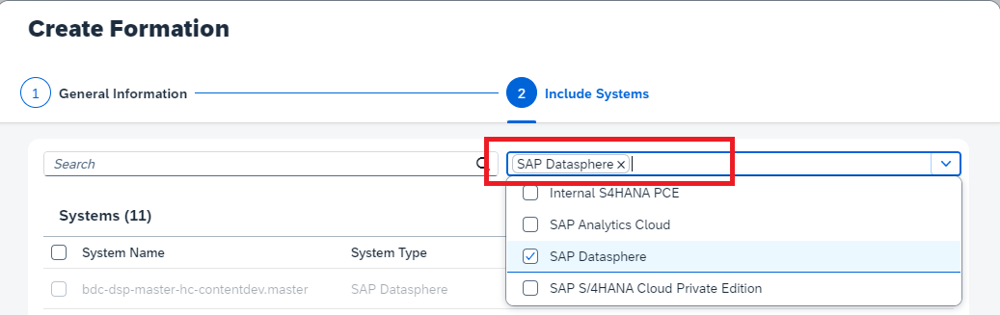  
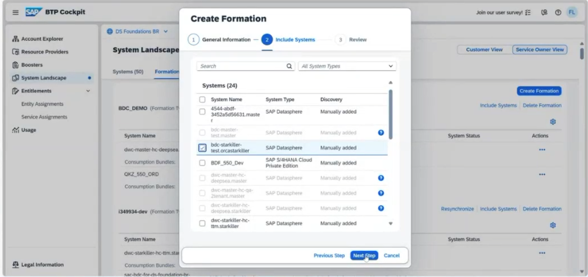  
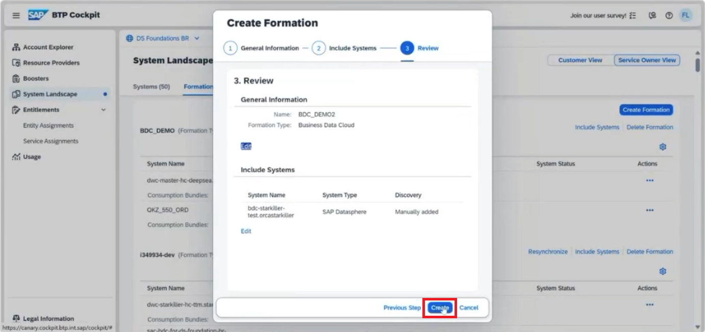  

4. After having created the Formation with the Datasphere tenant only, more components can be added (SAC, S/4HANA PCE). To do so go to the tile of the system to be added in the System Landscape Directory of the BTP Cockpit and add the system by clicking on **Incude System**. Find and add the required S/4 PCE system.  
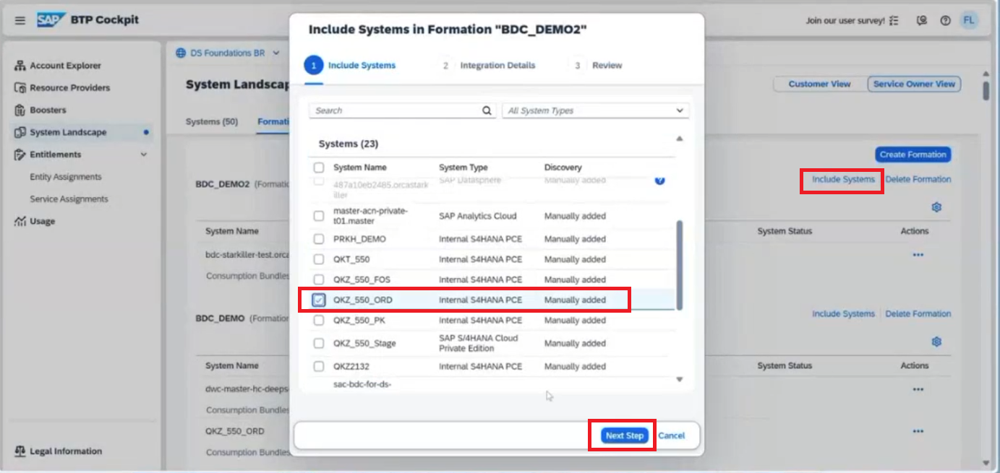

5. In the next step, the details about the S/4 PCE system has to be provided.
    * S/4 PCE Client CSR: The certificate contents will be used to access the HANA Data Lake File Instance from the S/4 PCE side
    * Cloud Connector Location ID: If the customer has multiple cloud connectors, then the location id is used to differentiate which cloud connector location is being referred to.
    * S/4 PCE Username and Password: Technical user name and password to authorize the S/4 PCE system Access. This has to be entered individually by the customer. This is also used to create RFC destination in the consumer subaccount. 
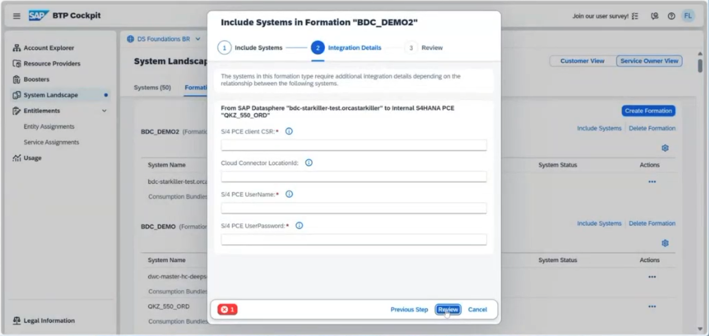

> [!NOTE]
> As prompted before, the input for this step can be generated by performing all the steps in S/4 preparation section. Head over to [this section](s4-config-steps.md), if the steps have not been performed yet.

6. Finally, the SAC system can also be added accordingly into this formation.

> [!IMPORTANT]
> At first the DSP tenant should be properly added to the Formation
> Secondly the S/4HANA Cloud tenant which acts as a source to deploy the data products and provide the necessary data
> Then the SAC tenant can be added
> If a Databricks tenant is required, then this service should be added after having properly configured the DSP, SAC and the S/4HANA PCE tenant.

7. The Formation status changes to **Synchronizing**. When the status changes to **Ready**, the Formation is ready to be used. The BDC Cockpit is also available for use. It can be accessed by using the App Switcher button in SAP Datasphere or SAP Anayltics Cloud. 

8. Technically, it is already possible to install an Intelligent Application in the BDC Cockpit as described in the [next exercise](/02-install-intelligent-applications/README.md). But before continuing with the next exercise, please go through the next section describing the prerequisites for Data Product installation.

### Prepare S/4HANA PCE connection for use in SAP Datasphere spaces(required for Data Product Installation)
 

> 

 

1. The SAP S/4HANA PCE tenant is a major component for SAP Business Data Cloud and the related Data Products. Hence a proper connection is key.​
2. It is important to be able to deploy Data Products. For manual installation of Data Products and to deploy them, spaces must be configured in the connection.​ Within the Connection details check if the right DSP Space is selected as a target to expose all Data Products for this source.​ Open the Datasphere Tenant, under System -> Configuration -> Unified Customer Landscape tab, you will see the S/4HANA PCE connection added. Add a Datasphere space to the list to allow this space to use the connection. (i.e. Add Spaces that should be eligible for installation of Data Products from given system)  

> [!CAUTION]
> Please note that if the switch “Allow connection in all spaces” is enabled- it can not be disabled. Only if you are sure that the connection should be available to all spaces, then enable this switch.

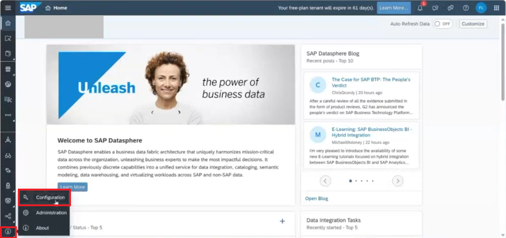 
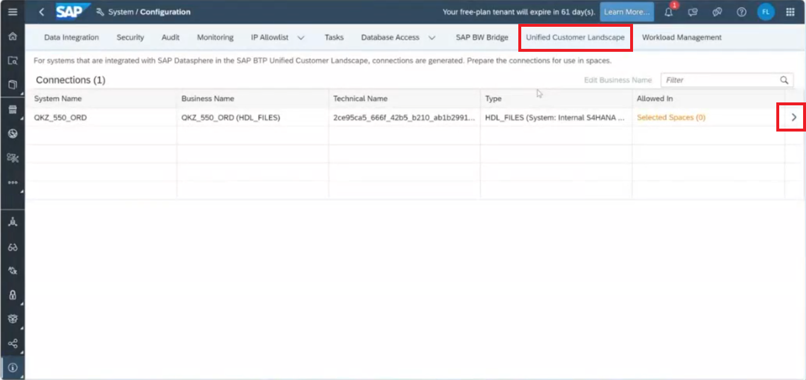 
 

> [!NOTE]
> The previous step is required as a prerequisite if data products have to be manually installed. Config is not required for Intelligent Application installation!
> Also, note that the Configuration is per source system​.

3. Also, give the S/4HANA PCE system, a meaningful business name to recognize it in the **Connections** Tab.
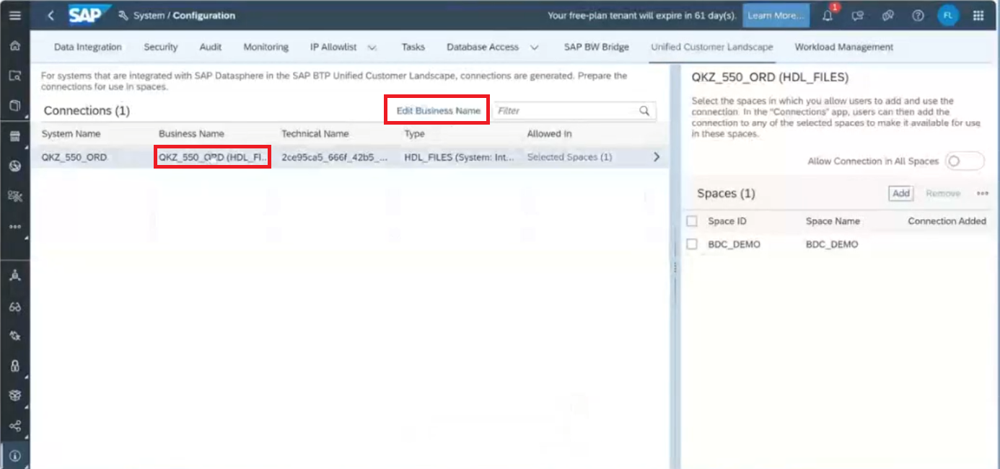 
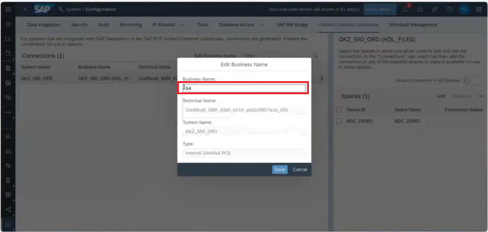 

4. Access the space you selected as a target in ***System -> Configuration -> Unified Customer Landscape***. In the **Connections** tab, click on **Add**.
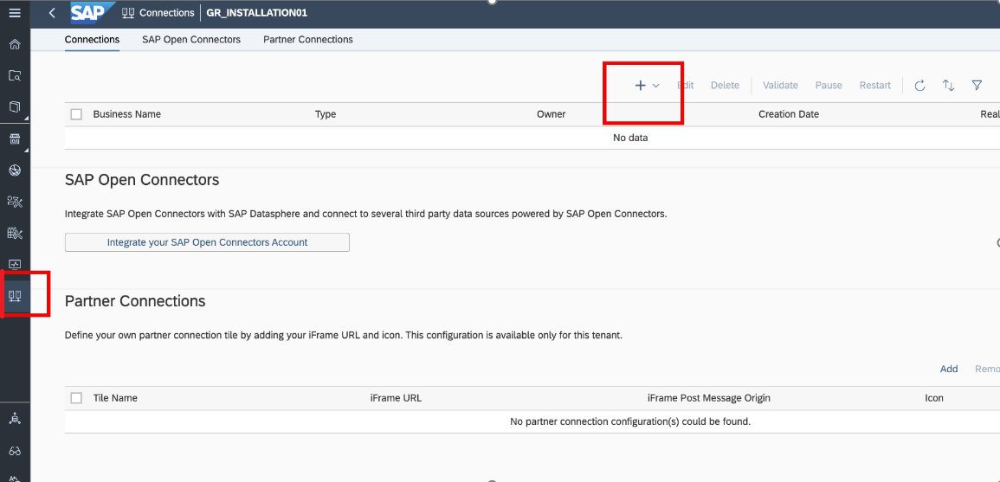

5. Add the S/4 HANA PCE system as a connection in the space.
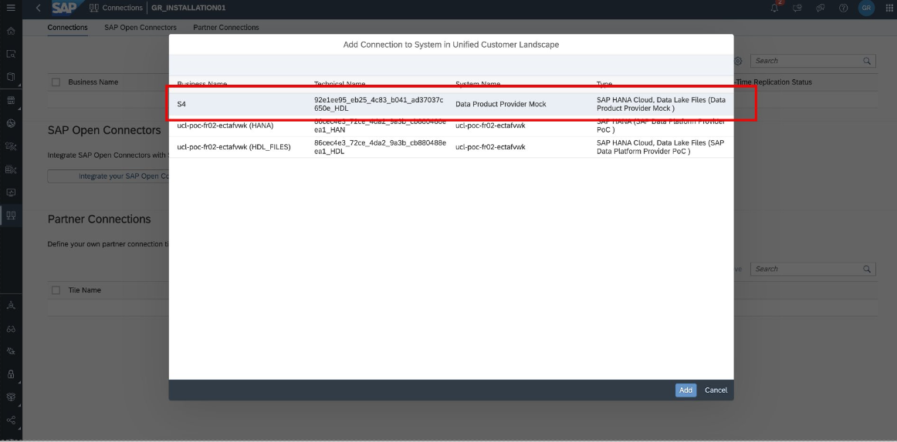

6. Once the space connection is created, it should be validated by clicking the **Validate** button. 

7. Now the configuration required to run a installation of a Data Product in SAP Datasphere is completed. 

## Next Steps
If you require a Databricks component as a part of your setup, you can proceed with the configuration steps after this exercise. The steps are listed in this [section](databricks-config-steps.md).

With all the configurations are in place. In the next [exercise](/02-install-intelligent-applications/README.md), you will learn how a BDC Admin can install an Intelligent Application and start deriving insights from all the valulable business data. In the subsequent exercises, we will also learn how to manually install data products.
