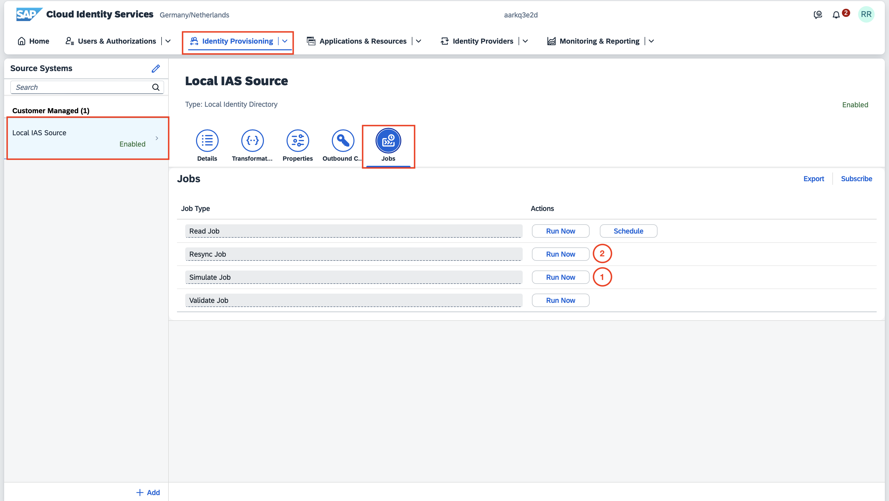

Configuration of SAP Databricks

# Business Data Cloud (Beta): Databricks user guide

- [Business Data Cloud (Beta): Databricks user guide](#business-data-cloud-beta-databricks-user-guide)
  - [1. Managing users and roles](#1-managing-users-and-roles)
    - [Registering users](#registering-users)
    - [Group/role assignments](#grouprole-assignments)
    - [Synchronizing users and groups with the Databricks account](#synchronizing-users-and-groups-with-the-databricks-account)
    - [Defining new roles](#defining-new-roles)
  - [2. Enabling consumption of SAP BDC Data Products in Databricks](#2-enabling-consumption-of-sap-bdc-data-products-in-databricks)
    - [1. Setting up a formation with the Data Product Provider system and Databricks](#1-setting-up-a-formation-with-the-data-product-provider-system-and-databricks)

## 1. Managing users and roles

To manage system users and their roles and authorizations in the Databricks account, access the SAP Cloud Identity Services administrative console.

### Registering users

New users can be created either manually, one by one, or a set of users can be imported from a CSV file. Please check the SAP Cloud Identity Services documentation:

- [Create a new user](https://help.sap.com/docs/cloud-identity-services/cloud-identity-services/create-new-user?version=Cloud)
- [Import users from CSV file](https://help.sap.com/docs/cloud-identity-services/cloud-identity-services/import-csv-file-with-full-user-profile?version=Cloud)

To delete or deactivate users:

- [Delete Users](https://help.sap.com/docs/cloud-identity-services/cloud-identity-services/delete-users?version=Cloud)
- [Deactivate Users](https://help.sap.com/docs/cloud-identity-services/cloud-identity-services/deactivate-users?version=Cloud)

### Group/role assignments

Roles are defined and assigned via groups membership. This means that you can assign a specific role to a set of users by including them into the respective group associated with that role.

Initially, there should be four pre-created groups in the Cloud Identity Services tenant associated with your Databricks tenant:

- `databricks__account_admins`: Members of this group are **Databricks account administrators**.

- `databricks__workspace_default_users`: Members of this group are **users** of the `default` Databricks workspace.

- `databricks__workspace_default_admins`: Members of this group are **administrators** of the `default` Databricks workspace. Check Databricks documentation on [What are workspace admins?](https://docs.databricks.com/en/admin/index.html#what-are-workspace-admins) for more information.

- `databricks__data_product_publishers`: Members of this group are allowed to publish Data Products from Databricks for consumption in SAP BDC systems.

> NOTE: for creating additional roles/groups, check the [Defining new roles](#defining-new-roles) section.

To assign users to groups, and grant them the respective role, check the following documents:

- [Add Users to a Group](https://help.sap.com/docs/cloud-identity-services/cloud-identity-services/add-users-to-group?version=Cloud)
- [Assign Groups to a User](https://help.sap.com/docs/cloud-identity-services/cloud-identity-services/assign-groups-to-user?version=Cloud)

To remove users from groups, and revoke their roles/privileges, check the following documentation:

- [Remove Users from a Group](https://help.sap.com/docs/cloud-identity-services/cloud-identity-services/remove-users-from-group?version=Cloud)
- [Unassign Groups from a User](https://help.sap.com/docs/cloud-identity-services/cloud-identity-services/unassign-groups-from-user?version=Cloud)

### Synchronizing users and groups with the Databricks account

After registering users and assigning them to the corresponding groups, you can trigger the Resync Provisioning Job to synchronize and propagate the users and groups defined in the SAP Cloud Identity Services tenant to the Databricks account. Check the documentation and execute the following steps:

- [Resync Provisioning Job](https://help.sap.com/docs/cloud-identity-services/cloud-identity-services/resync-provisioning-job?version=Cloud)

1. Go to Identity Provisioning > Source Systems.
2. Select the `Local IAS Source` system, click on Jobs > Resync Job > Run Now.

> NOTE: To check the status of the synchronization job, go to Identity Provisioning > Provisioning Logs. After the job is sucessfully executed, you can check the admin console of the Databricks account (under the User Management page) to verify that the new users were created and the group membership was correctly assigned.

### Defining new roles

In addition to the pre-configured groups/roles mentioned above, new roles can be defined by creating new groups and granting them the relevant privileges in the Databricks account. 

In this section, the documented steps will guide you through the creation of a new role/group named "Data Product Admin" whose users will be authorized to manage SAP Data Products consumption in Databricks.

1. To create a new group in SAP Cloud Identity Services, check the following documentation and steps:

   - [Create a New Group](https://help.sap.com/docs/cloud-identity-services/cloud-identity-services/create-new-user-group?version=Cloud)
    
   1. In the Cloud Identity Services admin console, go to Users & Authorizations > Groups > Create:
   2. Fill in the "Name" and "Display Name" of the group with the following pattern: `databricks__<role-name>` (example: `databricks__data_product_admins`, note the required `databricks__` prefix).

2. Assign this role to the relevant users by adding them as members of the group. See [Group/role assignments](#grouprole-assignments).

3. Synchronize the users and groups from SAP Cloud Identity Services into Databricks. See [Synchronizing users and groups with the Databricks account](#synchronizing-users-and-groups-with-the-databricks-account).

4. Assign the relevant permissions to this group in the Databricks environment:

    - For this "Data Product Admin" role specifically, users should be granted following permissions on the Unity Catalog Metastore: `CREATE CATALOG`, `CREATE SHARE`, `USE PROVIDER`, `USE RECIPIENT`, `USE SHARE`. For further details on Databricks Unity Catalog permissions, refer to [Unity Catalog privileges and securable objects](https://docs.databricks.com/en/data-governance/unity-catalog/manage-privileges/privileges.html) and [Manage privileges in Unity Catalog](https://docs.databricks.com/en/data-governance/unity-catalog/manage-privileges/index.html).
    
    1. Access the Databricks Workspace UI, open the Catalog Explorer (click on the "Catalog" item in the sidebar).
    2. At the top of the Catalog Explorer view, click on the gear icon and select the Metastore.
    3. Select the Permissions tab and click on Grant.
    4. Type and select the desired Principal (`__data_product_admins`) and mark the desired Privileges (`CREATE CATALOG`, `CREATE SHARE`, `USE PROVIDER`, `USE RECIPIENT`, `USE SHARE`).
  

## 2. Enabling consumption of SAP BDC Data Products in Databricks

To make SAP Data Products available for consumption in Databricks, the Delta Sharing output port of the Data Products need to be mounted in the Databricks Unity Catalog as a Delta Sharing Catalog.

### 1. Setting up a formation with the Data Product Provider system and Databricks

In order to make the Data Products discoverable by Databricks, a Unified Customer Landscape (UCL) formation must be exist and should include both the Data Product Provider system and the "Databricks in SAP Business Data Cloud" tenant.

You can create and manage formations in the BTP Cockpit of your Global Account, under the System Landscape > Formations page.

- [BTP Cockpit Live](https://cockpit.btp.cloud.sap/cockpit/)

1. Considering an existing formation which already includes a Data Product Provider tenant of type SAP S/4HANA Cloud Private Edition and a Datasphere tenant, click on the "Include System" button.

1. Select the desired Databricks tenant (of type SAP BDC Partner OEM Solution), click on "Next Step" and, finally, "Include".

2. Wait for the synchronization to finish and the formation to be in Ready state:

## Next Steps
With all the configurations are in place. We can move on to the next part of the workflow which is to start deriving value from the different functionality of SAP Business Data Cloud starting with this [exercise](/02-install-intelligent-applications/README.md).