# Creation of S/4 Technical user Credentials

SAP Business Data Cloud needs a dedicated S/4HANA Technical user with all the roles and authorizations to access relevant S/4 data.
This sub-chapter describes the details steps to create such a  technical user.

## Knowledge Basis
This section is based on some of the content from the SAP Note [3539174](https://me.sap.com/notes/3539174).

## Persona 
Actors: System Admin

## Steps

### Create technical user
* In the S/4 system, call the transaction SU01 (user maintenance). Help documentation for this transaction can be found [here.](https://help.sap.com/docs/ABAP_PLATFORM_NEW/ad77b44570314f6d8c3a8a807273084c/4cb5f7ac9cb33c94e10000000a42189c.html)  
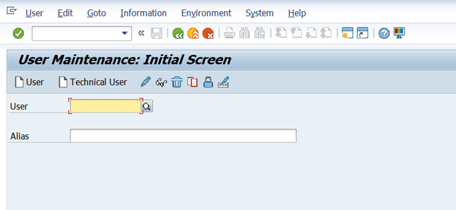 

* Enter a new user name for technical user and choose Create Technical User.  
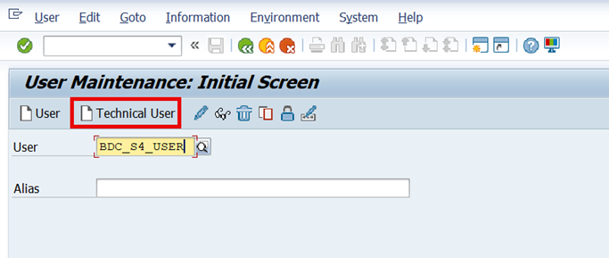 

* On the Logon Data tab, choose user type as **System**. Create a password manually and repeat it in the **Repeat Password** field to avoid typographical errors.  
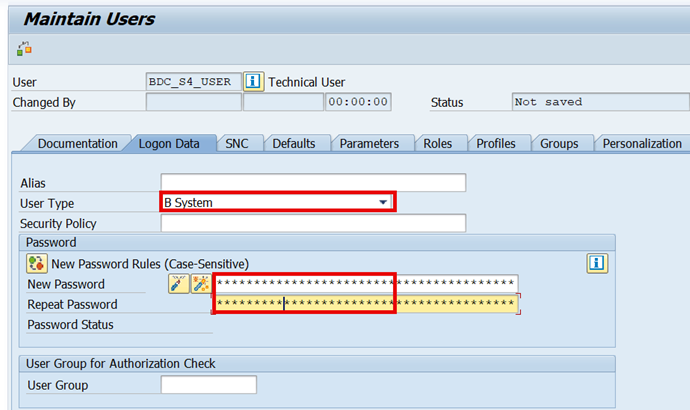 

> [!NOTE]
> It is only mandatory to fill out the Initial Password field on the Logon Data tab. All other entries on this screen are optional.

* Save your entries. 
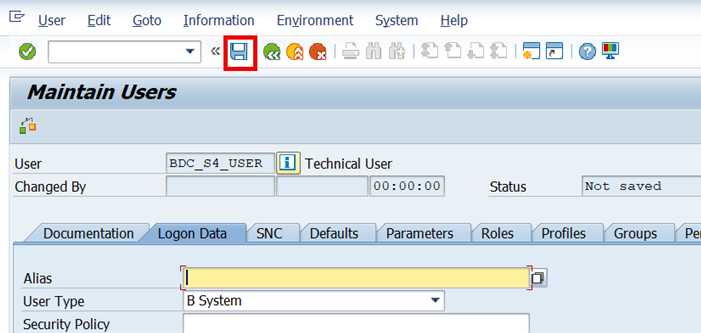 

### Create and Assign User Role
* Start Role Maintenance, call the transaction PFCG. Help documentation for this transaction can be found [here](https://help.sap.com/docs/ABAP_PLATFORM_NEW/ad77b44570314f6d8c3a8a807273084c/4c93141f5c153c91e10000000a42189c.html?locale=en-US)

* Choose **Role -> Upload**. Upload role file which is attached to SAP Note [3499606](https://me.sap.com/notes/3499606).
> [!NOTE]
> If you upload a role, the role data including the authorization data is loaded from a file into the SAP system. The user assignments for the role and generated profiles for the role are not uploaded. You therefore need to generate the authorization profiles after you have performed the upload. When you upload a role, the role data, including the authorization data, is loaded from a file into the SAP system. However, the user assignments for the role and the generated profiles are not uploaded. Therefore, you need to generate the authorization profiles after completing the upload.

* Copy template role **SAP_BDC_REMOTE** to a name from customer namespace. 
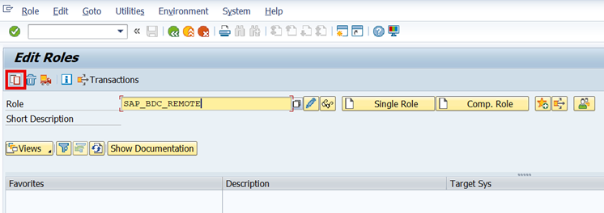 

* A pop-up appears, choose **Copy all**. 
 

* Once the role is copied, choose Change. 
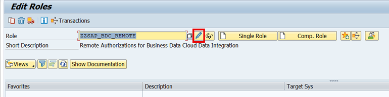 

* Generate Authorization profiles on the Authorizations tab. Help documentation for generating authorization profiles can be found [here](https://help.sap.com/docs/ABAP_PLATFORM_NEW/ad77b44570314f6d8c3a8a807273084c/739317502c729d38e10000000a44176d.html).
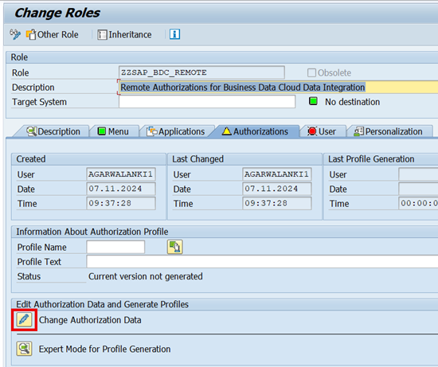 

* Maintain the predefined and open authorization fields for the transactions.
    - Please check SAP Note [3499606](https://me.sap.com/notes/3499606) for details about authorization objects and fields. Maintain below authorization fields of authorization object **S_DHCDCCDS**  
    	- DHCDCCDSRS – Provide CDS Release Stability Contract (C1 or NO)
        - DHCDCCDSNM – Provide Name of Data extraction CDS View(s) 
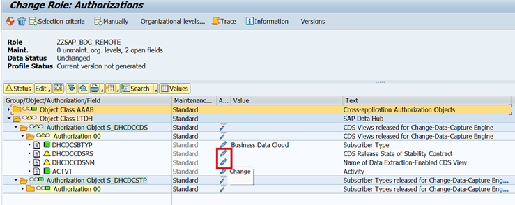 

* Once values are maintained, auth object turns into green. Choose **Generate**. 
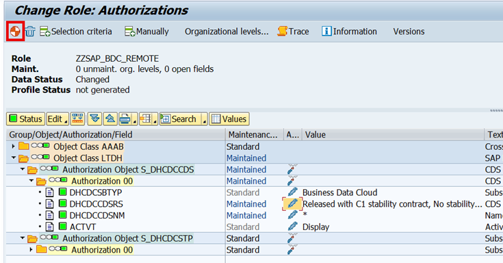 

* A pop-up appears, choose **Enter**.  
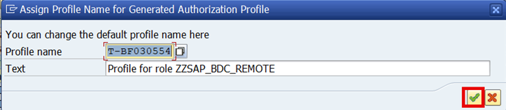 

* On the **User tab**, Assign users. 

* Enter technical user ID which was created in the step above and choose **Enter**. Help documentation for assigning users can be found [here](https://help.sap.com/docs/ABAP_PLATFORM_NEW/ad77b44570314f6d8c3a8a807273084c/4ee9aeb63f6c6fcee10000000a421937.html).
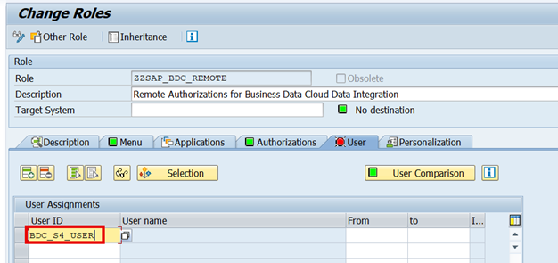 

* Perform a user comparison.  
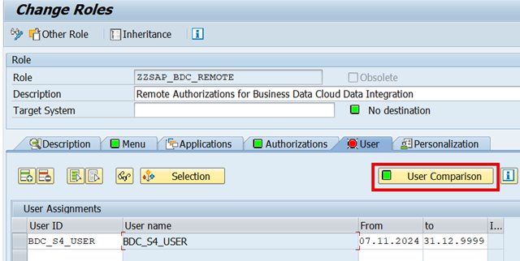 

* A pop-up appears, choose **Full Comparison**  
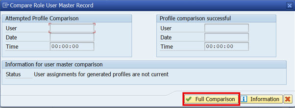  

* Save **Entries**. 
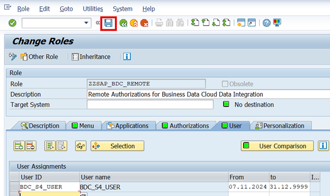 

> [!NOTE]
> Check [KBA 2441124](https://me.sap.com/notes/2441124) for more details on user and role administration. 

## Next Steps
Now that the S/4 Technical User has been created with all the necessary roles and authorizations, you can continue with rest of configuration steps mentioned [here](s4-config-steps.md#4-import-certificate-response-from-the-bdc-formation-in-the-s4-system).