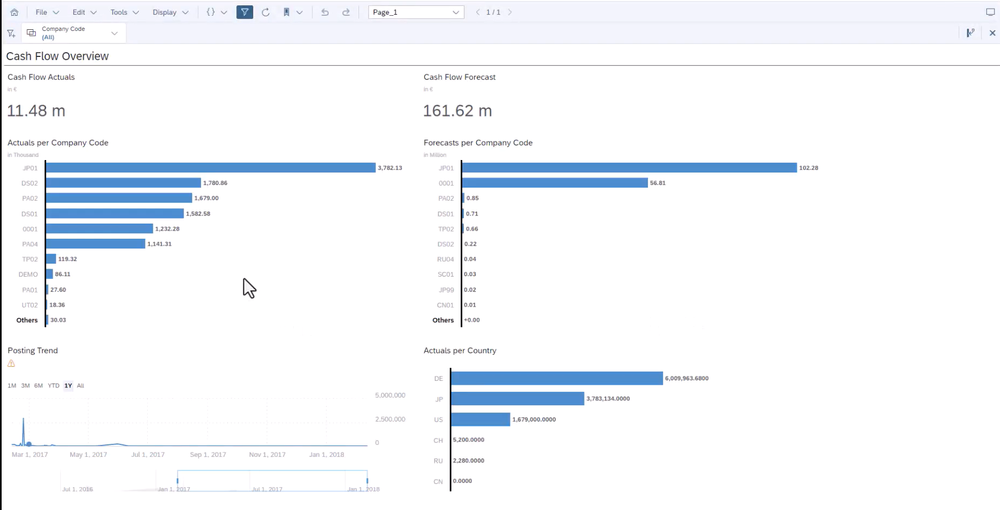
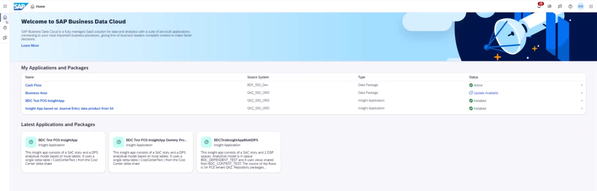
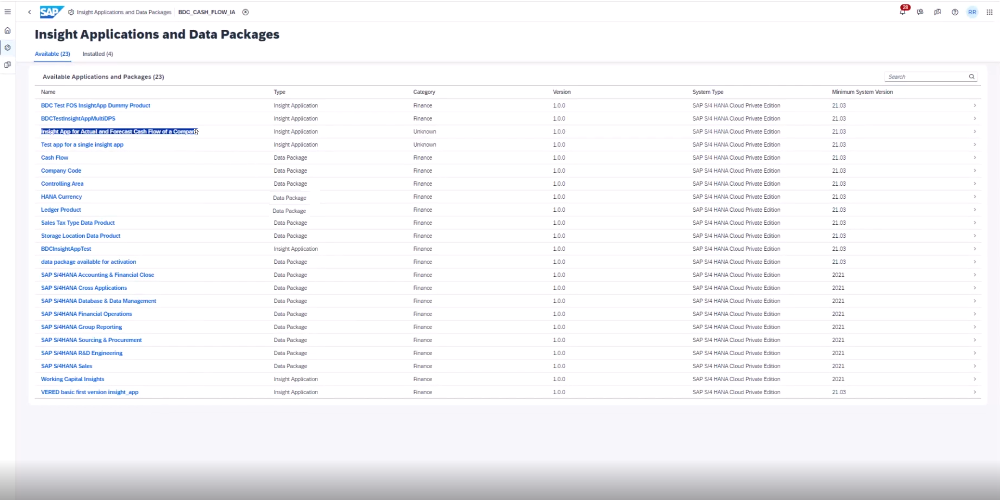
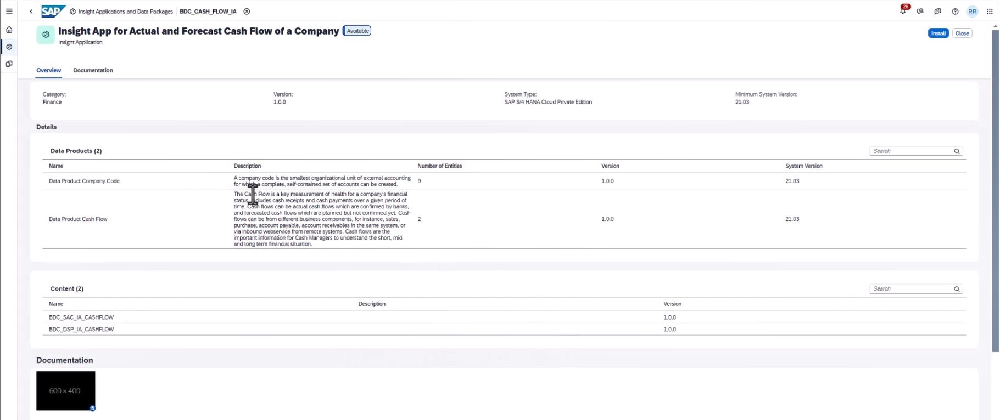
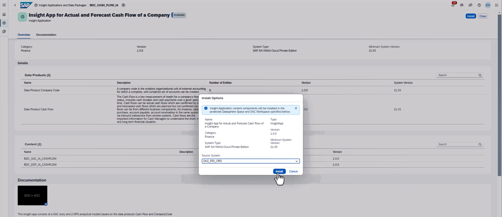
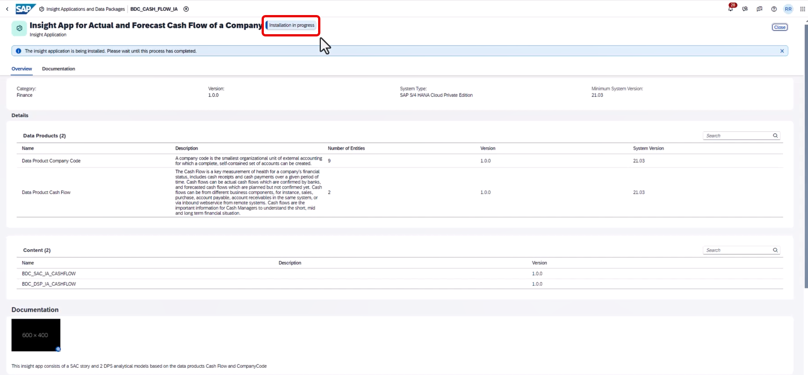
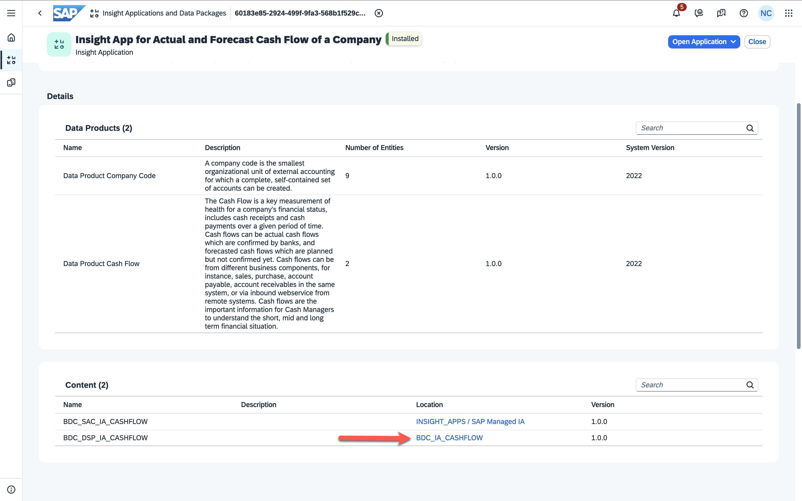
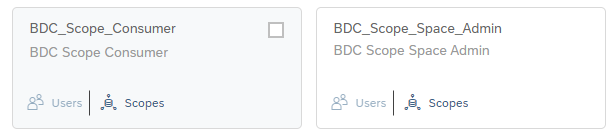
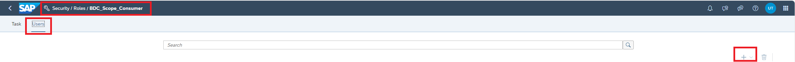
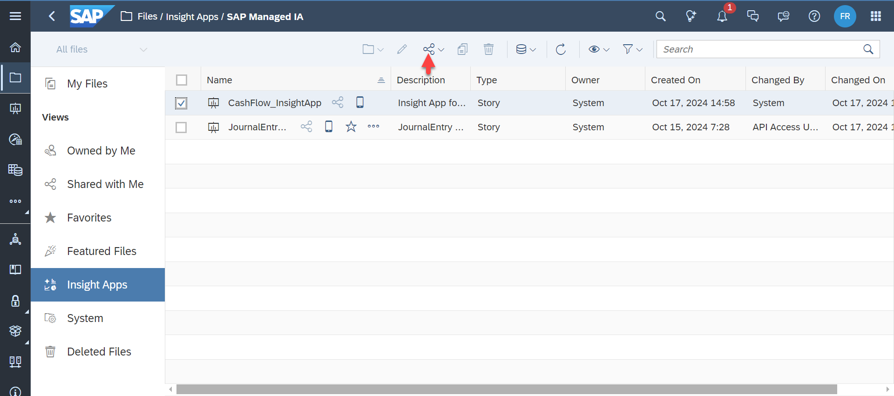

# Install Intelligent Applications

Insight apps are a premium offering exposed through BDC (Business Data Cloud). They are innovative applications designed to streamline data analytics processes from observation to action. 
Insight apps are intended to provide comprehensive dashboards, facilitate data analysis, and suggest viable actions based on the analysis (outlook: using artificial intelligence when applicable).

The BDC Beta offers two SAP-managed lean intelligent applications. In this exercise, let us look at how we can install one of these intelligent applications called the **Intelligent Application for Actual and Forecast Cash Flow of a Company** so that we can start using the underlying data products to their full potential. The lean intelligent applications available in beta will not be in the market entry scope.

## Persona 
Actor:  
 

## Prerequisites
You have completed the configuration of the SAP BDC Cockpit which can be found [here](01-basic-config-bdc-cockpit/README.md).

## Data considerations
The lean intelligent application relies on data from the following CDS views:
**I_CashLiquidityActualFlow** and **I_CashLiquidityForecastFlow**, for table `FQM_flow`.
The results will be best presented if and only if you there is sufficient data available.

## Use Case
This exercise describes the installation of the Intelligent Application called **Actual and Forecast Cash Flow Dashboard**. This exercise will also be describing how the content authorizations will be configured.

Cash Flow Dashboard provides:
<ul>
<li>an overview of positions like
<ul>
<li>Cash Flow Actuals</li>
<li>Cash Flow Forecast</li>
<li>Trends</li>
</ul>
</li>
 <li>
KPIs to assess Cash Flow performance like
<ul>
<li>Actuals per Company Code</li>
<li>Forecast per Company Code</li>
<li>Actuals per Country</li>
<li>Posting Trend</li>
</ul>
</li>
</ul>

The illustration below gives an impression of the look and feel of the lean Insight app:  

## Steps

1. Open the **Insight Applications and Data Packages** module in SAP Business Data Cloud. 
 

2. This module shows the “Cash Flow” Insight Application which is available for installation.

3. Opening the overview page shows the corresponding data products and content.

4. Click on the **Install** button to kick off the installation. A dialog opens up to confirm the installation details. Click on **Install** again to confirm.

> [!NOTE]
> This will save the related content in an SAP-Managed space in SAP Datasphere (DSP) and an SAP-Managed folder in SAP Analytics Cloud (SAC).

5. The status of the installation changes to 'Installing' and then 'Active' when the installation has finished.

> [!NOTE]
> This step can take from several minutes to hours since the step also entails fetching all the underlying data products data into the storage and semantic layer of BDC.

6. As a part of the installation, content will be generated in SAP Datasphere and SAP Analytics Cloud. Access the space in SAP Datasphere by selecting the according location in the ***Content*** section.

> [!NOTE]
> There is no additional log in required since SAP Datasphere and SAP Business Data Cloud are on one tenant mode.

7. :warning: Increase the quota of the space (amount of disk and memory storage which can be allocated) as soon as the installation of the Intelligent Application finished. The recommended setting depends on the data volume of the corresponding S/4HANA data products. This step is important so that the space does not get locked. Click ***Save*** and ***Deploy*** the changes.

8. In the next steps, we will provide all the relevant users access to this generated content. We start in SAP Datasphere. The intelligent application comes with two scoped roles. These scoped roles are the Consumer and Space Admin. These scoped roles are called **BDC Scope Consumer** and **BDC Scope Space Admin**. The scoped roles must be assigned accordingly to the users who need either the consumer role or the Space Admin role.  
 

8. After this, in the **Security> Roles > Scoped Role > Users** tab, add all the users that will need access to this content and at what capacity and then save.  
 

> [!NOTE]
> Please note that there is a second way of adding scoped roles to users in the  **Security> Users** application in SAP Datasphere.

9. Open SAP Analytics Cloud.   
 

10. In SAC, in the **Security>Users** tab, add all the relevant users who will need access to content in SAC and so that the content can be shared with them and then save.    
 

11. Access the SAP managed section ***Intelligent Applications*** in the file repository and grant the access rights to the **Cash Flow Intelligent Application** to all relevant users.   
 

12. The **Cash Flow** Insight Application with the dashboard is now available for consumption for the users you granted access.

## Next Steps
In the next [exercise](/03-consuming-intelligent-applications/README.md), you will learn how a business user can start consuming the Insight Application to draw meaningful insights from the underlying data product.
