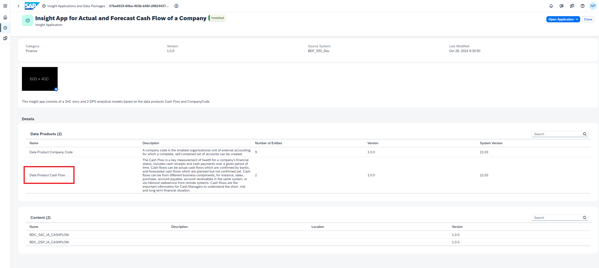
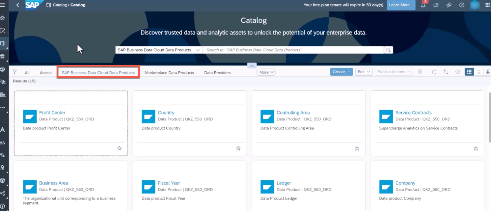
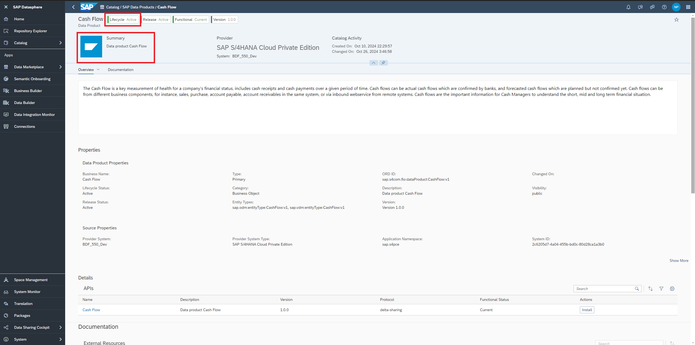
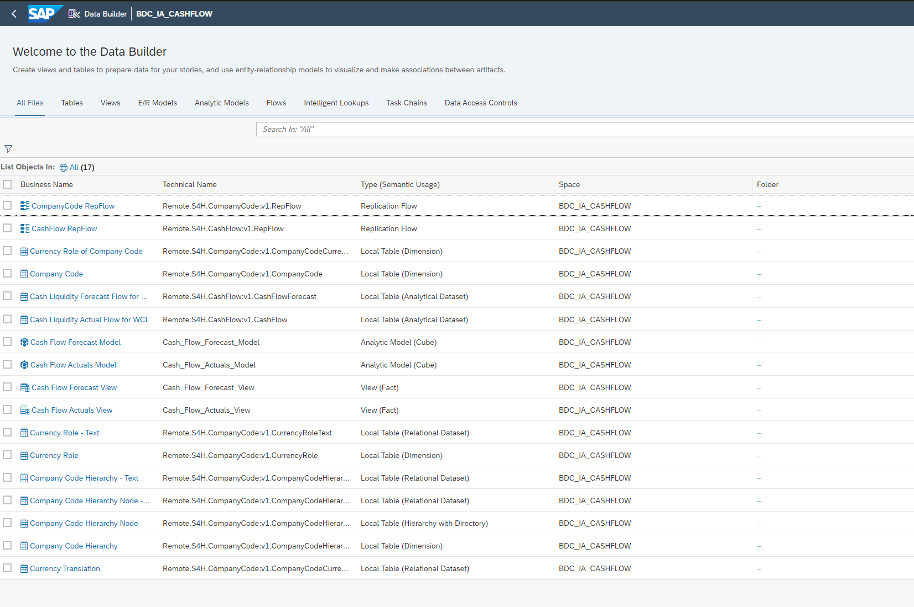
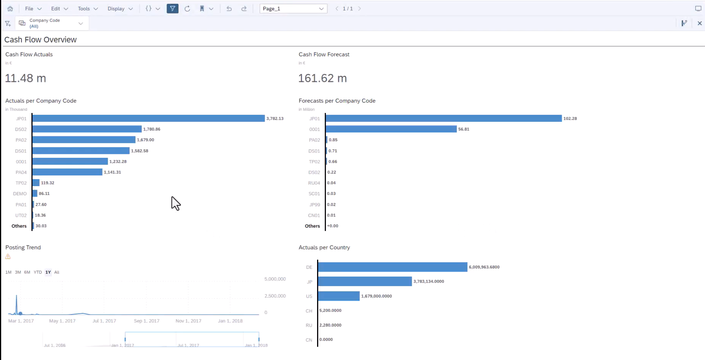

# Consumption of Intelligent Applications

The lean **Cash Flow** Insight app is an integrated solution based on SAP Datasphere Analytical Models and SAP Analytics Cloud capabilities that visualizes working capital KPIs based on data from different S/4HANA financial areas based on the **Finance Foundation for SAP S/4HANA and SAP S/4HANA Cloud**. You can use it to discover new insights, trends, and predictions through powerful analytics based on cross data models. It offers quick time to value, and low total cost of ownership through pre-delivered integration and KPI rich content available out-of-the-box.

> [!NOTE]
> This Intelligent Application is only a temporary dashboard available as a part of Beta Program. For market entry, there will be a more refined Intelligent Application experience.

## Persona
Actors:

## Prerequisites
You have completed the configuration of the BDC Cockpit described [here](01-basic-config-bdc-cockpit/README.md) and completed the installation of the Intelligent Application which can be found [here](02-install-intelligent-applications/README.md).

## Use Case
An Intelligent Application called **Intelligent Application for Actual and Forecast Cash Flow of a Company** has been installed successfully by the BDC Admin. How can the insights be consumed as-is? This chapter highlights the power of Intelligent Applications, pre-built SaaS applications designed to deliver critical business signals and actionable recommendations, built on SAP’s unified data model. Specifically, we will cover **Cash Flow** which is a use case for  **ERP Analytics**. 

## Steps

> 

1. Note that this Data Product has been installed as a result of the Intelligent Application installation in the [previous exercise](../02-install-intelligent-applications/README.md). It is the same data product the Intelligent Application in the BDC Cockpit references to.

 

> 

 

2. Installing the Intelligent Application consequently also installs all the underlying data products. Using the product switch, open SAP Datasphere. In the One Data Catalog, you can find all the data products that are available. In the Catalog screen, under the tab **SAP Business Data Cloud Data Products** tab, you can find all the data products that can be consumed. 

3. If the Lifecycle status of the data product is **Active**, it signifies that the data product has already been installed. 

4. In the **Assets** tab in Catalog, the Intelligent Applications can also be viewed and you can navigate to them directly from here. 
> [!CAUTION]
> Displaying the lineage to SAP Data Product from SAC Story will not be available as of now.

5. In the Data Builder, you can see that all the corresponding Datasphere content has also been promptly created. The corresponding data will also be replicated by the replication flows that have been created automatically.

 

> 

 

6. Open the Intelligent Application in SAP Analytics Cloud (either directly from the BDC Cockpit or by using the **Product Switch** button in SAP Datasphere to SAP Analytics Cloud). In this preliminary Intelligent Application, you can derive the following insights:
<ul>
<li>Cash Flow Actuals</li>
<li>Cash Flow Forecast</li>
<li>Trends</li>
</ul>

We will learn how to extend these models and corresponding content in the upcoming exercises.  

## Next Steps
In the next [exercise](/04-onboard-data-products/README.md), you will learn how a data product can be onboarded without a corresponding Intelligent Application. In the subsequent exercises, you will also learn how to integrate Databricks to enhance the data products and Intelligent Applications.
