# Activating Data Packages in Business Data Cloud Cockpit & Installing Data Products in Datasphere

## Persona 
Actors:  
 
 

## Use Case

Customers will use Data Products to:
- build their own Analytic Models in SAP Datasphere
- create customer-managed stories in SAP Analytics Cloud based on a new data model
- share it with Databricks for ML/AI processing 

In all cases listed above, the installation of a Data Package in BDC Cockpit is a prerequisite to make it available for business users in the Catalog (covered in this exercise). The Data Products of this package are visible in the Catalog (SAP Datasphere) after this activation. They can be shared with Databricks or installed in SAP Datasphere (required for modeling in SAP Datasphere).

## Overview
This exercise is separated into three sections:
- [Explore Data Products in the Catalog](#explore-data-products-in-the-catalog) (Explanation of the difference between active and inactive Data Products.)
- [Activate Data Packages in BDC Cockpit](#activate-data-packages-in-bdc-cockpit) (Prerequisites to share Data Products with Databricks or to install them in Datasphere.)
- [Access Active Data Products via the Catalog ](#access-active-data-products-via-the-catalog) (Installation in SAP Datasphere for usage in modeling is explained in this exercise, share with Databricks is another case in the following exercise)

## Prerequisites

- [Basic Configuration of the SAP BDC Cockpit](../01-basic-config-bdc-cockpit/README.md)
    * Please make sure that the S/4HANA PCE connection is present in the DSP space in which you want to install the Data Product ([explanation is part of basic configuration guide](../01-basic-config-bdc/README.md#prepare-s4hana-pce-connection-for-use-in-sap-datasphere-spacesrequired-for-data-product-installation))
- The Data Modeler needs the Catalog Admin Role to install or share Data Products.    

> :books: If you are participating in a SAP BDC training, you already have access to a space (customer managed) in which the connection is available. 

## Data considerations
In this exercise, the results will be best presented if and only if there is sufficient data available in CDS view **I_HouseBank** and its underlying tables. 

## Steps

### Explore Data Products in the Catalog

> 

1. Access the application ***Catalog***.
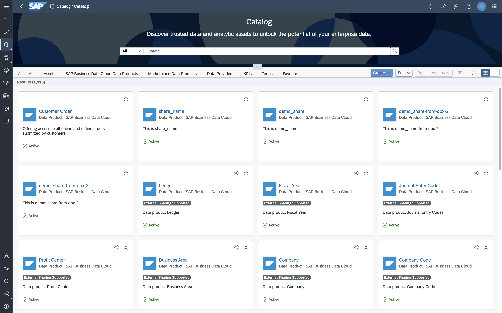

2. Select the tab named  ***SAP Business Data Cloud Data Products***. You see all Data Products available.
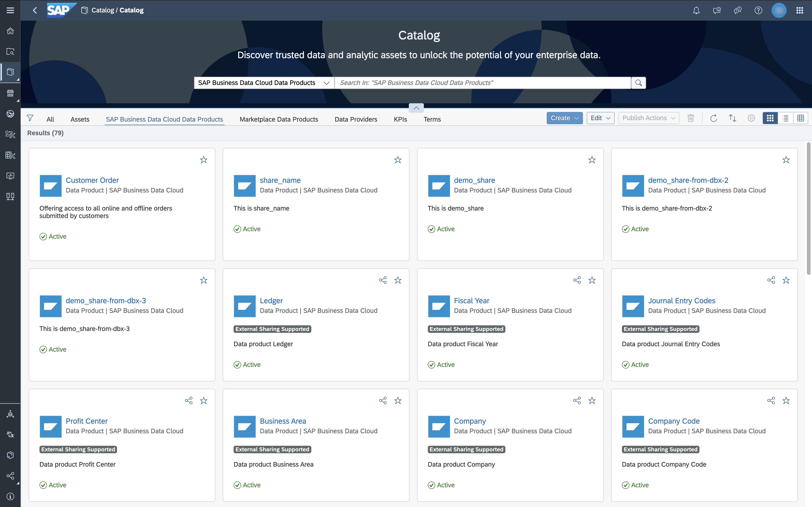

3. You can apply a filter to only see the data products provided from a specific source system. In the example displayed on the screenshot, we filter for the source system ***QKZ_550_ORD***, which is a S/4HANA PCE tenant. **Please note that in your system, the name might be different**
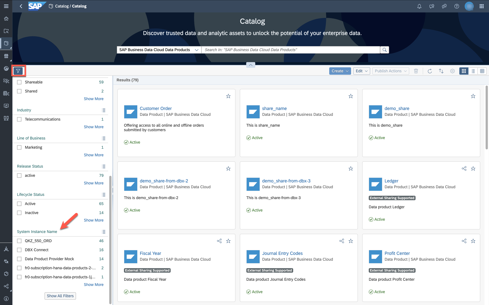

4. Data products are either ***active*** or ***inactive*** as displayed in the overview.
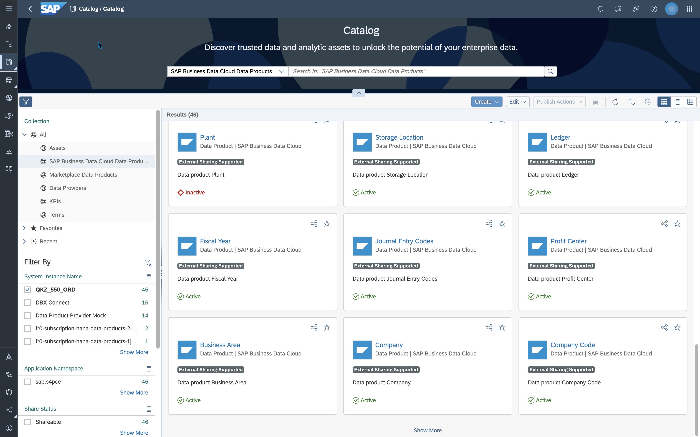

5. If you select an inactive data product (in the example displayed on the screenshot: **Plant**), the banner on top displays that this data product is disabled and not available for consumption. This means it is not installed for your system yet. It needs to be installed by the BDC Admin in the BDC Cockpit, as explained in the following steps.
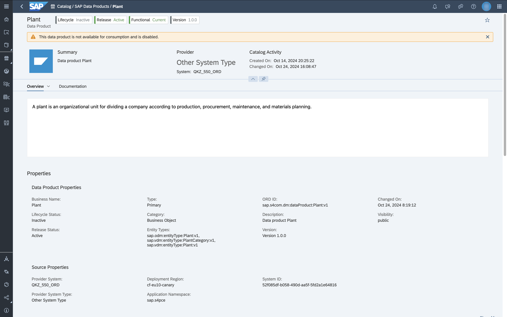

> [!NOTE]
> If a data product is not available for consumption or not installed yet, the definition is derived from the standard ORD definition. Any custom fields in the source system are not included in this standard definition, so they cannot be seen in the metadata until the status changes to active.

### Activate Data Packages in BDC Cockpit

> :books: If you are participating in a SAP BDC training, you are going to install the Data Product ***House Bank*** in Datasphere. The according Data Package has been installed before by the trainers of the workshop (one-time activity). You can watch this recording or read through the following chapter to see the steps required. 

> 

1. BDC Cockpit can be opened from the top right using the **Product Switch** button.
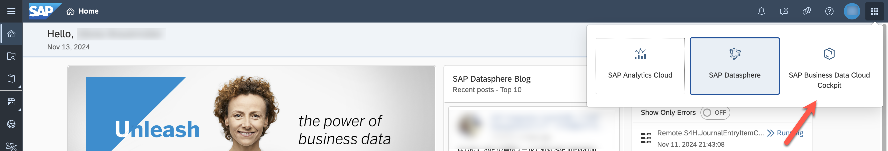

2. In the cockpit, open the tab **Insight Applications and Data Packages**. This tab shows all the Insight Applications and Data Packages that are available for installation.  
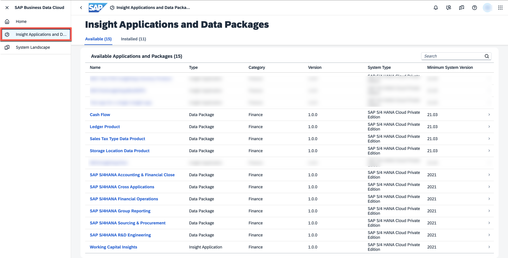

3. Search for the Data Package that you want to activate and click on ***Activate*** to start the installation process. You will be asked to select the source system. Activating the Data Package will make the Data Products available in the Catalog. :wrench:  
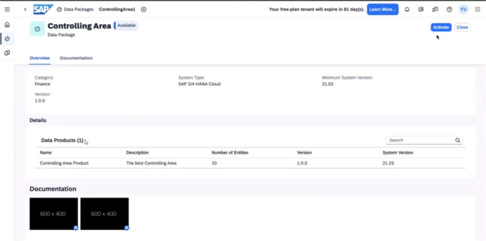

4. The status changes to **Installation in Progress**. This takes a few minutes. SAP Business Data Cloud takes care of the data extraction and processing in the background. Once, the installation completes, the Data Products that are comprised in this Data Package are available for consumption. :wrench: 
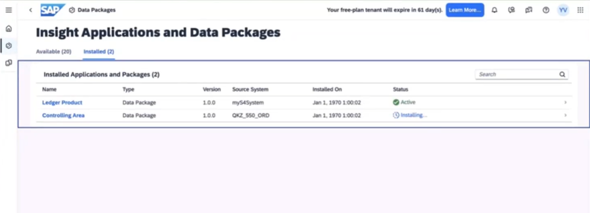

### Install Active Data Products via the Catalog 

> 

1. Switch to SAP Datasphere using the **Product Switch** button. In the Catalog (***SAP Business Data Cloud Data Products*** tab) search for the Data Product ***House Bank*** which was already activated in the BDC Cockpit.  
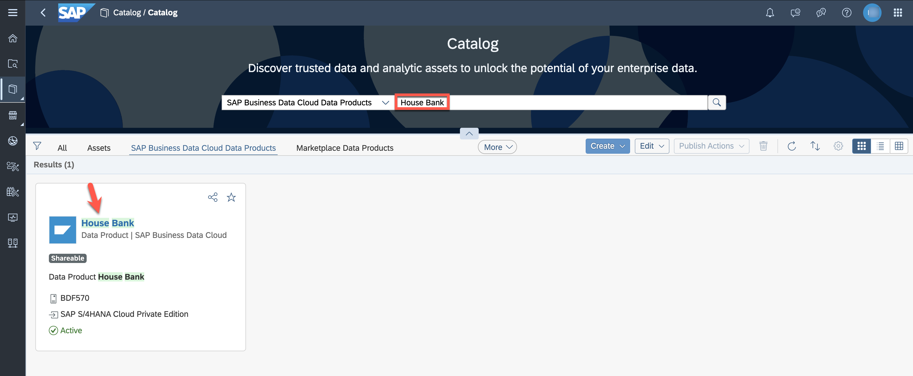

2. Open the Data Product ***House Bank***.

3. This data product is active as displayed in the header. You now have the following two options:
- Share Data Product with Databricks ([described in next exercise](/05-enrich-data-products-with-databricks-ml/README.md))
- Installation of a Data Product in the Data Builder (described in the following steps)
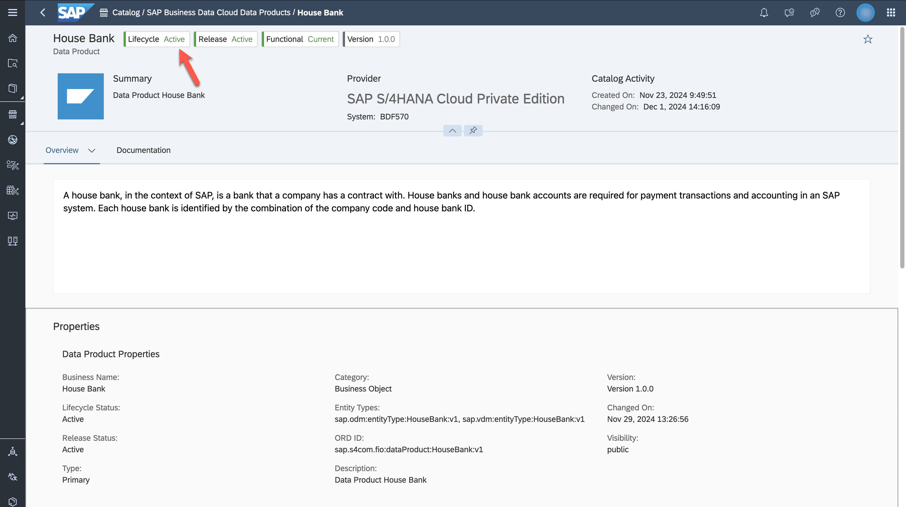

4. The following steps explain how you install a data product. Before following these steps, ensure that the space quota of the space in which you want to install the data product is set high enough depending on the data volume (***Space Management*** -> ***Space Storage***). 

5. Part of the installation is the creation of a replication flow for all of the shared data assets present for this particular data product. Install this active data product by clicking on the ***Install*** button.  
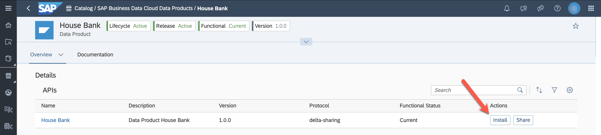

6. Run the semantic onboarding for an active data product. Select target space and the target connection. Please note: The S/4HANA PCE connection needs to be present in the DSP space in which you want to install the Data Product [setup details](../01-basic-config-bdc/README.md#prepare-s4hana-pce-connection-for-use-in-sap-datasphere-spacesrequired-for-data-product-installation)). Click ***Next Steps***.

> :books: If you are participating in a SAP BDC training, select the **space that was assigned to you**.

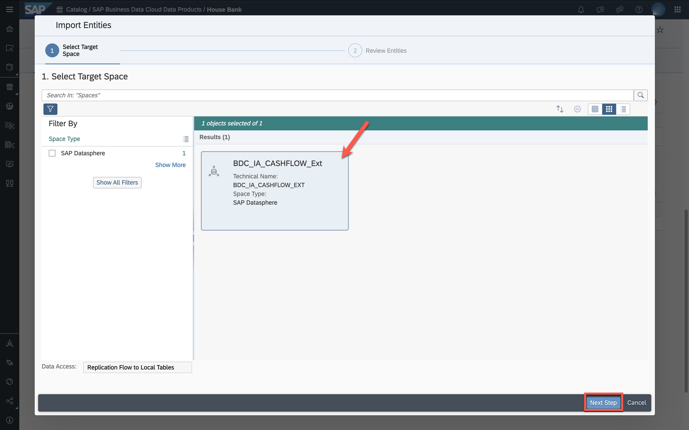

7. Review the entities (replication flow and local table) and run the import selecting ***Start Import and Deploy***.  
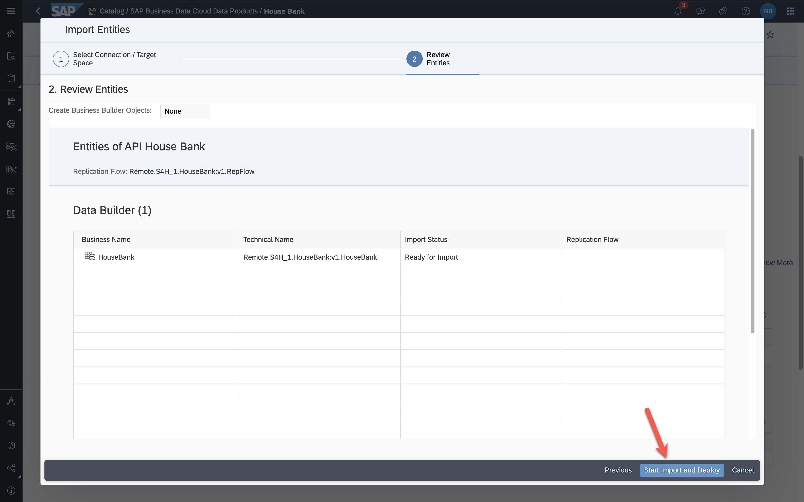

8. You see the message ***Importing entities. Check the notifications for the status of the import.***.

9. Notifications display that the import started and also that the import completed successfully.
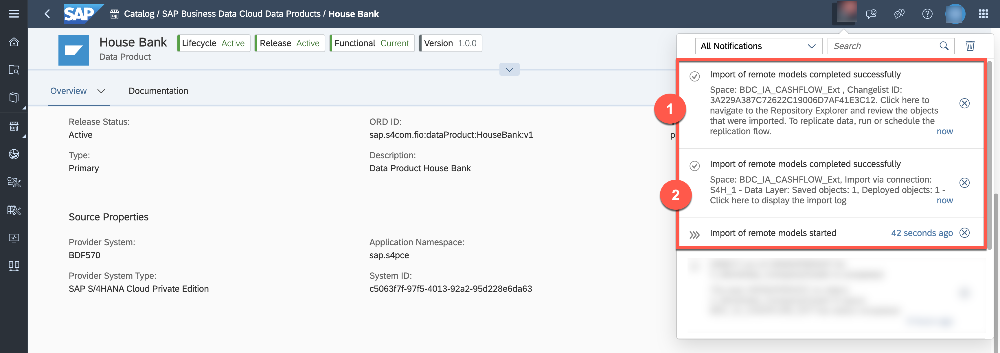

10. Access the log by clicking on notification message **2** to get insights into the model import.

11. Access the Repository Explorer by clicking on notification message **1** to review the objects that were imported.
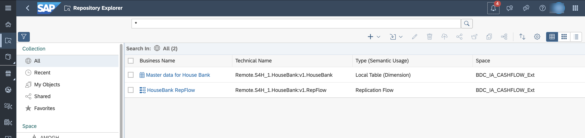

12. Select the local table ***Master data for House Bank*** and open the data preview. The table is populated automatically by the Replication Flow, you don't need to start the run.
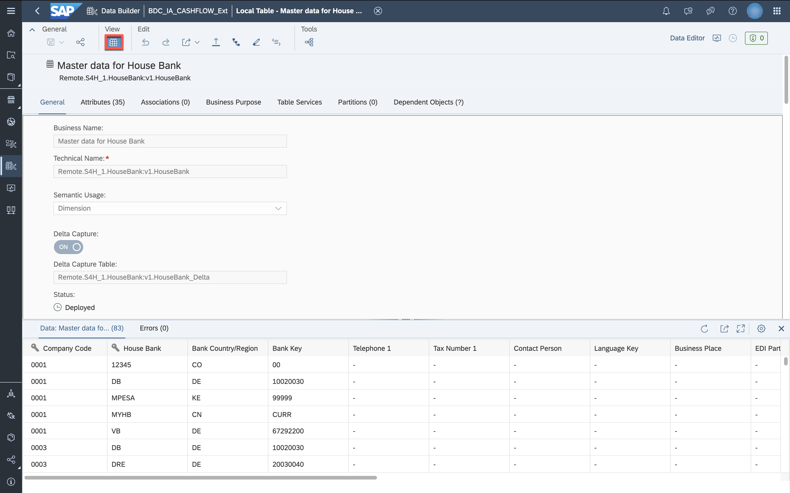

You could now start building an own Analytic Model in SAP Datasphere based on the installed Data Products.

## Next Steps
 If the integration with Databricks is available, you will learn how a data analyst can extend the out-of-the-box data products with machine learning capabilities that the BDC integration with Databricks has to offer. You can have a look at the [exercise here](/beta-pipeline/05-enrich-data-products-with-databricks-ml/README.md).

 Until the integration is available, continue with the exercise about customizing a model delivered as part of an Intelligent Application [here](../06-enhance-analytic-model/README.md).
